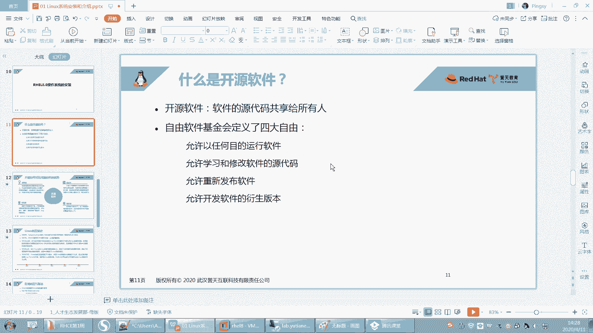
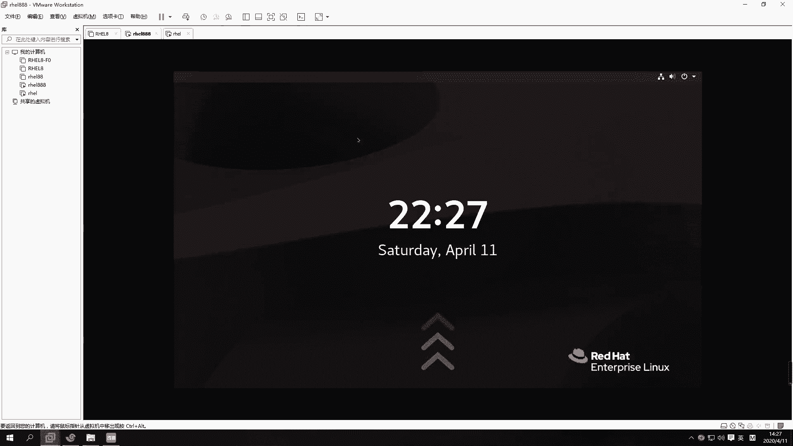
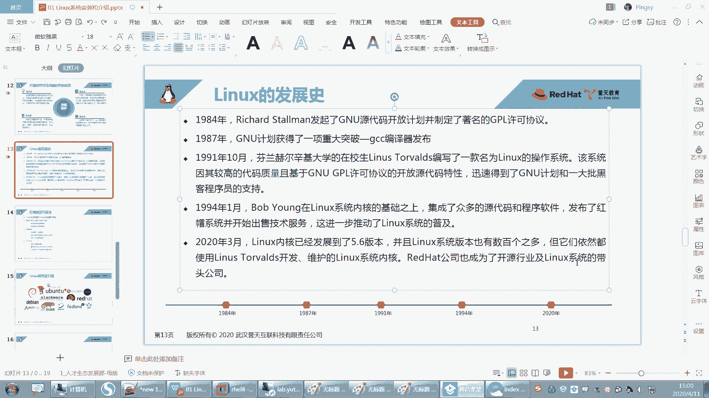

# 【重置详解版】孙老师讲红帽系列视频／RHEL 8.0 入门／红帽认证／RHCE／Linux基础教程 - P4：04 开源软件介绍和Linux发展史 - 誉天孙老师 - BV1aB4y1w7Wi

然后呃那在这之前，我们先来介绍一下开源软件啊。嗯，我们今天上午讲的这个linux，它是一个开源的，开源的linux啊。它是一个开源的软件，它是个操作系统，它也是个软件，而且它是个开源的软件，对吧？

那么开源的软件。开源什么叫开源呢？开源就是指。软件的软源代码可以共享给所有的人去使用啊，就是所有人都可以拿到这个软件的源代码。怎么还在讨论？密码不知道的重装啊。要么就试一下这个问题没有什么好说的了啊。

ううん。不装tes没关系啊，不用不用装，你装不装都无所谓。现在你这个。我一般都没装。一般装的话就会有一些高级的功能嘛，但是这个我也无所谓。

好吧，我们在微末里面这个无所谓啊，有需要的时候，我们再把它装一下，没需要我们就不装了，好吧。😊。

好，现在装可能大家也不会，没关系啊，慢慢来。好，看这里啊。嗯，开业软件呢它是指我们源代码可以共享给所有人。我们的源代码呢就是我们的这个软件呢。嗯，他都是由这个。嗯，各种语言写出来的对吧？

比如说我们常见的语言，C语言啊，C加加呀，java呀。还有现在还有很多流行的语言，什么够语言呢，对吧？嗯，很多这样的语言啊。😊，嗯，然后写的一些嗯对，写出来的一个软件。那么其实我们像普通拿到这种软件啊。

比如说我们这种。你像我们windows里面有很多软件，比如说啊。呃，像这种软件，然这种软件是吧，什么这种软件，那这是windows里面的那些软件。这些软件其实都是必免的。

这些软件基本上就windows里面的软件啊，基本上都是闭源的。也就什么叫B源。就是你可以用这个软件。但是呢你没有办法看到这个软件的源代码。也就是说它如果是用C语写的，你看不到C语言的代源代码哟。

就它一行那个程序员在什么一行一行写出来那个源代码是看不到的。啊，那开源呢它是指什么？它就会将源代码给贡献出来。那你想一下这得需要什么样的境界是吧？嗯，才可以把这个源代码给共享出来啊，就如果你创造了是么？

你发明创造了，然后给大家都都去使用，哎，而且还告诉人家什么秘方，对吧？对，还告诉人家怎么这个过程是怎么怎么弄出来的啊，得辛辛苦苦写出来的。所以到目前为止。

我们呃在开源界啊能发展到目前为止其实是多么不容易，对吧？大家都有这样的都要有这样的精神，对，都要有这样的开源精神才能一步步发展到现在啊。那么在我们一些就是自由软件，有一些自由软件就开源软件啊。

有一些基金会，有一些就是组织的组织的就是基金会啊，他们定义了就是你有四个自由，就是在开源的使用开源软件的时候，你有四大自由，就是你能做什么，对吧？你拿到这些开源的代码，你能做什么？好。

第一个呢就是你可以以任何的目的去运行这个软件。以任何目的去进行这软软软件啊，比如说你拿到Lux是吧？这linux它是一个开源的，那么这个开源的软件你可以怎么样啊？好，因为要等一下啊。嗯。画笔。好嗯。

二笔。啊，你可以去以任何的目的去任何目的哦去运行这个软件。当然你的目的可以。不那么纯洁对吧？比如说你要干坏事对吧？或者是做好事，做坏事，攻击别人，这个都是允许的。啊。无论你做什么都可以啊。好。

第二呢这是第一个第二个第二个就是允许学习和修改软件的源代码。你可以去学习它可以，因为你都可以看到了嘛，对吧？你也可以去修改它，你可以把这个原代码拿来之后，要你写的不行啊，我来给你修改一下，可不可以呢？

当然也可以了，对吧？好，那么修改完之后呢。我能不能把它重新发布出来呀？可以。第三。你可以去重新去发布这个软件，就是说这是你写的。当然有没有人用，有没有人看还是另外一回事，对不对？你写的好呃。

那别人可以可以去借鉴你写的不好，那别人可能不用，对吧？别人可能不用啊，所以呢这是第三个，你可以重新去发布这个软件啊，然后第四呢，你可以干什么呢？你可以去发布开发这个软件的一些衍生版本。

就是说呃什么叫衍生版本呢？我们这是个linux是吧？它是一个操系统。那么我拿到lininux源代码之后，我可不可以拿来做别的事情，就是将来它不是做操作系统，呃，去把它其中部分代码拿出来。

然后做放在别的软件里面可不可以呢？也可以也是可以的，就是它可以做创建创造创造一些衍生版本啊，就是不做操作系统，做别的事情也是可以的啊。所以这就是在自由软件的里面，你可以做的四件事情，就1234。

但是一般你去用别人的源代码，你需要标注你需要标注是吧？你你这个这个这个出处是哪里？这个是对别人是什么尊重啊。嗯，你要去尊重别人的知识产权嗯，所以要去标注一下啊。好，这是开源软件。

那么开源软件它有什么优点呢？对吧？为什么大家现在都要用去用这个开源的软件啊，嗯，现在很多公司他们在做嗯比如说啊他们要去像国内呃一个linux是吧？但是linux是一个开源的开源的操作系统。

那么这个开源的操作系统嗯，开源之后那国内想去做一款自己的国内的这个操作系统，国产的操作系统是吧？那它是要自己去写一个操作系统吗？当然不太可能也不太现实，对吧？嗯，然后这个开发成本也比较高。

所以呢他就用么用它的源代码，然后进行二次开发，对，进行二次开发，然后作为自己的什么？哎，就是自己的为国产的是吧？因其实国产现在有很多的很多的linux啊，就是国产的linux，对不对？呃。

像华为就有自己的欧，还有国内的什么麒麟啊深度啊。嗯，红旗什么反正很多国内的啊。好，所以大家去愿意去用啊。好，那它到底有什么优点呢？我们可以看一下。哎。好，这边呢我们列了几个这样的优点啊。

我们可以大概看一下啊呃，低风险低风险啊，就是如果你是用一些闭源的软件，那么这个闭源软件它一旦没有人去维维护的话，比如它是A公司做的对吧？它是A公司做的这个B眼软件，你用它的话，你用它的软件。

这个软件公司倒闭了是吧？公司倒闭了，那你的这个软件有可能就用不了了，你就可能要去选择别用别的软件，对吧？这是有风险的啊。然后那一般开源的软件呢，开源的开源的软件有开源的社区来维护，它是由社区来维护。

不是哪一家公司来维护的啊，它是有个社区的。呃，很多公司都会加入这些社区呃，来共同去维护这个呃这个开源的产品，所以一般社区很少有倒闭的倒闭的可能嗯这个这种问题啊，所以一般大家愿愿意去用啊。

因为它风险比较低。然后第二呢，它成本也是比较低的啊，这个成本低大家可能就是我刚刚说的，大家如果想去做二次开发的话，呃，想去做开发自己的产品，你没必要说我自己再开发一个新的产品，对吧？嗯，真的没必要啊。

你就去用那些开源的就可以了，把开源的拿过来做一次二次开发，对吧？做二次开发啊，然后就可以节约你的成本，节约成本啊。啊奥第三呢就品质也比较高，就是它的这个嗯推动推动啊。

就是有众多的人来去推动它这个写字不好写。就是有这个由整个社区来维护，对吧？那么它的生命周期，它的这个呃周期版本周期可能是比较短，就是短可能呃。就是。就这个发展起来呃也是比较快的啊。比如说你有一些bug。

刚刚开发出来的时候有bug，那bug修复的也是比较及时。对，因为用的人多嘛，然后维护的人多呃，bug修复及时。嗯，等等啊，由社区来维护而研吧。啊，最后呢就是你用这些开源的开源的产品，当然更安全一些。

对吧？因为开源的嘛，你这些源代码都可以拿到。如果别人在这个开源的产品上去植入一些后门呢。嗯嗯这个别人一看就能看到啊，一看就能看到啊，所以大家愿意去用这样一个一个开源的产品啊，开源产品。

无论是个人使用者而言，还是对于开发者而言啊，对于企业而言，他都许愿意去用这个开源软件嗯，开源软件。好。那么我们知道什么是开源的软件了之后，我们下面来看一下关于linux的一个发展史啊。嗯。

你要想知道lininux。对吧linux它本身它的一些工具啊，或者说嗯它的各个版本，你必须要知道它是怎么发展过来的。唉，为什么现在我们linux它叫什么？叫一类unux。嗯，叫类类有那个骚系统，对吧？

为什么这样去叫啊，要这样去叫，那它跟unix到之间到底是什么关系，对不对？你这个要知道啊。好，那么在说这个呃linux之前，我们肯定要提到的一款操作系统叫叫unux操作系统啊，unux操作系统。呃。

这个unix操系统呢。呃，是其实在很就是。嗯，因为那个词是哪一年，哪一年就是。发布使用的知不知道啊？unix啊。50年代。50年代嘛。有没有同学知道啊？七八十年代是吧。嗯，很好，70年代比较接近了啊。

对，70年代初呃，为什么会记住这个时间呢？嗯，你们对，很棒啊，它就是1970年1月1号，71970年1月1号，就其实是1969年，1969年的时候就已经发布，就已经就是已经开发出来了，是吧？对。

然后到1970年1月1号有一个时间点，因为这个时间点很特殊。呃，我们计算机的元年就是这一年，知道吧？唉，计算机的元年就是1970年1月1号啊，后面你们会经常会看到这个时间时间的开始，就是从这一年开始。

从这一天开始的啊，从这一天开始的，这个是unix诞生的时间，对，unix诞生的时间啊，那么unix嗯是怎么出现的呢？unix又是怎么出现的呢？大家在当时应该有听说过啊。

有两有一家公司叫AT andT是吧？呃，AT andT。哎，这个公司大家应该听过。嗯，美国的一家公司对吧？然后这个公司它旗下它下面有一个对有一个贝尔实验室。这个贝尔实验室哎，这个这个大家肯定听过吧。

经常会受到这个实验室是吧？对。很厉害啊，这个贝尔实验室有很多工作者，研究工作者啊，呃当时是有一个研究工作者，嗯，好像是。假期在家休息吧，还是怎么样，对吧？嗯，说是说是老婆出去玩了，还是怎么样。

他自己家没事儿是吧？他想去玩一个游戏，叫星际什么星际太空，还是什么星际反正么什么游戏的。嗯，反正就是玩一个游戏，对，就是玩窝里玩游戏啊。😊，呃。

玩游戏呢他没有就是没有好的操作系统去运行它这个游戏它就它呢就。自己写了一个，当然在这之前还有其他的一些操务系统啊。他自己写了一个unix，就当时就是这个unix写出写了一个unix。

然后把它的游戏运行在这个unis上面。运行在这个unux上面啊，然后回来呢，他他们就放假回来之后，他就把这个呃游戏给他同事看，对吧？说你看我这个游戏怎么样，对不对？好，当时他这个游戏是人家没相中是吧？

但是人家这个操作系统相中了，有看中了他这个操系统他说这个这个厉害啊，对吧？呃，但是其实当时呢。美国这个公司对吧？他其实并没有重视这个操作系统。他当时只是觉得哎呀这个操系统没有太去重视它的重要性，对吧？

所以当时就是把这个这个呢其实也是当时是开源的，就是它是开源免费。就是说你用这个工具，对吧？用这个呃操系统，你我免费给你用，而且我还教你怎么用，对吧？原代码什么都可以拿到，对，就是当时最早的时候啊。

就unix是这样子的。那当时人们也有这样的这个境界是吧？可能是他也没有重视它啊，这个也正是由于后面他重视了它，还知道它他知道了它的利益所在，所以后面unix慢慢就会成为商业化一个产品。

就慢慢就开始避园了。对，就是大家可能就用不用不太能用得起它了。嗯，所以这就导致unix后来就就就就很多人就就有点就是。后来就发展发展出很多很多的小版本是吧？嗯，很多的小版本。

这个其他的这个unix版本啊。😊，那关键这个unix，它后来还有一个问题，就是它跟硬件是要兼容的，就是说你拿一个unix过来，它需要在特定的。比如说你惠普的服务器或者是什么其他的这个呃服务器。

它上面都它都要去修改源代码才能运行的。嗯，他说跟硬件要兼容才可以，否则运行不了，就像我们普通这种笔记本，你装个unix嘛，你装没有装过呀，对吧？装不了啊，所以慢慢慢慢的后来发展。嗯。

这个unix就成为一个商业化的产品了。商业化产品刚开始是免费给大家用，对吧？又开源，但是后面啊就不是这样子了啊，就不是这样。好，那么那这是unix啊，那就到unix呢要说到另外一个人，这个人叫什么呢？

是rid Richard啊。就这个人。这个人大家可能都没有听过他啊，呃，不过你要知道，因为他非常厉害。嗯，他非常非常厉害啊。呃，这个Rcha storeman呢。

他呃你可能听过linux的创始人叫雷纳斯，对吧？嗯，但是你没有听过这个人叫riacheltman哦，这个人当时他其实是这个他是做什么呢？他在一个开发小组里面，他是为这个unux写什么东西呢？

写一些应用程序的，就开发一些应用程序。大家知道有了操系统之后，你就要在下面去开发，就基于什么？基于这个操系统去开发一些应用程序。它本身就是一个研究，它就是一个。开发者啊就是一个开发者，就写应用程序的。

那么当时他写这个应用程序呢。为ux。但是后来慢慢unix不是转为商业化的产品了，对吧？unix慢慢转为商业化产品了。那么在他当时那个小组当中，他那个小组的人基本上有的人就是依然还是怎么样为unix服务。

得为unix去写，因为他们觉得嗯可能其他人不知道怎么想。他但但是他自己呢觉得什么，他自己觉得我写的这些东西用在这个上面，那这个给别人去用的时候又要去收费，又要去一堆这个版权问题，对吧？别人都用不起了。

那他认为是什么？他要有开源的精神，要贡献开源。就是这个人最早的时候，他就觉得。😡，我这些东西开发出来，就应该给别人免费去用。对，给别人去开源，就可以拿它的源代码，而且教他去使用。

对他当时这个境界还是比较高的啊，所以他当时就不与他们为伍，对吧？就觉得呃我不需要再跟你们一起了。对，不要再跟你们一起做这些事情了啊，但是他他也很难受，为什么呢？你不用unix，你用什么？

当时的操作系统只有一个可选的对，就这个unix啊。😡，哦，那后来呢他呢嗯他自己啊。它组织了一项运动，叫兼U运动，叫兼U运动啊。那这个兼NU的组织这个这个名字呢其实就叫什么GNU is not。呃。

unix你看啊那GNU对，就组成了一个叫GNU计划，叫GNU计划啊，就是发起了一项运动计划。啊，那么这个项运动跟计划呢其实就是来倡导什么？倡导开源啊，倡导开源啊，就他认为。我们的这些。软件都应该开源。

对，都应该开源给到大家去去使用它啊。好，那么呃但是他也没办法，对吧？因为unix确实当时只有这一款这个操作系统可以使用啊，直到什么时候呢？直叫直到1991年的时候啊。这是一个转折点。

我们linux诞生了。对。呃，1991年的时候，linux诞生了啊，所以linux它是1个90后对吧？它是个91年的啊，它91年，那现在为止，它可能就只只只有什么，只有30可能3030岁，对吧？

还是比较年轻的啊，还是比较年轻的。🤧好。那么linux当时是怎么开发出来的呢？它就有一个人叫什么，叫雷纳斯，对吧？就这个吃这个人吧。呃，就这个人啊叫雷纳斯托瓦斯，嗯，这个人呢呃现在还活还活着啊。

就是现在还在为这个linux在做贡献。对，呃，不过他听说这个人的脾气非常古怪，对吧？哦，非常古怪的一个脾就是那个啊然后当时他是一个在校生啊，在校生就是好像是个研究生吧，嗯，他当时呢有一个什么呢？

他有一个unix。它有一台unix，当时有unixux其实已经很不得了了啊。对，就已经很不得了了。然后它呢根据这个unix的架构。就是unix的架构。比如说嗯就是就是嗯这个unix的组成，对吧呃。

然后去自己写了一套呃linux。那么当时这个linux呢虽然说是参考了unix，但是请注意它里面没有一行代码是抄袭unix的。也就是说它只是参考了它的架构，但并不是什么。

并不是代码抄袭了unix能理解吗？所以unix跟linux，它们之间其实是没有什么关系的，只不过它叫一类unix，对吧？它只是类似unix，但是它不是unix衍生版本，对，不是unix衍生版本啊。

因为没有一行代码是抄袭什么unix的。啊，那么linux当时开发出来的时候。它还用不了，为什么？因为它是开发出来的时候，它是一个内核。它是一个内核啊，什么叫内核呢？

内核叫 kernelnal唉叫 kernelnal啊，我们内核是一个操作系统的心脏核心部分啊。对，它是一个核，就是就相当于什么？就我们操作系统的心脏一样，没有了是吧人嘛？没有操没有人的心脏一样，对吧？

人没有心脏，那就没有办法泵血是吧？你就活不了了啊，没有内核那。😡，就。免谈对吧？免谈啊，所以这个内核呢它是用来做什么？它是用来控制。硬件的。对，它是用来控制硬件的。就是说我们要去往里面写数据。

那要通过内核来去写到硬盘当中，要去调度CPU要通过内核去调度，要去调度磁盘，要通过内核去调度，OK吗？调度网卡要通过内核去调度，所以都要通过内核内核跟硬件就是交互。好，但是问题是有了内核。

我能不能去人为的干预呢？人为去干预是么？我就是人为去想去什么。😡，人为干预想去往里面，比如说我想去控制它，我想人为能不能给我一个接入口，就是比如说我点鼠标啊，我说我敲命令啊，对吧？

那能不能呃给我提供这样一个入口，让我去控制我的什么硬件啊，没有对，只有内核是无法去控制它的。它虽然可以控制硬件，但是人为没有办法去干预它。😡，好，那么需要有什么才能去人为去干干预它呢？哎。

就是这个操作系统。需要有操作系统才可以去干预它啊。对，需要有操作系统。其实说白了就是我们所说的OS。那你说老师操作系统不就包含内核吗？是这样的啊，是当时他是我给大家画张图，大家就知道了啊。

我们要弄清楚啊，就是他们之间的关系是什么。呃，如果说。好，如果说我们中间是硬件。当然，没有硬件是不可不可能的，是吧？啊，那么这部分呢就是我们的内核。啊，就是部分就是内核啊，那外面呢就是操作系统。哎。

外面就是操作系统啊，但是呢我们现在啊我们现在所说的操作系统是包含是这两部分的。那我们这个这个外层外层操作系统跟那个 kernelel组合在一起，才是我们现在所说的什么操作系统。😡。

所以我们现在已经把它概念就是已经已经混合在一起了啊。所以现在我们所说操作系统其实是包含什么？包含内核和外部的这个操作系统。这个操作系统是什么呢？这个操作系统其实就是所谓的什么应用程序儿啊。

就是一些应用程序。就是一些应用程序，就是这个应用程序可以给你提供一个入口。唉，你可以呃去操作它就是提供这样一个。比如说可以提供一个图形界面呢，我可以点点点，可以提供一个命令行，我可以去输入命令，对不对？

那这就是应用程序，啊，包括我们后面会学的一些命令等等，都是属于这一层啊，那都是属于外面这一层，OK吧。啊，那么有说内核还没有办法用，对不对？啊，而且呢当时啊。雷纳斯把这个内核给什么贡献出来了。

也就是说他把它给开源了，哎，把它给开源了。那么开源之后呢，网上就有很多黑客嘛，对吧？那大家对他都比较感兴趣。因为这个当时呃也是轰动世界的一件事情，是吧？嗯，能有这样一款内核出现，而且开源。

那是大家多少人都很兴奋，对吧？所以当时内核刚开始写出来的时候，其实非常小的那个内核很小很小，后来呢呃大家逐逐渐的去完善它，完善完之后呢，到1991年的时候，呃，就是那1。0的内核就发布了1。

0版本的in。呃，1灵V就发布了啊就发布了。好，直到现在我们这个内核已经到我昨天看了一下，也是5。6。呃，V了就是5。6点几5。6点几版本了啊，就是光内核啊，光内核已经是5。6点几。

我们所说的什么红帽八是吧，什么红帽七，那这种是什么操作系统版本是操作系统版本啊，好。这个就是内核，而且我可以大家去看一下。我们内核。源代码都是可以去拿到的。你们可以去访问一个网站。

这个网站呢叫3W点 kernell点ORG。嗯。对我们红帽八的内核版本是4。10。14。18是吧？呃，是4。18吧。哦，4。18是吧。嗯，好。然后这里有个3W点col的p点进去看一下。

然后这个linux，然后 kernel。然后这是V1。0版本的，就是呢。呃，这个是它最早的这个内核1。0的。当时这个版本你看它得有多大呀，是不是只有一个兆啊，一兆左右估计解压缩出来估计有个不到10兆吧。

嗯，不到10兆，这就是源代码，你可以把它下下来解压缩看一下。再加缩看一下啊，然后这都是一些补丁包补丁包啊。好，然后呢呃现在是什么版本了呀？现在是5点。嗯，现最新的是无链机的，这是变更日志啊。

那现在是无连机版本了，看到没有？而且现在大概有多大了呀？100兆左右了，100兆左右解压缩出来估计有将近快1个G，相信一个G的内就光内核呀，光那个代码就一个G的。呃，这个就比较大了啊。

这还不包括操系统啊，还不包括外层的操系统吧，光内核就有100啊100兆压缩之后100兆左右。嗯，那这就是内核，你想去看它的源代码，你说来，我也修改一下是吧？我将来也想加入到开元社区里面。呃，呃。

现在这个呃雷雷雷纳斯还在这个就是在为lin的内核发展做贡献。对他还在这个社区里面，为linux内核发展啊做贡献啊。我们红贸八用的是4。18的内核是吧，你可以去找一下。嗯，这就是大家可以自己去看一下啊。

好。那我们再回来啊，刚后说到哪儿了？好，那么我们来看一下啊。那这个呢呃就差操系统了是吧？那操系统谁有呢？GNU组织有啊，对不对？好，那么我们这又回到了GNU组织了啊。

那GNU呢不是由这个什么reachsman就是发起了一项运动吗，对不对？那么他当时是为谁呀，是不是为unux写应用程序的，对不对？是不是为unux写应用程序的呀？那刚好怎么样啊？Glinux。

它可以兼容unux的一些应用程序。它开放了它开放了一些接口。所以一般如果当时是unux上面那些程序，它可以移植到我们的linux上面，linux上面。它可以移植到我们的lins上面了啊。

所以很多leas上面的应用程序都它都写了一个什么unix，对，什么什么unix，而且嗯还会有可能会带什么GNU什么什么东西。对GNU什么什么啊，还GNU比如GCC有一款编译编译软件叫GCC是吧？呃。

这个是GNU组织开发出来的嗯，GCC。所以将来你在linux上面会看到很多这种什么兼优什么什么东西，然后unux什么什么东西，对吧？这应该知道了它们之间的关系了啊。呃，它是之前unix在用。

然后后来移植到了linux上面，它还可以用，还可以用。后来rechard storeman呢就专注于在linux上面是开发什么开发应用程序啊啊，而且一直到现在为止。

linux都是开源的开源的操序对开源操。所以就是现在为什么大家都去用这个linux。😊，对，都去用这个leaings啊，因为它是无国界的，就是像这种这种东西，它就没有说哪一个国家开发出来的是吧？

它是社区社区哪个国家的人都有，它不是属于哪一个国家的组织。嗯，所以这种如果是各个国家出现一些呃矛盾呢，对吧？那么不会影响到。那你像windows的话，它就有可能。就有可能是吧？

只是说有可能啊会影响到我们去使用它啊。好，嗯，那这个就是我们的什么，这个就是我们的GNU和linux之间的渊源啊，GU和linux之间。好，你把这个大概捋顺一下以后应该就稍微清晰一点啊。呃。

linuxlinuxlogo是什么，知道吧？看我们这个PPT上是吧？呃，这PPT上场对nice logo就是这个小企鹅，嗯，就是一个小企鹅啊。哦，坐着的小企鹅，这linux的一个logo 。

linux的logo啊，linux的logo。😡，好。呃，那我们再看一下下面啊。嗯。那么我们来看一下。现在我有了什么，我有了这个什么有了硬件啊，有了有了内核，有了操系统应用程序。

最后组成了一个什么组合组成了一个操作系统啊，组成了一个操作系统。那么我们一般做对这个操作系统做二次开发的时候，我们会拿内核，那把内核拿过来，呃，甚至还可以把别人的操系统拿过来，我行行修改，对吧？

然后做成自己的什么这样的一个发行版本。对，这个叫发行版。呃，像我们我们这个就RHEL嘛，就是其中一个类型的发行版。对，就是其中虹贸公司拿过来嗯修改的，然后做了一个发行版啊，发行版。

但是这个发行版非常非常多。对，非常非常多，它最终都是基于什么？这个内核开发的啊，基于这个内核开发的。所以他们都是一家人，对，他们都是一家人，呃，他们最终都是由这个内核，他们内核都是一样的。

只不过内核版本可能不一样，对吧？但是你你你只要找到跟他同一个内核版本，那他们就是一家人。好。那么我们就可以在这个应用程序或者在内核你也可以修改，都可以修改。这两个都可以修改啊。好。

最后做出自己的发行版本。那么红帽呢是其中一家公司，红豹很早就开始做这种这样的发行版本了啊，它大概是在1994年的时候呃，这个人就是红贸公司的人啊，在linux内核内核呃系统内核技术之上，对吧？

然后做了很多这样的呃集成了很多这个源代码。呃，像我们linux上面这些操作系统应用程序啊，一般都是也开也是开源的，就应用程序这种软件，它一般也是开源的，嗯，一般也是开源的啊。好。

那么最后呢就发布了红帽的系统。呃，红帽最早的版本叫什么呢？红帽最早的版本啊叫这个东西。叫什么redhead。123456789就是最后好像。最高版本是叫redhead9。redhead9啊就是最高版本。

就是最早红猫的版本啊，它就叫redhead什么什么什么。😡，好，再后来呢他没有再去继续这样叫了，因为他改变了自己的方向。他想做服务器版本server版服务器版本。所以他后来分了两分了两个方向。

一个就是server版。server版叫什么？叫HEL。对，叫鸿猫企业版。呃，当然还有其他鸿猫有自己的版本，其他自己的版本啊，待会儿我会来给大家介绍，这是其中一个版本啊，其中一个版本。嗯。好。

你看大概就是这样子啊。嗯，这个这个应该没有没什么问题吧。我一直在给大家说，可自己说嗨了，不知道你们听听没听清楚我在说什么啊。😊，好。所以红帽现在也是什么呃，开源行业和linux的一个领头。

这个呃带头公司吧，对吧？带头公司啊。

