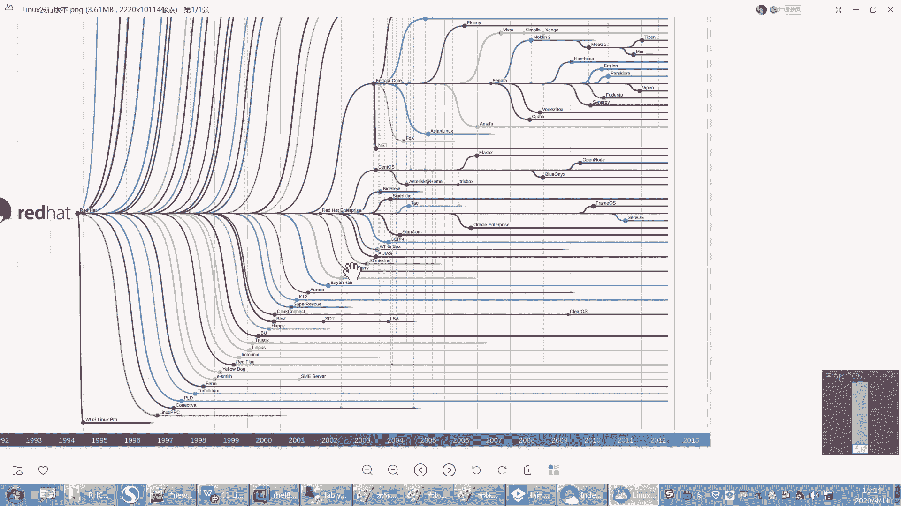
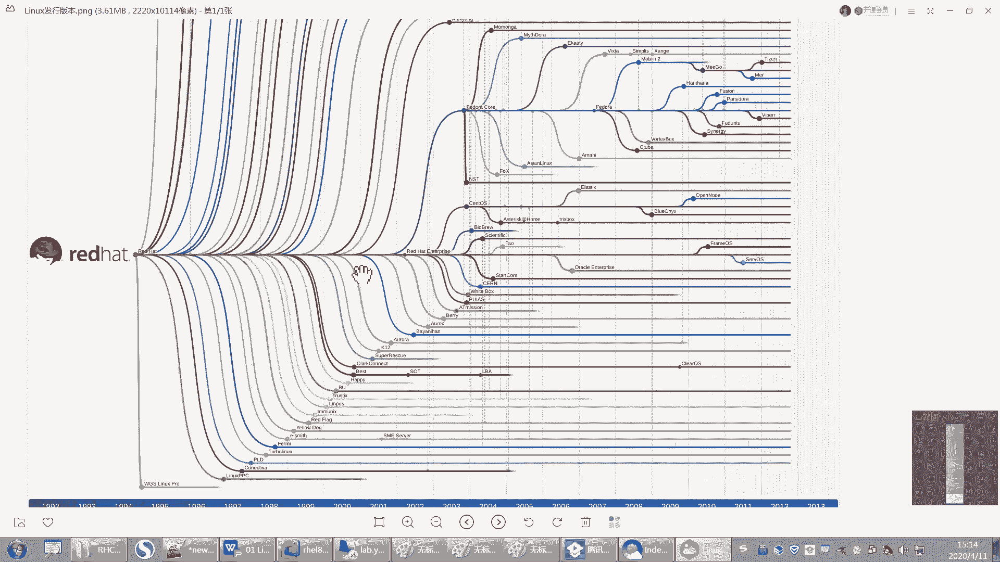

# 【重置详解版】孙老师讲红帽系列视频／RHEL 8.0 入门／红帽认证／RHCE／Linux基础教程 - P5：05 红帽发行版本和其他Linux版本介绍 - 誉天孙老师 - BV1aB4y1w7Wi

发行版本，首先是红帽的发行版本。红帽旗下有三个版本，红帽旗下有三个版本啊，一个叫红帽企业版linux，还有一个叫呃fdoa。百多ra啊。还有这个叫centS三个我都来介绍一下，必须都知道啊。

第一个就是我们今天用的这个今天我们装的这个系统，这个系统叫虹贸企业版linux。啊，它叫企业版。那么它一定有个功它它的特点就是什么？应用程序和功能稳定稳定啊，我们要的是什么？我们要的就是稳定，对吧？

要的就是稳定啊啊嗯而且它更新的比较慢，因为它功能更新的话，它需要测试一些功能，所以呃可能更新的要慢一些。一般红帽的话4年左右。4年左右有个新的版本，像我们去年是去年的时候，红帽八呃出来是吧？

而1414年的时候是红帽七，红帽七，想一下经过多少年，大概4年左右4年左右啊，更新一个新的版本。嗯，更新一个大的版本啊，就是7到8，下一次再到9，可能要又要4年左右以后，对吧？嗯，4年左右以后啊。好。

然后它呢它的一个特点就是它有专业的技术支持服务。当然这个服务我们说过了，你是要付费的，是要付费的啊，就是你不交钱，人家不管你。呃，你可以免费用，你想怎么用就怎么用，但是你要怎么样，嗯，你要出现问题了。

那我不给你解决，你交钱我才给你解决。而且这个服务的费用不低对，不低啊，所以国内有很多他用不起啊，对吧？那他怎么办呢？那只能用一些其他的版本是吧？那待会儿我会介绍啊。好。

但是绝大多数都是根据他来呃开发出来的嗯。啊，呃都去基本上都是用它比较知名的啊，就这个红包企业版的。好，第二个叫斐doa斐doa啊，斐dora的这个版本它是面向于呃。面向什么呢？面向桌面版的。

它其实面向个人和桌面的。为什么要面向个人跟桌面呢？因为这个呢不是面向企业的啊，你看它没有带企业吧，不是面向企业的啊。😡，啊，面向面向个人跟桌面的话，桌面的话就是说它图形界面很很很炫。图形界面很炫。

大家可以去到它fira的官网去看一下啊。嗯，它呃图形界面跟windows有了一拼。对，windows那个图形界面呃相当于是比较炫的是吧？但是它呢可能有嗯跟它有的一拼啊，有了一拼。好，那这是斐多ra。

它是个人使用的，不是企业当中企业不会去用它，为什么不用它呢？因为它的功能。功能太新了，不稳定。功能太新了，不稳定，应用比较多。嗯，如果因为这个是红贸旗下的啊。

所以如果你想知道红贸企业版lin将来有什么新的功能和特性，你可以去用一下这个斐dora。这个斐dora就是他之前会在这斐dora上进行测试。对进行测试。然后大家如果用的话，用出问题了，会反馈bug。

然后去修复bug反馈修复反馈修复，然后最终得到一个稳定的版本用在我们这个鸿贸企业版上面。哦，OK吧，这是他们之间的关系啊，他们之间的关系。啊，不会直接放在鸿贸企业板上面的啊，因为这个我承担不起这个风险。

别人在用的时候啊，我怎么敢去用呢，对吧？啊，而且这个功能它是它这个斐多尔呢，还是由社区支持的。也就是说你用斐多尔出现问题，你说我装个斐多尔哎，崩了是吧？你怎么丢了呀，我不管不管呢？我不管，红帽也不管。

对吧？不是我不管啊，是红帽不管。😡，因为红帽这个本来就是社区版本的，他不提供红帽的官方支持。我就免费给你用还不错了，是吧？你出问题了，你还怪我是吧？啊，他不提供的红帽官方支持。那你说我用出问题怎么办？

你只能去社区提交问题，社区提交，当然别人看到了可能会回复你，对吧？嗯，一般都比较热心啊，他们还是会回复的。嗯，当然你要能看得懂是吧？要跟别人这个英文这个跟别人交流啊。啊，还是针对个人的啊针对个人的。

你自己在这个你的笔记本装个斐dora是可以的啊。好，这个是斐多ra跟红帽之间的渊源。那么还有一个叫centize，那跟这个红帽企业本的渊源就更大了啊。嗯。じゃ。哦，sinS呢呃CENTOS是吧？哦。

那么这个操作系统呢呃最早的时候它不是红贸旗下的，它是有一个社区来做的，就是stoS的这个社区呃，因为这个C嘛，C这就知道这个C是什么意思吧？C就是community community啊就是。

会拼吗？呃，community叫社区的，所以它是个社区版的草系统ENT就是什么enterprise。哎，叫undererpriOS就是操系统嘛，对吧？所以它是社区版的企业版的操系统。社区企业版的操系统。

好，那么它跟火贸之间是什么关系呢？它跟红贸之间，那红贸企业版之间啊，那关系老大了是吧？它其实就类似于说白了就是红贸企业版的复制品是吧？对，跟它一模一样。

它其实就是将红贸企业版的这个代码拿过来之后进行二次再次编译。呃，得到一个版本。而且这个版本呢这个社区也比较厉害。他们呢就是红帽每出一个新的版本，那这个s度S就跟他出一模一样的版本。你是7。1。

我也是现一，你是7。2，我7。2，你8。0，我也8。0。你看8。0的这个红帽企业版刚出来没多久，s度S是不是就出来了，对吧？s度S就出来了啊，s度S的8。0也出来了，对吧？现在8。1出来没有没看啊。

你可以看一下。😡，嗯，反正红猫企业版8。1是出来了。😊，好，那么。这个这个社区呢对吧？这个对于洪帽来而言啊，这个威胁性还是比较大的啊，对于洪帽而言呃，威胁性也是比较大。所以他当时就害怕呀。

有个人天天在屁屁股后头跟着你，对吧？你是不是也很怵，对吧？你说万一哪一天把我给怎么怎么怎么怎么样了，是吧？我还害怕。好，所以当时红帽呀算了。😊，你呢？就把你收了算了是吧？哦，就把它给收够了啊。对。

就把这个社区版的这个stoS给收购了。啊，收购了之后呢，它并没有改变stos的这个工作模式，就是没有改他的业务模式，没有改变啊，就是还是他还是做以前的事情。就是说哎我是什么呀？我是什么版本。

那你就怎么样，你就你就跟着我出一样的版本啊，它这个是还是原来的运作模式。对，还是原来的运作模式啊。所以你现在会看到他们之间对吧？版本基本上就是同步的，几乎是同步的。

他们之间唯一的区别就是logo可能不一样。还有一个区别就是鸿贸企业版，它有服务。就说他有这个服务是吧，卖服务嘛，那这个版本呢就无所谓没有所谓服务。一说。也就是说你用sin度S的话，出现问题了。

我没有人负责。对，没有人负责啊。所以那这就需要什么，需要我们运维人员啊。对，出现问题了之后，我们再去维护它啊，进行维护。你没办法呀，你用snoS就只能出现这样的问题。因为你又没有交钱，对吧？

你要想交钱买服务的话，你就用这个版本对，用这个版本啊。嗯嗯。嗯啊当然这个有社区可以可可能给你这个这个不是不过啊不过红贸企业版每出一个补丁或嗯这个补丁包的话，那这个它也很它厉害在哪个地方？

就是你出个补丁包，我都能给你是吧？我都能跟你一样的对我的补丁包都跟你一样。呃，所以这是它厉害的地方啊，这是它厉害的地方。O。呃，那这个我们公司可能会培养一批自己的这个运维人员来去维护这个系统。对。

用stoS的人啊，而且现在用sintoS不会涉及到版权什么服务之类的。所以大家有些企业都愿意愿意去用这个sintoS啊，愿意去用这个stoS，也就是服务买不起啊。怎么办呢？对吧？只能用这个了啊。

啊，呃，这是红帽旗下的三个啊红帽旗下的三个版本。🤧嗯嗯。所以你你学了红帽企业版，你用stoS，那简直就是一模一样的对，就是一模一样的啊。

好，linux还有一些其他的发行版，这个我就不多介绍了啊。呃，有一些什么deb啊、susy啊、wo版图啊呃特别多是吧？嗯，这是以前红帽的这个logo啊。嗯，苏usy呢是这个你看变色龙这个是吧？还有嗯。

还有什么？还有乌班图，乌班图其实它它也嗯用的比较多。现在很多个人版企业版也都在用，企业里面也在用乌班图。而且乌班图呢，它上面可以它好像现现在就是支持打，就是玩一些游戏吧，应用程序还多一些。对。

有一些应用程序就可以直接装在物班图上面。嗯，好像现在现在好像可以装，我觉得新的版本好像可以装QQ了吧。我没试过啊，说是之前说好像。嗯，可以可以装QQ。之前好像有出过QQ forlinux1。0是吧？嗯。

就是1。0版本，但是后来没有再出了，因为没必要，但也没有用手机、移动终端都比较发达了啊。嗯，就出个，对，现在好像说是又要出了是吧？而且乌斑图的话，你比如说你做这个多媒多媒体，就是3D渲染，呃。

它对显卡支持度比较高，所以呃一般像那种嗯人脸识别啊，或者是那种对图像啊、采集等等处理呃要求比较高的，因为用这个乌斑图对用这乌斑图。嗯，甚至有些公司全部装到无关图，嗯，还有苏usy这种商业版本比较出名的。

嗯，这些大家可以自己去看一下啊，去看一下。好。嗯，那最终呢我们这么多版本对吧？我们还是选择了红帽呃，红帽还是要给大家稍微介绍一下这家公司啊。

呃，红帽这个大家应该都听过了吧，是吧？它叫redhead，就就rehead，其实就是红帽。

嗯。哪个国产的没了？呃，国内还有什么，国内是不是还有。

国内还有这个。

好，我给大家看一下，我我嗯。有一张图。

嗯。看一下啊，国内也有很多这个版版本吧。

深度是吧，麒麟。欧拉欧。忘了你这个家伙。这里有一些发行版。嗯。你看一下啊，这个。这张图呢。这是这是它相当于列的比较全了啊，反正我是已经看头晕了，我就搞不清楚，就是这版本太多了呢。

啊，我们大概有几大家族的几大家族的这个呃版本啊。呃第一个叫debdeb家族的deb家族的呃，susy就是debd家族的。你像susy。

哦，说错了，乌斑图啊，是乌斑图吧。嗯像找不到了，反正好多。嗯，然后还有下面这个呃乌班图是属于迪b家族的。然后下面这个是susy比较出名的些么？susy，还有什么卡里是吧？

这个这是几大家族的吉大家族的。

嗯，还有还有什么卡里是做那个渗透用的，做安全渗透用的是吧？所以你看现在有好多学网络的同学呃，他想去做安全，做渗透，他就要去学linux。

对他就要去学这个linux，看到没有？

嗯。就是卡里有个版本叫卡里是吧？

用这个。哦，然后这是呃还有一个家族，就是红帽家族的。

呃，红帽下面是它的发行年限这样子，红包是1994年是吧？1994年的时候发布的。然后这边你看有红贸企业版，红贸企业版，然后还有oracle的，看到没有？

oracle的这个oracle公司的这个oracle lioracle嗯这个跟它几乎是一样的。所以你会用这个红贸企业版，你也会用oracle的好吧，然后还有stoS看到没有？stoS。

呃，还有华为的这个欧拉OS，华为的欧拉OS。

也是基于红帽这个家族，红帽这个家族。所以你用华为的那个ol拉OS，你只要会这个你也会用红帽的那那个华为那个还有国内很多的就是产品，反正基本上都是大同小异。只要你会一个会一个就行了。嗯，其他的都就就。

都是相通的啊都是相通的。就一些工具可能有它有点不太一样，是吧？

啊，这就是红帽，为什么要去学红帽啊？而且红帽的整个认证体系它是比较全的，没有哪一个版本有这么全的认证体系啊，认证体系啊，所以呃。

而且红帽在整个开元界它的领军地位，大家应该是知道的。还有一句话叫呃红帽开元界的领导者是吧？是不是叫开源界的领导者啊？

嗯，对开学界的领导者地位啊，领导者。开学界的标，而且红帽是做纯纯软件的。呃，纯软件的公司啊呃，但是很不幸是吧，被收购了是吧，是这样吧。呃，很不幸最后被收购了。呃，被别人看上了是吧？被IDM公司给看上了。

嗯，这个去年的就是之前当时被收购的时候，人们都很担心啊，就说呃这个新闻就是。这个新闻是比较大的一个新闻啊，然后被上被，当时被收购人们就担心说那红帽，我去学红帽，这个这个还有没有必要学，对吧？

就学了还有没有出路啊，这这这对吧？大家有担心啊，但是目前为止是没有受到任何影响的，而且。嗯，他的这个。发展会越来越好。因为为什么IBM会去收购红帽这家公司？嗯，这个大家可以去想一下啊。

你想下IBM它是做什么，它基本上是做。他它的产品一般都是必，它就必然的嘛。😡，对吧它产品就是这个闭源的，它从什么，它从硬件它好它好在哪儿？它从硬件到什么软件全是自己的。有自己CPU有自己的服务器。

有自己的什么操系统，有自己的都有。对它的兼容性。因为自己家公司做的嘛，兼容性肯定是什么要好一些嘛，而且稳定对吧？像这大型机小型机。但是现在的什么现在是什么时代呀？现在是就什么开源对吧？那开源嘛。

大家现在都用一些开源的产品。你想如果IBM说来，我把某一个软件给开源了，现实吗？不现实，这件事情是不太现实，那我怎么办？那我怎么才能怎么样，呃，才能跟着上什么现在的潮流呢。

呃算了跟不上就怎么样收购你算了是吧？😊，好，又把红帽给收购了。呃，现在去做呃，因为红呃像大家现在开始做云嘛，对吧？呃，做云，你像IBM也有自己的云，但是它的云呢它。怎么说呢？他现在是想做云云。

就是做云的老大是吧？呃，他就结合什么红猫的云啊，ABM的云做混混合云啊等等。对，所以有钱还是跟这个这个对吧？想去收购谁就去收购谁，然把红帽都给收购了，是吧？😊，嗯，而且现在IBM公司。

他们所有的这个呃员工都要去学红帽，而且考红帽的认证。对，考红帽认证。之前我们有一批就是这样子，有一批学员就是全部是IBM公司的，就武汉IBM。呃，他们全部要去考那个那个那个那个CA的。

有一门叫open shift的吧。然全部好上去要去考，对要去考。所以他给他给红帽带来的市场会更大啊会更大。嗯，这个嗯就是红帽。目前为止，我们为什么要去选择红猫啊？

所以我们选择其中一个，其他的无式基本上就自同了啊。好呃，下面呢我们有一句话啊。呃，我们类当中我们有一些基本的准则啊，基本准则。呃，我们给大家说比较经典的几句话啊。第一个你只要记记住这句话。叫一切接文件。

呃，C里面open shift的学吗？学啊嗯你们报了CA的就会学。好，叫一切接文件，包括硬件。对，包括硬件啊，那么。我们所有的。lin当中，所有的都是以文件的形式存在的啊。呃。

比如说一个进程呢就比较抽象的一个以文件形式存在，对吧？包括一个硬件，比如说我像鼠标啊、键盘哪，还有磁盘哪、显卡呀等等等，所有的啊它都是文件。所以所以你只要这句话，一切接文件。对，一切接文件啊。好。

第二呢，我们linux当中啊。它的一些应用程序都是小而功能单一的应用程序。

link当中的应用程序。比如说啊我们呃我有一个，比如说我有一个看的。

看的工具是吧，那看的工具它就只能看。😡，就只能看是吧，他能不做什么，其他呢他能不能写呢？啊不能写。对他可能啊比如A他就只能看嘛，你说写怎么写啊，没办法写。😡，哦，那这相比于windows当中的一些。

比如说QQ这种应用程序，它就是什么呀？它功能太多了。比如说一QQ又可以本来就聊天的是吧，结果现在变成干啥的呀，变成什么嗯嗯。变成一些什么工具啊，邮箱啊。呃，玩游戏啊，干嘛干嘛什么偷菜呀，是吧？

抢车位啊啊有很多这样的功能是吧？还有什么QQ空间啊啊，传文件啊，对吧？😊，哦，唉，说到这个QQ，我还没加咱们群啊嗯。好，然后它都是一些这种小而精巧的应用程序。那QQ呢不windows的工具呢。

它就是大而宽对吧？大而宽泛的这些啊功能太多，但是它不专一，不专一的话，它可能就性能没有专一那种好，比如像像一些远程工具，对吧？QQ是不是可以远程，但是QQ远程的话，它是不是很慢呢？它会很卡，对不对？

那我们就会有一些单独这种做什么？只做远程的啊，那性能肯定会有好一些，性能可能会好一些啊，那lins当中我们都是什么都是这种工具啊？

都是这种工具。OK吧？好，下面呢那如果说我想去实践一个复杂的任务怎么办呢？那我就可以将多个程序组合在一起，一起来去执行这个复杂的任务啊，这个就会我们去都会去使用一些工具，然后把它联合在一起啊好去执行。

啊比如后面我们写写脚本呢，对吧？把所有的这个就是这个任务，这个都放在程序都放在一起，对吧？一下子执行了啊。好，然后还有什么跟用户操作界界面无关，就是你在哪个哪个界面去操作它，它有很多操作界面。对。

有很多操作界面啊，你在哪操作都一样的。我们待会儿会给大家嗯，下一章就会讲到啊这个操作界面。好，最后呢就是说这个文本呃文本文件啊呃都是以文本文件的形式保持配置数据。

就是呃比如说啊你像我们想去修改一些配置数据，比如说我修改IP地址啊，我就可以打开一个类似这种windows里面的一一个什么一个这样的编辑器，然后往里面去写。比如说写上IP地址等于什么什么什么对吧？

这样去写。所以我们待会我们以后去修改配置的时候，都会通过什么，都会通过文件来去修改。那你说老是windows难道不是通过文件吗？那windows还真不知道是通过什么什么东西。

你像你windows的IP地址，你你是通过文件修改的吗？😡，但是那个IP地址放在哪呢？你你找不找到啊，你不一定能找到是吧？😡，嗯。

但是windowslin都是基本上都是透明的那lins基本上都是透明的啊好，就放在这个文本文件里面，然让我们随时去修改这些配置的数据啊，配置数据。

好，那这一张呢我们就到这儿啊，我们这张都学了什么啊？呃，我们把系统装好了，对吧？还没装好的，今天晚上回去吧，装好啊，装好，明天我们就要去操作了。对，就要去操作了啊。你明天你装好，你还能跟得上。

还可以操作一下。然后我们要知道什么开源软件，开源软件的什么叫开源软件对吧？为什么要用开源的？嗯，将来我们能不能也加入这个开源社区啊？嗯，当然也可以是吧？如果你们足够厉害的啊，我跟你说在开源界混的这群人。

那是非常厉害的啊，非常厉害。如果你们有对吧？能够加入进去啊，那个你像国内有很多公司大型的公司啊，他都会有一些这个人员在这个开源社区里面工作，专门派一些人在开源社区里面工作。而且像国内的这些呃开源社区啊。

或者是有一些还有一些自由软件软件基金会是吧？像linux这个有个linux基金会，大家知道吧？😊，lins还有lins基金会呀。然后有很多国内企业就要加入到这个基金会里面，还要充会员，就会员等级越高。

就钱越多，充的越多是吧？你会员等级越高嗯，那为什么他们要去花钱买这个会员是吧？嗯，当然这你如果对吧？知道了将来这个这个linux的发展方向，那对你们公司企业发展而言是不是就会更好，否则你就。

就是你不知道将来未来的方向在哪个地方，对吧？你就每你就每天就是毫无方向。对你不知道将来可能往哪个方向去导。因为这个这个互联网这个时代，你将来你都不知道你将来可能会被谁谁打败，对吧？呃。

然后就是linux一个起源，还有各个发行版本，还有linux的基本原则。啊，我们基本上今天我们就做一下安装啊，介绍啊啊就是嗯先做一个了解啊。

好了，那我们今第一章啊就到这儿，好吧，就到这儿啊。嗯呃我不是我的水平还不太不够高啊。嗯，我希望咱们班能够对吧？能够加进去啊。😊。

