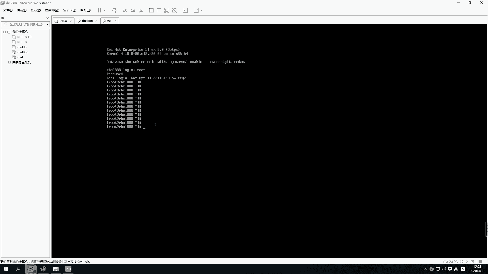
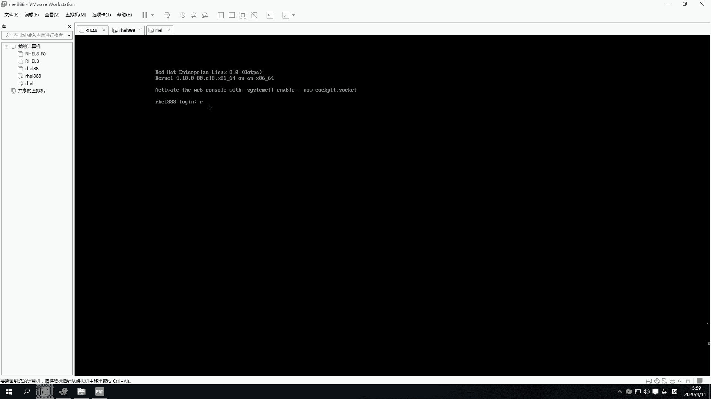
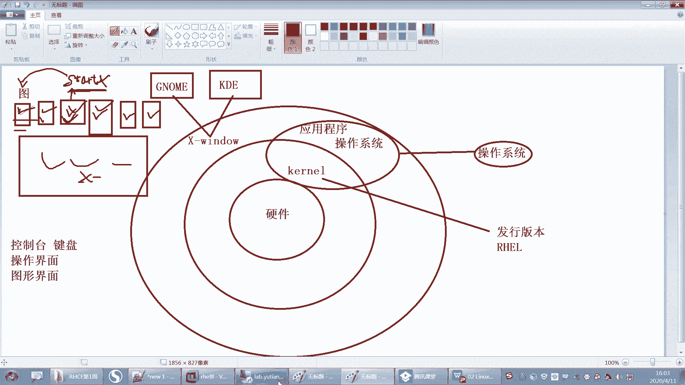
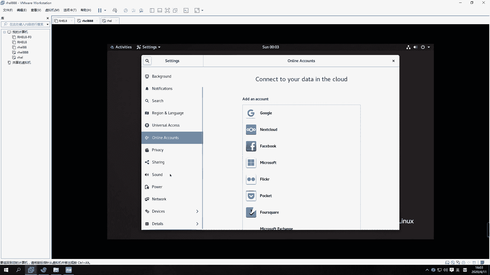

# 【重置详解版】孙老师讲红帽系列视频／RHEL 8.0 入门／红帽认证／RHCE／Linux基础教程 - P6：06 rhel8的gnome桌面使用 - 誉天孙老师 - BV1aB4y1w7Wi

第二张啊第二张呢这个是linux的基本的使用。我们要先去会用一下，就操作界面要熟悉一下啊。好，呃，这张呢我们会去学习一下关于怎么去登录这个linux操系统。呃，还有怎么去呃还有这个控制台是吧？

有几个控制台呃，怎么去启动一些图形，呃，你要会去简单的执行一些linux的命令啊。呃还有最后你要去会去编辑文件啊，编辑文件啊，最后呢我们稍微做对root的root用户呃，做一个基本的了解，好吧。呃呃。

下面呢我们来看一下啊，关于等会去登录操系统。呃，我们linux提供了两种登录方式，两种登录方式啊。第一个呢是图形图形登录，就是第一个第一个这种方式啊，就图形登录。呃，这个这张图可能放的不太正确。

应该是那个登录界面啊，就是这个图形的。嗯，第二个呢就是这种字符界面的，看到没有？字符界面的啊。

好，我们来看一下啊。

呃，图形界面呢就是这样子。如果你选择了sver with GUIGUI的啊，就是GUI那就是带图形的。那么带图形的话，嗯，它这个地方就会有进来之后就会看到这样一个登录界面啊，登录界面啊。

你可以怎么样在这输入输入呢？那就是这样的是吧？然后在这输入一个。Root。嗯，然后再输入密码这样子啊，就你输入用户名跟密码就进来了，就这样子好吧，进不来就密码输错了啊。有同学他有一个小键盘，你知道吧？

我我这个真的呃，有的同学他他的笔记本是有小键盘的。他在输密码的时候，他用的是小键盘上面去输密码。嗯，然后导致他怎么都进不去，他说老是密码不知道啊，他是问我，我说我也不知道啊。😡，那要不我帮你破一个吧。

那我我在你身边，我可以帮你破，对吧？那我现在不在你身边，我没办法帮你破啊。所以你这个要注意输密码的时候，千万不要你最好不要用小键盘，有时候你摁出来没摁出来，你搞不搞不清楚的啊。好，这是通过图形界面。

图形界面去登录啊，还有一种登录方式就是这样子的。嗯。Yeah。

我不动。外部没有吧。

啊，就还有一种界面是这样的界面啊。还有一种是这样的界面。好，然后这样界面的话就是嗯看一看这个是鸿贸企业版8。0的是吧？然后这个是我们的操系统版本啊，下面是内核版本。嗯。哦，这个好像有。

他说激活web的conl，对吧？web登录方式哦，就开启这个，你是应该是stoS8的吧那。对。他这个web console。嗯，通过web这个这个web去登录是吧？好，然后下面这个就是输入这个呃用户名。

输入用户名啊，root。啊，然后再输入密码。这样的话就登录进来了。对，登录进来了啊。呃，然后你们呢就是在这个地方要记住啊，在这是log in这个地方是输入什么，输入用户名，password输入密码啊。

有同学在这个这个地方输入密码，在这输入用户名，反正搞来搞去也没输对啊，不要弄错了。而且这个地方你输入密码是看不到的啊，就是其实你已经输进去了，对吧？但是你看不到你输的这个内容，嗯，它没有回显。

没有回显啊，然后这个就可以直观的给你一个什么给你一个这样的命密行。给你一个这样的命令行啊。

好吧。OK好，这是两种登录方式啊。但是现在就第三种了是吧，web界面啊。这个我要研究一下web team怎么登呢，还没还没研究过。啊，那么这个图形界面呢并不是所有的这个呃系统都会有图形界面的啊。呃。

你需要它由什么来支撑呢？它里面有一个叫X window的X window的啊，就是是这样的啊，就是在这个你看这这张图啊，这张图这个操系统这一层面需要安装很多的应用程序，很多的应用程序。

那里面有一个叫X window的。呃，叫X window的啊一个一个图形协议框架。嗯，这个它可以提供什么，提供这个我们的图形，就上面可以跑图形，就上面你只要跑图形。

你就需要装这个什么X windowX window啊。那么这个图形上面呢啊它会提供一些，比如说有了这个图形就后光有这个还不行。你还要装一些图形工具啊，这个图形工具呢。

包括比如说啊还有什么有这个有两种有两种啊，一个是这个gome，就是我们接下来会学到的这个gome。它这个桌面工具叫gor，呃，还有一个比较常用的叫KDE的KDE的。这两种是比较常用的桌面。对。

第一个叫gor呃，第二个叫KDE。我们红贸企业版的话用的是gor，这种工具都是开源的桌面工具，就是这个你看到的这个界面。

No。这个界面它就是什么？它就是gor工具啊，gro桌面。gor这个工具提供的一个桌面啊，那你可以在这点对吧？右键等等啊，这gorome工具。

啊，所以你要想实现，比如说你之前没有装图形界面，那你就首先要装X window，要再装一个什么gome这个桌面工具才能或者装KDE才能实现出现图形啊实现图形。好嗯。这个是这个图形控制台啊，图形控制台好。

这是虚拟控制台，对吧？那图形控制台跟虚拟控制台之间呢，它可以怎么样？哎，你不慌啊不慌啊。

啊，他嗯还没到那呢啊。然后通信控台跟虚拟控台呢，它可以进行进行切换，对吧？比如说啊你我刚刚在这个这个地方是吧，是不是在这儿啊？

嗯，在这个地方呢，它呃有一个这个字符界面，就是就是字符界面啊，我们可以怎么样啊？执行呃第一个命令，我们今天选第一个命令叫star X。这也叫star X，它可以怎么样？它可以开启一个图形。那。

你执行一下star X啊，不过一般这种开图形的话，它很耗什么？它很耗这个。很耗信任的啊。嗯嗯。嗯，现在直引达雷不行了吗？嗯。好，待会儿它就会开启一个图形啊，开启一个图形。

好。呃，其实那个star那个star的话呃，刚刚执行的什么？是叫star X是吧？那个star那个X呢指的就是这个X window的意思，把它开起来也开起来啊。啊。

你要想执行star X能够开启这个图形的话，那么你一定要怎么样要装X window和这个桌面工具才可以开起来啊，才可以开起来。

好，那么我们这个图形控台跟虚拟控制台之间呢，它总共有几个呢？我们一共啊提供了几个虚拟控制台跟图形控台呢？呃，我们红帽八跟七是一样的，七是几个，它就是几个。呃，红帽八提供了5个虚拟控制台和一个图形控制台。

5个虚拟控台和一个图形控台啊，一第一个图形控台就是我默认进去的这个。

那我默认进去是其实是这个看到没有？默认是不是这个啊？那我每次进去的时候，它都是这个图形控制台，对吧？图形控制台啊，然后我也可以切到什么，切到这个虚拟控制台嗯。

比如说呢是不是切了一个虚拟控制台，对吧？啊，这就是虚拟控制台。虚拟控制，其实说白了就是什么？就是字符界面啊，字符界面。那它们之间是怎么切换的呢？你可以摁着这个cttrorlal加F1。😊。

control all F1啊，然后conttrol all F2conttroll F一直123456这样子去切换。嗯，一般就ctl order F一就是那个图形控制台。

图形控制台就cttrolal F1。然后conttrolal加F2到F6，就是5个虚拟控制台。对，5个虚拟控制台啊。好，你可以在虚拟控制台上执行staryle X运行图形，但前提是什么？

你需要装图形界面才可以star X啊。好，那是这样的啊嗯。我们这个地方呢，比如说啊我现在这个操作系统是吧，上面是不是有很多很多的控制台呀？那有一个、2个、3个、4个、5个。6个是吧？好。

第一个呢就是我们的什么图形控制台，图形的啊。好，其他的都是什么字符界面，都是这个虚拟控制台，虚拟控制台。好，那我们在这个控制台之间进行切换。比如说我在这个控制台之间，这个控制台对吧？呃。

这个空制台切到这个空制台，我们摁什么呀？是不是按ctrol all加F2，cttrol all加F3contlal加F4F5F6是不是这样去切换呢，对不对？啊，那么我们刚刚是不是切到一个虚拟控制台。

在这个虚拟控制台上，然后执行了一个什么star X。对我在这个虚拟控制台执行了一个star x啊，那我在这执行一个star X，是不是就跳到第一个图形控制台呢？是不是就跳到第一个图形的界面呢？注意啊。

不是不是啊。好。它并没有进入到第一个控制台，要想进入到第一个控台，一定要用controrl al加F一才可以进入。那我star X是什么意思呢？s X是指的是什么呢？

指的是你在这个控制台上在这个控制台上开启了图形的应用程序。对，开启了图形的应用程序。所以你直引star X是没有切换控制台的，能不能理解是没有切换控制台。

切换控制台只能通过contrl al加F1F2F3F4F5F6这样子去切换啊，这样切换。好，那么我们sex前提是不是要这个操作系统上面要装什么？X window吧，是不是X window啊。

嗯才能执行s啊。

好，你们可以去试一下啊，怎么进行切换。ctrlal加F6是吧，嗯输入密码。

呃，我们红帽手好像是红帽，红帽六的时候，它只能开一个图形，红帽七可以开，就是你你有几个你就可以开几个。红帽八，就是你有几个，你就可以开几个。不过你图形开的多的话，它一般它就是就是怎么说呢？

它带很难带起来啊。呃，是这样的，你的conttrol键跟old键。FOF2那个键有可能它是那个声音，好吧。你要把它换成那个F2那个键。就是你们的键盘上。你们这你们键盘有时候摁F2，那不是声音键吗。

或者什么什么其他的亮度啊，那些键是吧？😡，那不是那个你要换一下，切一下，你把它改一下。😡，才能摁出来，否则摁不出来的啊嗯。

嗯。嗯。你们自己去研究一下，好吧，看摁哪个键。好。嗯。

那这个就是在不同的控制台之间进行切换啊。那么什么叫控制台呢？其实控制台说白了它就是一个操作界面。控制台啊，它就是一个操作界面。但实际上我们现在所说的控制台已经不是以前那个控制台了。我们现在的控制台呢。

我们以前啊最早时候说控制台什么叫控制台，什么控制台就是什么？就是你的键盘啊，有鼠标啊，还有显示器啊，对吧？那这一整套，我们叫一个控制台，叫一个控制台啊，但是现在我们所说的控制台都是虚拟控制台。

其实说白了它去就你就一个什么？你就一个鼠标键盘显示器，对吧？但是你是不是可以切这种把它模拟出很多虚拟的控制台，对不对？虚拟的控制台啊，所以我们叫控制台啊，控制台啊，那么这几个控制台呢。

为什么要做这么多控制台，124456，对吧？哦，一般我们图形界面啊，比如说你装了图形界面。我知道图界面，我可不可以不开图形界面呢？当然可以不用开图形界面啊。因为开图形界面的话。

图形处理它需要消耗更多的这个资源。对，图形处理啊，所以我们效率要高的话，一般都很少开图形，很少很少开图形啊。像我平时如果没有什么特殊需求，我一般都不开图形。嗯，而且消耗的内存还会少一点，还会少一点啊。

啊，那么嗯。啊，那么如果第一个图形控制台卡卡住了，对吧？第一个图形控制台卡住了，或者第二个也卡住了，那么你就可以有更多的控制台。比如说你可以切到第什么切到第三个控制台啊啊，切到第三个控制台。

然后切到第四个控制台，对吧？他们各个控制台之间是相互独立的，相互独立的啊，就是这个控制台崩了，没关系，不影响第二个这个也崩了没关系，不影响第三个对吧？就就是崩了之后，我还有几个总共有6个嘛。

因为怎么能6个都崩了吧，对吧？所以他就给为什么要给这么多的控制台啊，给这么个控制台，就是防止我们的什么某一个界面，某一个控制台崩呃崩崩溃之后，我们可以用其他的控制台来去呃去操作啊，因为你在哪个控制。

然后操作其实都一样的嘛，因为它跟这个用户的操作界面是没有关系的，对不对？没有关系的啊。啊，这就是我们提供一些控制台。但是一般我们很少说这个除非你真的说这个控制台卡住了，你就要在这个控制台里面去操作是吧？

才会去切控制台啊，否则一般很少会去切控制台的一。

那我们就是有网络的话，我们就远程登录了，远程登录了啊。好，很少碰到说控台卡住的成，就这种情形啊，不过以防万一嘛，他给我们提供了，我们就知道就行了啊。

好，这个是图形界面跟字母界面之间进行切换啊，进行切换。好，那么下面我们来看一下关于gorm工具的一些这个使用呃一些这个简单的使用啊。嗯我们来看一下，我们先切到同界面啊。

嗯。我去吧。这个设置一下。😔，没有。

啊，然后这就是一个黑色的这个这样的一个图形界面啊，呃图形界面。然后在这边呢，我们可以比如说我要去敲命令，对吧？我们在那个字符界面直接给你一个命令行，直接给你一个命令行。但是我们在图形界面。

我们怎么去敲命令，对吧？你就可以点这个地方，这个有个小红帽，那我们所有的啊就是你包括你将来用红包把考试的话，它桌面上什么都没有，什么都没有啊，你需要点这里。

嗯，这地方有个浏览器，对吧？那火狐浏览器就这个。

我把这个机器关一。感觉还是会很慢，这图形就会跑很慢。好，然后下面有个terminal，看到没有？有一个终端，你就是打开点一下点一下啊呃，红帽器实右键就会右键叫在终端中打开是吧？那这个没有。

这个就在这里啊，点一下terminal，点一下啊。

然后就会出来这样一个黑色的界面，看到没有？一个黑色的框框，对吧？啊，这个黑色的框框上你就可以那它给你一个提示，一个提示符，你可以在这敲命令呢。呃，在这在这敲对吧？就可以敲命令了啊，好吧。好。

那这个黑色这个界面呢你也是可以改的。我我大概点了一下啊，因为我也不是太熟，因为我这个嗯图一界面用的比较少，然后你可以点这个preferenceprefer它可以去修改的。比如说。我大概找了几个。

他他可以修改。它这里有个呃透明度，看到没有？他可以看这个透明度啊，这有个透明度。嗯。那看到没有？它这个透明度是吧？你这重启了吗？你重启试一下。control加油器什么都什么都不是，没有。啊。

然后还有还有一些啊，比如说我想把这个改成白色的。那你就可以呃在这里改。那这里有个主题嗯，light就是亮色的，看到？亮色的是白色的，但是你要把这个透明度调回来，要么然都透明的。这个我就不跟大家点了啊。

你们自己感兴趣就去点一下。嗯，我很少去研究这个。我看有的同学研究哇研究的这个对吧？很炫酷啊。把这个关掉。你再切一下，要不你就重启一下试一下啊。好，那这就是一个这样的呃框框啊框框。好。

那么现在我们可以在这敲命令，对吧？那它这个地方有个提示符。那如果说我们在这个敲一个命令，那这个嗯这个这个这个框如果被占用了，对吧？那如果被占用的话，那么。我们就要去敲其他的命令，执行其他的任务。

我们可以打开多个窗口啊，你可以打开多个嘛呢。那就可以打开多个。大家如果卡的话，你把内存多给一点啊。给太少了，就。有些时候他。它运行起来，它图形本来就本来就是比较卡。那我这。嗯，我之前之前很顺利的呀。

不能打开多饿吗？New window。唉，这里可以打开呢。这样可以打开。那你我再点这个terminal，然后这里边new window，它就可以打开多个，看到没有？No。打开多个。

你们最还是多给一点内存吧，要不然它开机关机就比较慢。这个红光娃这个图形。嗯。多给一点。嗯，多给一点啊。好，那么这个多个窗口你就可以多可以去敲，但是它这样很乱，对不对？很乱啊，那你就把它给呃，这样啊。

我们想去把这个窗口给关了的话，我们可以点这个叉叉，对吧？但是呢我们如果你什么这个地方什么事情都没有做啊，但是最好这样吧，不要养成习惯了啊，不要去点这个叉叉，你可以就EXIT这样退出来。

EXIT这样退出来。对，这样去退出来啊啊，就第二个命令EXIT这就退退完了就退出来了，然后重新打开一个。好，然后它可以打开标签页的new table这个。TAB就是标签页的意思啊。

new table是吧？标签页你可以打开一下，然后右边就出现两个标签页并排在放啊，就打开标签页。当然我们也可以用那个命令，就是用那个快捷键去打开标签页啊嗯。哦，你c摁一下control shift加T。

ctl shift加T，它就可以打开那个标签页。那ctrol shift加T就可以打开多个标签页。看到吗？然后那这个标签页你可以在标签页之间进行切换。比如说conttrolalF1F2F3F4啊。

al1234好，是这样的啊。

那你创建新的标签页，就是通过control。control shift加T就可以创建一个标签页了。然后你在标签页之间进行切换，你就记这个吧，这个也可以切换。

我比较喜欢用这个叫alt123456这样去切换。呃，就是后面方便大家以后你考试，你只你考试的时候，你只有这个界面，看到没有？你考试的时候就在这个上面去敲啊，那个上面去敲，你可以按住al1234这样。

这样在标签页之间进行切换。嗯，ctrl Al1234在标签页之间进行切换了啊。

好吧。然后呢呃标签页你想关掉的话，就ESIT嘛，就这样把它关掉就可以了。大家不要去点。不要去点右上角这个叉叉啊，这里也不要去点它，你点这里的话，你把所有的这个标签是不是都关掉了？如果有一个。

任务在这个地方运行，在这个界面上运行，一你这样关的话，有可能会把那个任务给异常中断了。所以大家不要养成习惯，点这个叉叉啊。嗯有的同学对，不是说大家啊其他的。他喜欢点他他就没事儿，他就喜欢点叉叉嗯。

就是那点这里是吧？不行，点这里就不乱点啊不行，再点点这里再不行，点关机是吧？所以你不要去看到叉叉就点它，你看这里不有吗？右键是吧？你要温柔一点，不要那么暴力啊，不要动不动就点这个叉叉，看见叉叉就想点。

😊，这得有关机嘛，然后。重启对不对？还有一个挂起，这个挂起的话，你点一下，它就把你当前的状态给保存下来了。

，这个。感觉这个服务器不行啊，还不如用我自己的电脑。

哦用自己电脑上。

感觉我自己还快一点。

嗯，所以大家不要去点这个叉叉啊，点这个叉叉了。嗯，养成习惯啊养成习惯，好吧。好，那么这个嗯这个比如说你嫌字太小了，嫌字太小了，你可以怎么样啊？

你可以control shift加放大control shift看到没有？control shift加放大这样放大然后contrl减放小好，是这两个标签啊，大家可以记一下。

就是第一个是这个control。呃，我这边没有写是吧？好，再加上啊嗯control。加shift。加加号，这个是加号啊，加个加号，然后它是什么放大。大家自己记一下，好吧，PPT到时候发给大家啊。好。

然后在conttrol shift。啊，没有shift的啊，就加减号就缩小。缩小。嗯，就让ctrorl减缩小啊，这个是放大好吧，放大。

呃。OK吧，就是你字太小了，你就放大一点。如果你眼神好，你就缩小一点。OK大家可以改字体，但是字体的话，你你自己改一下吧，那大小是吧？这个我没有改过，你可以自己去改一下啊。好，然后我们这个复制的话。

怎么复制呢？就比如说你这个界面上怎么复制啊，我们这个里面你可以这样，右键可以选中选中这个。呃，选中这个右键复制，看见没有？copy。paste是吧。嗯，没copy paste这样去选。这你总会吧。

对吧那copy，然后paste这样去选。这样这样去选啊。啊，当然这个地方也有control什么，ctrol C，我们用windows controltrol C对吧？那你control C没有用啊。

conttrol C是中断的意思。不要在这使用control C，ctrl C是中断的意思啊。嗯，不要去使用ctrl C。大家平时把我说的我说到的这些东西啊，你记一下好不好？嗯，你你你最好记一下啊。

可能PPT上没有了，你就记一下。啊，那ctl C是中断的话，那我想复制怎么办呢？也可以啊，你就可以把它选上，比如说选上啊，然后contrl shift C。

然后control shift的为这样去复制control shift的为contl shift的为这样去复制，看到没有？嗯，crl shift为这样去复制啊，就复制跟粘贴啊，复制跟粘贴实在不行。

你就右键这样去选。啊，当然这个功能只是这个桌面工具才提供的啊。你比如说你在这种情况下。

呃，你你你在这种情况下，你就没有办法去选你的鼠你的鼠标都用不了，鼠标都用不了啊。那在这个控台上啊，不过以后我们学了一些远程连接工具之后，那你就不用担心了，是吧？

好，反正在这个里面我们是这样子的啊。好，这是复制啊。啊，复制粘贴。那如果想清屏，比如说这个内容太多了，我们想去清屏的话。我们就问controrl L这样去清屏，看到没有？control L。

control L去清屏。control也要清屏啊，或者是clear。可。clear这样去清屏。

嗯，会吗？会了吗？嗯，clear是清屏，就这些啊。这个标签页什么滚动这些我都很少用，所以这个你不用记，这个也不用记，其他的你记一下，这个是经常用的嗯。就是在这个桌面工具上才能在这个桌面工具上用的啊。

如果你换一个桌面工具或换一个工具那个连接工具的话，操作界面呃有可能就不是这个了啊，好吧。

好，这个就是我们这个这个呃桌面工具的使用方法啊。我觉得我用自己的吧，这个远程的话，我先把它关掉。好。这个黑色的大家能看见吗？应应该还好吧。我放大一点。O。黑色的啊。好了，这就是你桌面上怎么具体的使用啊。

还有右边的我话，我就可以教大家点一下啊。比如说嗯你这边会有一个这个你看可以点这个这个是相当于设置嘛，对吧？设置。

你就可以点一下设置。然后如果你想比如说我想去这个是背景是吧？然后这是蓝牙什么通知啊什么之类的语言啊、区域啊这些这就不多说了啊。然后右边这个地方有一个这个。

有一个这个是吧，这个是关机吧，右边这个是关机，然后这个是锁锁上锁屏，这个你们自己去点，好吧，我就不我就不带大家说了，因为这个毕竟不重要。嗯，然后你就就点一点，然后这你就。

