# 【重置详解版】孙老师讲红帽系列视频／RHEL 8.0 入门／红帽认证／RHCE／Linux基础教程 - P8：08 Linux的tab键补齐和history历史调用 - 誉天孙老师 - BV1aB4y1w7Wi

好了，嗯，我们昨天把这个系统装好了，回去还有没有没有装好的呀？昨天我们学了什么把系统安装啊，系统安装好啊，然后呢我们学了一些简单的命令啊，昨天学了哪些命令，我们再回忆一下啊。嗯，我们昨天学了一个。

首先学是sstar X，对吧？这个命令可以去切换我们的这个字符界面到同一界面star X。然后还学到了一些嗯常用的命令。比如说ID啊显示这个用户信息显示用户存不存在，还有什么还有呃SU对吧？SU杠。

加用户名，它可以去切换用户切换用户。然后第二个呢就是password，它可以去修改密码。啊，以及我们还简单的选了一个us a，对吧？它是创建用户的啊。

这个我们后面会仔细给大家讲这个这个用这个命令的使用啊。还有昨天我们还学到了什么？嗯。我不记得了，你们记得吗？哦，data哦data CAL。哦，PWD对吧？嗯，LLLS简单的说了一下，然关机。

NIT0和power off关机。啊，其实学了还挺多的啊啊VIM。哦，对VI变器VIM哦，ban昨天也说了一下啊，这个用的比较少，你知道有这个工具就可以了。呃，VIM昨天我们说这个VIM这个工具啊。

它我们后面会经常会用，所以这个必须要会啊。这个回去大家自己练一下，如何进去NI对吧？退出ESA冒号WQ退出保存退出W保存Q退出。啊，嗯其实我们还有一个工具叫GVM，我不知道大家听过没有啊。

这是一个图形界面的呃。怎么说呢？它是一个能记呢，就是graphic对吧？图形界面的一个呃。这个在windows里面好像也可以用，你可以装一个在windows里面去搜索GVM。

它就相当于就是windows跟VM一样的啊，就是后面你用习惯了就可以去在windows里面去使用，就知道有这个就行了。

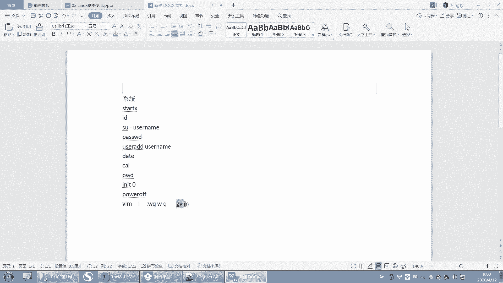

啊，这个地方好像是没有的，看一下啊。

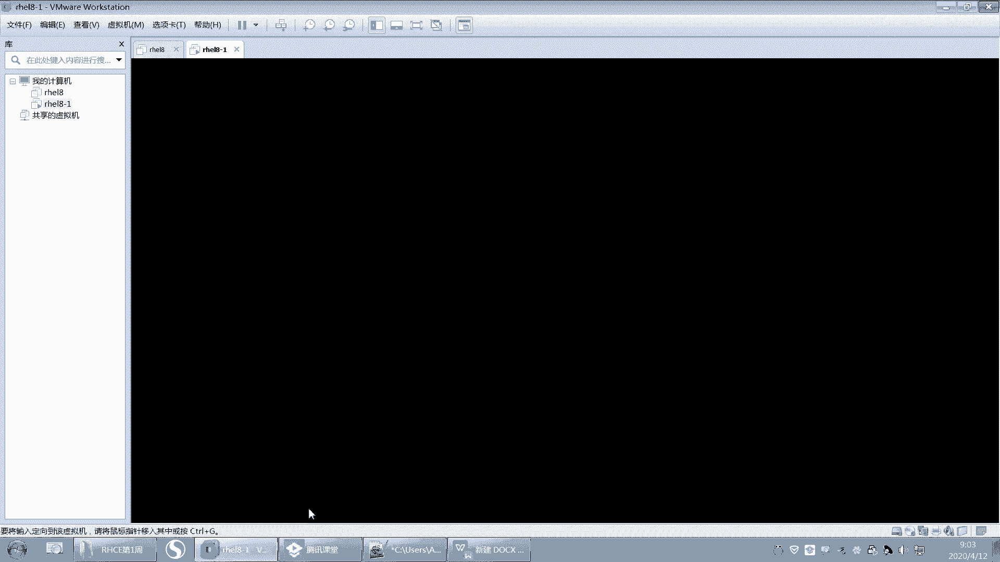

GVM是吧？哦，这里没有没有这个。好，这边你看这个地面就报错了啊，啊，当我们去修去去去执行一个命令的时候啊，那么这边就是说command not found，对吧？这个命令没有找到啊。

也就是说这个命令是不存在的啊，那么跟它相似的命令，这个是相似的命令是什么？是VM啊。

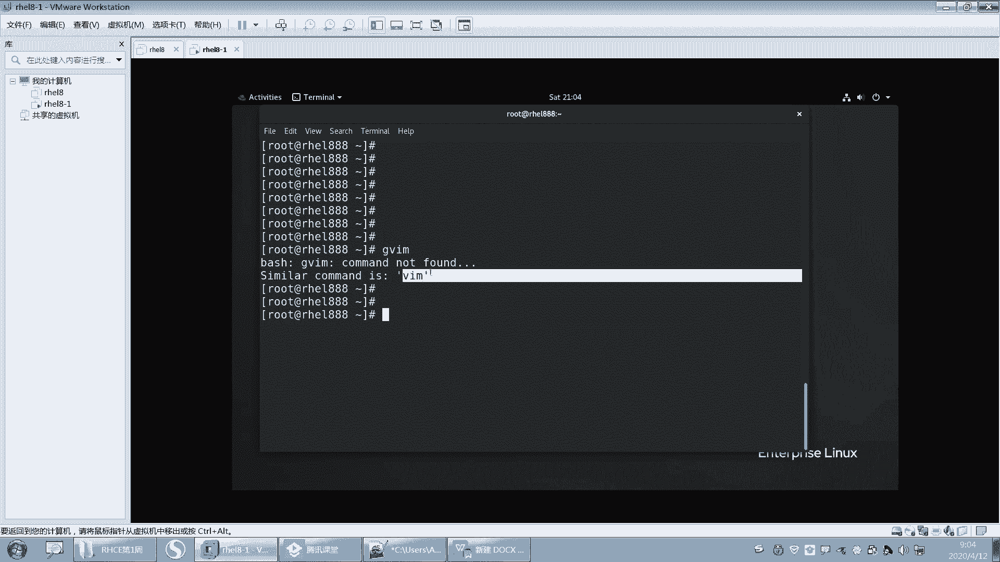

哦，有可能敲错了，对吧？有可能这个命令没有装啊。好，然后嗯这个是我们昨天大概学的一些命令啊，回去大家一定。每周啊每周都要把这个这周内容复习好，大家把基础打牢啊。好，那么我们接着昨天的内容继续啊。

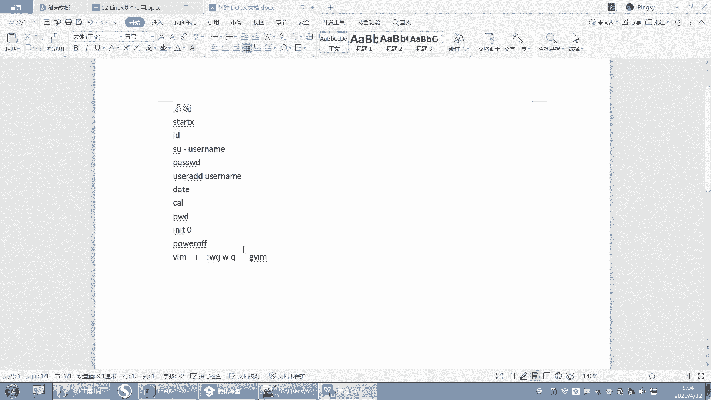

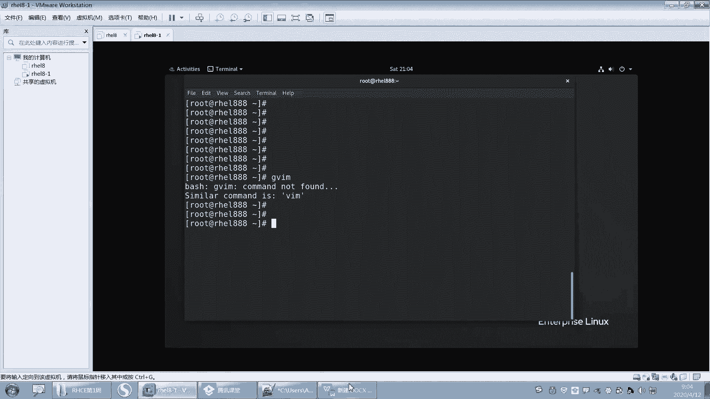

我昨天看到有群里有同学用那个web界面去登录是吧？我试了一下，是可以登录的啊，到时候我们往后面学的时候，我再教大家怎么去登啊。你先会用这两种方式去登就可以了。然后他们怎么进行进行切换啊。

这个其实用的说实话是比较少，没有那么用的没有那么多，你就知道知道就可以了啊，万一说是有一个控制台卡住了，对吧？嗯，特别是什么时候会用到这种场景呢？就是当你。的你装了一个linux是一个物理机。

那么这个物理机当前终端这个控制台卡住了，对吧？那你可以切换到另外一个终端来去执行。而且这个时候我们没有远程工具的时候啊，就会用到这种。来切换的控制台的这种方式。好。

以及如何在gorometmin这个工具上去使用一些快捷方式，对吧？如何去复制啊、粘贴呀，这个大家要会用了啊，就是我们后面你可以提高你的这个这个效率的啊。好，还昨天学了一些命令嗯，简单的命令。好，呃。

昨天其实我们在修改密码的时候，这个地方就已经体会到了啊。我们这个嗯好，我就问大家一下啊，前面这个提示符的话，这个地方对不对？呃，如果说是这个root用户，前面就是井号。如果是普通用户前面就是多了符号。

这个大家记住啊。好，那么如果我们用普通用户去修改密码和用root用户来修改密码，他们是有区别的，对不对？所以从我们昨天的实验当中，我们可以看到root用户的权限其实是比较高的。而且我们在登录的时候。

我们建议说大家最好不要什么啊，不要用root用户去登录，但是我们昨天就是用的root用户去登录。呃，因为后面你的实验啊，也包括大家以后也是刚开始我们学习的时候啊，你还是用root去登录登录啊，呃。

因为很多如果你没有用root去登录的话，很多权限都是没有的。呃，所以你要先入门入门之后呢，呃再用这个普通用户去执行。包括昨天有同学说了，公司有很多都用的root。

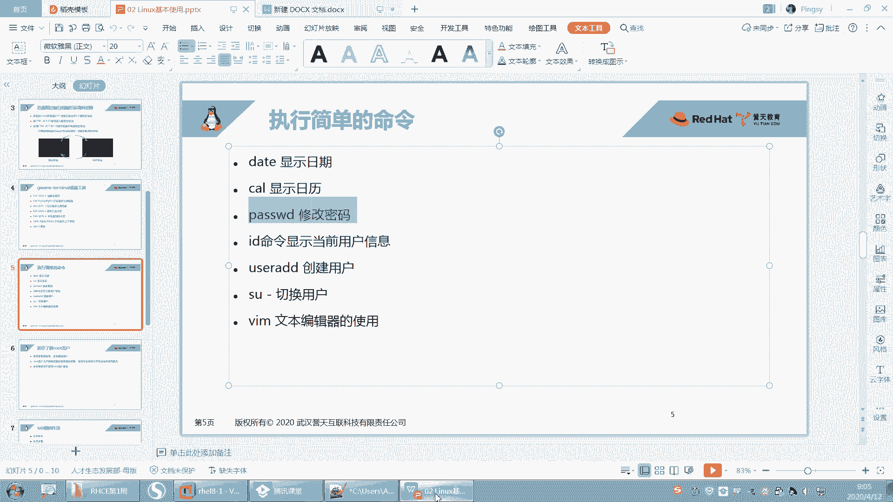

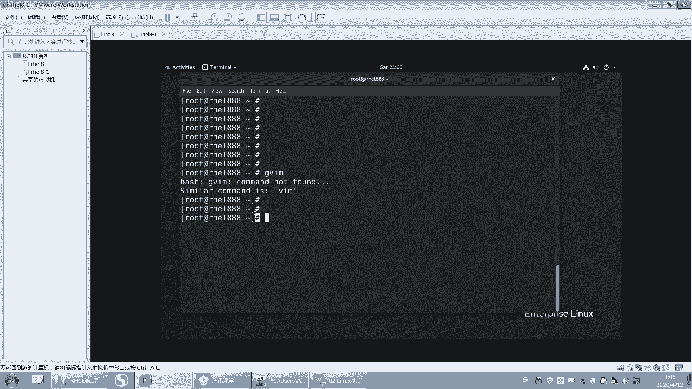

户对吧？这是一种很危险的操作啊，所以大家尽量不要用root工作当工作当中啊，因为咱们有些同学已经是在职了，他可能学了就要用。嗯，所以你工作当中你千万不要用root。好，万一无操作了，对吧？

你就得这这还没入门呢，就要跑路了，是吧？

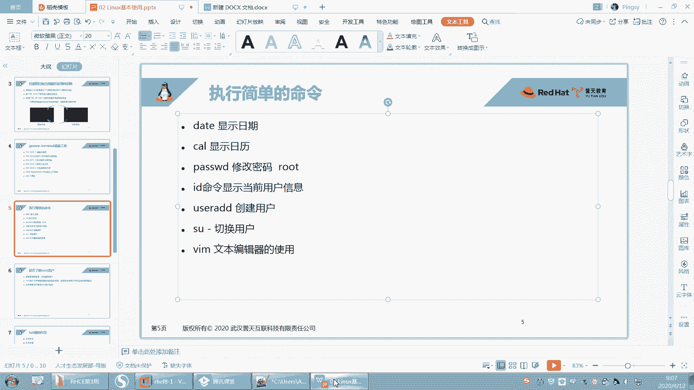

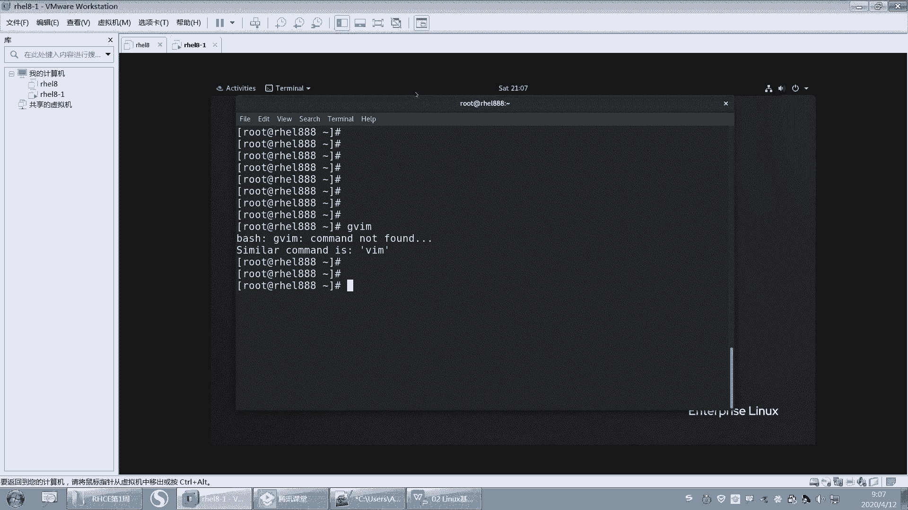

嗯，好。嗯，root呢这个地方我们对它有个简单的介绍啊。呃，root是我们系统管理员，又称超级用户，呃，叫superus是吧？那么这个root用户呢，我们系统当中只有一个管理员账号。

那么这个账号就是root，只有一个管理员账号啊，其他所有的账号都是普通用户都是普通用户啊，这个要记清楚，那么root呢为什么不要用root去登录。因为root用户几乎拥有完整控制系统的权限。

它几乎可以完整的去控制这个系统。嗯，这个权限啊。甚至要比这个windows的这个管理员的权限还要高，能理解吗？对。高到什么程度呢？对吧？它可以几乎怎么样啊哎拥有它既然有完整去控制系统的权限。

那么它就会怎么样去破坏这个系统的能力，就完全去破坏这个系统，就是自己把自己搞刮了是吧？这是哎就是他有这样的能力去把自己自杀，对吧？啊，所以非特殊情况下，不要用root去登录啊，一定再三警告大家。

前段时间我记得我在上上个班的时候，嗯，就出过一个事件嘛。呃，好像是就是误操作了是吧？那都是由于什么？由于我们的开始应该是使用root权限了，对用root去执行的一些命令，导致数据丢失啊。

然后业务就挂掉了，数据丢失了。啊，所以大家千万不要用入的工作当中啊，实验环境的话，我们先如果实在是入门。🤧对。入门的话，那我们就用root。好。而且大家做实验的时候再说一下。

大家做实验的时候不要去连到什么，连到你的生产环境上去做。之前有个同学就是这样的，他有一次做实验呢，他他是远程连的，他连过去了之后，他发现他连错了，他本来连自己的虚拟上面做，结果连到什么。

连到他的这个呃这个生产环境上去做了啊。结果就误操作了。对，因为他又觉得这个反正就是我的这个虚拟机嘛，对吧？反正还有快照啊，删了无所谓，然后就还有快照，但结果还不小心连错了。嗯，连错了之后。

最后嗯那个系统就挂掉了，挂掉了之后呢嗯。😡。

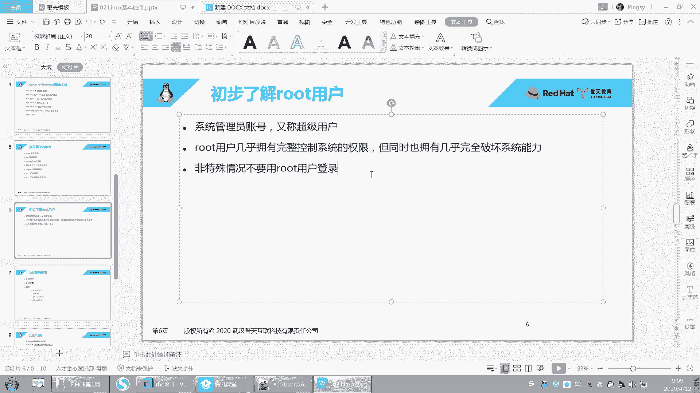

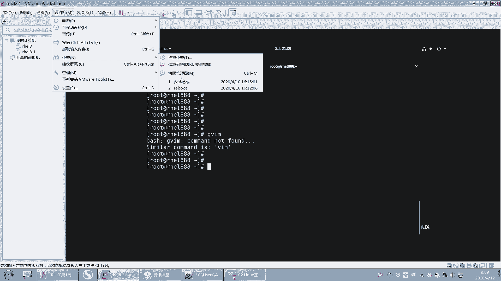

后来他那个系统是测试的一个系统，因为刚刚装好没多久，所以呃还好影响没有那么大啊，所以这个就是随时都有可能发生的啊。我们从今天哎就是从明天呃从昨天啊从昨天开始得开始学习linux，那么你们身上的责任对。

就很重大啊，就是重要很重要的一责任的啊。所以你们每执行的一步操作，对，都关系着，对吧？你们你自己的这个未来的发展和公司的发展，对吧？所以呢呃你们以后就要谨慎啊，不要觉得我已经对他怎么样。

就包括我平时有时候做实验的时候，我可能已经觉得自己比较熟了，但是有时候敲快了，或者没注意，也有可能误误操作，对，所以大家平时千万千万要注意啊。当然如果我说我没有root权限，我就用root执行的对吧？

如果没有root，我是普通用户，我可能误操作了，没有权限，啊，这个就可能给我带来。就就就带来一个一些障碍了啊，所以呢呃尽量还是用普通用户啊。这个话说在前面啊，以后出问题了。

不用呃不要找我说老师让我用用root去登录的是吧？那我完了啊这个这个。😊，好，这是root啊，我们慢慢在学习过程当中，慢慢去体会它的这个呃这个权限有多高啊，有多重要，好吧。

OK下面呢我们再来学习一下关于呃去提高我们这个执行命令的一些效率的一些这个工具啊。首先第一个就是那个table键table键的使用啊。啊，就table键呢它可以它的作用。第一个是就是补齐。

它就是补齐的作用。嗯，因为我们的命令啊呃太多太多了，包括对吧？你比如说昨天昨天我们学了一个命令，叫passwordpassword对吧？啊，那么这个password有点长，我可能记不住，对吧？

它具体怎么敲，我也记不住，没关系啊，你可以怎么样啊，你可以去用table键去补齐这个命令，你可以敲一个，比如说P。

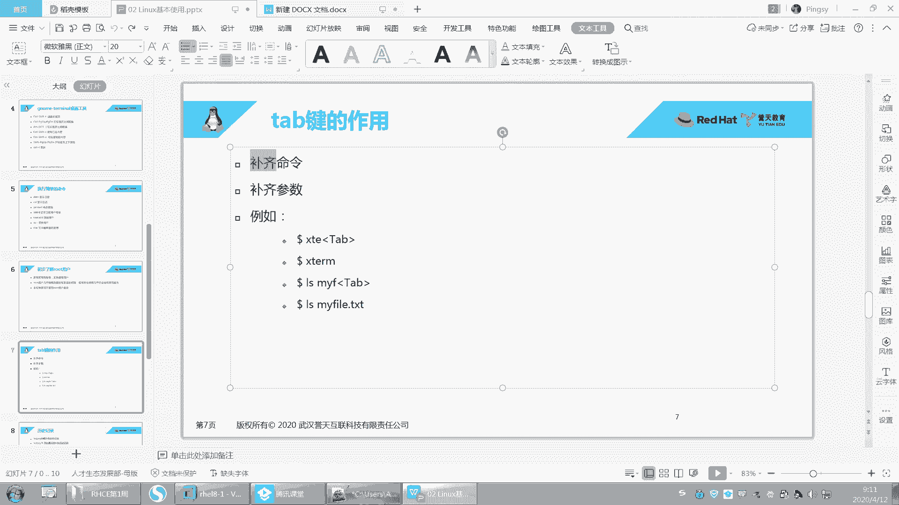

呃，敲一个P对吧？然后PASS后面不记得是ORD了，还是什么WD对吧？你就可以tableable键那你看table键这样是不是就可以出来了，对吧？table一下要会用去这个table键啊。

就从现在开始你就可以开始用了。嗯，因为所命令太多太多了啊，你常用的命令也就那么几十个，常用的命令，我呃应该是不到100，就经常经常用的命令，应该是不到100个啊，所以嗯那种不常用的。

你就tableable键对table键啊。好，那么这个是table一种情况，你tableable一下摁一下就出来了。但是还有一种情况是。😊，呃，比如说你你又table一下，它没出来，对吧？

但是你再table一下，它就会出来什么呀？出来多个，看到没有？哎，出来3个对吧？那么你一看哦，以PAS开头的命令有3个，所以你一看哦后面是S这个命令是吧？然后你应该认识它吧，对吧？

刷一个S敲一个S再table它就出来了啊，就这样子的啊，所以一下没出来。有两种可能性啊，就是你table一下没出来，有两种可能性。第一个是以这个PA开头的命令有多个嗯，有多个。第二个是你敲错了。

能理解吧？你敲错了，你再怎么table它也不会出来的啊。啊。另外还就是老师有同学说老师可以不用记了，对吧？啊，哇就这这个这个不用记了，我就上来tableable，这不行啊。好，那就记一个吧，太多了。

我就PAS都懒得记是吧？然后就记一个P，然后他就开始table键table一下。😡，然后你再table一下怎么样啊？😡，有164个可能性，就是以P开头的命令有164个哟。然后你要不要显示啊。

Y你显示你去找这是不是太多了呀？呃，但也不要懒懒到这种程度啊，所以还是要稍微记一下啊，如果实在是不记得了，对吧？那我再对。😡，没有，这个是一样的啊。然后你再来table啊no。你稍微多记一点啊。

稍微多记一点点，好吧。OK吧，这个大家去记这个命令啊，记这个命令。呃，最最呃就是对于入门者，刚入门的同学而言啊，他最容易出现错误，是敲错。他那个单词啊都拼不明白。

就敲来敲去PAS反正就是啊就是容易敲错啊。好，然后第二个呃，除了可以补齐命令以外，我们还可以补齐什么呢？还可以补齐这个嗯比如说。哎，还可以补齐这个参数，对吧？还可以补齐参数。

比如说啊我password给谁修改密码呢？啊，另外你你table的时候，它后面会自动帮你空一格，看到没有？就是命令结束完之后，这个会自动帮你去空一格。而且你的命令这个地方后面接一些参数的时候。

比如接一些呃用户名的时候，这地方一定会有空格啊，一定会有空格啊。😡，好，后面你再tableable的话。啊，能给谁对吧这个地方还可以tableable是吧？

都可以table那参数有的时候也可以table啊。好，那么如果说我想给addmin修改密码，那我就需个AD啊，AD对吧？然后tableable。所以我告诉你啊，千万就比要说你就敲个A。

你这样记得太少了啊，稍微多记一点。然后这样的话啊tableable这样那admin这样就出来了。对，这个就是补齐这个参数啊，补齐参数。当然你不要指望说我所有的参数都可以补齐啊，它有些参数是补不齐的。

但是呢它的路径都可以补齐。比如说我想我们昨说LS昨天是看什么，当前目录下面内容，对吧？那如果说我想看，比如说。我想看ETC目录下面的。哎，目录下面的内容，那我就可以怎么样啊？哎。

我就可以那table键呢table一般目录这种路径都是可以补齐的，看到没有？啊，如果你敲两次对吧？才出来，那说明有多个以network开头的这个呃路径啊，然后再table它就出来了。看到没有啊？

如果你一次性全部tableable出来了，那说明什么？说明只有一种可能性啊，只有一种可能性啊。啊，OK吧，这个叫table啊，一般路径都是可以table的啊，就这种路径。

但是后面这种参数呢不一定所有参数都可以tableable出来。这个要看情况啊。好，如果你是最小化安装的话，注意。如果你是最小化安装。比如说昨天你选了是那个字符界面安装，安装的包只有几百个。

不到1000多个是吧？没有图形界面，那么你就不能用什么？那不能用tableable键，就table不了，O吧，不能用tableable键啊，因为它需要有个包来支持O吧？

所以大家刚开始的时候全部装成图形界面啊，先装成图形界面啊。O。

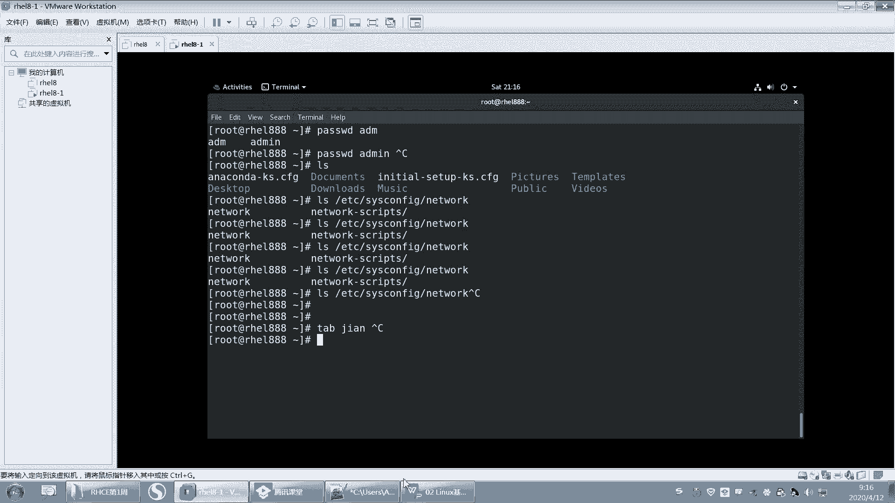

好，这个是table键啊，补齐什么，补齐这个命令和补齐参数啊，补齐参数。好，然后嗯这个大家经常回去用啊。嗯，第二个呢可以帮助我们快速去执行命令的提高呃执行命令的效率的，有个叫历史记录的啊。

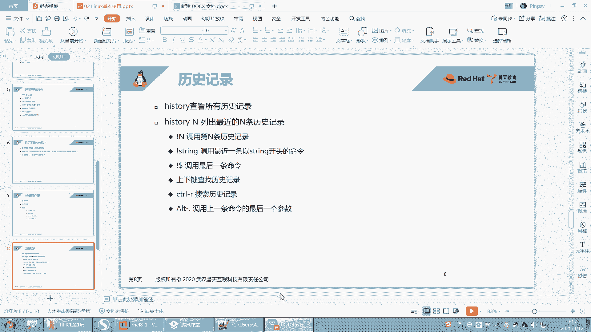

好，他是怎么回事呢？比如说啊我现在想要去嗯。我执行过的一个命令。😡，我想看我所有执行过的命令，对吧？那我就用history。看到吗？有。我有个history，可以查看我之前执行过的命令，那执行过的命令。

然后前面呢会有一个编号一，对吧？这是我执行的第一条命令。啊，这是查看历史记录啊，查看历史记录。好，同学们，那个你们把自己的笔记随时准备好，OK吧，就是把自己的这个你电子笔记。嗯，电子笔记啊。

还有这个纸质的笔记，随时准备啊，随时准备着。然后呃我说的时候我可能有时候没注意，让他没没没没有那个说记笔记，对吧？但是你要有这个意识啊，你要因为呃记笔记还有一个好处。呃，防止你睡着了。对。

因为很多同学他就躺在那儿躺在那儿去，我估计现在绝对有人是躺在那儿听课的。因为在家里嘛对吧？在家里上班啊，或者是有可能。对，或者是在家里今天休息，对，绝对是有人躺在那儿拿个手机，然后去在那看的。嗯。

那这样的话你就容易睡着，过一会儿你就睡着了啊。所以同学们一定要把自己的这个笔记，到时候我要抽查的啊。我说那个谁谁谁对吧，把你的笔记拿出来啊，我来看一下啊，你要随时能拿得出来，OK吧。😊。

要不然你就丢人了啊。好。一定要随时啊。啊，OK所以这个是我们的历史记录啊，历史记录呃，清历史记录，我们后面再说啊。OK呃，那么我想只想显示，比如说我只想显示这个history1。嗯。

那history后面加一个数字，那么就是显示最近的什么十条记录，显示最近的1条记录啊呃加个history，加个数字，OK吧。好，那么呃那这个历史记录有什么用呢？对，有什么用呢？我们可以看一下啊。

如果我执行过的一个命令，我还想再次去执行它，对吧？我可能要去再敲一遍。对我可能要去再去敲一下什么，敲一遍这个命令，比如说这个命令有点长，对吧？敲一遍，我哎呀不想敲了，那这个时候你怎么样。

你可以去调用历史记录啊，这时候我可以去调用它，那我怎么去调它呢？注意啊，前面有个数字，对不对？前面有个58号这个数字啊，那么我可以怎么样？我可以去调用它，加个感叹号加一个什么58看到没有？

感叹号调用历史记录啊，哎，感叹号叫调用历史记录啊，加上一个数字回车。啊，就执行了这条命令。对，执行了这条命令啊，就是这种方式比较简单，对吧？但是这个数字的这种方式。嗯。是不是有点难记，对吧？

因为你还要去看看它在哪一条，对不对？看他在哪一条。呃，当然还有一种啊嗯还有一种这个方式去调用这个历史记录。比如说啊。这是通过数字的方式，对吧？还有一种感叹号，比如说SYS。啊。感叹号加SYS啊啊。

那么感叹号加SYS的话，就可以怎么去调用我们以SYS开头的一条命令，以SYS开头的一条命令啊。但是如果说我现在去执行的话。你看它是不是调用这条命令了那。😡，感叹号SYS对吧？好，我们可以再来看一下啊。

刚刚呢我是在怎么样？我是不是在这个地方执行了一个这个命令，对吧？把这个命令重复执行了一下。那这条命令其实是我调用58号是不是执行的，对不对？好，然后呢我可以怎么样？我可以去感叹号SYS。但是大家想一下。

我们整个历史记录当中是不是有很多是以SYS开头的，对不对？那么他调用的是哪个呢？对它调用的是最近的这一个注意啊，它调用的是最近的这个。OK吧，离你最近的这条命令啊，但这条命令呢其实有些时候是不太保险的。

为什么呢？因为有些时候你可能不太记得了，对吧？你可能不太记得的时候，我最后一条命令是执行的是哪一条命令，万一是一条什么这个这个呃，就是可能导致系统无操作的命令，对吧？

所以这个这个命令有些时候就看你自己好吧，你觉得你能记住了，那你就用，那你记不住，那你就不要用，好吧，它是执行最近一条SYS开头的这个历史记录啊，历史记录。好，那说老师他有些时候不太准确，对吧？

那怎么办呢？能不能去准确的去找到最近执行的一条命令呢？啊，也可以啊。我们可以去摁ctrorl加R。就是cttrol键加R键R就是这个R键嘛。ctrorl加R是搜索历史记录，搜索历史记录啊。

那么你在搜的时候，你呃你可以去搜里面任何一个关键词。比如说啊你像这三个对吧？这三个命令他们之间怎么去区分呢？它们都是以SYS开头的对吧？那么区分是不是从这儿可以开始区分啊？对不对？

然后这个是不是有个杠杠道啊？这里是不是可以区分好，这个是tats，对吧？这个是tats加个S，所以你可以输入STS，你看。它就会输入STA，它就会找到什么。哎，最近一条，但是其实是这条对吧？

那找到最近的一条里面有STA这个什么关键词的。一条命令，这个能不能理解？就是你只要输入这条，只要输入一个关键词，它就会去找离你最近的一条命令当中有STA开头的。好，一看找到这个对吧？你过目一下。

你看一下啊，是不是你想要的这个命令，如果是的话，直接回车就可以了。就可以执行了。看懂了吗？因为有些时候你的这个命令，这个后面的参数特别特别多啊特别特别多。那这个时候你再去敲一遍，可能怎么样。

可能就是就很麻烦，对吧？那你就可以通通过这种搜索的方式啊，只要你记住它其中的一个跟其他命令不同点，就可以去把它搜索出来啊，搜索出来。这个会用了吗？这个能不能听懂啊，搜索历史记录。呃，你们先呃先记住。

好吧。

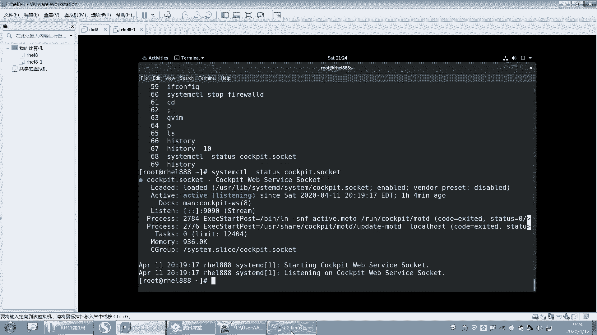

就是这些命令你先记住，因为你老说老师我现在这个命令也不会敲几个，对吧？那我怎么去这个呃，对，怎么去使用呢？没关系啊，你只要先把这个你的什么，先把你的笔记给记好，OK吧。

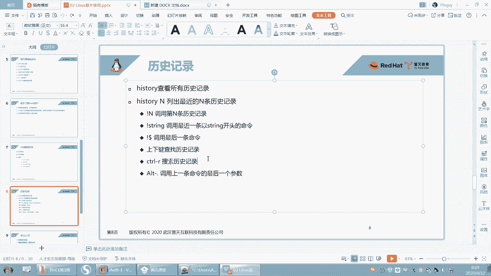

把笔记给你记好啊，然后后来再去翻以前的笔记，然后遇到了我就用遇到了就用，这样的话就可以提高你的工作效率啊，提高你撬命的效率。啊，这就是搜索cttrol加R啊，然后比如说enable对吧？哎。

我敲个enable啊，我多敲了一个那个啊。ctrol加R唉 enable。这样的话就可以对调到最后一个一。有EN啊有EN的啊。好吧。O。啊，如果你这条命令觉得你说我不想敲了，对吧？嗯，怎么办呢？

你就你有些时候你就cl C吧。😡，呃，ctrol C就是中断的意思。但是如果有一个任务正在执行，你就不要ctl C了。嗯，这个这个我们遇到了再说，好吧，嗯，就是那ctl C就中断，就不想执行了。

就ctl C中断啊，中断。

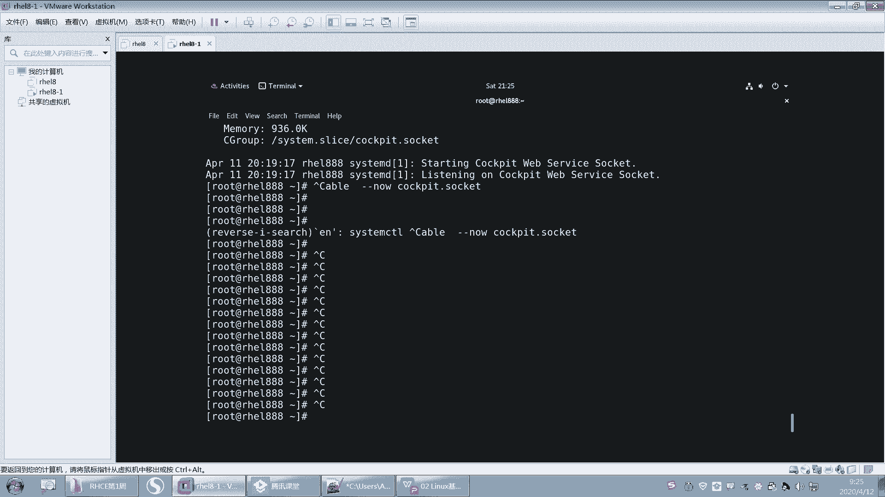

好吧。

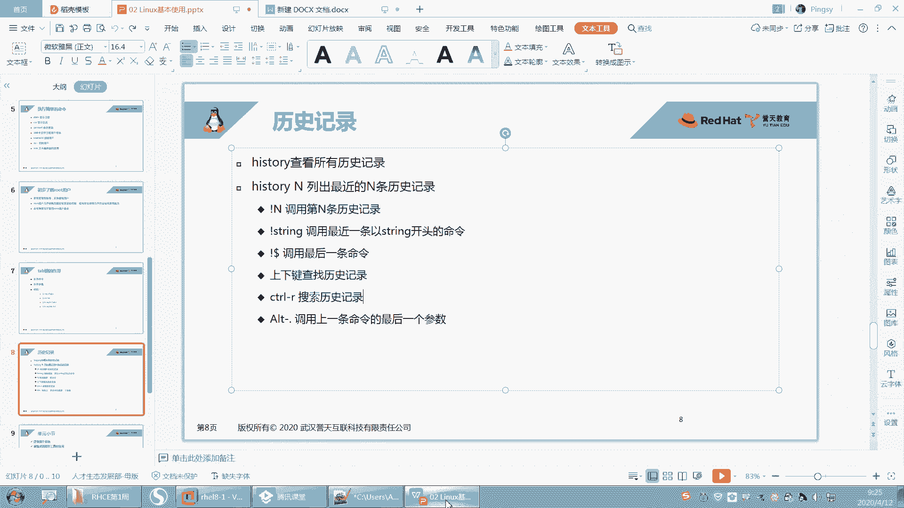

うんうん。啊，呃，然后呢还有什么？有同学刚才说到是吧？上下键，那这种就是最简单的。你想上下降样这样去翻历史记录呃，也可以。因为但是我们的历史记录有可能会有什么呃几百条对吧？甚至上千条。

那你去翻的话就就就太多了。所以这个看你自己的情况，好吧，你这样去搜索，反正就有很多方式，你愿意去用哪一种就用去哪一种就可以了啊。

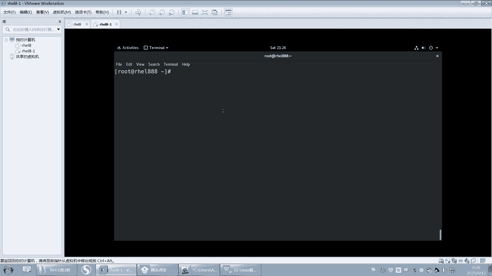

好，这个是我们的历史记录啊，我们刚刚讲这个是么？然后这个是调用第N条历史记录，感叹号加str加一个关键词，加一个字符串，就是以最近一条以str开头的命令，还有一个就是感叹号多了符号。

这个是调用最后一条命令是吧？这个用的比较少，感叹号。

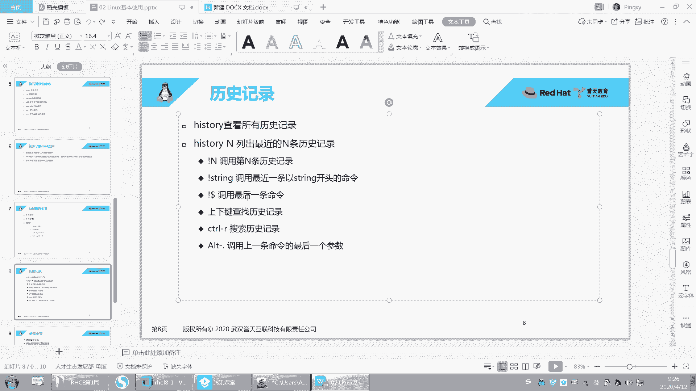

多了符号。啊，就调用最后一条。调用最后一条历史呃，最后一条命令，调用最后一条命令啊，感叹号多了符号。

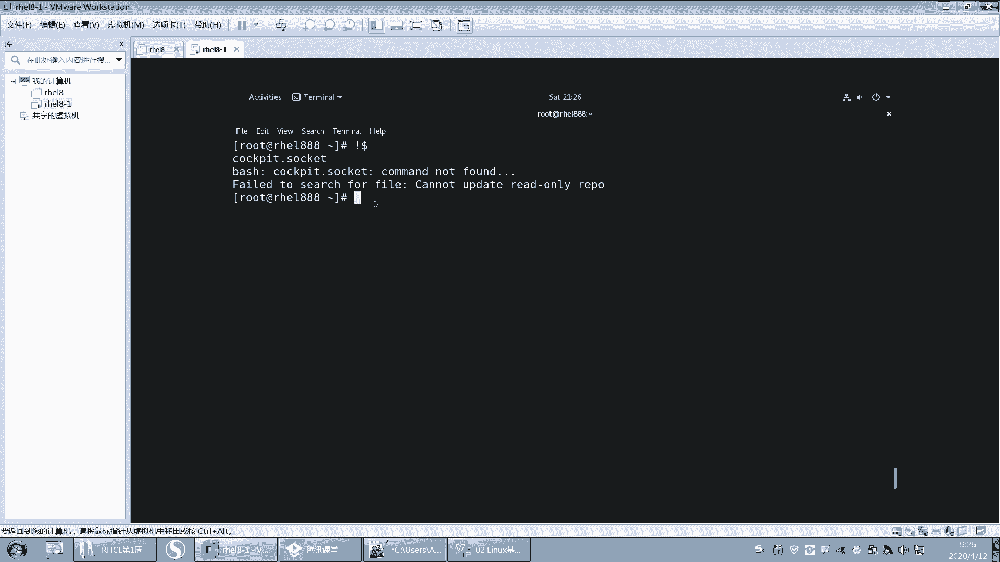

啊，然后上下键去翻，对吧？上下键去翻查找这个历史记录。嗯，这个有些时候用的比较多啊，然后还有ctrl加R去搜索历史记录。对，搜索历史记录啊。嗯。

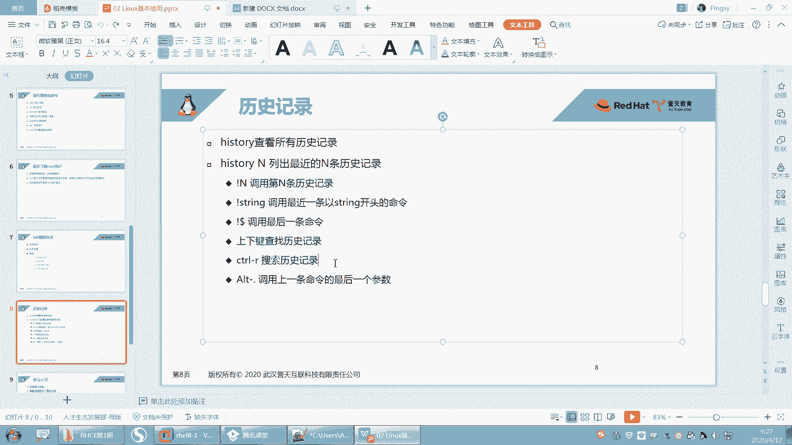

好，那么还有一种呢，就有些时候啊我们想去调用历史记录，但是我们。并不想去怎么样啊，比如说啊这我想执行这样一条命令。好，我执行了这样一条命令之后，有些时候我想去调用这个历史记录。

但是我并不想去调用全部的这个命令，全部的这个这个这这一行命令，对吧？我就可以去调用其中的某一个参数。比如说我想去一般啊像后面这个比较长的参数，我想去调用它，哎，我可以我可以用什么。

我可以用这个这个比如说我可以用EA点。看到吗？ESC点。对，ESC点这样去调用最后一条。历史就最上一条命的最后一个参数。唉，E要E点啊。E呃，然后加一个点就可以去调用上一条命的最后一个参数。

这个参数有时候一般比较长。OK吧。或者是比如说嗯。你看啊后面接了几个参数，对吧？你看我我这个地方是不是接了几个参数啊，那么我不管你后面这个参数是什么东西，反正我就要调用你E点E点E点。

这个我们也是比较常用的。对，也是比较常用的。好像摁alt点也可以吧。嗯，alt点也可以altal就是那个ALT这个键。al加点记好了吗？al加点和ESC加点。ESA加点都是什么呀？

都是调用上一条命的最后一个参数啊。

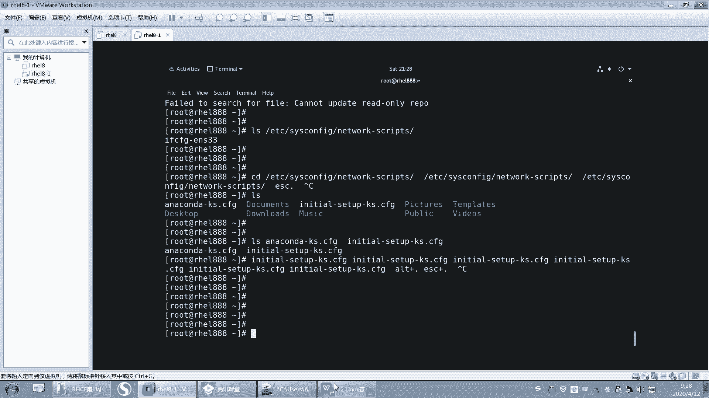

调用上一条命令最后一个参数，好吧。记下来了吗？嗯。好，如果大家就是这样吧，我们嗯我们这个因为大家都是远程上课嘛。嗯，然后如果大家就是觉得这个这个知识点我听懂了，对吧？

或者是嗯我刚刚问的你你们刚刚问的问题，我解释清楚了，或者怎么怎么样啊，嗯笔记记好了没有。然后你们要么就对送朵花，对吧？要么就敲个一，要么就敲个666，要么就敲个，反正就就是你给我示意一下就可以了啊。

让我知道大家还在啊，要不然我就啊对我总有一个人演独角戏的感觉啊，好，你们自己你自己想想敲什么就敲什么啊。这个是谁啊？邵阳。是邵阳吗？你这个把名字改一下，下次进来啊，要不然我都不确定是不是你。

你你问的什么问题啊？删除历史记录先不慌啊。嗯。你问的哪个问题啊，这个吗？哪里你再发一遍，我不知道是哪一个了。

啊，我可以啊，old加点嘛？那old加点，我就按着old加点可以啊。EC加点都可以。ESC加点ESC加点。嗯。有的系统没有history没有history。没有黑色这个命令吗？你说没有黑色这个命令吗？

啊。没有你这个你这个。也不能上下翻案。你确定你用的是linux吗？呃，是这样的啊。对，黑色跟用户相关的啊嗯。你们就是说是呃你们觉得就所有的参数能不能都调用都调用出来，对吧？呃，是这样的。

这个要看这个命令是否支持了。呃，有些时候这个要看版本，而且有比如说你鸿猫六的系统跟红猫七鸿猫八，那这些系统有可能有有一些它就无法去就是呃table键无法去调用，呃，或者说是什么。

或者说这个命令本身它就不支持，或者是等等。就是。对，所以呃不要去指望说所有的参数都能去调用出来啊嗯。啊，当然他说你说这个命令对吧？他后面后面的参数，比如说你看啊啊这个命令啊，它后面的参数。

你看etable它是不是都可以出来呀，那你就感谢他，对吧？你就啊你这个这个我们可以就很方便去使用。但是他有的参数它就是不能出来，怎么样，你怎么你怎么怎么样自己去敲了啊啊，就这个样子，就这个意思啊。😊。

好，当然我们后面会做的他们做的越来越人性化，对吧？让你去快速的能够去执行命令。嗯，大家知道unix吗？unix哦，昨天说到了一个系统，对吧？这个系统呢呃它就不能这样上下翻，能理解吗？

它就不能这样去上下翻。🤧嗯。呃，我们这个这个要说远了啊，这个后面我们会说到我们用的是这个hear呃，我们用的这个。算了，不说了，好吧，你说说远了吧，说蒙了啊。有的系统像unix，它就不能上下翻。

它也不能左右翻。知？比如说啊。呃。你比如说敲错了，哎，这个单词敲错了，对吧？字母敲错了，还可以左右这样去翻呃，unix就翻不了，就有的系统上就翻不了，这个要看它用的是什么配置。嗯。那然后上下翻也翻不了。

那上下翻也翻不了，一翻就会出现一些那个呃乱码这个样子。好。

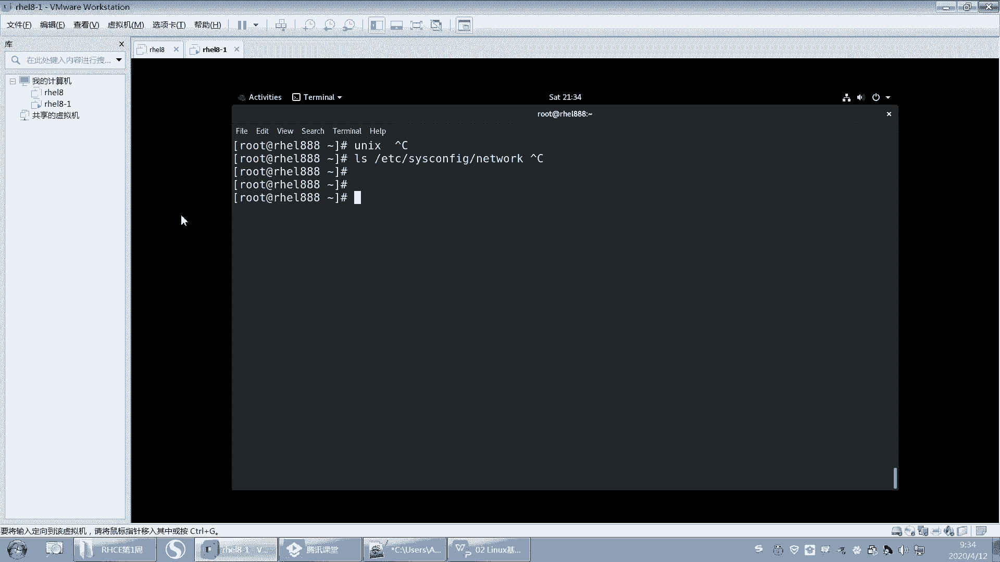

对，是的啊，是这个意思。这个这个要看可以修改啊，可以。还有啊大家最后就是呃就是说嗯是这样的啊，大家后面在问问题的时候，一定要把来龙去脉说清楚。比如说我举个例子啊，现在张勇同学遇到的问题是。我不能上下翻。

我不能tableable键，我不能怎么怎么样，对吧？首先你要你要能说清楚，第一你的系统是版本是什么？啊，如果你还能清楚你要知道你的当前用的surear是什么。😡，呃，以及你之前做过什么操。

就是可能你不知道做过什么操作，对吧？对于起码的这个这个这个背景，你要向我描述一下，要不然我们也是猜，对吧？我们也是说可能是什么情况，还有同学问问题是他直接把一个问题丢给我。

然后问我老师这有可能是什么原因导致的对吧？这个原因那太多了，对你要把前后来龙去脉去说清楚，这样的话，我们才能去根据你的这个实际情况来去分析一下，到底有可能是什么原因，对不对？所以大家问问题会会问啊，嗯。

就是我为什么要你你要去修改一个配置，你为什么要去修改这个配置，对吧？你出于什么目的去修改，有没有必要去修改，那这些都要都要说对，都要说啊，否则我们就就就就很难去对话下去了啊。嗯。嗯，不是说大家的意思啊。

就是就是说我们。对，不用管它啊，不用管是什么，我们后面会说啊。😊，啊，这是这一章内容啊，我们这张呃到现在就基本上结束了。呃，这张其实怎么说呢？你可能就是暂时还用不到，对吧？

但是呢我们嗯就是后面在用的时候，我们我会给大家再继续去呃解释啊，只是在这个时候我们先给大家提一下，也有这个东西，后面我在用的时候，你就知道哦，之前好像学过，对吧？对，有个印象啊。好。

OK这张我们大概学了登录操作系统啊，怎么去使用一些图形工具，对吧？怎么去点大家图形工具可以自己去自由发挥去点点点啊。你在实验环境里面，你大胆一点啊，没关系，搞崩了坏照还原，对吧？就怕什么呢？

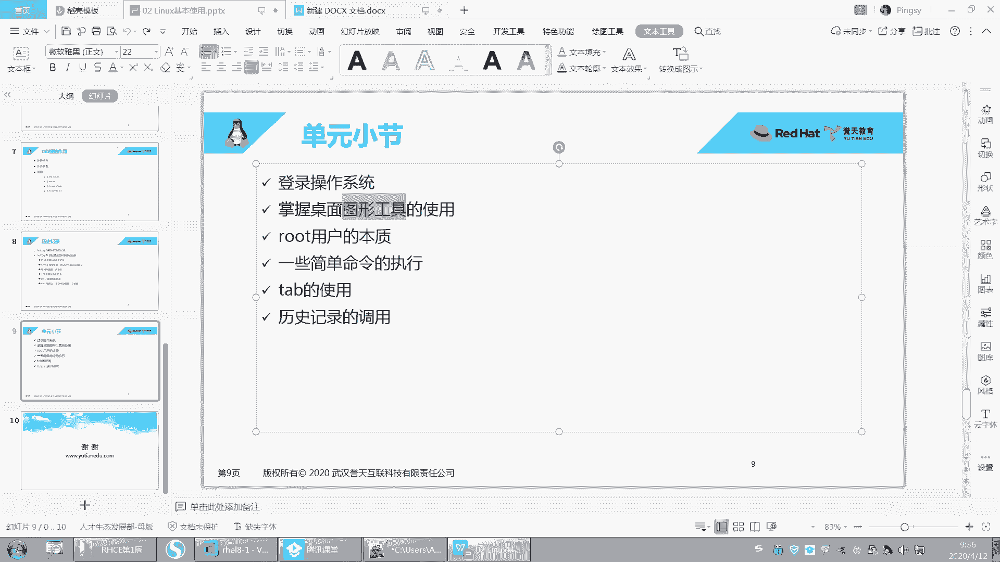

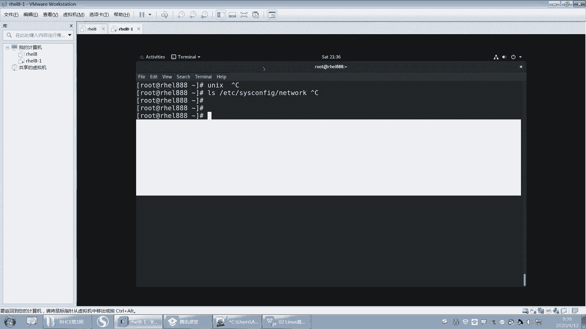

好，然后root的本质root用户。他权限很高，对吧？还有一些简单的命令。怎么去执行tableable线使用历史记录调用，这两个非常重要啊，这个会帮助我们去呃加快我们这个呃这个命令的执行效率啊。

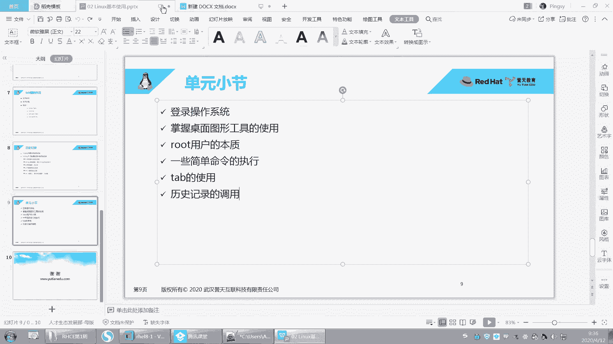

好，这是第二章我们。