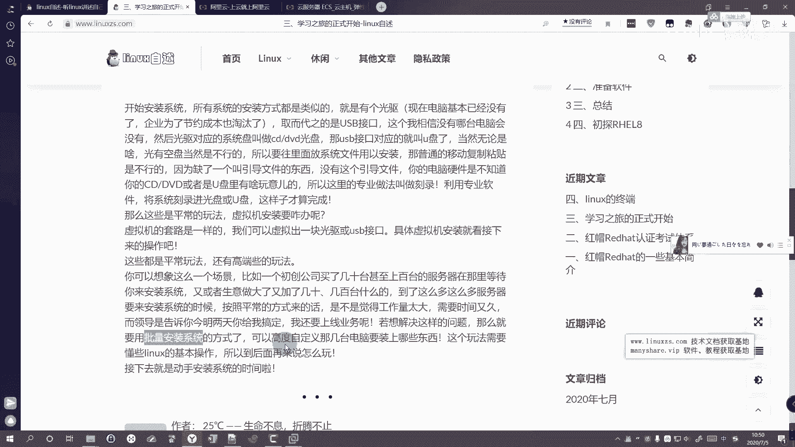

# Linux运维入门：P1：学习前的准备工作 🛠️

在本节课中，我们将学习如何为Linux学习之旅做好软硬件准备。我们将了解不同的硬件选择，准备必要的软件工具，并理解系统安装的基本概念，为后续的实践操作打下基础。

## 硬件准备 💻

上一节我们明确了学习目标，本节中我们来看看需要准备哪些硬件设备。

学习Linux主要有两种硬件选择方案。

以下是两种方案的说明：
*   **无额外成本方案**：使用个人日常使用的电脑进行学习即可。
*   **付费方案**：自行购买物理服务器或租用云服务商（如阿里云、腾讯云、华为云）提供的云服务器。云服务器是未来工作中常见的形式，其本质是在远程数据中心运行的计算机。例如，一台配置为2核CPU、4GB内存、5Mbps带宽的云服务器，年费可能在945元左右。

对于初学者而言，使用个人电脑进行学习是性价比最高的选择，无需初期投入额外资金。

## 软件准备 📦

准备好硬件后，接下来我们需要准备相应的软件环境。

由于日常使用的通常是Windows系统，为了同时满足办公娱乐和学习Linux的需求，最常用的方法是在主系统上通过虚拟化技术模拟出一台Linux计算机。

以下是需要准备的软件清单：
*   **虚拟化软件**：用于创建和管理虚拟机，例如 **VMware Workstation** 或 **VirtualBox**。
*   **Linux系统**：本课程选择 **RHEL 8** 或其社区版 **CentOS Stream/Rocky Linux** 作为学习系统。
*   **连接工具**：用于远程连接和管理Linux系统，例如 **SSH客户端**（如PuTTY, Xshell）。这类似于在云上拥有服务器后，从本地电脑进行连接的操作。

准备好这些软件后，我们就可以开始安装操作系统了。

## 系统安装基础 📀

无论是虚拟机还是物理机，安装系统的基本原理是相通的。传统上，系统通过光盘和光驱安装；现代则普遍使用U盘。

仅将系统文件复制到U盘是无法引导安装的，因为缺少关键的**引导文件**。硬件无法识别普通复制的文件。专业的做法是“刻录”。

**刻录**是指使用专用软件（如Rufus, balenaEtcher）将系统镜像文件完整地写入存储介质（光盘或U盘），使其成为可引导的安装盘。

在虚拟机中安装系统，流程是类似的。虚拟化软件（如VMware）会模拟出一套完整的虚拟硬件（CPU、内存、硬盘、光驱等）。我们只需将下载好的系统**ISO镜像文件**“放入”虚拟光驱中。

例如，在VMware中新建虚拟机后，在设置中选择“使用ISO镜像文件”，并指向下载好的RHEL8镜像文件。这相当于完成了物理机上插入系统安装U盘的操作。点击开机，即可开始安装系统。

## 扩展：批量安装 🤖

最后，我们来了解一种更高效的部署方式。想象一个场景：一家初创公司需要为几十、上百甚至上千台新电脑安装系统。如果每台花费10-20分钟手动安装，将耗费巨大人力和时间。

此时，就需要用到**批量自动化安装**技术。这通常需要借助网络服务（如PXE, Kickstart）来实现。由于涉及对Linux网络和服务更深的理解，我们将在后续课程中，当大家熟悉Linux基础后再进行讲解。届时你会发现，批量安装也可以“so easy”。

---

**本节课总结**：我们一起学习了开始Linux学习前的准备工作。我们了解了使用个人电脑作为学习硬件的经济性，准备了必要的虚拟化软件和系统镜像，掌握了通过刻录制作系统安装盘以及虚拟机安装的基本概念，并对高效的批量安装有了初步认识。下一节课，我们将正式进入Linux系统的安装环节。