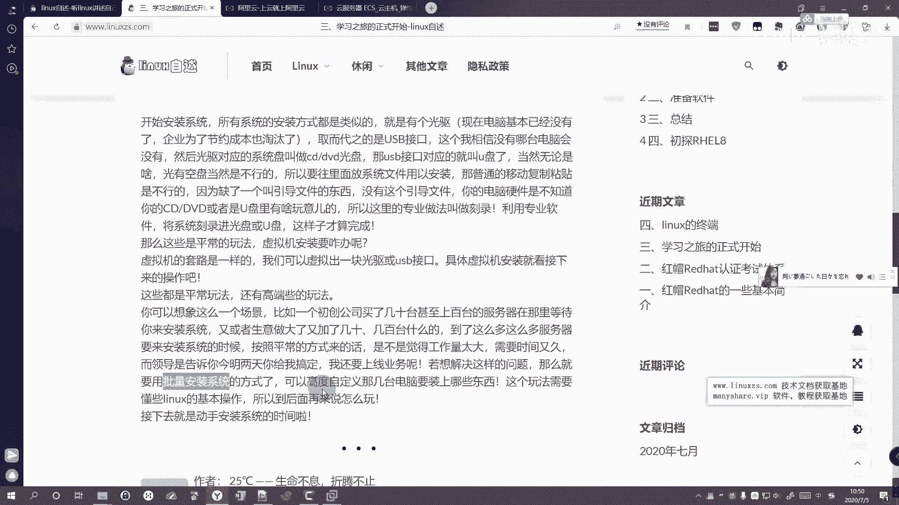

# 三、学习之旅的正式开始之前的准备 - P1 - zzzhbr - BV1vg4y1v7Kd

Yeah。那咱们就是开始学习之前呢，需要做一些准备工作，一个是准备的。咱们学习的硬件设备，然后还要准备一些软件，就是系统之类的。那，首先我们就是不额外花钱的玩法呢，就是。

平常用咱们平常用的这个电脑来进行学习操作就可以了。那比较花钱的玩法呢，就是你自己去买一台服务器，那或者是买人家现成的云上服务器。比如说你去阿里云啊、腾讯云啊、华华为云啊上面去买。

当然他们这些服务器呢卖的应该都是比较贵的。我们来可以可以看一下，比如说阿里云的。Yeah。Yeah。Yeah。当然了，以后工作的话，基本上就是以这种云上的形式来工作的。就是电脑的话。

基本上就是在别人别人那里，就是在。把你的电脑来进行操作的。比如说咱们这个云服务器ECECS。그。今天网有点吧。就搜云服务器。嗯，可以多看一下，他这里面可以看到他这里就稍微好一点的。

比如说两核4G的5兆宽带，它就要945。61年了。然后这个就是。稍微稍微。差一点的就是稍微简单一点的，初级点的，就是你可以看到它是一和二G，然后40G的高效云盘一兆宽带2021年。那学生的话还有优惠。

这就是就是相当于就是。他的一些价价格吧，反正就是大概有个认知就可以了。然后还可以改买域名啊什么的。这就是。他大原。也非常贵啊，其实你要稍微买好一些的就非常贵了。你看这个两盒8G的差距啊28961年了。

OK那我们自己学的话，其实就用咱们自己平常用的电脑就来学习一下就好了。因为我们刚开始嘛不需要去额外花钱再去买。然后有了电脑之后呢，咱们就要开始准备一下软件了。比如说。虚拟化。

因为咱们平常的话就是会有一个windows系统嘛。那咱们平常要办公啊或者是娱乐之用的，所以基本上呢咱们都会采用虚拟化的方式，就在咱们主电脑上。咱们主电脑上去模拟出一台这个lininux操作系统出来。

那也就是虚拟化的软件呢，我们可以用win more，然后或者是we books就W books。然后系统的话，由于咱们选择了是HEL这么这么一个系统，所以咱们就用了最新的blhead8这么一个系统。

然后常用的软件呢就是用用来SSH连接的，就相当于远程连接，就相相当于你在这个云上。买了一台电买了一台服务器，然后你要在自己家里去连，就是这个这个样子的。有了，准备好了这些软件之后呢。

咱们就可以开始就是安装系统了。那平常咱们安装系统啊，就是一般来说就是以前的话就是有个光驱。然后关区现在呢其实基本上是已经没有了，企业也为了成本节约成本呢也算是淘汰了。

那取而代之的那就是1个USB接口就是。嗯，我们经常用来插鼠标插键盘的那个USB接口。那这个呢几乎这个应该说是没有哪台电脑会没有的，就是所有的电脑都会有。

然后这关驱以前咱们光驱对应拿来安装的那个系统的系统盘呢，叫做CDDVD光盘。然后现在咱们用USB接口来做系统盘的那个呢叫做U盘系统盘。那当然了就是光有这个盘不行的，所以咱们需要就是在里面放系统嘛。

普通的移动和复制粘贴的那是不行的，因为那个直接复制的话，就缺少了一个叫引导文件的这么一个东西。那没有引导文件呢，你的电脑硬件呢，就是不知道你究竟放了什么东西进去。所以就是有一个专业的做法呢，叫做刻录。

就是利用专业的软件，将这个系统刻录进光盘或者U盘，这样子呢才算把这个系统做完。课完。那我们平常就是用虚拟机安装的话，其实套路是一样的。就是我们用就是虚拟，就就种就微vo这个虚拟软件。

就他模拟出就新建虚拟机的时候，给他模拟出一套硬件设备出来。比果说我这里先默认，全都默认。嗯。哎，你可以看到全都。模拟出来之后，它有内存，有处理器，还有硬盘，还有这个CDDVD，还有光驱，还有网络。

还有USB控制器，然后还有声卡，还有打印机，还有显示器，这些它都给你模拟出来了。然后咱们有了关驱之后，咱们就把这个系统给它放进去就行了。那咱们虚拟机里的要放的系统呢叫做SO印象文件。

可以看到它这里写着使用SO镜像文件，然后把下载了这个SO镜像文件呢，就给他放那个放进去，就比如说随便选一个，然后点击打开。它这里就已经放进来了，放进来点击确定以后呢，就相当于咱们把准备工作都准备好了。

所以只要点击开机就可以开正式开始安装这个系统了。那虚拟捷安装方式和咱们UU盘。物理机去安装的方式是一模一样的那这个就是咱们一些平常的玩法，就还有一些高端的玩法。就比如说一个初创的公司。

就买了几台几十台几百台，甚至上千台电脑，然后再等你叫你来安装系统。那你说有个几十台系统这么一台一台的装过去，一台，你就相当于如果就算你就要花10分钟，20分钟这么关景。但你要装装个几十台几百台。

那你一天时间几乎都要耗在那里装系统了，也可能说你一天时间还可能装不完。那这个工作量是太大了，而且是要需要的时间很久。然后领导可能告诉你要的很急，你最好马上给我搞定。那这个时候呢。

我们只需要用到一个批量安装系统的方式去安装了这批量安装呢。那只不过是需要借助一些软件服务之类的来给他搞定。所以说呢。批量安装系统呢，咱们是就是后面会讲，因为嗯对linux咱们刚上手的时候不太熟悉。

所以说了可能就是有点复杂。所以等咱们接触到了这个linux东西之后呢，再来讲，就可能会觉得哦，原来是这样soso easy就是这个样子的。🤧嗯。

嗯。

