# Linux系统工程师培训：04：制作文件间的连接 🔗

在本节课中，我们将学习如何在Linux系统中创建文件的链接。我们将重点理解**硬链接**和**软链接**（符号链接）的核心概念、区别以及它们的创建方法。通过实际操作，你将掌握如何利用`ln`命令来建立这两种链接，并理解它们各自的特点和适用场景。

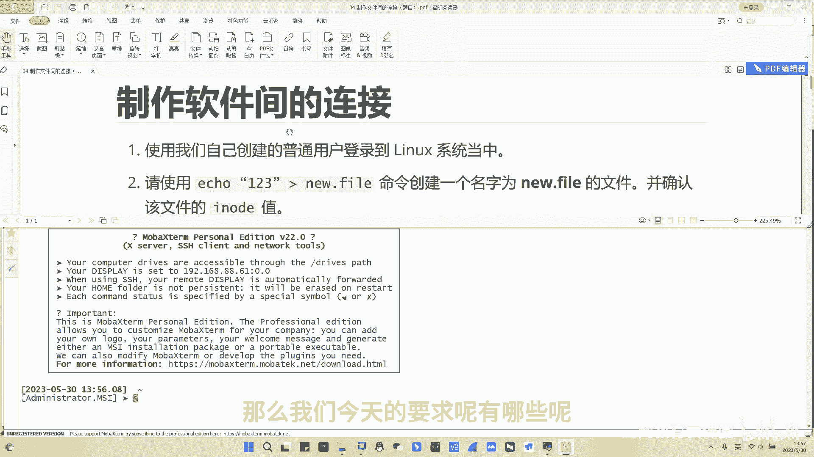

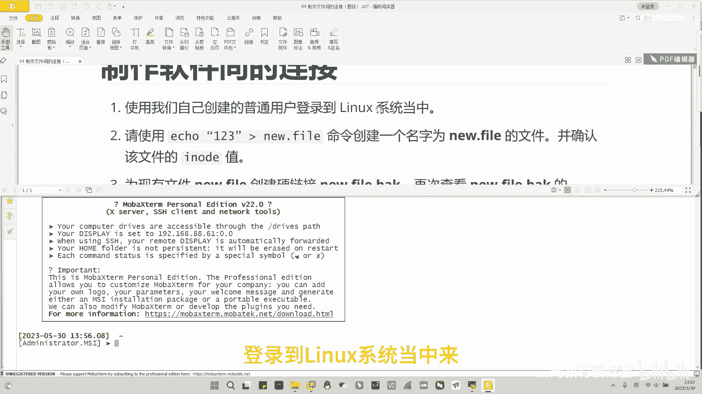

---

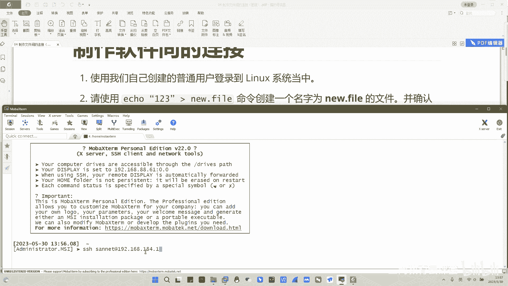

## 概述 📋

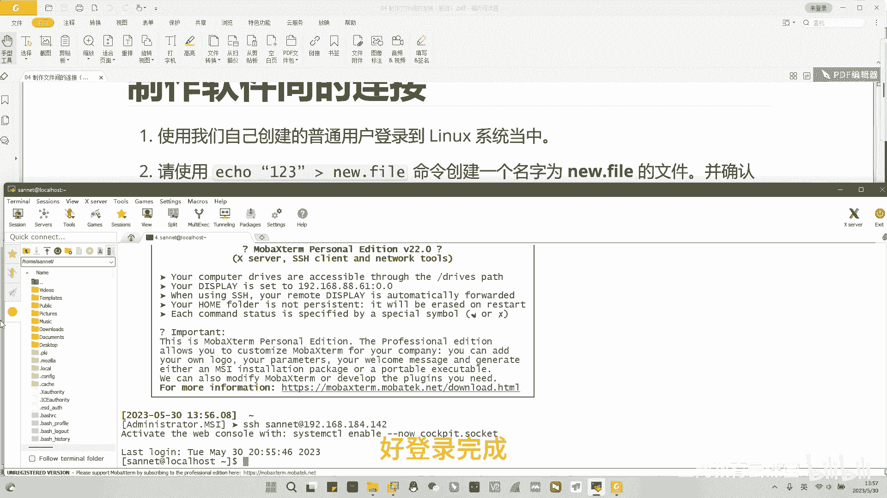

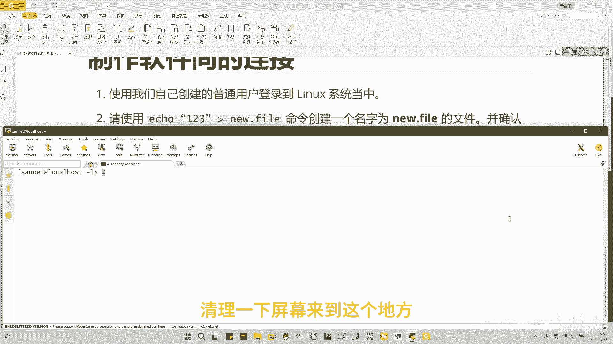

Linux系统中的文件链接分为硬链接和软链接。所有文件都始于一个硬链接，它直接指向文件数据本身。软链接则像一个快捷方式，指向另一个文件或目录的路径。理解这两种链接的区别对于文件管理和系统操作至关重要。

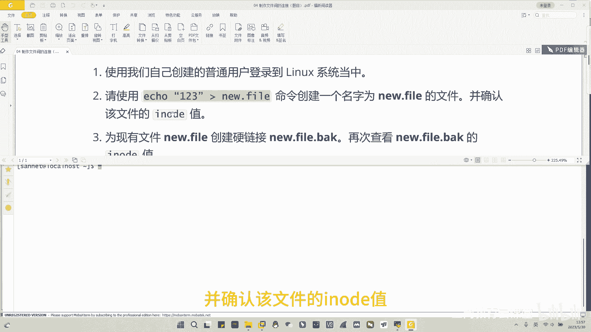

---

## 登录系统与准备工作 🖥️

首先，我们需要使用自己创建的普通用户登录到Linux系统。和之前的操作一样，我们使用SSH命令进行登录。

```bash
ssh 用户名@服务器地址
```

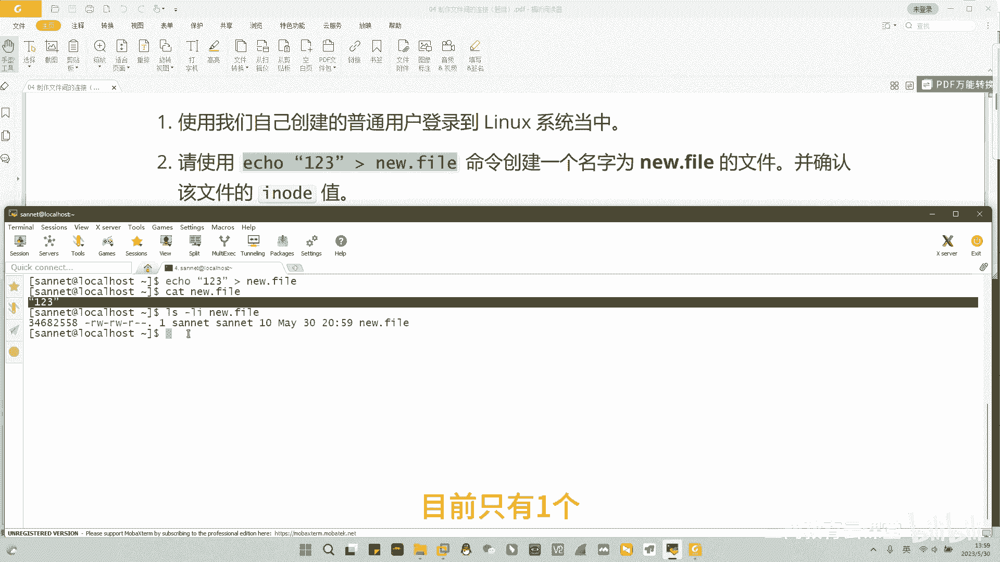

登录完成后，请清理一下终端屏幕，以便进行后续操作。

---

## 创建实验文件并查看inode值 🔍

第一个任务是创建一个新文件，并确认该文件的inode值。inode值是文件的元数据，每个文件都有唯一的inode值，用于区分不同的文件。我们可以通过比较inode值来判断两个文件是否实质上是同一个文件。

以下是创建文件并查看其inode值的步骤：

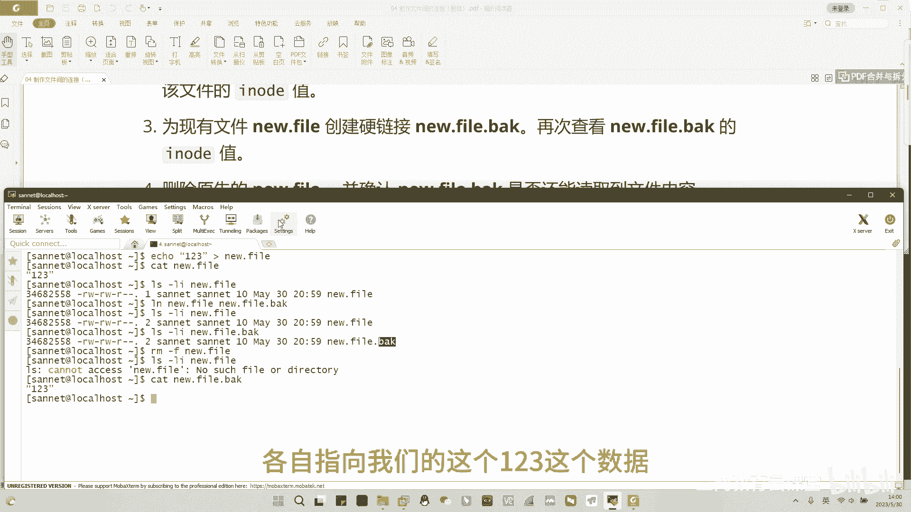

1.  使用`echo`命令创建一个名为`newfile`的文件，并写入数据“123”。
    ```bash
    echo "123" > newfile
    ```
2.  使用`cat`命令查看文件内容，确认数据已写入。
    ```bash
    cat newfile
    ```
3.  使用`ls -li`命令查看文件的inode值和硬链接数。
    ```bash
    ls -li newfile
    ```
    命令输出中，第一列的数字（例如`34682558`）就是inode值。第三列的数字（例如`1`）表示当前指向该文件数据的硬链接数量为1。

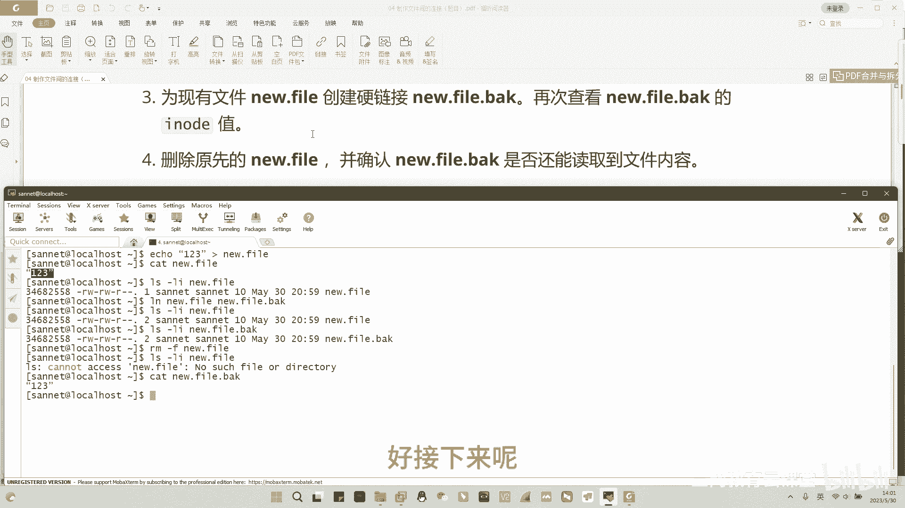

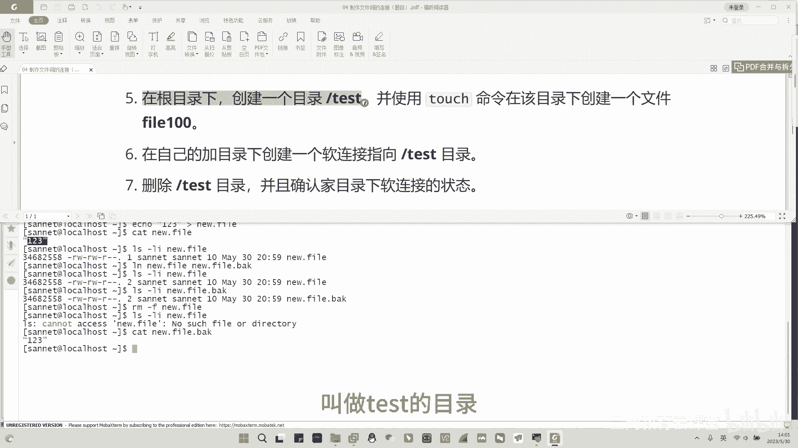

---

## 创建与理解硬链接 ⛓️

接下来，我们将通过`ln`命令为`newfile`创建一个硬链接。硬链接会创建一个新的目录项，该目录项直接指向原始文件的数据块（即相同的inode）。

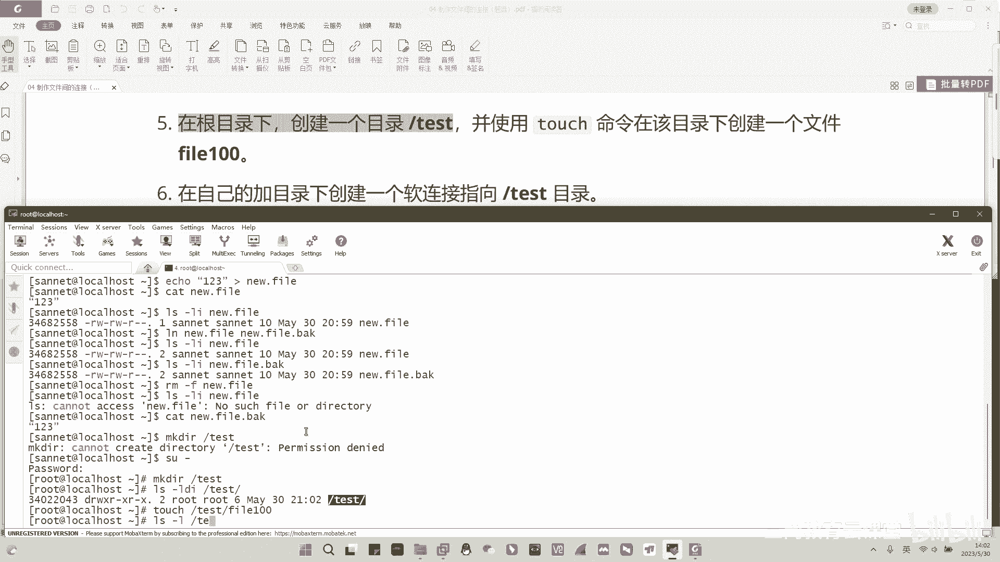

以下是操作步骤：

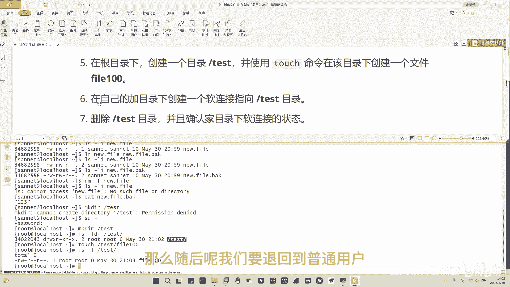

1.  使用`ln`命令创建硬链接。
    ```bash
    ln newfile newfile.bak
    ```
    这条命令创建了一个名为`newfile.bak`的硬链接，它和`newfile`指向同一个inode。
2.  再次使用`ls -li`命令查看两个文件。
    ```bash
    ls -li newfile newfile.bak
    ```
    你会发现两个文件的inode值完全相同，并且`newfile`的硬链接数变成了`2`。这表示现在有两个文件名（`newfile`和`newfile.bak`）可以访问同一份数据“123”。
3.  为了验证硬链接的独立性，我们可以删除原始文件`newfile`。
    ```bash
    rm newfile
    ```
4.  然后尝试读取硬链接文件`newfile.bak`。
    ```bash
    cat newfile.bak
    ```
    你仍然可以成功读取到数据“123”。这说明硬链接是平等的，删除其中一个并不会影响通过其他硬链接对数据的访问。

**核心概念**：硬链接是指向文件数据本身（inode）的多个目录条目。公式上可以理解为：**多个文件名 => 同一个inode => 同一份数据**。

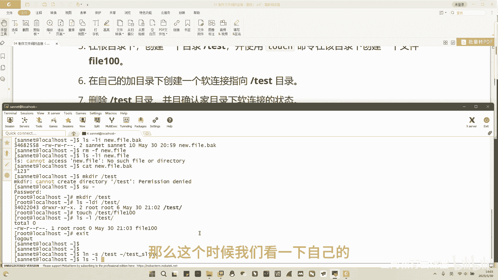

---

## 创建与理解软链接 🔗

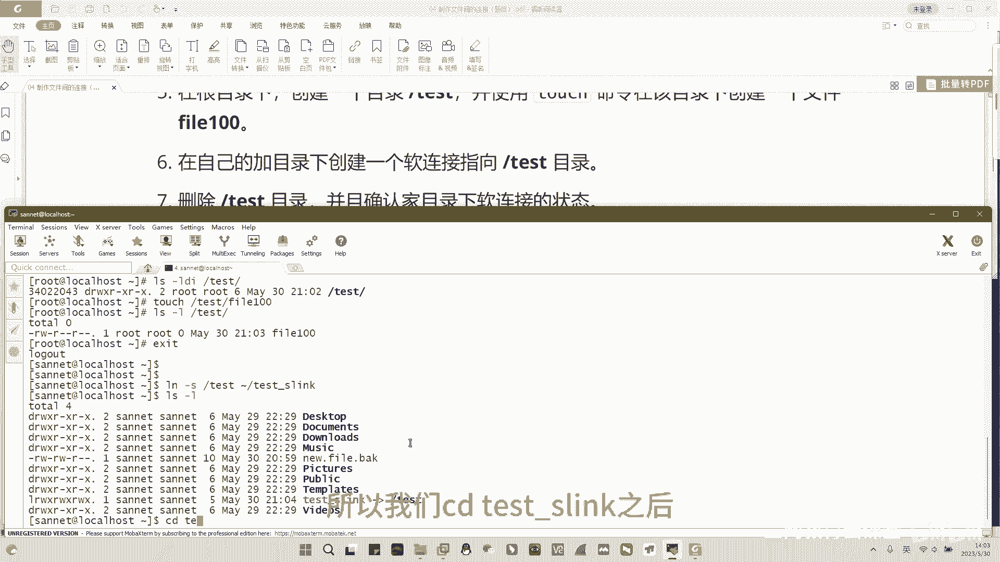

上一节我们介绍了直接指向文件数据的硬链接，本节中我们来看看另一种链接方式——软链接。软链接是一个独立的文件，其内容存储的是目标文件或目录的路径。

以下是创建软链接的实验步骤：

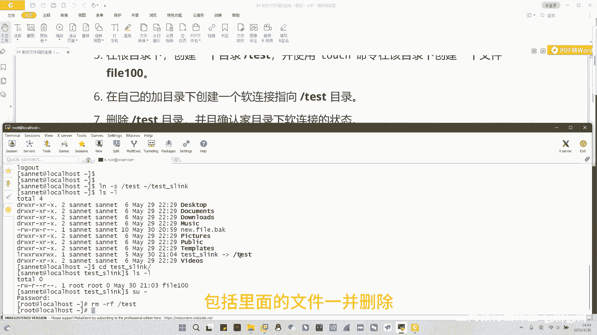

1.  **切换到超级用户并创建目录**：由于需要在根目录(`/`)下操作，普通用户权限不足，因此先切换到超级用户（root）。
    ```bash
    sudo su
    # 或
    su -
    ```
    输入密码后，在根目录下创建一个名为`test`的目录。
    ```bash
    mkdir /test
    ```
2.  **在test目录中创建文件**：使用`touch`命令在`/test`目录下创建一个文件。
    ```bash
    touch /test/file100
    ```
3.  **退出超级用户**：返回我们自己的普通用户环境。
    ```bash
    exit
    ```
4.  **创建软链接**：在普通用户的家目录下，创建一个指向`/test`目录的软链接。
    ```bash
    ln -s /test ~/test_slink
    ```
    这里的`-s`选项表示创建软链接（符号链接）。
5.  **查看软链接**：使用`ls -l`命令查看家目录。
    ```bash
    ls -l ~/test_slink
    ```
    你会看到一个标记为`l`（link）的条目，它有一个箭头指向`/test`。这表示`test_slink`是一个软链接。
6.  **通过软链接访问**：你可以像进入普通目录一样进入这个软链接。
    ```bash
    cd ~/test_slink
    ls
    ```
    你会看到之前创建的`file100`文件，这证明软链接正常工作。
7.  **演示软链接的依赖性**：现在，我们再次切换到超级用户，删除软链接所指向的原始目标`/test`目录。
    ```bash
    sudo rm -rf /test
    ```
8.  **观察断链**：回到普通用户，再次查看软链接。
    ```bash
    ls -l ~/test_slink
    ```
    此时，`test_slink`的显示通常会发生变化（例如颜色改变或闪烁），这表示它是一个“断链”或“悬挂的链接”。尝试进入该目录会失败，因为它指向的路径已经不存在。

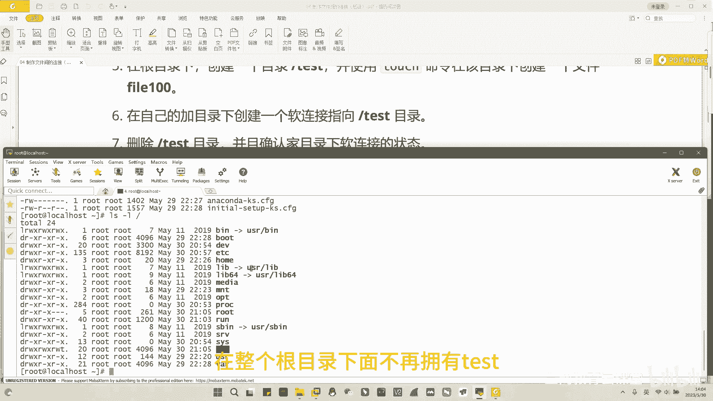

**核心概念**：软链接是一个包含目标路径的特殊文件。公式上可以理解为：**软链接文件名 => 存储的目标路径字符串 => 访问目标路径**。如果目标被删除，软链接将失效。

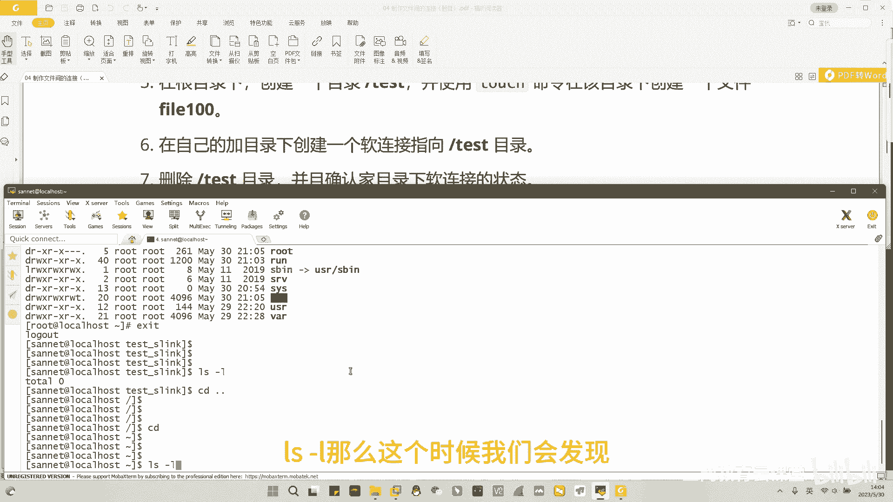

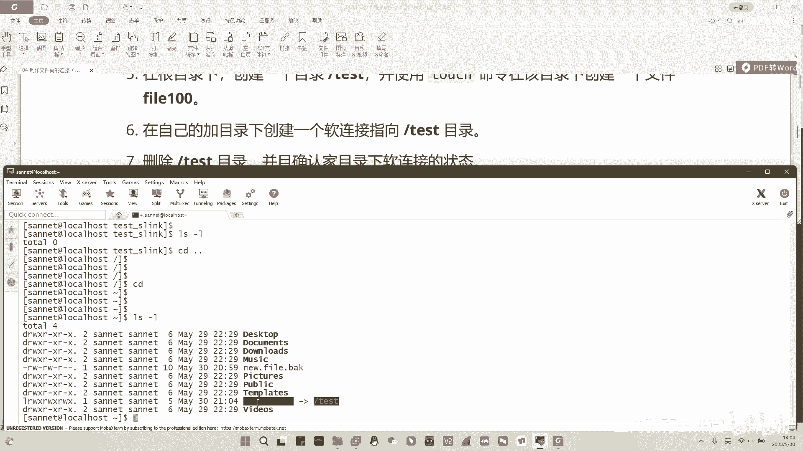

---

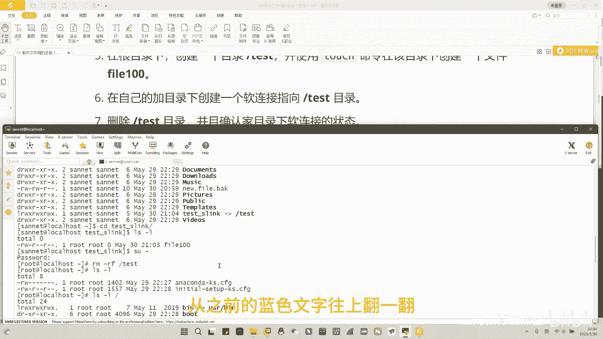

## 总结 🎯

本节课中我们一起学习了Linux文件系统的两种链接方式：
*   **硬链接**：使用`ln source target`命令创建。多个硬链接共享相同的inode和数据，删除其中一个不影响其他链接。它不能跨文件系统，也不能链接目录。
*   **软链接**：使用`ln -s source target`命令创建。它是一个独立的文件，存储目标路径。可以跨文件系统，也可以链接目录。如果目标被移动或删除，软链接会失效（成为断链）。

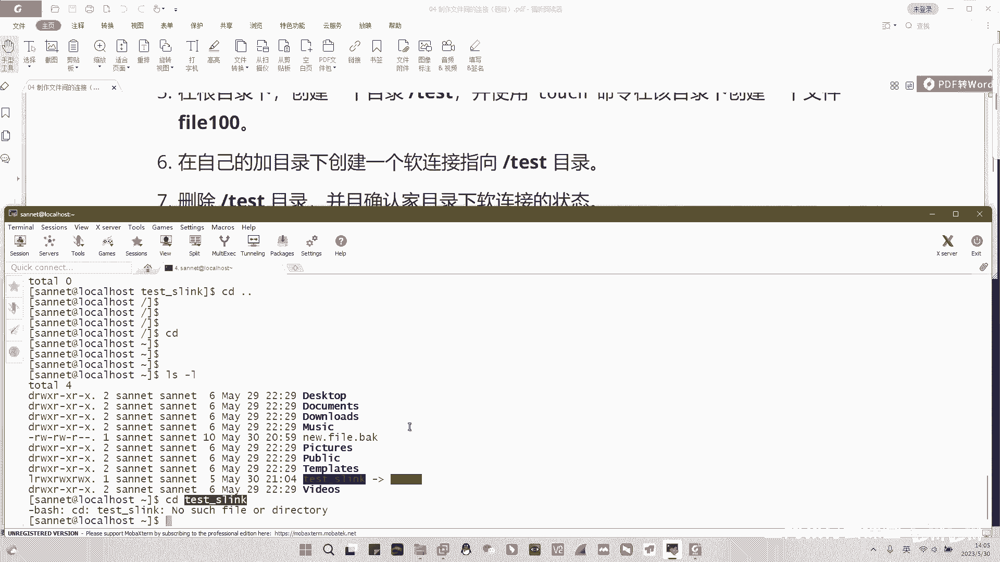

理解这两种链接的区别，能帮助你在实际工作中更灵活、高效地管理文件和目录结构。