# Linux系统工程师培训：03：使用命令行管理文件 📂

在本节课中，我们将学习如何使用Linux命令行来创建、修改和删除文件与目录。我们将通过一个具体的操作场景，逐步演示常用的文件管理命令，确保初学者能够理解并掌握这些核心技能。

---

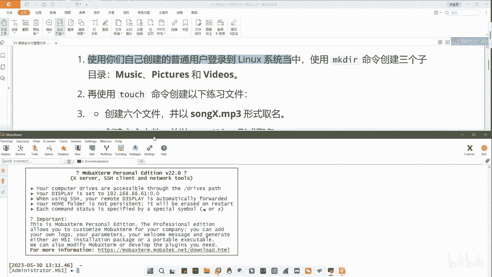

## 场景概述

我们将在一个预设的场景中操作。场景要求如下：
1.  使用 `mkdir` 命令创建三个子目录：`music`、`picture` 和 `videos`。
2.  使用 `touch` 命令创建一系列文件。
3.  使用 `mv` 命令将文件移动到对应的目录中。
4.  使用 `mkdir` 命令创建新的分类目录。
5.  使用 `cp` 命令将文件复制到新目录中。
6.  使用 `rm` 和 `rmdir` 命令删除文件和目录。

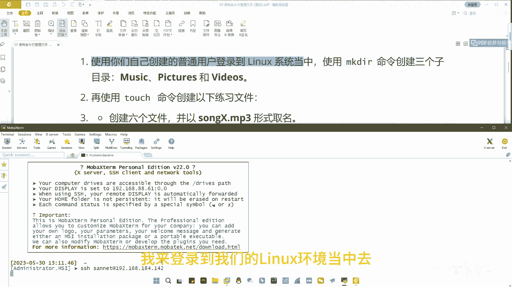

现在，让我们登录到Linux系统并开始操作。

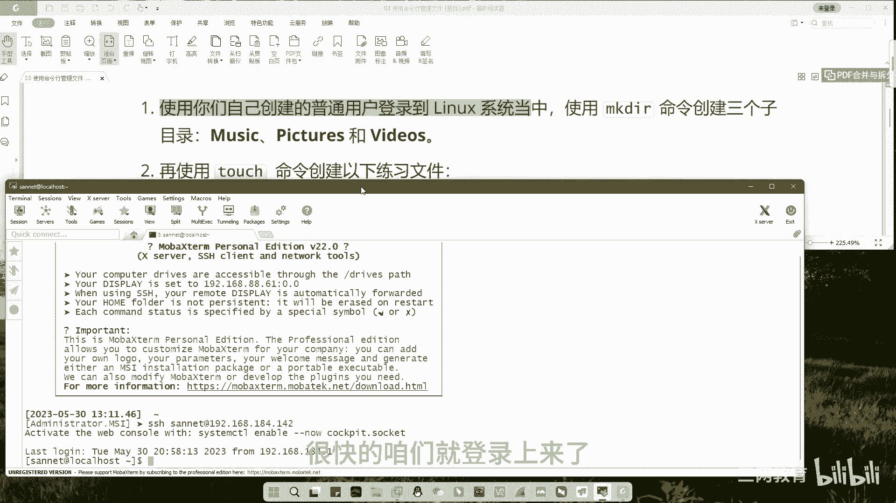

---

## 登录系统与初始检查

首先，我们使用之前创建的普通用户（例如 `senate`）通过SSH登录到Linux系统。

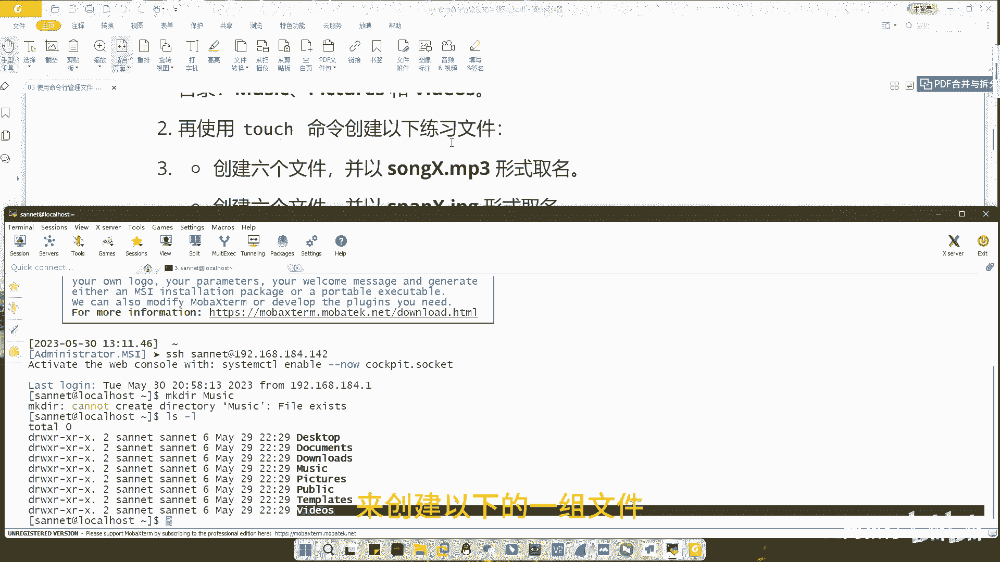

```bash
ssh senate@192.168.184.142
```

登录成功后，我们位于用户的家目录中。

---

## 创建目录

上一节我们完成了登录，本节中我们来看看如何创建目录。根据场景要求，我们需要创建 `music`、`picture` 和 `videos` 目录。

使用 `mkdir` 命令可以创建目录。

```bash
mkdir music
```

执行后，系统可能提示目录已存在，因为某些Linux发行版会为用户预置这些目录。我们可以使用 `ls` 命令来查看当前目录内容，确认目录状态。

```bash
ls -l
```

---

## 创建多个文件

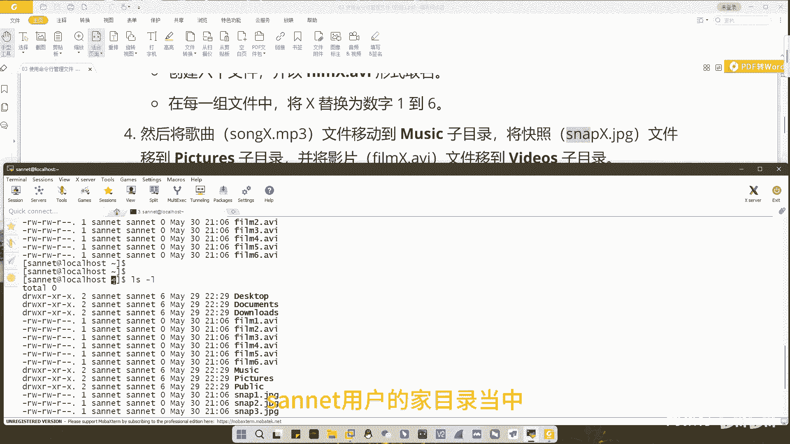

在了解了目录创建后，本节我们将学习如何高效地创建多个文件。我们需要创建三种类型的文件，每种类型包含编号1到6的文件。

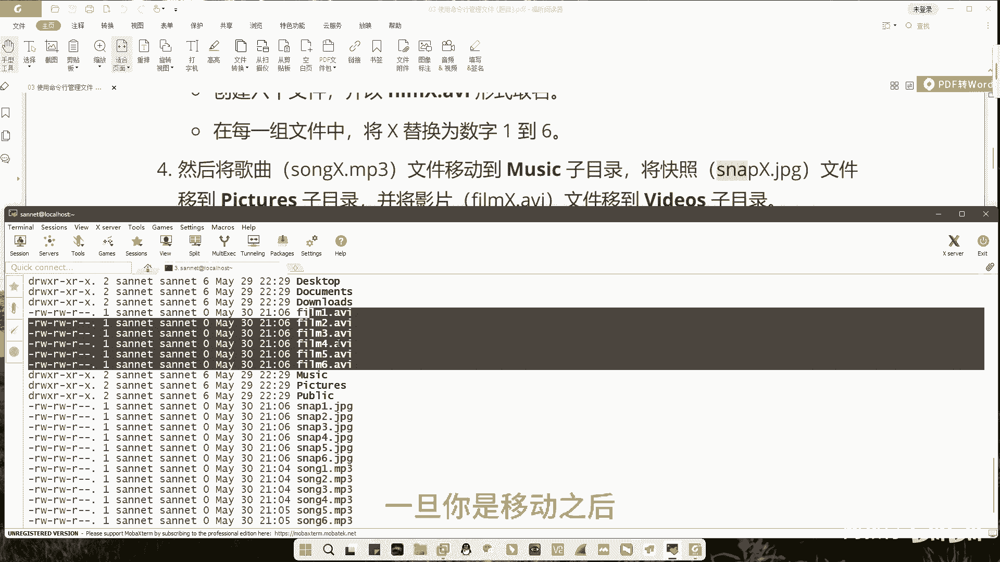

`touch` 命令用于创建空文件。以下是创建文件的几种方法：

**1. 逐个创建文件：**
```bash
touch song1.mp3
```

**2. 同时创建多个文件（不连续）：**
```bash
touch song2.mp3 song3.mp3 song4.mp3
```

**3. 使用花括号 `{}` 创建连续编号的文件（更高效）：**
```bash
touch song{5,6}.mp3
```
这条命令会创建 `song5.mp3` 和 `song6.mp3` 两个文件。

**4. 使用序列 `..` 快速创建一批文件：**
```bash
touch snp{1..6}.jpg
touch film{1..6}.avi
```
以上命令分别创建了6个 `.jpg` 文件和6个 `.avi` 文件。

创建完成后，使用 `ls` 命令检查所有文件是否已生成。

```bash
ls -l
```

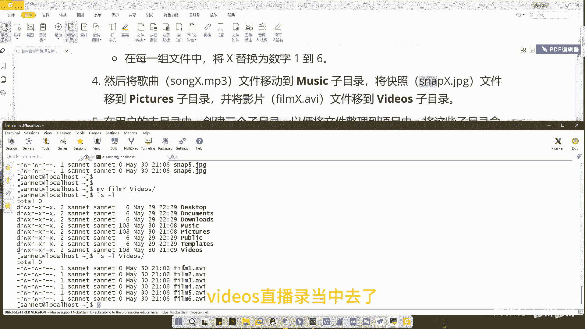

---

## 移动文件

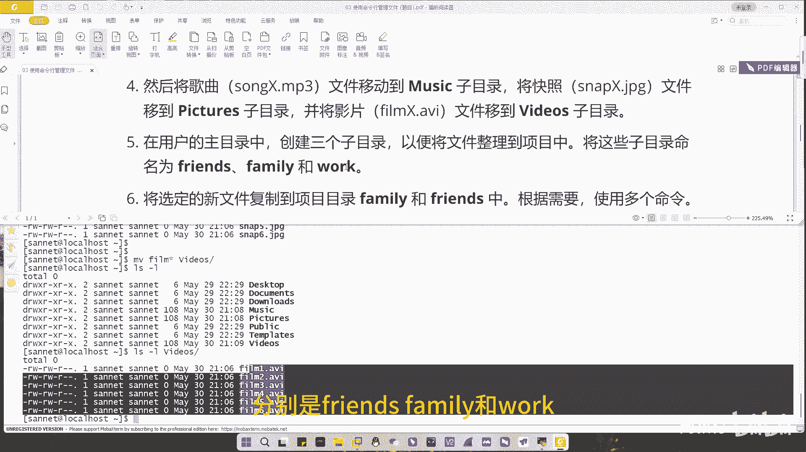

文件创建完毕后，我们需要将它们整理到对应的目录中。本节我们将学习如何使用 `mv` 命令移动文件。

要求将 `song*.mp3` 文件移动到 `music` 目录，`snp*.jpg` 文件移动到 `pictures` 目录，`film*.avi` 文件移动到 `videos` 目录。

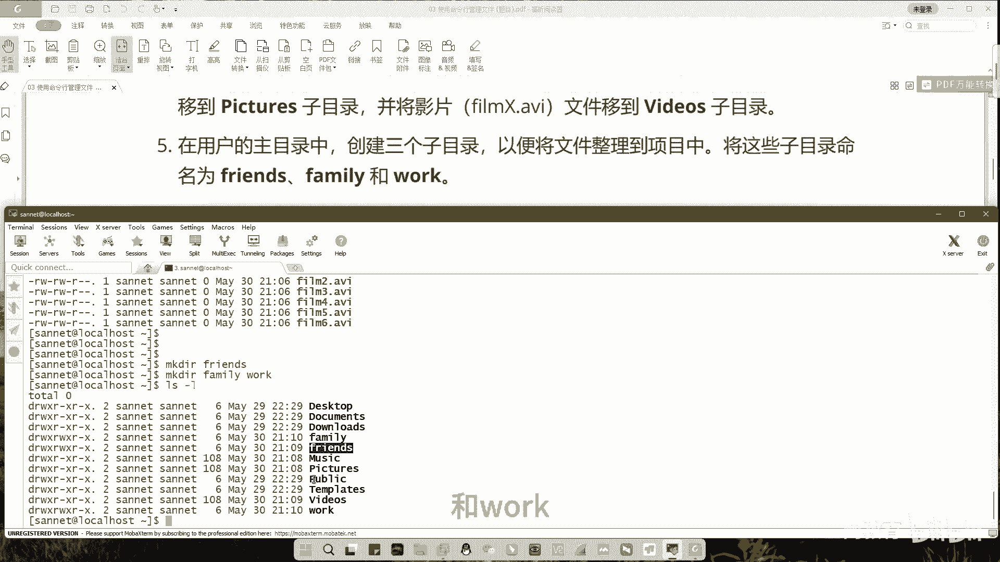

**移动一组文件：**
```bash
mv song{1..6}.mp3 music/
```
此命令将6个MP3文件移动到 `music` 目录。

**使用通配符 `*` 移动所有匹配文件：**
```bash
mv snp*.jpg pictures/
mv film*.avi videos/
```
通配符 `*` 可以匹配所有以 `snp` 开头、以 `.jpg` 结尾的文件。

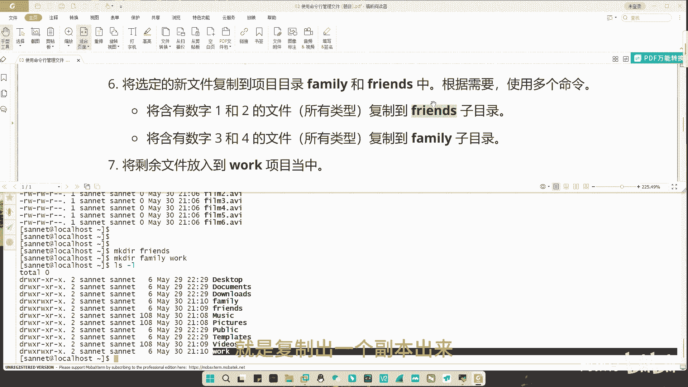

移动后，可以分别检查家目录和目标目录，确认文件已正确移动。

```bash
ls -l
ls -l music/
ls -l pictures/
ls -l videos/
```

---

## 创建分类目录并复制文件

文件初步分类后，我们需要进行更细致的整理。本节我们将创建新的子目录，并将文件按规则复制过去。

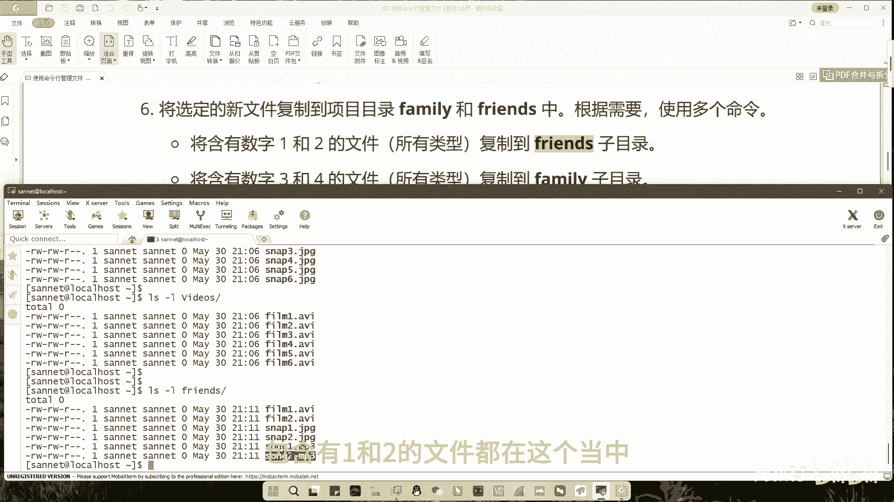

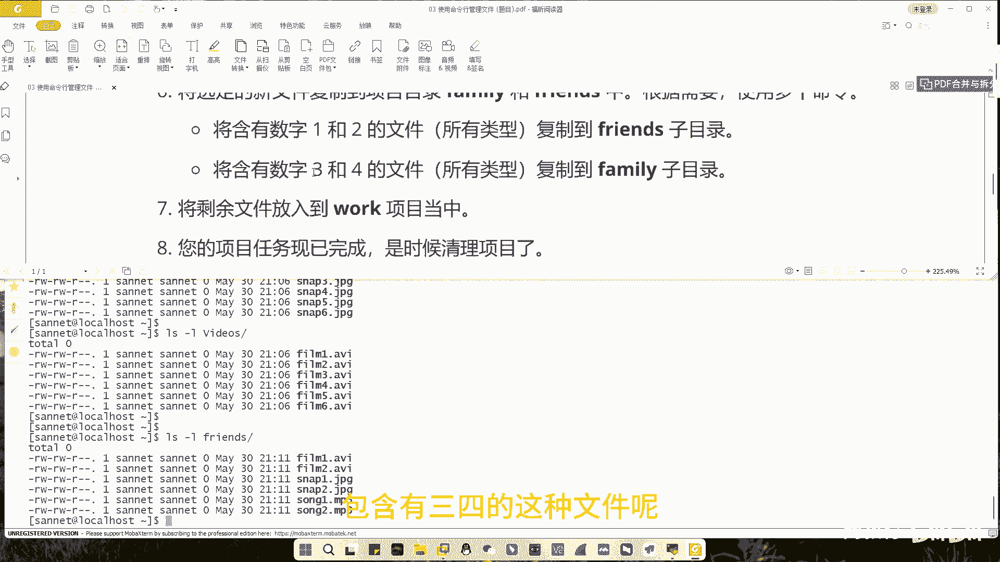

首先，在家目录下创建 `friends`、`family` 和 `work` 三个目录。

```bash
mkdir friends family work
```

接下来，需要将包含数字1和2的文件复制到 `friends` 目录，包含数字3和4的文件复制到 `family` 目录。

`cp` 命令用于复制文件。复制操作会在目标位置创建文件副本，原文件保留。

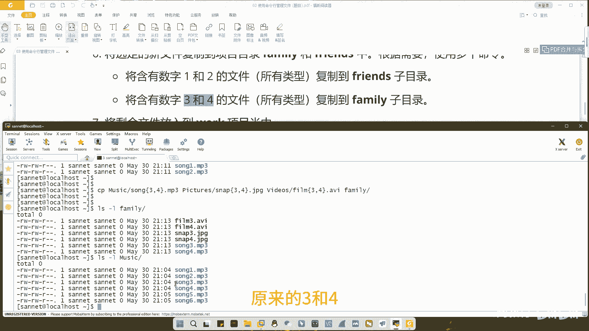

**复制包含数字1和2的文件到 friends：**
```bash
cp music/song[12].mp3 pictures/snp[12].jpg videos/film[12].avi friends/
```
方括号 `[12]` 用于匹配数字1或2。

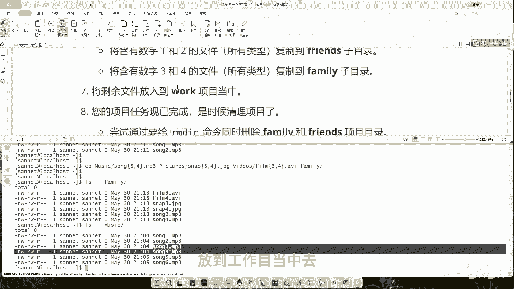

**复制包含数字3和4的文件到 family：**
我们可以使用命令行历史（按 `↑` 键）调出上一条命令，然后修改数字和目标目录。
```bash
cp music/song[34].mp3 pictures/snp[34].jpg videos/film[34].avi family/
```

**复制剩余文件（包含数字5和6）到 work：**
同样，修改命令中的数字范围和目标目录即可。
```bash
cp */*[56].* work/
```
这条命令使用了通配符：`*/*` 匹配所有子目录，`[56]` 匹配数字5或6，`.*` 匹配任意后缀。

完成后，请检查各个目录，确认文件已正确复制。

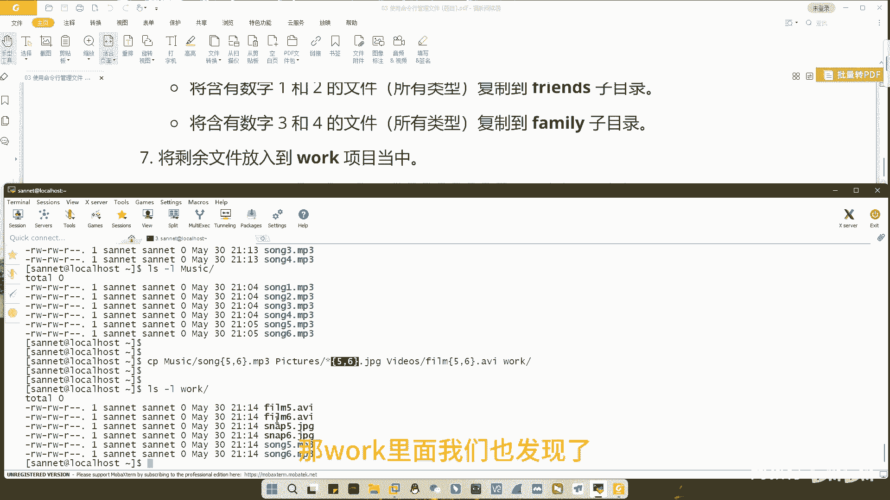

```bash
ls -l friends/
ls -l family/
ls -l work/
```

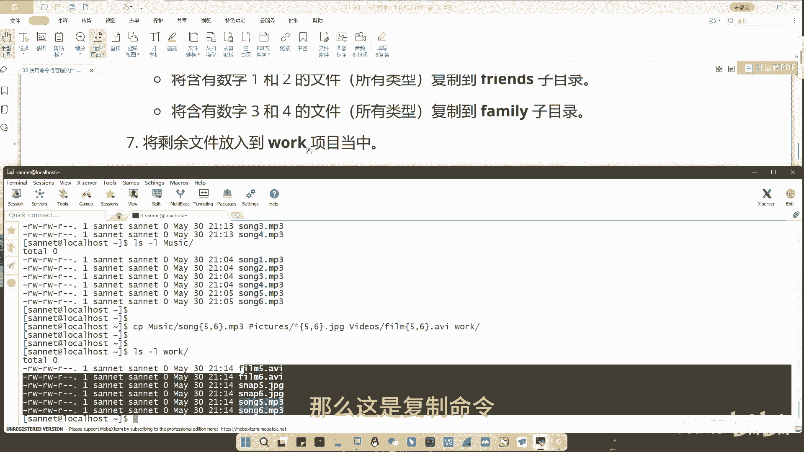

---

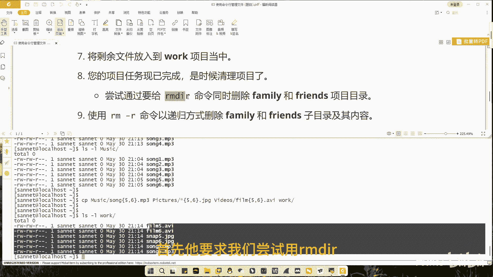

## 删除文件和目录

最后，我们来学习如何清理文件和目录。本节将介绍 `rmdir` 和 `rm` 命令的区别及用法。

首先，尝试删除 `friends` 和 `family` 目录。`rmdir` 命令用于删除**空目录**。

```bash
rmdir friends family
```
如果目录非空，此命令会失败。我们需要使用 `rm -r` 命令来递归删除目录及其内部所有内容。

**递归删除非空目录：**
```bash
rm -r friends family
```
执行后，`friends` 和 `family` 目录将被彻底删除。

接下来，删除 `work` 目录中的所有文件，但保留 `work` 目录本身。

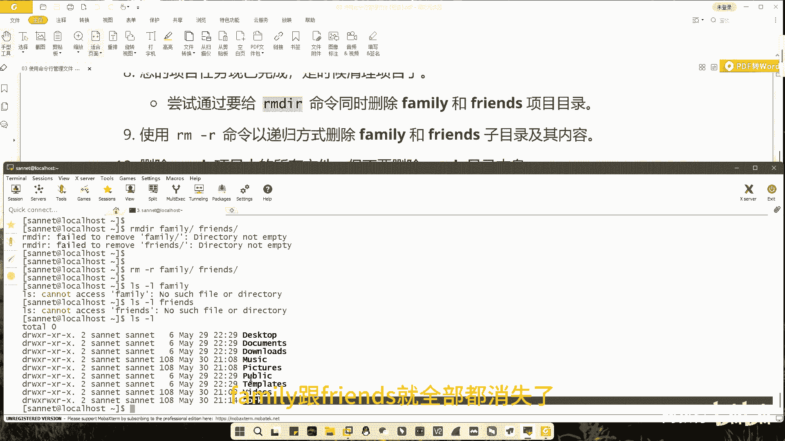

**删除目录内所有文件：**
```bash
rm work/*
```
通配符 `*` 匹配 `work` 目录下的所有文件。执行后，`work` 目录变为空目录。

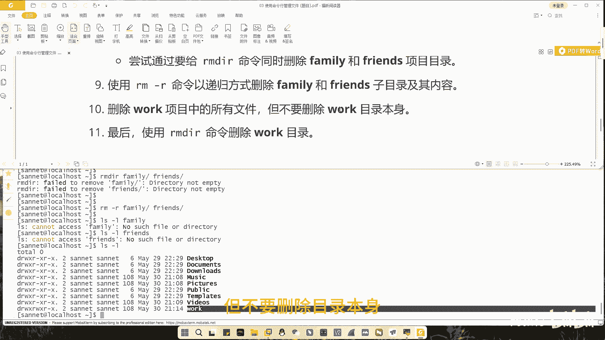

最后，由于 `work` 目录已为空，我们可以使用 `rmdir` 命令安全地删除它。

```bash
rmdir work
```

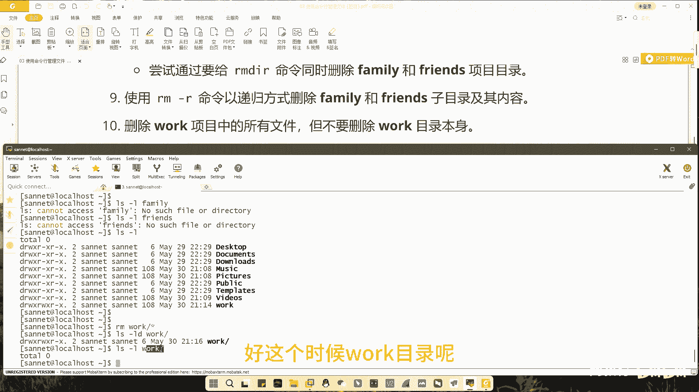

---

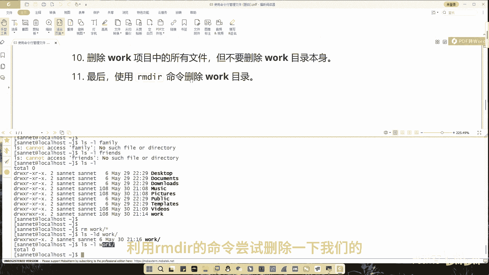

## 总结

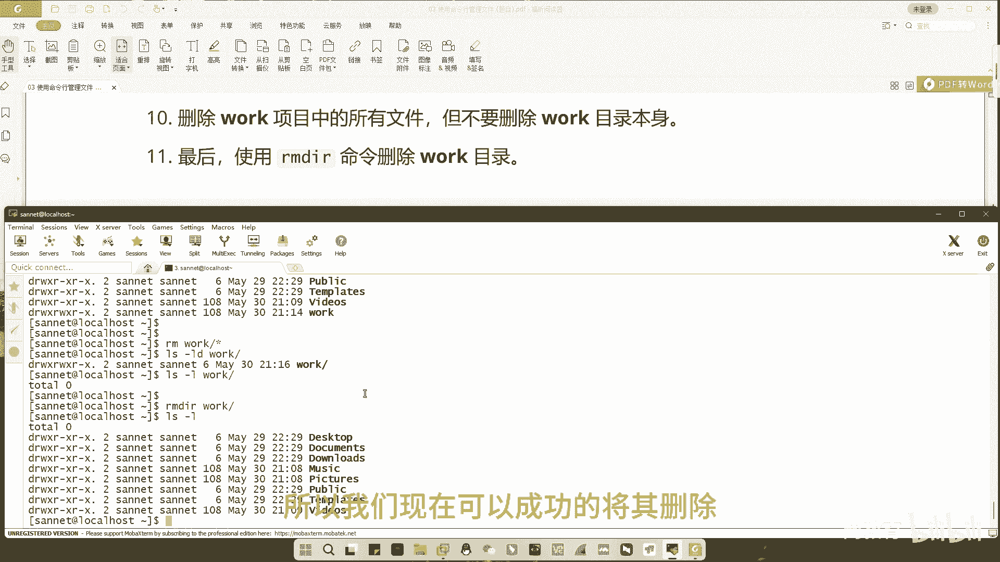

本节课中我们一起学习了Linux命令行下的核心文件管理操作。我们通过一个连贯的场景，实践了以下命令：
*   **`mkdir`**：创建目录。
*   **`touch`**：创建文件，并学习了使用 `{}` 和 `..` 批量创建的高效技巧。
*   **`mv`**：移动文件或目录。
*   **`cp`**：复制文件。
*   **`rm`**：删除文件。`rm -r` 可以递归删除目录。
*   **`rmdir`**：删除空目录。

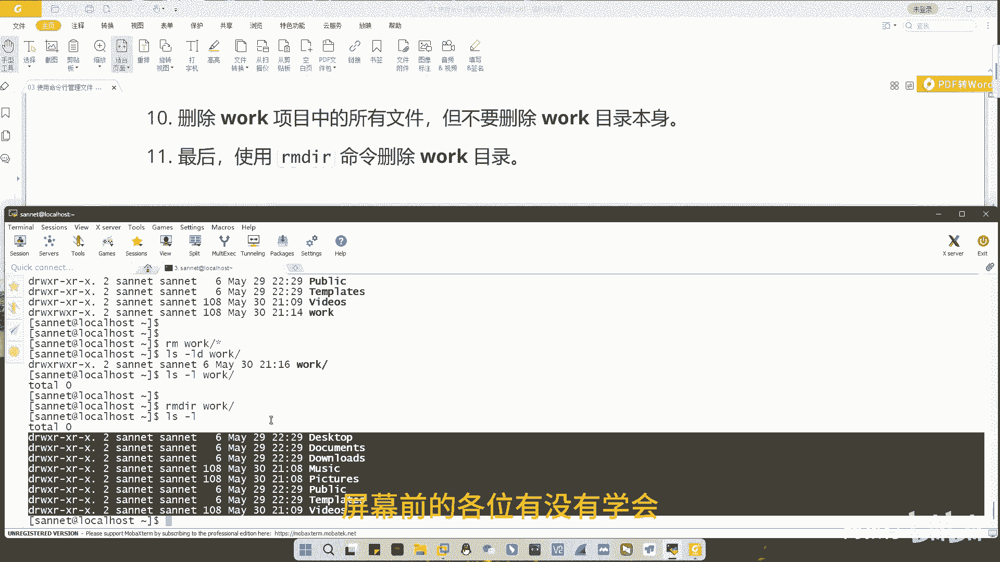

同时，我们还熟悉了通配符 `*` 和字符组 `[]` 在匹配文件名时的应用，以及使用命令行历史 (`↑`) 和光标移动快捷键 (`Ctrl + 方向键`) 来提高操作效率。掌握这些基础命令是成为Linux系统工程师的重要一步。