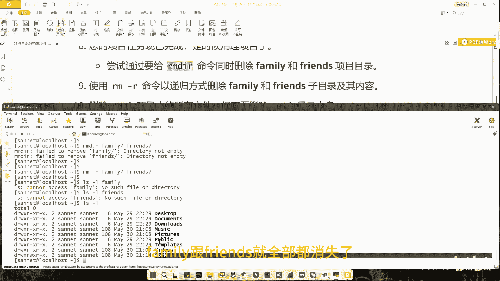

# 三网教育-linux系统工程师培训-03 使用命令行管理文件 - P1 - 网络工程师-平头哥 - BV1uo4y1777b

hello，大家好，在上一次视频当中呢，我们简单的了解一下，linux的一些常用的命令和快捷键，那么今天的视频呢将带大家使用命令行来创建，修改删除文件和目录，为了大家能够更好地理解我们的命令。

我们将在一定的场景当中呢，和大家来演示这个命令，场景呢我已经放在了屏幕上方，下方呢将是我们用来操作linux的超级终端界面，那么这个时候根据我们的环境呢要求，我们使用自己创建的普通用户。

登录到linux系统当中去，那么在我们第一次视频当中，给大家安装linux环境的时候，我们自己创建了一个普通用户，那么在我这里呢，这个普通用户的名称叫做senate。

所以我这一回呢我可以使用s s h senate at，192。168184。142，这是我linux环境的ip地址，通过这个地址呢，我来登录到我们的linux环境当中去。

好登录上来了，很快的咱们就登录上来。

登录上来之后呢，他说请我们使用mdr r命令呢，来创建这三个子目录，music picture和videos，那么这个时候呢，我们make a d i l创建第一个目录music。

那么给到我们的反馈是什么呢，说music这个目录呢现在是已经存在的状态，好我们通过ios gl看一下，那么其实在我们嗯随系统安装好的用户当中，他的music pictures。

而videos这三个子目录呢是已经存在了，所以第一题呢我们可以相对的来跳过，紧接着呢，他需要我们通过touch命令来创建以下的一组文件。

一共我们要创建三种类型的文件，分别是sum。mp 3，snp。jpg和film。a v i，每一种文件呢需要有一和六，1~6这六个数字组成，所以每一个文件我们都要重建六个，出了touch命令。

最简单的使用方法呢无非就是使用touch命令啊，创建上一点mp 3啊，这是一种方式，我们可以检查一下，在我们的整个系统当中，就有了一个sum一点零mp 3的这样一个文件。

当然我们也可以通过sum 1 sum 2点mp 3，上三点mp 3，上四点mp 3，实现多个文件同时创建的一个操作，那么我们可以这个轴展示一下，利用原字符啊，我们可以一次性展示所有以上开头的所有文件。

那么这个时候呢，我们可以看到这边已经拥有了四个sm的文件，但是如果利用上面这两种方法呢，依然显得咱们的这个效率呢啊不够高，而我们想要快一点创建这六个文件，我们还有更快的方法。

比如说我们的上文件还留有两个，那么我们依然可以用touch命令加上加花括号，里面加上五和六的方式，来创建最后两个mp 3文件，创建好ios看一下啊，五和六就创建出来了，花括号协会写六，中间有一个逗号。

说明呢我要创建上五和上六这两个文件，这两个文件呢是不连续的不连续的，那么像这我们知道了这种方法之后呢，我们可以一次性把这六个文件全部创建出来，我们可以使用touch snp，花括号，写两个点。

写六这个字符的含义呢，表示我要一次性创建出六个文件，分别是stop 1 number 2，一直到stop 6为止，同时呢，每个人都会保持有一个后缀加jpg的这种形式，那么l s检查一下snp文件。

一共就有六个文件还是snp，那么还有第三个类型的文件film，我们也是使用同样的方法film好一点点，六点avi的方式创建，创建完了也是检查一下我们的文件，同样的六个文件呢也都全部创建完成。

这样就是我们通过一个原字符的方式，来创建多个文件，好，紧接着我们的题目要求，我们呢将相对应的文件呢，比如说son的文件移动到music目录当中去，再将snp文件呢啊。

移动到pictures的子目录当中去，将影片的文件呢file移动到videos的子目录当中去，那么既然是移动，就意味着我们现在的这一共18个文件呢，它是保存在咱们三net用户的家目录当中啊。

全部保存在这边，一旦你是移动之后。

那么这些文件呢，film文件就应该来到videos目录当中，snp文件就会来到pictures的文件当中，sum的文件就会来到music目录当中啊，那么什么样的命令可以帮助我们移动文件呢。

啊就是mv命令啊，mv命令，那么同样的方式，我们一次性想要把这三个，这六个文件一起移动到某一个目录里面去，我们可以用我们刚才创建的方法，比如说上花括号一点点六点mp 3。

给它移动到我们的music目录当中去，回车好展示一下上点mp 3，在我们senate用户的加入，下面的就不复存在了啊，那么到哪儿去了呢，l s杠l music看一下，在music的目录当中。

我们出现了sound 6个文件啊，当然我们也可以使用这样的方法，同样还是使用mv命令来移动我们的文件，写snp写新号啊，表示匹配nb开头的所有文件啊，给它存放到我们的啊pictures的目录当中去。

回车，同样先展示一下我们自己的家目录，在javd里面呢，stop的文件就已经消失了，去哪了呢，在picture的文件目录当中呢，我们来查看一下啊，在picture的目录当中，我们看到了snp的六个文件。

好，紧接着紧接着我们还要继续，要把最后的影片文件放到radio里面去，那么这个时候我们可以用我们学到的任意方法，来移动这些文件，移动到videos当中去，l s杠l。

看一下本地加目录里面呢就不再有任何的文件，最后的文件跑到了，我们的videos的子目录当中去了。

这个时候呢我们就完成了第四个需求，第五个需求呢需要我们在用户的主目录当中，创建三个子目录，以便将文件呢整理到相关目录当中去啊，这些子目录的名称呢分别是friends family和work。

那么我们可以通过make第二行啊来创建这些目录，比如说我们要创建的第一个目录friend，同样的我们可以一次只创建一个目录，也可以一次创建多个目录，目录名称之间加一个空格即可，检查一下我们的文件。

family friends和work啊。

这三个子目录呢就全部创建出来了，然后按照我们的需求，我们要将数字含有一和二的文件类型，给它复制到friends的目录当中去复制啊，和刚才的移动不同，复制就意味着文件在原来的目录应该存在啊。

目标目录france里面呢也应该存在，就是复制出一个副本出来。

放入到friends目录当中去，所以我们用到的命令是cp命令，copy的意思，我们cp命令把所有包含有一和二的文件呢，通通转移到france目录当中来，那么首先music里面有s和二，点mp 3啊。

picture里面呢有snp一和二啊，点jpg的文件，然后wow这个videos目录当中呢啊有这个film一和二，点avi文件，我们可以同时找到这些一包含有数字，一和二的文件。

一次性的给他转移到啊复制到friend目录当中去，回车好，那么这个时候我们先检查一下l s杠l music，因为我们是复制，所以在music目录当中包含有一和二数字的文件，依然还在，picture呢。

也是一样，包含一和二的文件还在videos，我们也来查看一下包含一和二的文件呢，也还在，同时再看一下我的france france的目录，friends目录，在friends目录里面。

我们同样看到了这三种类型文件的，包含有一和二的文件都在这个当中好。

那么最后我们要将包含有三四的这种文件。

复制到family里面去好，那么这个时候呢，我们没必要去把命令再去配置一遍了，我们只需要按一个上限图命令，调整到我们之前用过的命令，把里面所有的一和二改成三和四，即可改成三和四，那么这个时候呢。

我们可以使用到我们上一次学到的快捷键，ctrl加右键来快速移动我们的光标，快速移动的光标来到我们需要修改的位置，最后把目标目录改成范围即可好，同样的我们来检查范围啊。

family里面有fm film 3 film 4，snp 3 sp 4 sp 3和sp，那原来的目录里面我们简单检查一下，原来的三和四。

在之前的目录里面也都存在好这两个需求，完成第七个需求，我们要将啊最后剩余的文件啊，剩余文件指的就是包含数字五和六的文件，放到工作目录当中去。

好也是使用相同的方法，把我们这个啊三和四改成五和六即可，当然这个时候呢，我们也可以用一个最简单的方法，比如说我把中间pictures里面这个呃修改一下呃，我们可以使用，一种方法来，更换一下他的这种写法。

前面用星号表示所有文件，在所有文件里面挑出五和六的方式，其实这种方式呢也是被允许的，那么接下来我们再来看一看五和六啊，同样的最终目标目录呢，我们要给它改成work，这个时候来检查一下mod。

那work里面我们也发现了。

各个文件的五和六呢也都过来了，那么这是复制命令好。

最后的需求就是要求我们来删除这些项目了，首先他要求我们尝试用rmdr。

来删除这两个目录啊，friends family和friends r m d i r可以逐一的删除，也可以两者同时删除，那么我们可以选择两者同时删除，但是这条命令是有一个特殊的。

这条命令虽然是意思是呢可以删除目录，但是它删除的必须是空目录，就是目录当中不包含任何文件的目录，是可以用rmd r l删除的，而我们现在的目标目录呢。

family跟friends当中呢其实都是拥有文件的，并非是空目录，所以一旦我们使用这条命令来删除，我们就会发现你会失败啊，因为提示你这个目录呢它并不是空的，所以如果你想删除一个并不是空的目录的时候。

我们需要使用到命令叫rm港，而采用一种递归的方式，先删除掉目录当中的内容，再删除掉我们这个目录本身，所以我们来检查一下rm杠r加上family加上friends，ok，首先在本地加目录里面找一找。

有没有family这个目录了，他们告诉我们没有这个目录了，没有这个目录了，我要找一下有没有friends这个目录了，同样也没有了，也没有了，我们总的展示出来，发现在这边只剩下了一个work。

family和friends就全部都消失了。

全部都消失好，那么紧接着下一步说，请我们删除work项目中的所有文件，但不要删除目录本身。

怎么做呢，我们可以使用rm的方法，rm即为删除写work work下面写一个星号，代表work子目录当中的所有文件，我们把它删除，这个时候我们可以看一下work目录本身依然还在。

但是work里面之前存放的标记，有五和六的文件全部都消失了，好这个时候walker目录呢就是一个空目录。

最后题目要求我们利用r m d r的命令。

尝试删除以下我们的walker目录，那么因为work目录这个似乎是一个空目录了，所以我们现在可以成功的将其删除。

ok那么到这儿，我们使用命令行来管理文件的基本操作。

