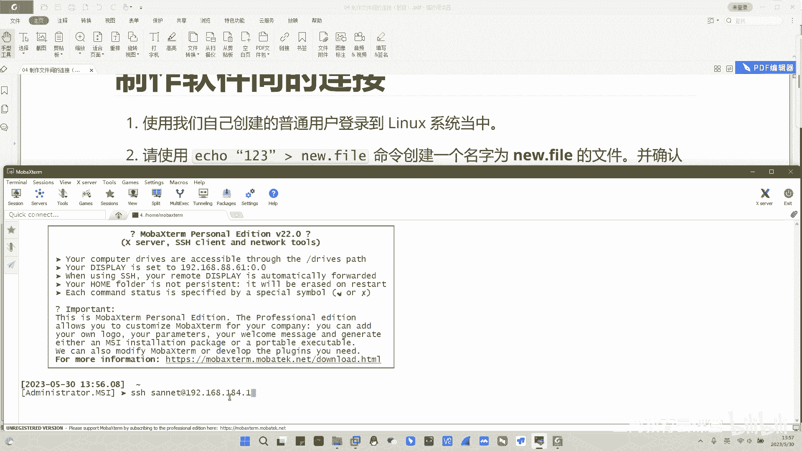
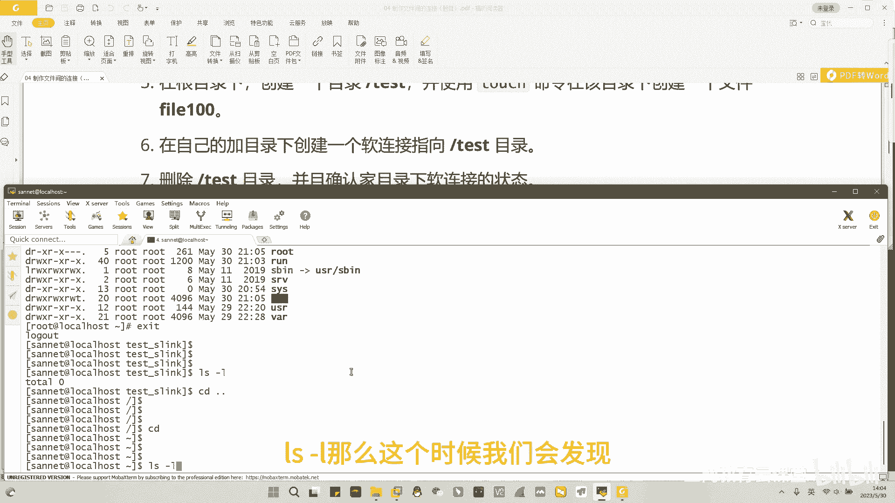

# 三网教育-linux系统工程师培训-04 制作文件间的连接 - P1 - 网络工程师-平头哥 - BV1Sh4y1X7KK

大家好，本期视频呢主要给大家演示，如何创建文件夹的链接，我们知道在linux当中呢，所有的文件都开始于一个硬链接，简单来理解就是通过硬链接，我们可以直接找到文件的本身。

同时linux还提供了一种软链接的方式，通过软链接找到某一个硬链接，借助这个硬链接，我们在最终找到文件本身好，那么咱们今天通过以下的操作来理解一下，软硬链接它们之间的一个区别。

那么我们今天的要求呢有哪些呢。

第一个首先使用我们自己创建的活动，用户登录到linux系统上来。

和上次一样，那么s s h利用我们自己创建的普通用户，登录到咱们自己的linux系统当中来。

好登录完成啊。

咱们登录完成，清理一下屏幕。

来到这个地方，那么我们看一下第一个要求，首先他要求我们用这条命令，来创建一个新的文件，并确认该文件的i noodle值。

i noodle值呢是一个文件的元数据，每一个数据文件呢都有一个属于自己的m l值，我们可以通过i nod值来分辨，两个文件到底是否属于同一个文件，我们可以利用这个值呢来判断啊，软硬链接之间的一个区别。

好，我们接下来来利用这条命令，创建一下我们的实验所需文件，回车下去啊，我们通过cat查看命令呢，先查看一下这个文件啊，发现了我们在文件当中呢，已经写入了123这样的一个数据，写入了123这个数字。

那么有了123这个数据之后，我们l s杠l同时加上一个小写的i，我们就可以查看到该文件的iu的值，那么我们会发现这个文件的idol时呢，是3468258这样的一个i note。

并且在这边呢显示一个数字一，那么表示现在该文件的硬件结束呢只有一个，该文件的硬链接数只有一个啊，也就是说能读取到123数据的文件呢，目前只有一个好。

接下来呢我们将通过硬链接link的话，用ln的命令来创建一下new fm的一个硬链接，我们来尝试一下l n new file，给它做一个硬链接，new fi改一个名字叫做b a k啊。

类称之为new file的一个备份，回车下去，我们再一次查看new file这个源文件，我们会发现什么都没有改变，其中只有这个地方发生了一个小小的改变，由原来的一变成了我们现在的一个二。

那证明现在就是有两个文件可以指向，我们之前写过的123这个数字，那么还有一个文件是谁呢，还有一个文件，自然就是我们刚才创建出来的这个new file，点b a k的文件，那么把new file。

bk文件打开之后，我们对比两个文件的i noodle值，我们会发现，这两个i noodle值是完全一模一样的，都是34682558，这是3468258，硬链接呢，每一个链接自己都指向文件本身。

所以只要你你随意的去删除任何一个文件，都不会影响到另外一个文件的读取吧，比如说我们把最原始的new file给它删除，l s l i看一下，这个时候就没有new file了啊，没有这个文件了。

那么我们再尝试读取new file，点back看看，照样可以读取到我们的123的信息，那么就证明我们new file和new file back，都是分别独自各自指向我们的这个123。

这个数据，这个就是硬链接好，接下来呢我们要来做一做软链接的实验。

软件件的实验，要求我们在根目录下面创建一个新的目录，叫做test目录。

但是我们是普通用户，普通用户呢可能会涉及到权限问题，那在根目录下面创建目录呢就被拒绝了啊，这个操作是不被允许的，那怎么办，我们可以通过竖杠的命令啊，切换到超级用户，输入超级用户密码啊。

这个时候呢我们就来到了超级用户上面，超级用户拥有绝对的控制权限，那么我们就可以把test这个目录给他创建出来，l s杠l d i test，看一下，在根目录下我们有看到test这样的一个目录。

test这样一个目录，随后呢我们要用touch touch命令来看一下啊，在该目录下面创建一个file 100的文件，test fail 100，这个时候我们再看一下test目录。

这个里面就有了file 100，那么随后呢我们要退回到普通用户。

退回到我们之前的snet这个用户这边，在自己的家目录下面呢，再创建一个软链接，指向test啊，指向test，那么这个时候我们可以通过ln命令啊，依然是la命令，只要添加一个选项杠s啊。

杠s就可以制造出软链接，我们要给谁制作制作软链接呢，给这个test目录制作软件，接，这个软链接在哪儿呢，是在我们sat用户的加密录下面，我们给他创建一个test下划线，s link的这么一个目录。

回车下去，那么这个时候我们看一下自己的家目录。

在家目录里面呢，我们就会看到有一个标记为l的一个文件啊，标记为l的文件呢为软链接文件，那么这个软链接文件呢，我们发现它有一个小小的箭头，帮助我们指向test文件，并且链接数呢它仅仅为一啊，仅仅为一。

意思是我们当我们访问test s link这个目录的时候，我们会自动帮你跳转到test目录下面，所以我们cad test s ink之后。

在这个里面查看一下目录当中的文件，我们就会发现我们刚才创建的file e版，就会出现在这个当中，那么软链接本身呢，是不能直接读取到文件本身的，所以一旦我们如果把软链接的目标文件，或者目标目录给他删除。

比如说我们再次切换到超级用户，我们通过rm杠r f的方法啊，把这个t test目录呢给它彻底删除，包括里面的文件一并删除。

来看一下，在整个根目录下面不再拥有test的这个目录了。

我们再回到snet这个用户下面，来查看一下我们软链接的状态，查看一下软链接的状态，那么回到senate加目录当中，l s杠l那么这个时候我们会发现啊。

test s link这个目录的从之前的蓝色文字。

我们往上翻一翻。

蓝色文字变成了一个啊黑底的红字，并且呢test目录的名字在不停的闪动，那么在我们这边呢，我们把它称之为断链啊，或者称之为一个被悬挂的链接，意思指软链接本身并没有删除，但是它指向的那一个硬链接啊。

出现了问题，找不到他所关联的那个目录，这就是软链接，而软链接如果出现这种情况，该软链接呢也不能再使用，因为它没有办法再去读取到具体的内容了，我们就没有办法再进入到这个木头上去了，好那么到此呢。

我们这个制作文件夹的链接，的实操训练就结束了。

