# 为Linux设置默认显示语言 - P1 - Huizhixue - BV1WC41177yC

这节课的话呢，我们来讲一下啊，怎么为Lux设置默认的显示语言啊。那有些同学的话呢就会呃问，就是比如说在命令行里面怎么显示中文，对吧？就是一些错误的提示啊，这一些怎么显示中文。那么第二个的话呢。

就是呃在这个图形界面里面，它也需要这个中文啊，但图形界面的话我觉得就比较好解决。因为图形界面的话本来是有一个设置嘛，对吧？就是你图形界面，就是你点一下设置啊。

那里面的话呢就可以呃选择这个呃显示的语语言嘛啊这个。主要是呃这个命令行的话，有同学是在问啊，虽然我不推荐命令行使用这个中文的一些显示。因为有时候就是他报错的时候啊，呃就是他比如说他报错，报错来是中文。

那么你在网上去搜答案的时候，可能就是比较比较少的答案嘛啊，就是如果你这个错误显示的话，是一个英文的。你在网上搜的话呢，反而呃就比较容易得到这个呃这个答案啊，就是什么原因，造成怎么解决，对吧？

但既然有同学问到的，我就讲一下啊，这个呃也算是一个呃知识点吧啊，就是就是我们实际上在Lux里面的话，是有相对应的那个命令行啊，去设啊，设这个呃是这个我们的那个默认的一个语言的。

因为这个语言的话不但不仅仅是显示语言啊，你你还有这个时间的格式啊，还有呢就是表示这个货币的。呃，这种单位啊呃等等，就是因为每个国家都不一样嘛啊，就是它不仅仅是呃你你这个中文英文的这个区别啊。

你还有就是一些寄阳单位的呃一些还有是一些格式的一些区别啊，那这里的话呢，我就做了一个这样的一个教教程吧，就是比如说我们可以用呃loceCTO是吧？啊，设一下本啊试一下那个呃本地的语言啊。

比如说是呃中文对吧？试言中文啊，UTF8这个字符集啊，就这这就是中文啊。就是语言是中文啊，使用UTF8的这个这个字符集，我们在这里点一下。

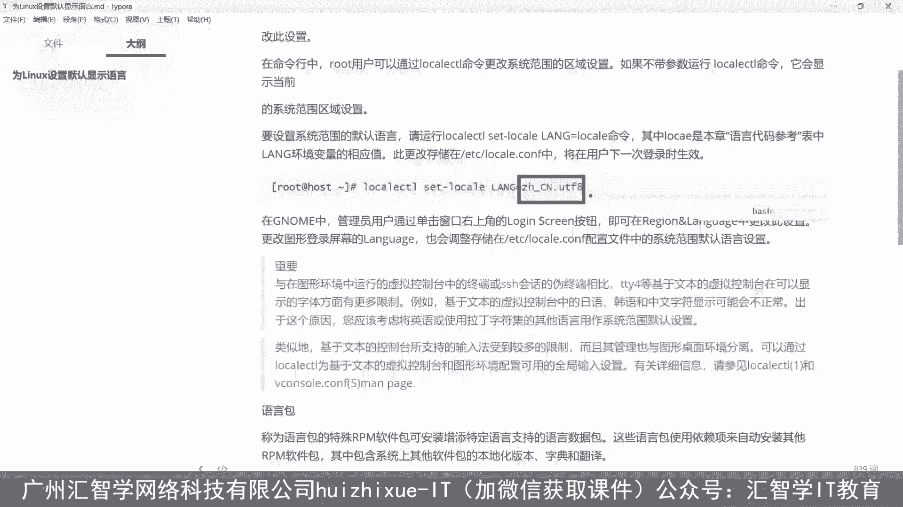

啊，就是复制过过来，这样子的话呢呃你。啊，有可能是吧我输错的话就它会显示个中文出来啊，但为什么没有中文？是因为里没有这个语言包啊啊没有这个语言包啊，我们来把这个。

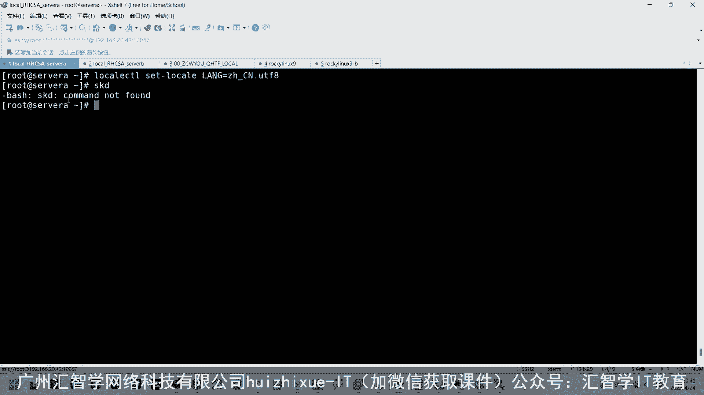

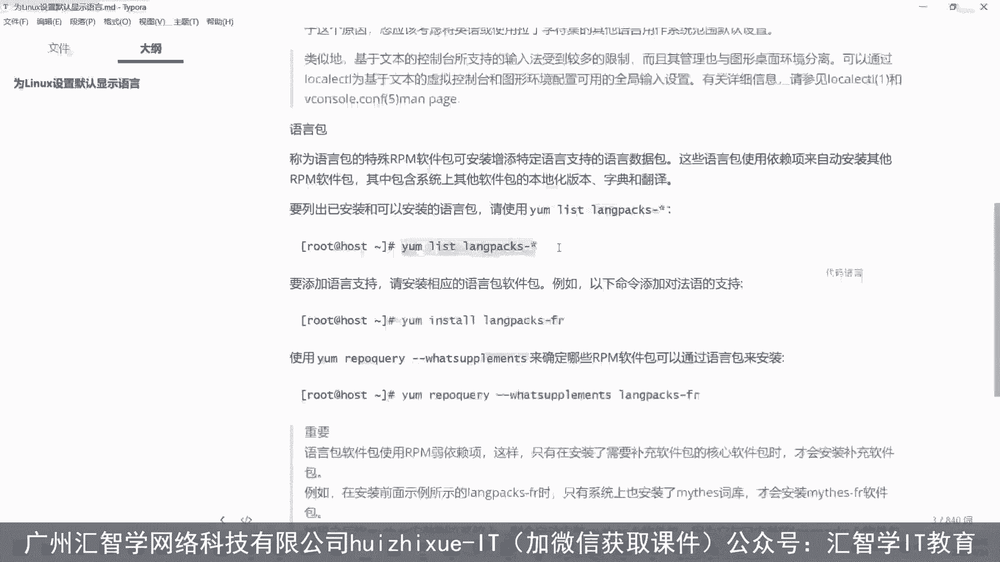

啊。支持这个语包。

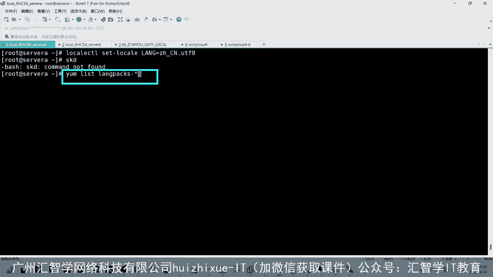

嗯们把它。啊，把它列一下啊，那么这里的话呢，是。

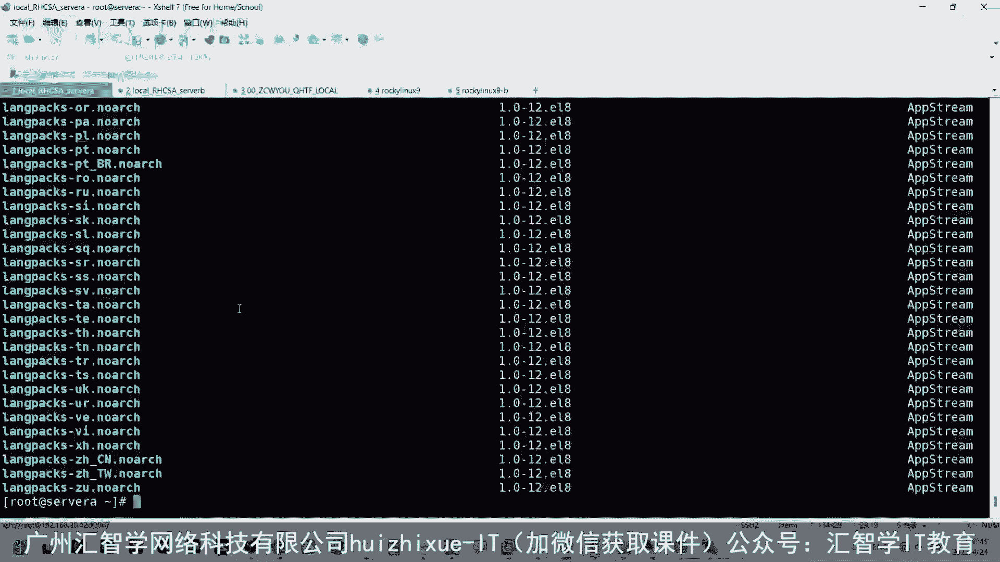

最后倒数第三个啊，就是下面这个是台湾是吧？这个是简体中文啊，简体中文啊啊，然后我们一样杠Y in store。

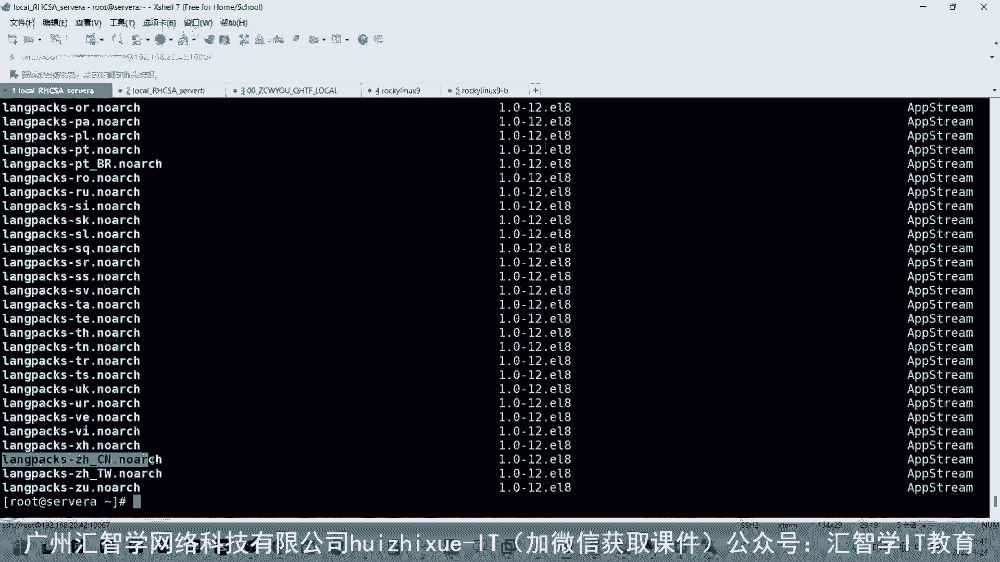

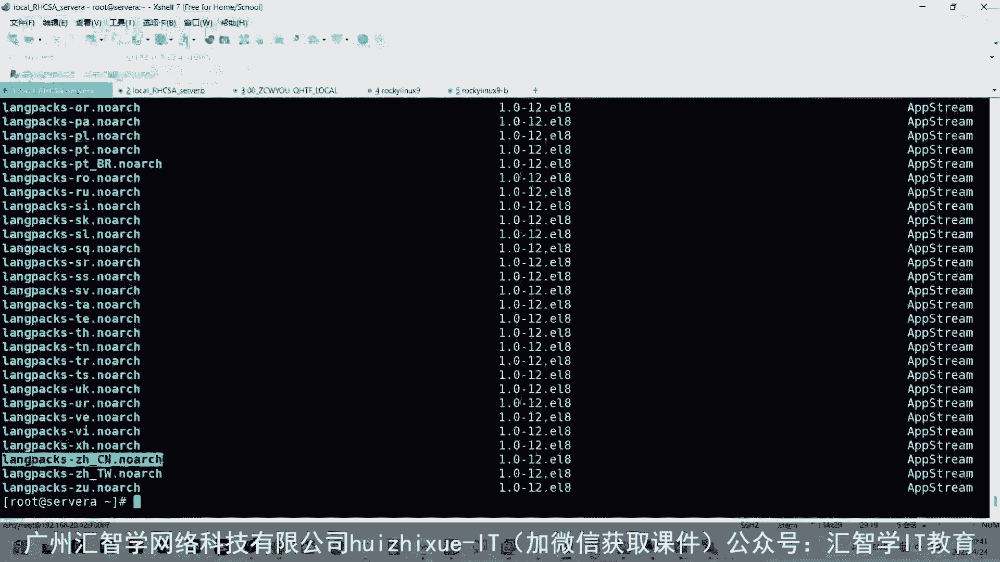

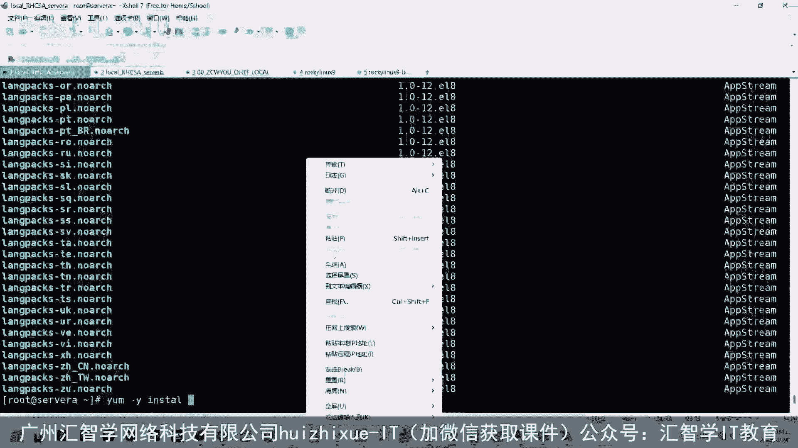

这里我们把它呃。

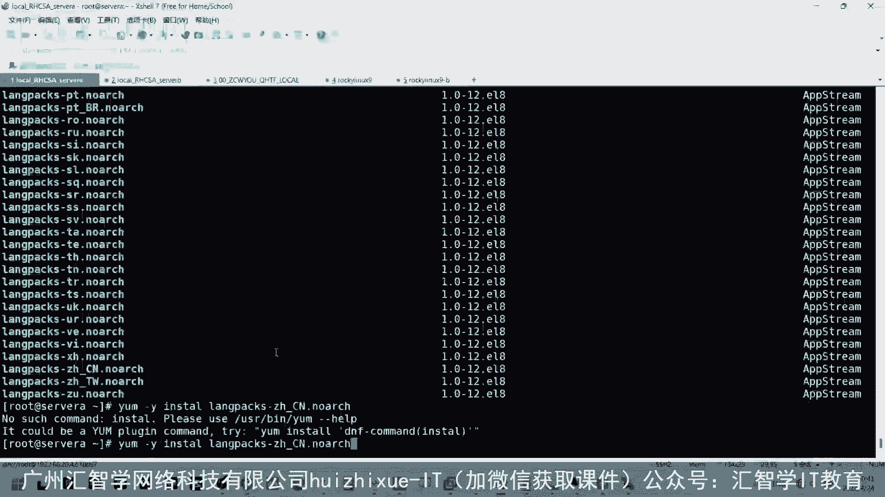

写错了，这里instore。把这个原包给装一下，原包装一下。

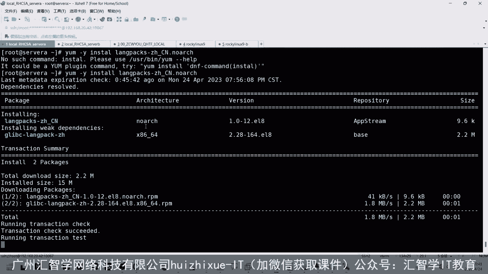

然后呢，我们呢随便呃输出一个命令，看一下啊，这里还是个英文，对吧？啊，我们退出来。

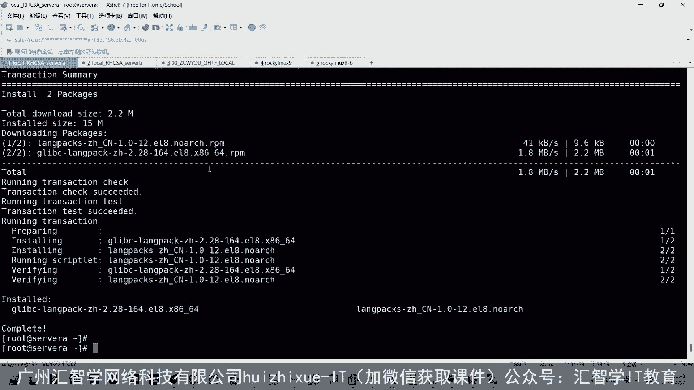

然后再重新登录上去。

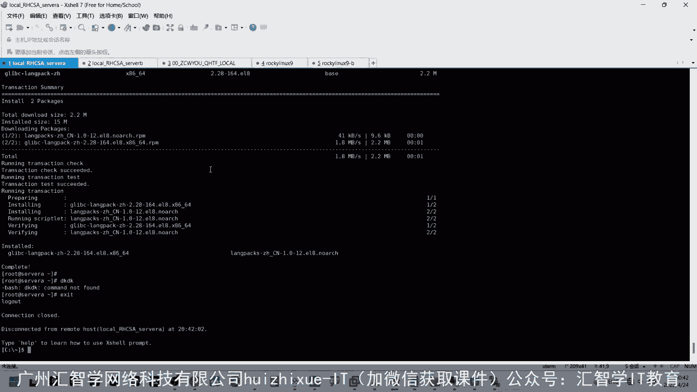

然后。

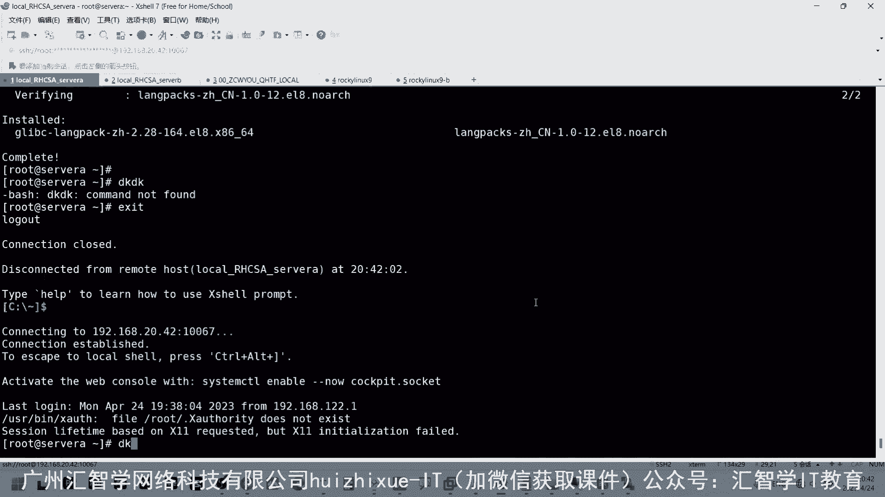

这时候的话呢就会显示一个呃显示个中文啊，就是什么妹子被找到命是不是啊，写这个中文啊。就大概是一个这样的一个呃一个方法。那注意的是说我们设的这个语言环境的话，是跟那个账号有关的啊，就是在两个用户上去设。

明白明白啊，就是。

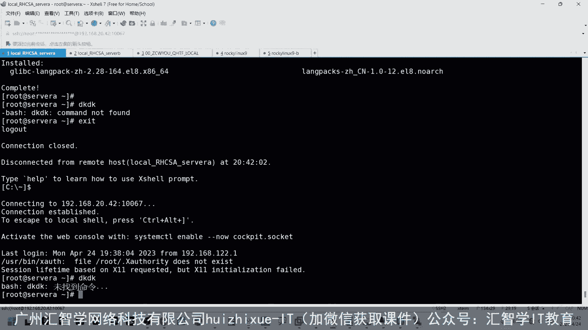

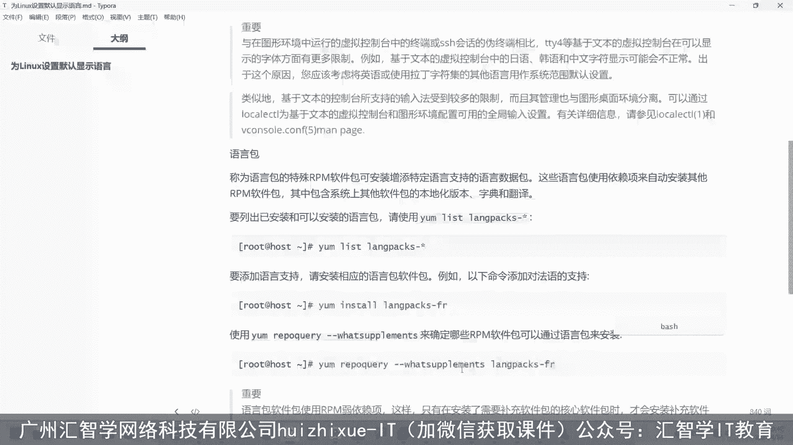

就是中文英文的话呢，这个环境是跟你的账号相关的，就是有可能是A账号是英文的，B账号是个中文，对吧？这个是这个可以理解嘛，这个东西是吧？就系统比如说我这个系统里面有有不同语言的用户，不对对吧？

A的话可能是说英文的，B的话是说中文的那那就不奇怪嘛啊。

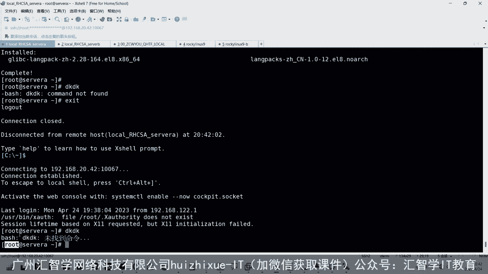

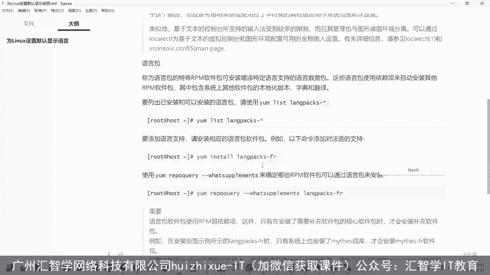