# Linux系统管理：P1：为Linux设置默认显示语言 🌐

在本节课中，我们将学习如何为Linux系统设置默认的显示语言。这包括命令行界面和图形界面的语言设置。虽然命令行使用英文更便于搜索错误解决方案，但了解如何设置中文显示对某些用户来说是一个有用的知识点。我们将通过具体的命令和步骤，演示如何配置语言环境。

## 概述

Linux系统的语言设置不仅影响界面显示的文字，还关联到时间格式、货币单位等区域化信息。设置过程主要涉及修改“区域设置”（locale）。本节将指导你完成从检查当前语言环境到安装语言包，再到最终设置的全过程。

## 命令行界面语言设置

上一节我们介绍了语言设置的基本概念，本节中我们来看看如何在命令行中具体操作。核心步骤是使用 `localectl` 命令来设置区域。

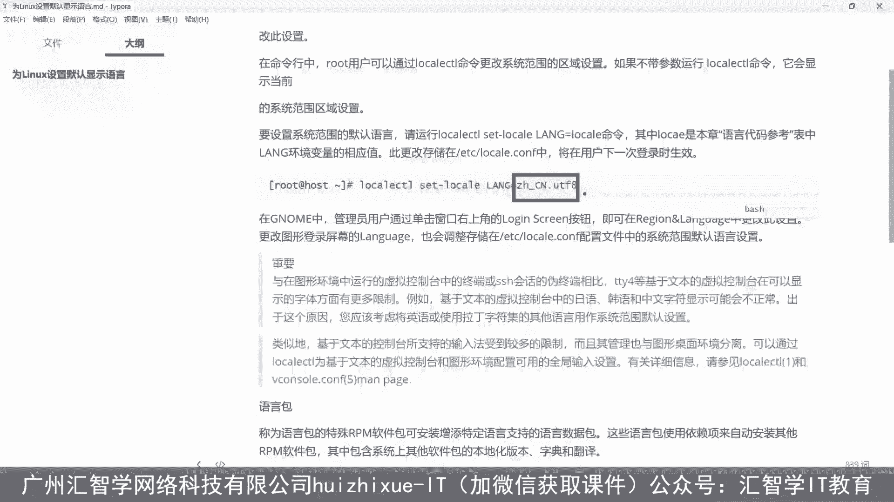

以下是设置中文语言环境的步骤：

1.  **设置区域**：使用 `localectl` 命令将系统区域设置为中文（简体，中国）并采用UTF-8字符集。
    ```bash
    localectl set-locale LANG=zh_CN.UTF-8
    ```

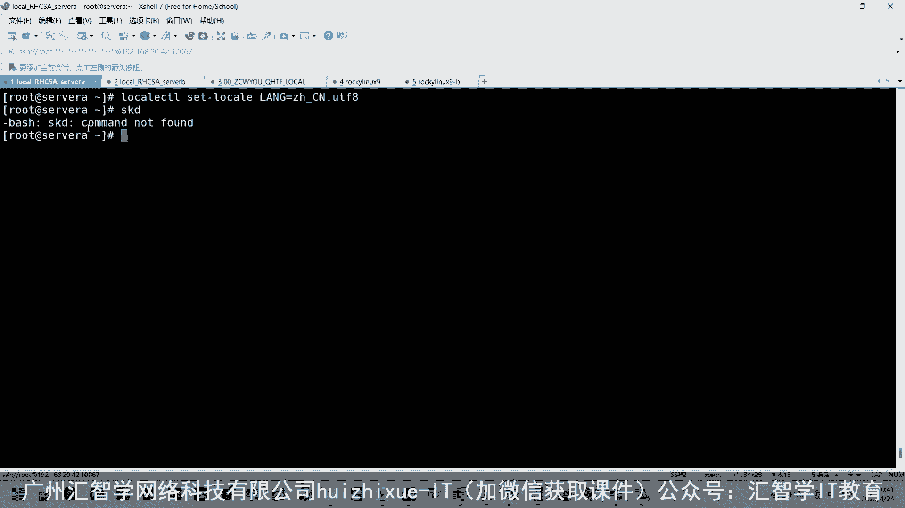

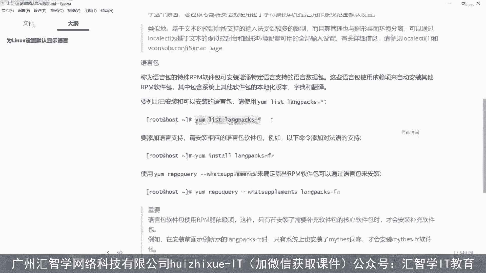

2.  **安装语言包**：如果系统尚未安装对应的中文语言包，上述设置可能不会生效。你需要先安装它。
    *   首先，列出可用的语言包以确认其名称：
        ```bash
        yum list langpacks-*  # 适用于CentOS/RHEL/Fedora
        # 或
        apt list language-pack-zh*  # 适用于Ubuntu/Debian
        ```
    *   然后，安装简体中文语言包：
        ```bash
        yum install -y langpacks-zh_CN  # 适用于CentOS/RHEL/Fedora
        # 或
        apt install -y language-pack-zh-hans  # 适用于Ubuntu/Debian
        ```

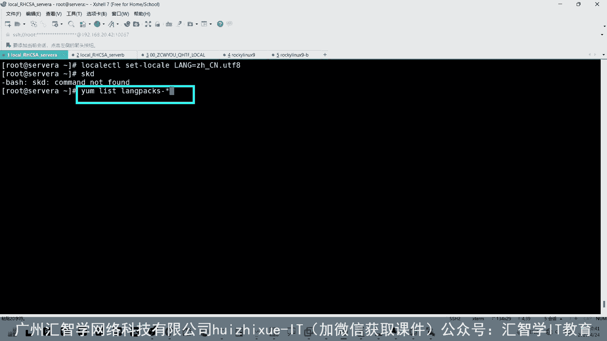

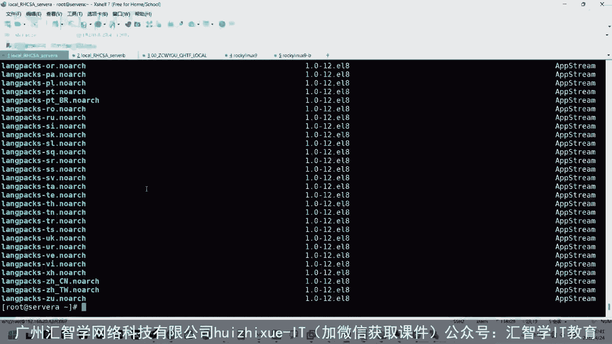

3.  **验证设置**：安装并设置完成后，退出当前终端会话并重新登录，或者启动一个新的终端窗口。此时，系统命令的提示信息（如错误信息）应该会显示为中文。你可以尝试输入一个错误的命令来测试：
    ```bash
    ls /不存在的路径
    ```
    如果设置成功，错误提示将变为中文。

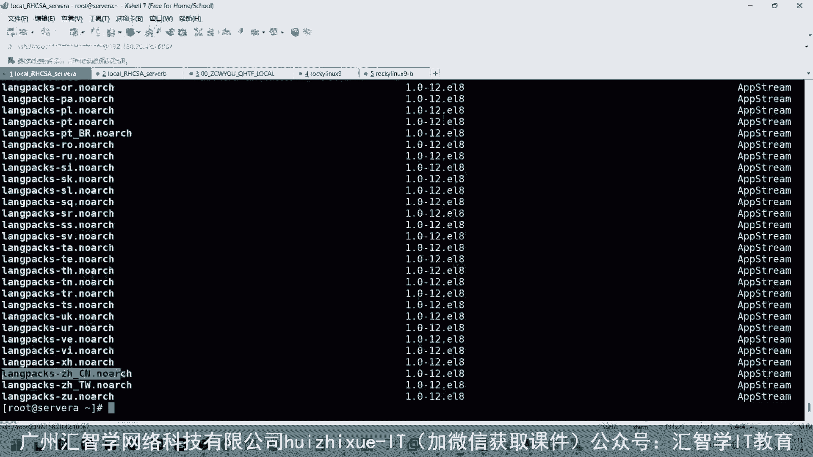

## 图形界面语言设置

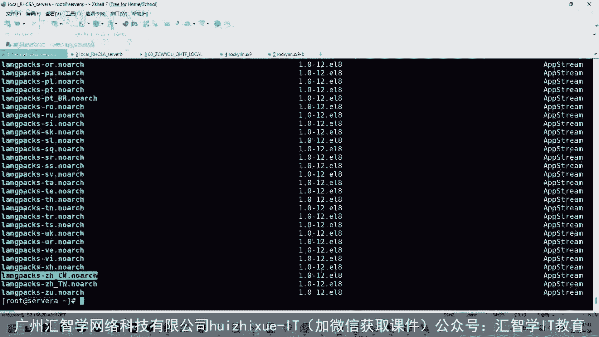

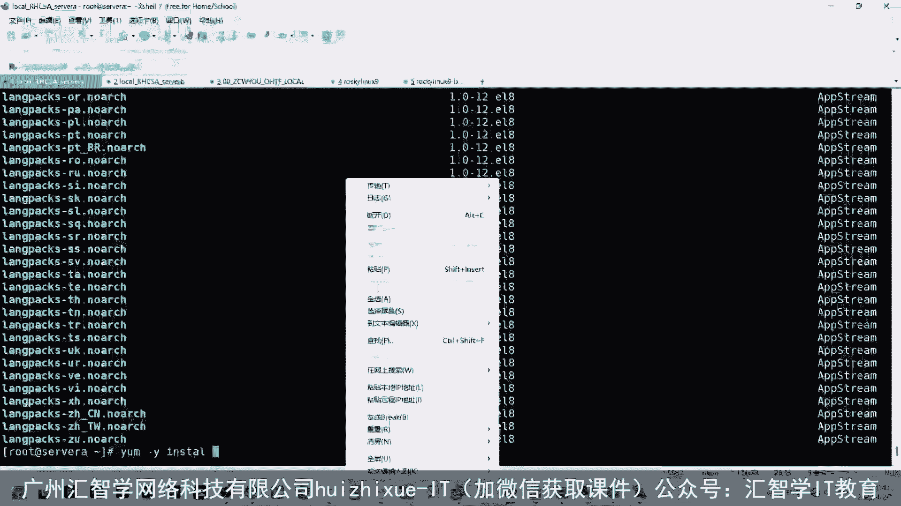

命令行设置完成后，我们来看看图形界面的设置，这通常更为直观。图形界面的语言设置通常通过系统设置菜单完成。

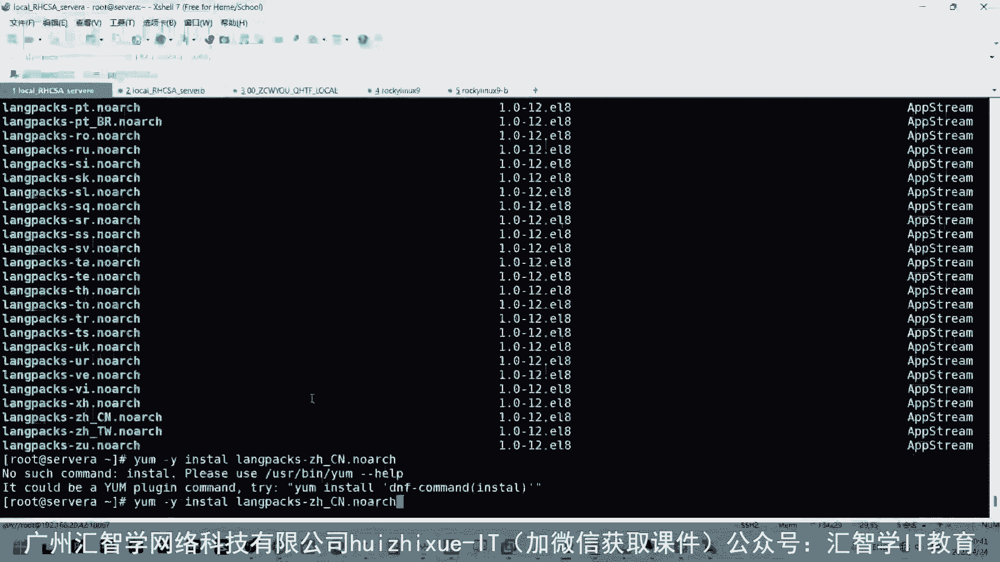

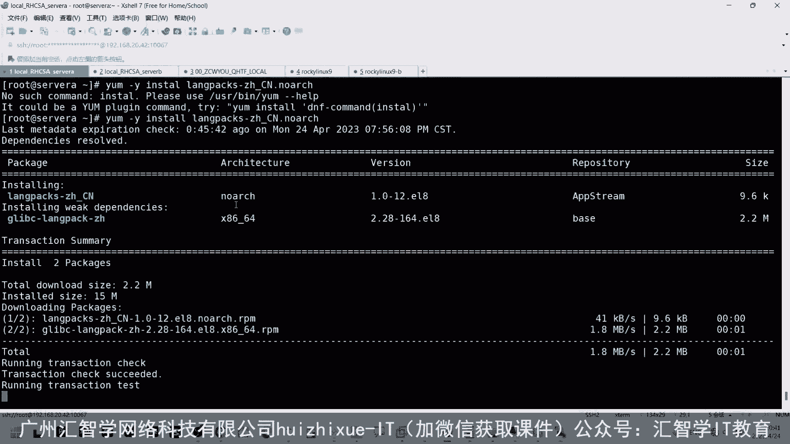

以下是通用的图形界面设置路径：

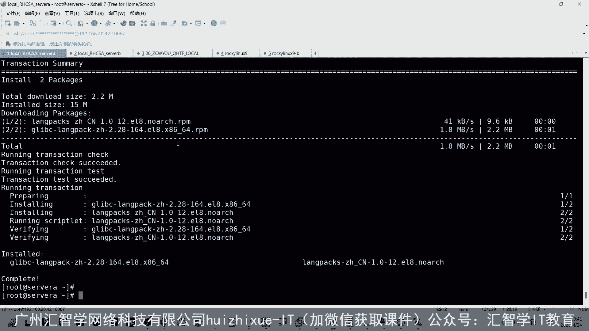

1.  进入系统“设置”（Settings）。
2.  寻找“区域与语言”（Region & Language）或类似选项。
3.  在“语言”（Language）列表中，选择“中文（简体）”并将其拖到列表顶部，作为首选语言。
4.  注销当前用户并重新登录，以使更改生效。

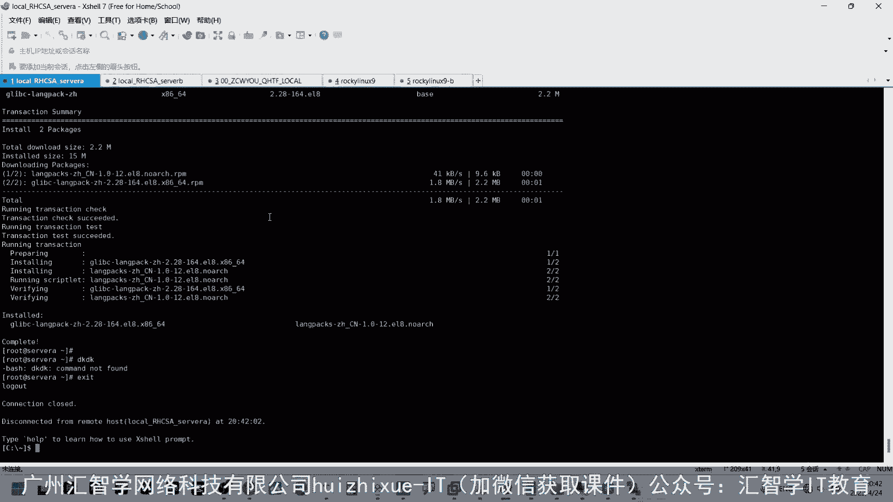

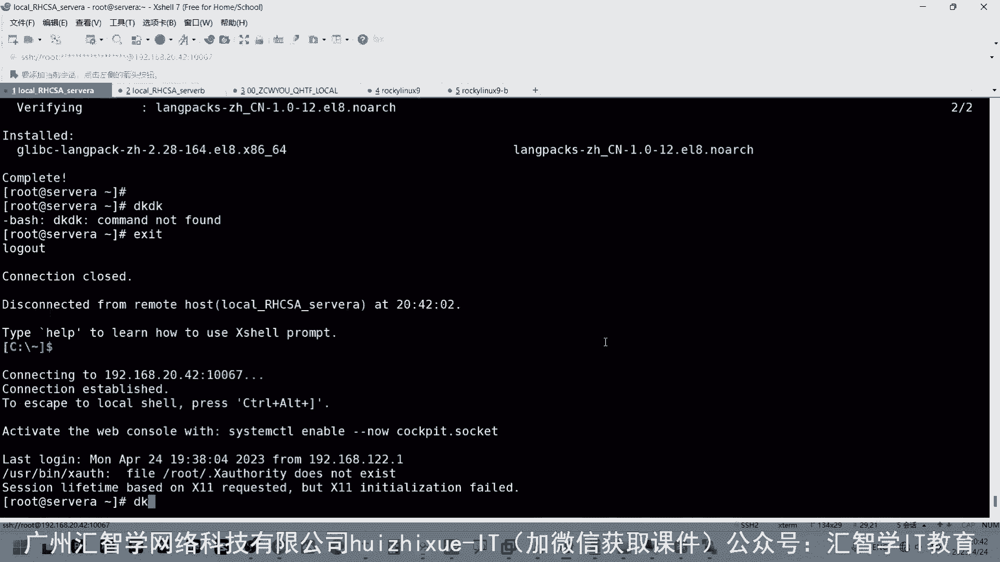

## 重要注意事项

在操作过程中，有几点需要特别注意：

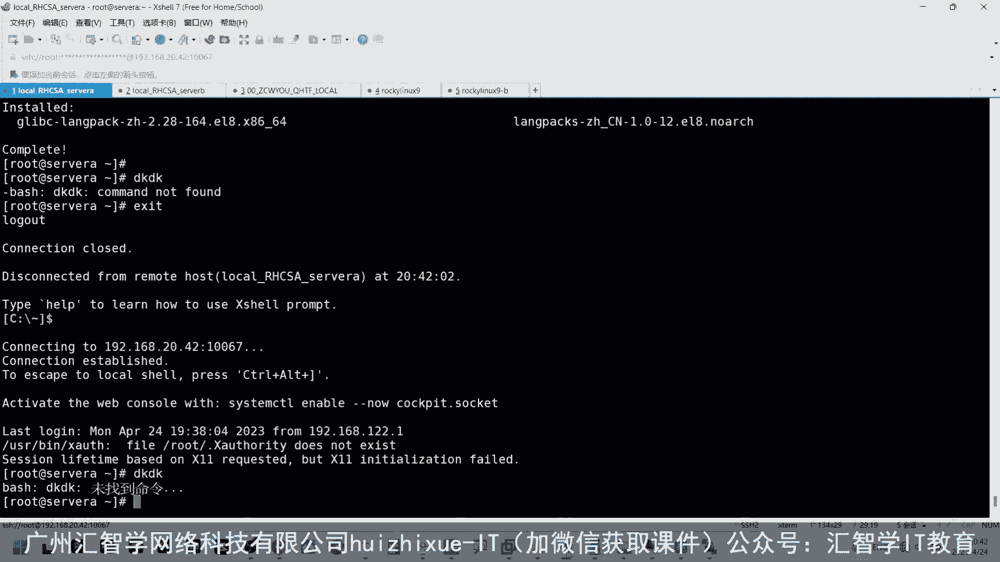

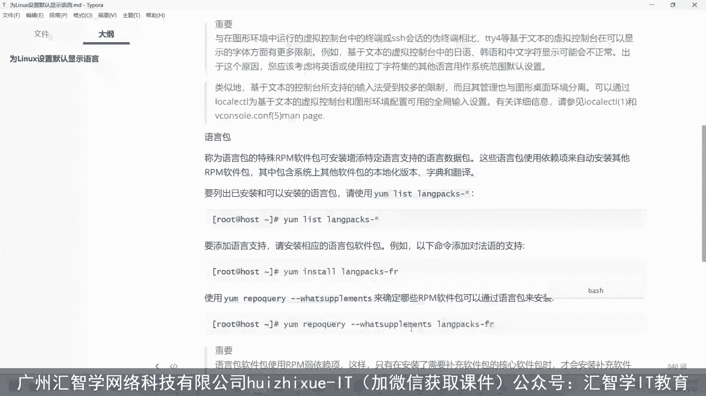

*   **用户独立性**：语言环境设置是基于每个用户账户的。这意味着，系统管理员可以为不同的用户账户设置不同的显示语言（例如，用户A使用英文，用户B使用中文），彼此互不影响。
*   **错误排查**：如前所述，将命令行语言设置为中文后，错误信息也会以中文显示。这可能导致在互联网上搜索解决方案时找到的相关资料变少。因此，在学习和排查复杂问题时，使用英文环境可能效率更高。

## 总结

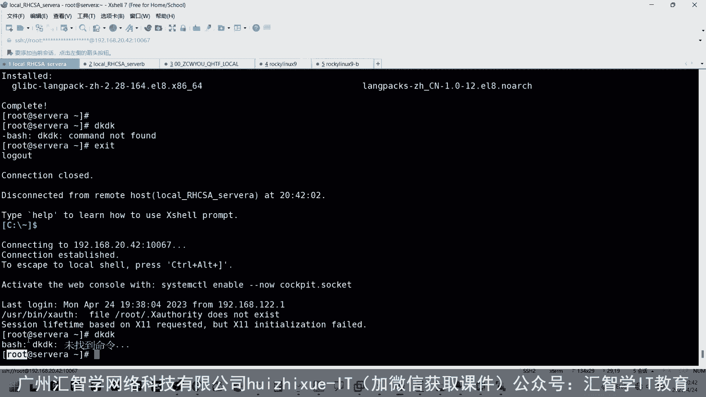

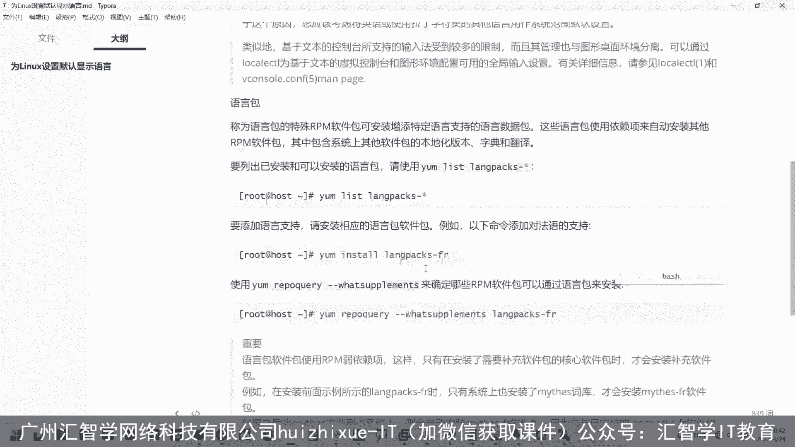

本节课中我们一起学习了为Linux系统设置默认显示语言的方法。我们掌握了使用 `localectl` 命令配置命令行区域设置，安装了必要的语言包，并了解了图形界面的设置路径。同时，我们也明确了语言设置是基于用户账户的特性以及中英文环境在问题排查上的利弊。现在，你可以根据自己的需求，为Linux系统配置合适的显示语言了。