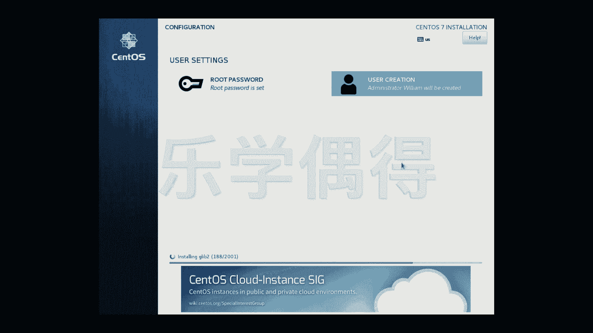

Linux系统安装与配置：P10：9.Linux安装系统参数设置2

在本节课中，我们将继续完成Linux系统的安装过程，重点配置网络、设置root密码以及创建用户账户。我们将一步步操作，确保系统能够正常连接网络并拥有必要的管理账户。

上一节我们完成了磁盘分区等关键设置，本节中我们来看看如何配置网络和用户账户。

### 网络与主机名配置

配置网络是安装过程中的重要一步，它允许虚拟机通过宿主机连接到互联网。

1.  在安装界面找到并点击 **“Network & Host Name”** 选项。
2.  将网络连接状态从“OFF”切换为 **“ON”**。
3.  此操作相当于在真实机器和虚拟机之间建立了桥梁，使虚拟机能够借助宿主机的网络进行上网。

网络配置完成后，即可开始系统安装。

### 开始安装与密码设置

启动安装过程后，我们需要同时设置系统最关键的管理员密码。

1.  点击 **“Begin Installation”** 开始安装系统。
2.  在安装进行的同时，点击 **“Root Password”** 设置root账户的密码。root账户是系统中权限最高的管理员账户。
3.  在输入框中设置密码，并重复输入以确认。
4.  密码设置完成后，点击完成退出。

### 创建用户账户

除了root账户，我们通常需要创建一个日常使用的普通用户账户，并可以赋予其管理员权限。

以下是创建新用户的步骤：

1.  点击 **“User Creation”** 创建新用户。
2.  在“Full name”字段填写用户全名（例如：William）。
3.  在“Username”字段填写登录用的用户名（例如：william）。
4.  勾选 **“Make this user administrator”** 选项，这将赋予该用户sudo权限。
5.  为该用户设置密码。
6.  点击“Advanced”选项可以查看详细信息，例如系统为该用户创建的**家目录（Home Directory）** 路径通常是 `/home/用户名`。
7.  完成所有设置后，点击完成。

### 完成安装

所有配置完成后，只需等待安装进程结束。

1.  系统安装进度条会持续运行。
2.  安装时间可能较长，请耐心等待。
3.  安装完成后，系统会提示重启。重启后即可进入新安装的Linux系统。

本节课中我们一起学习了如何为安装中的Linux系统配置网络、设置root超级用户密码以及创建具有管理员权限的普通用户账户。这些步骤是系统安装收尾的关键工作，确保了系统在首次启动后即具备网络连接能力和基本的管理功能。