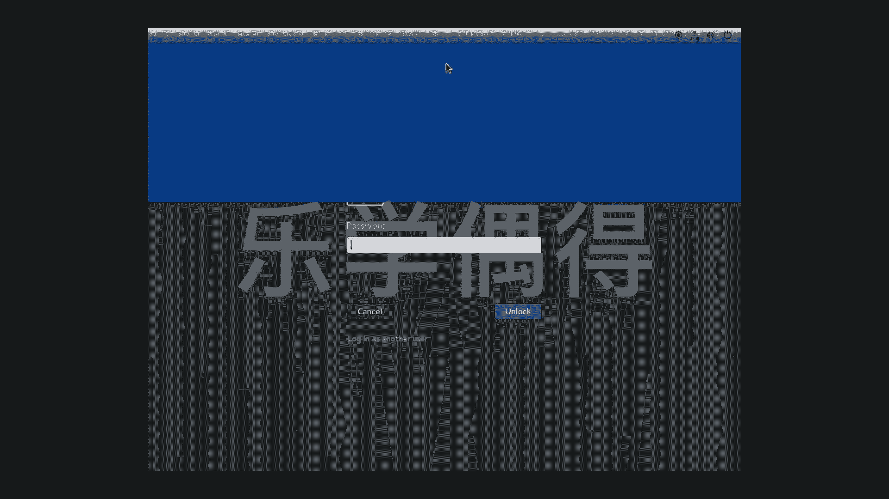
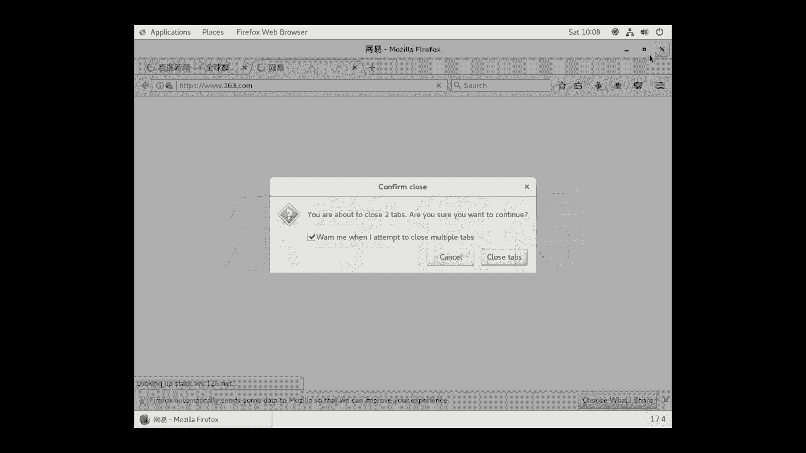
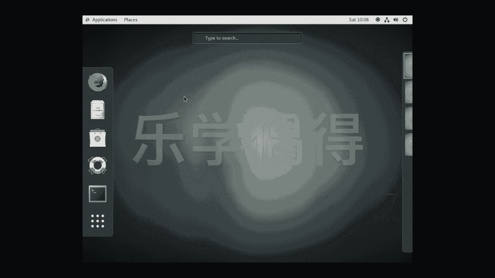
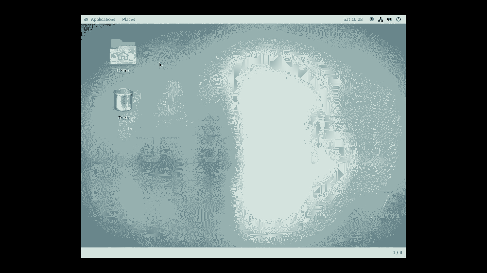
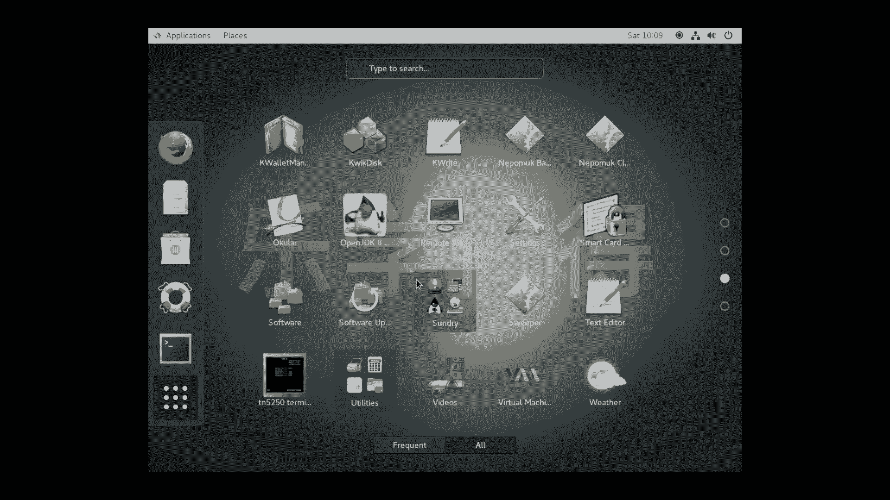
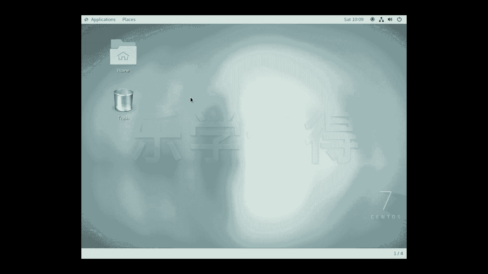
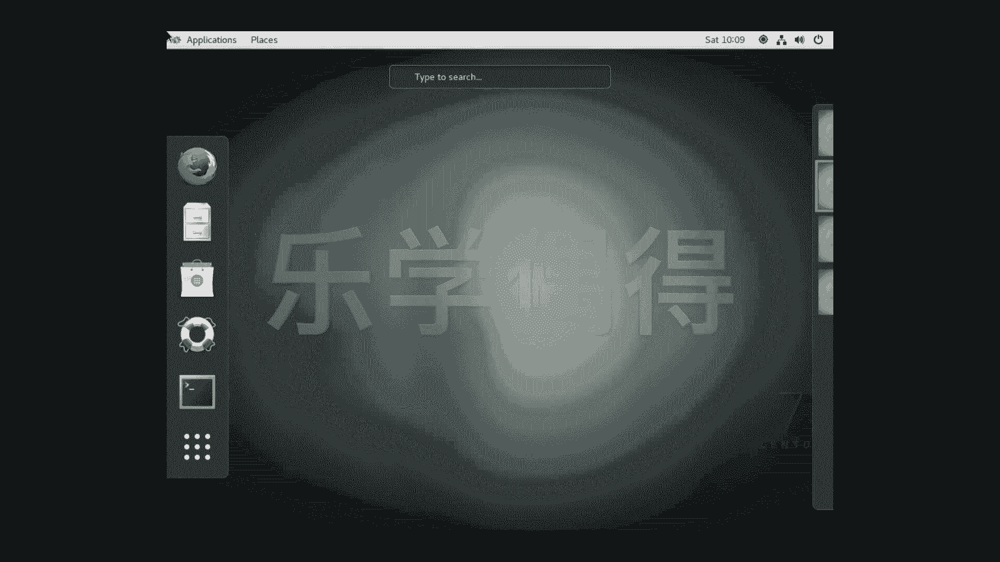
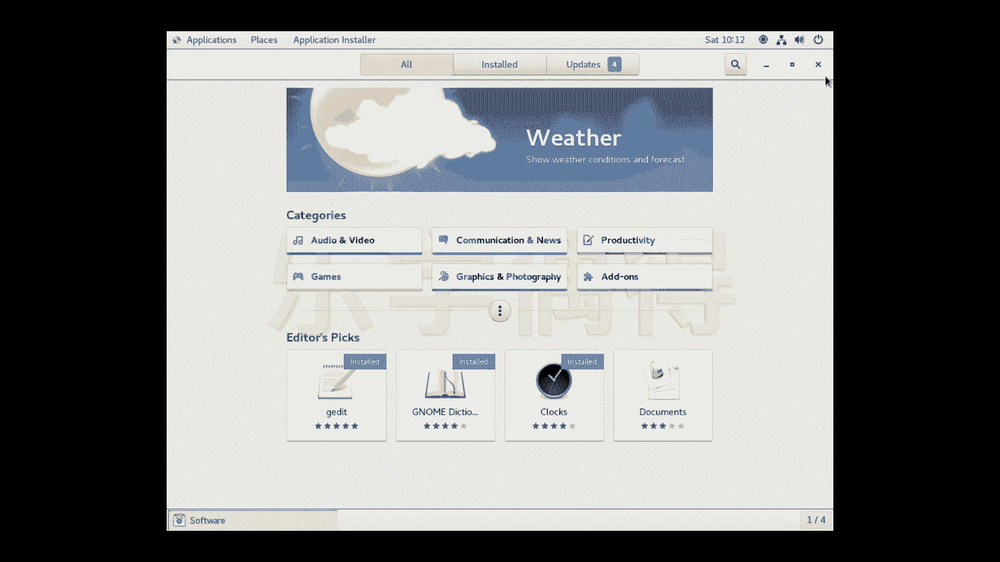

# 乐学偶得｜Linux云计算红帽RHCSA／RHCE／RHCA：P11：10.CentOS及Linux桌面GUI版本熟悉 🖥️

在本节课中，我们将要学习CentOS 7的桌面图形用户界面（GUI）版本。我们将熟悉其基本布局、常用功能以及如何安装应用程序，为后续学习命令行操作打下基础。

## 系统启动与登录 🔓

我们已经成功安装好CentOS 7操作系统。系统重启后，会进入登录界面。

点击屏幕并向上拖动，即可解锁登录界面。输入在安装过程中设置的用户名和密码，然后点击“Unlock”或按回车键，即可进入系统桌面。

## 桌面环境概览 🏠

进入的界面是CentOS 7的默认桌面环境。这个图形界面基于**GNOME**桌面环境构建。红帽企业版Linux（RHEL）、CentOS等发行版的桌面版本通常都采用此类界面。

该桌面环境的外观与Windows或macOS有相似之处。例如，点击左上角的“Activities”或按下`Super`键（通常是Windows键），可以打开概览视图。

## 文件管理与基本布局 📁

在概览视图中，左侧是应用程序启动器（Dock），中间是窗口预览和工作区切换器。

点击桌面上的“Home”文件夹图标，会打开文件管理器。其布局类似于macOS的Finder，包含`Home`、`Documents`、`Downloads`、`Music`、`Pictures`、`Videos`等常见目录。关闭窗口只需点击右上角的关闭按钮。

屏幕顶栏左侧有“Applications”（应用程序）和“Places”（位置）菜单。
*   **Places**：用于快速访问`Home`、`Documents`、`Downloads`等目录。
*   **Applications**：显示所有已安装的应用程序。`Favorites`（收藏夹）中会显示常用应用，例如Firefox浏览器。

## 网络测试与网页浏览 🌐

为了测试虚拟机网络是否正常，我们可以使用浏览器访问网页。

从`Favorites`中打开Firefox浏览器。浏览器会显示CentOS的欢迎页面。为了测试网络连通性，我们可以访问一个外部网站，例如百度。在地址栏输入 `www.baidu.com` 并访问。如果能成功打开网页，则证明虚拟机的网络配置正确，可以通过宿主机连接到互联网。

测试完成后，可以关闭浏览器窗口。

## 工作区与多任务处理 🔄

GNOME桌面支持**工作区（Workspace）**功能，用于高效管理多个窗口和任务。

将鼠标移动到屏幕左上角或按下`Super`键，进入概览视图。在视图右侧，可以看到当前所有的工作区（默认显示为1/4，表示共有4个工作区）。你可以：
*   将不同应用程序窗口拖动到不同的工作区。
*   使用 `Page Up` / `Page Down` 键或直接点击来切换工作区。
*   在每个工作区内独立运行和管理程序，实现任务分离。

## 软件安装与办公应用 📦

如果系统未预装所需软件，可以通过软件中心进行安装。

在`Applications`菜单的`Favorites`中，找到 **“Software”** （软件中心）。它类似于一个应用程序商店。在软件中心内，你可以浏览和安装各类软件，例如：
*   **Graphics & Photography**：图像处理和摄影软件。
*   **Productivity**：生产力办公软件。

对于日常办公需求，推荐安装 **LibreOffice** 套件，它是开源免费的办公软件，兼容Microsoft Office格式。
*   **LibreOffice Writer**：用于文字处理（类似Word）。
*   **LibreOffice Calc**：用于电子表格处理（类似Excel）。

安装方法很简单：在软件中心搜索到对应软件后，点击“Install”按钮即可。

## 命令行学习的过渡 💻

本节课我们演示的是CentOS的**桌面版（Desktop Version）**，它提供了可视化的操作环境，方便初学者熟悉系统。

在熟悉了图形界面的基本操作后，从下节课开始，我们将进入**命令行界面（CLI）**的学习。命令行是Linux系统强大与灵活的核心，我们将学习CentOS的基本特性和常用的命令行指令。

---

**本节课总结**：本节课我们一起学习了CentOS 7桌面图形界面（GNOME）的基本使用。我们了解了系统登录、桌面布局、文件管理、网络测试、工作区切换以及通过软件中心安装应用程序（如LibreOffice）的方法。这为我们接下来深入学习Linux命令行操作奠定了直观的基础。