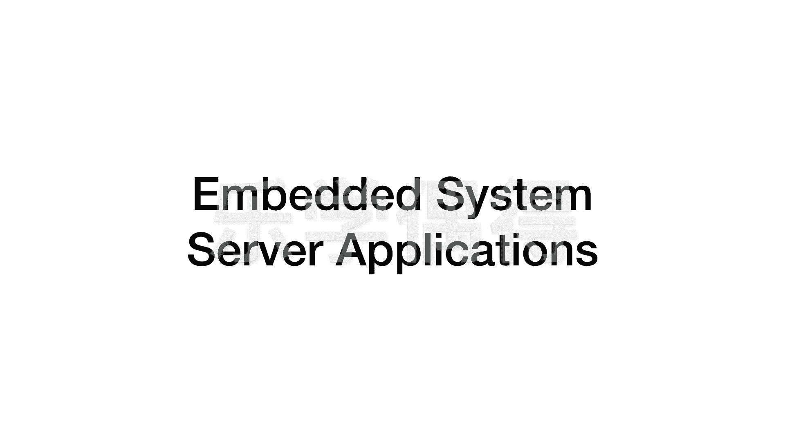

# 乐学偶得｜Linux云计算红帽RHCSA／RHCE／RHCA - P12：11.Linux运用最多的两个领域


在本节课中，我们将要学习Linux系统应用最广泛的两个核心领域。通过了解这些领域，你将明白为何Linux在专业和商业环境中如此重要。


在之前的课程中，我们介绍了如何在个人电脑上安装虚拟机，并在虚拟机中安装桌面版（Desktop）的Linux系统。我们使用的Linux发行版是CentOS，因为这个版本完全免费，并且其使用方法与企业级的Red Hat系统几乎完全相同。这为我们后续学习红帽认证（包括RHCSA、RHCE、RHCA）做好了准备。


然而，有些同学可能会产生疑问：Linux究竟强大在哪里？使用桌面版后，感觉它与macOS或Windows系统并无太大差异，甚至可用软件似乎更少。为什么在严肃的研究或商业服务器领域，大家仍然推崇Linux系统？这是因为我们尚未接触到Linux真正强大且应用极其广泛的一面。Linux主要不是用于个人电脑（个人桌面操作系统主要由macOS和Windows主导），而是应用于以下两个核心领域：**嵌入式系统**和**服务器应用**。


现在，让我们具体看看这两个领域。


## 嵌入式系统 🚀

嵌入式系统是指嵌入到更大设备或产品中的专用计算机系统。Linux因其开源、可定制和稳定的特性，在此领域应用非常广泛。


以下是Linux在嵌入式系统中的一些常见应用场景：
*   **智能家居设备**：如智能电视、路由器、物联网网关。
*   **移动设备**：Android操作系统的内核就是Linux。
*   **工业自动化**：工厂中的控制设备和机器人。
*   **汽车电子**：车载信息娱乐系统和高级驾驶辅助系统。


## 服务器应用 💻

服务器应用是Linux系统大放异彩的另一个主要舞台。目前，全球绝大多数企业级服务器都运行在Linux内核之上。


Linux在服务器领域备受青睐，主要基于以下几个关键优势：
*   **高稳定性与可靠性**：Linux服务器可以长时间持续运行而不需要重启。
*   **强大的安全性**：其开源特性使得安全漏洞能被快速发现和修复。
*   **优异的性能**：对系统资源（如CPU、内存）的利用率高，尤其在处理高并发请求时表现卓越。
*   **低成本**：系统本身免费，降低了企业的软件授权成本。
*   **高度的可定制性与灵活性**：管理员可以根据需要精确配置和裁剪系统。


一个典型的Linux服务器命令操作界面是**终端**，用户通过输入命令来管理系统。例如，查看当前目录下文件的命令是：
```bash
ls -la
```




本节课中，我们一起学习了Linux系统应用最广泛的两个核心领域：嵌入式系统和服务器应用。理解这两个领域，有助于你认识到Linux在当今技术世界中的基础性和重要性，也为后续深入学习和考取红帽认证奠定了认知基础。