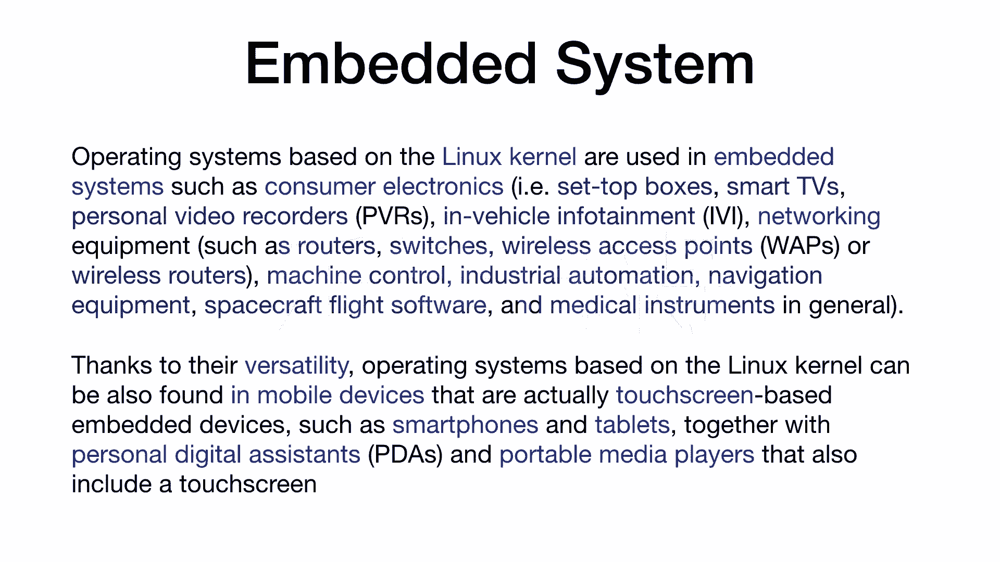
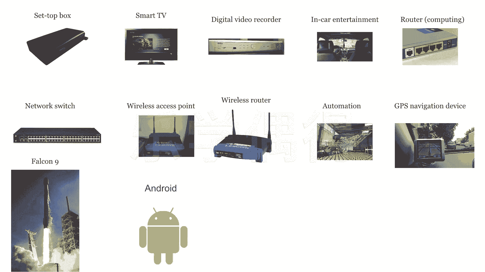

# 乐学偶得｜Linux云计算红帽RHCSA／RHCE／RHCA - P13：12.Linux嵌入式系统运用

## 概述
在本节课中，我们将要学习什么是嵌入式系统，并了解Linux在嵌入式系统中的广泛应用领域。

## 什么是嵌入式系统？
嵌入式系统是指那些将程序预先编写好并固化到硬件设备中的系统。这些系统通常嵌入在特定设备内部，用户后期无法轻易更改其程序。例如，电视机和路由器都属于嵌入式系统。

## Linux在嵌入式系统中的广泛应用
上一节我们介绍了嵌入式系统的概念，本节中我们来看看Linux内核在嵌入式领域的应用。Linux内核因其开源、稳定和可裁剪的特性，在嵌入式系统中得到了极其广泛的应用。

以下是Linux嵌入式系统应用的一些主要领域，这些领域渗透到我们生活的方方面面：

*   **机顶盒**：用于转换和传输电视信号的设备，其系统基于Linux。
*   **智能电视**：许多智能电视运行基于Linux内核的安卓系统。
*   **数字视频录像机**：用于录制和转换数字影像的设备。
*   **车载娱乐系统**：包括广播、多媒体播放、GPS导航和行车记录仪等。随着自动驾驶和人工智能的发展，车载娱乐与办公系统前景广阔。
*   **网络设备**：包括路由器、网络交换机、无线接入点等，其内部程序通常在Linux上开发。
*   **自动化设备**：例如机械臂和小型机器人，其控制单元常使用基于Linux的袖珍计算机。
*   **全球定位系统**：已成为汽车和智能手机的标准配置。
*   **航天设备**：例如美国猎鹰9号火箭，其控制系统也使用了Linux和C++。
*   **智能手机**：超过半数的安卓手机，其内核基于Linux。

通过以上介绍，我们可以明白学习Linux不仅对服务器管理重要，在嵌入式系统领域也同样关键。Linux底层知识有助于我们更好地学习Java、C++、Python等上层应用技术。随着物联网和智能设备的发展，Linux的应用必将越来越广泛。

## 总结
本节课中我们一起学习了嵌入式系统的定义，并详细了解了Linux内核在机顶盒、智能设备、车载系统、网络硬件乃至航天科技等多个嵌入式领域的核心应用。理解这些底层应用，将为后续的技术学习打下坚实基础。