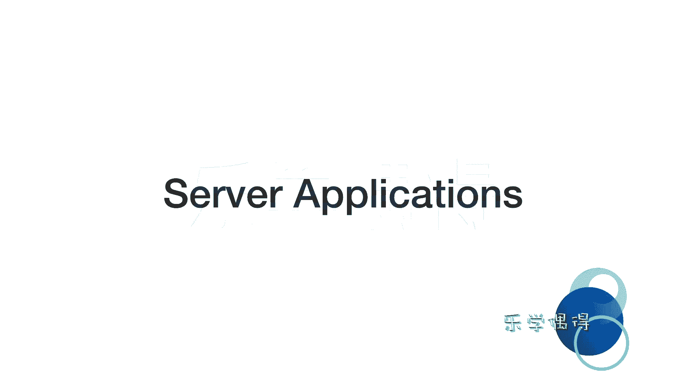

# 乐学偶得｜Linux云计算红帽RHCSA／RHCE／RHCA：P14：13.Linux服务器云计算方面的运用

在本节课中，我们将要学习Linux在服务器和云计算领域的核心运用。我们将了解为何Linux是服务器领域的首选，并解释服务器与客户端交互的基本原理。

上一节我们介绍了Linux在嵌入式系统中的广泛应用，本节中我们来看看Linux作为服务器的强大之处。

世界五百强企业超过90%的服务器都运行Linux系统。选择Linux作为服务器操作系统，主要原因是其**极其稳定**。个人计算机可能数周不关机，但服务器必须保证**24小时不间断运行**。如果服务器宕机，依赖它的网站和服务将无法访问。Linux内核以其高稳定性著称，这也是它被用于航天等关键领域的原因。同时，作为**开源**系统，全球开发者共同审查和完善其代码，使其安全性日益坚固。

我个人认为，云计算和将计算任务迁移到云端是未来的发展趋势。无论是运用人工智能、机器学习方法，还是进行大数据处理与运算，这些高耗能的任务最终都将依托云端完成。因此，掌握Linux服务器的基础知识，对未来的职业发展非常有帮助。

下面我们来讲解服务器应用的基本原理。

服务器，顾名思义，是为我们提供服务的设备。我们可以通过两张图来理解：一张展示了Facebook庞大的服务器集群；另一张是我们安装的CentOS 7操作系统桌面。

当我们在桌面打开浏览器（如Firefox）访问一个网站时，整个过程类似于拨打电话：
1.  我们的电脑（客户端）向存储网站数据的服务器发送一个访问**请求**。
2.  服务器持续**监听**网络请求，就像电话等待接听。
3.  服务器接收到请求后，会分析客户端需要什么信息。
4.  服务器将存储在本地（如HTML、图片等）的相应**数据**，通过互联网发送回我们的电脑。
5.  我们的浏览器接收到这些数据后，对其进行**解析**和**渲染**，最终呈现出我们看到的绚丽网页。

在这个交互模型中，有两个核心概念：
*   **IP地址**：可以理解为服务器的“电话号码”，用于在网络中唯一标识一台设备。
*   **端口**：可以理解为电话的“分机号”或“服务窗口”。一个IP地址（服务器）可以提供多种服务（如网页服务、邮件服务），每种服务通过不同的端口号来区分。客户端在联系服务器时，需要指定IP地址和具体的端口号，以获取正确的服务。

本节课中我们一起学习了Linux作为服务器的优势、服务器与客户端交互的基本流程，并引入了IP地址和端口这两个核心网络概念。理解这些基础知识，是进一步学习云计算和网络服务的起点。