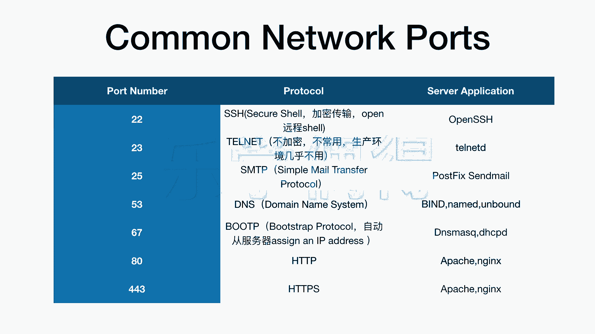

# 乐学偶得｜Linux云计算红帽RHCSA／RHCE／RHCA - P15：14.常见port端口及协议了解

## 概述
在本节课中，我们将要学习计算机网络中一些常见的端口号及其对应的协议与应用。了解这些基础知识，有助于我们理解网络服务是如何通过特定端口进行通信的。

上一节我们介绍了IP地址，它是网络中设备的唯一标识。本节中我们来看看端口，它是网络通信中用于区分不同服务的“门牌号”。

## 常见端口与协议详解
以下是互联网中约定俗成、通常不会更改的一些常见端口号、协议及其应用场景。

*   **端口 22**：该端口对应 **SSH** 协议。SSH 是一种安全的加密传输协议，常用于远程安全登录服务器、执行命令或进行加密的文件传输。其核心作用是建立安全的通信通道。
*   **端口 23**：该端口对应 **Telnet** 协议。Telnet 是一种不加密的远程登录协议。由于缺乏安全性，它在生产环境中已基本被SSH取代，现在多用于测试目的。
*   **端口 25**：该端口对应 **SMTP** 协议。SMTP 是简单邮件传输协议，广泛应用于电子邮件发送。例如，在手机或电脑上配置邮箱客户端时，就需要开启此协议以连接邮件服务器进行发信。
*   **端口 53**：该端口对应 **DNS** 协议。DNS 是域名系统，负责将我们容易记忆的域名（如 `www.example.com`）解析为服务器实际的IP地址。我们访问网站时通常不记IP地址，这个过程就由DNS服务完成。
*   **端口 67**：该端口对应 **DHCP** 协议。DHCP 是动态主机配置协议，其作用是让网络中的计算机能够自动从服务器获取IP地址等网络配置信息，实现即插即用。
*   **端口 80 与 443**：这两个端口分别对应 **HTTP** 和 **HTTPS** 协议。HTTP 是超文本传输协议，用于网页浏览；HTTPS 则是其安全版本，在HTTP基础上增加了SSL/TLS加密层，现在已成为网站传输数据的标准。我们常说的网站漏洞攻击，很多就与不安全的HTTP协议有关。

## 总结
本节课中我们一起学习了计算机网络中几个关键的端口号及其对应的协议，包括用于安全远程管理的SSH（22）、用于邮件发送的SMTP（25）、用于域名解析的DNS（53）、用于自动分配IP的DHCP（67），以及用于网页访问的HTTP（80）和HTTPS（443）。了解这些常见的端口与协议，是后续深入学习网络服务配置和管理的重要基础。目前大家只需对这些概念有初步印象，看得眼熟即可。