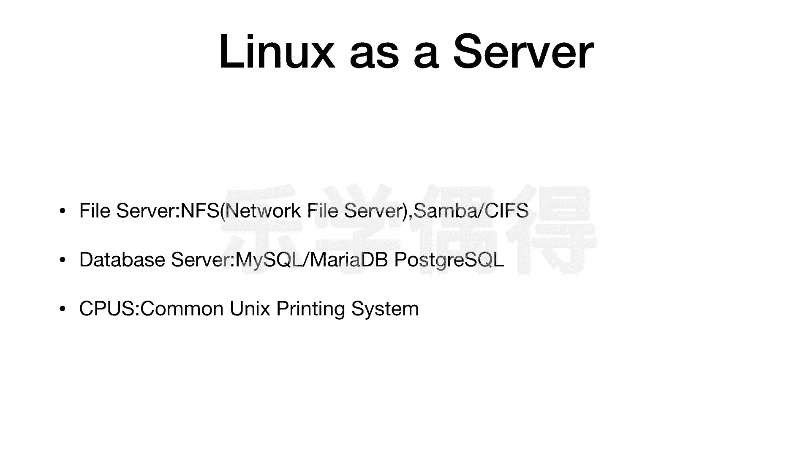

# 乐学偶得｜Linux云计算红帽RHCSA／RHCE／RHCA - P16：15.Linux作为服务器的运用

在本节课中，我们将要学习Linux操作系统作为服务器可以承担哪些角色。了解这些常见的服务器类型，有助于我们理解Linux在企业级环境中的广泛应用。

上一节我们介绍了端口的概念，本节中我们来看看Linux作为服务器的主要应用方向。

Linux作为服务器，主要可以应用于以下三个方面：

以下是Linux作为服务器的三种常见类型：

1.  **文件服务器**
    *   **NFS (Network File System)**：这是在Unix风格系统中非常常见的网络文件服务器。它允许在网络上进行文件传输。
    *   **Samba/CIFS (Common Internet File System)**：这是一个使用Microsoft的Server Message Block (SMB)协议的开源实现。它使得Linux服务器能够与Windows系统进行跨平台的文件共享和传输。

2.  **数据库服务器**
    *   **MySQL**：目前世界上最流行的开源数据库管理系统之一，现由甲骨文公司拥有。
    *   **MariaDB**：一个与MySQL高度兼容的数据库系统分支，并非甲骨文公司所有。
    *   **PostgreSQL**：一个功能更加强大和高级的开源对象-关系数据库系统。建议在掌握MySQL后再进行学习。

3.  **打印服务器**
    *   **CUPS (Common Unix Printing System)**：一个主要由苹果公司开发的开源打印系统。它可以被部署为远程打印服务器，处理网络打印任务。

由此可见，Linux作为服务器可以实现文件传输、数据库管理和网络打印等多种功能，其应用非常广泛。

在掌握了这些基础知识后，后续课程我们将介绍如何在Amazon AWS、阿里云等云平台上使用Linux进行云计算，将本地计算任务迁移到云端完成，这也是Linux的一个重要应用场景。

本节课中我们一起学习了Linux作为文件服务器、数据库服务器和打印服务器的三种主要应用，了解了NFS、Samba、MySQL、PostgreSQL以及CUPS等核心服务与协议，为后续的云计算学习打下了基础。

