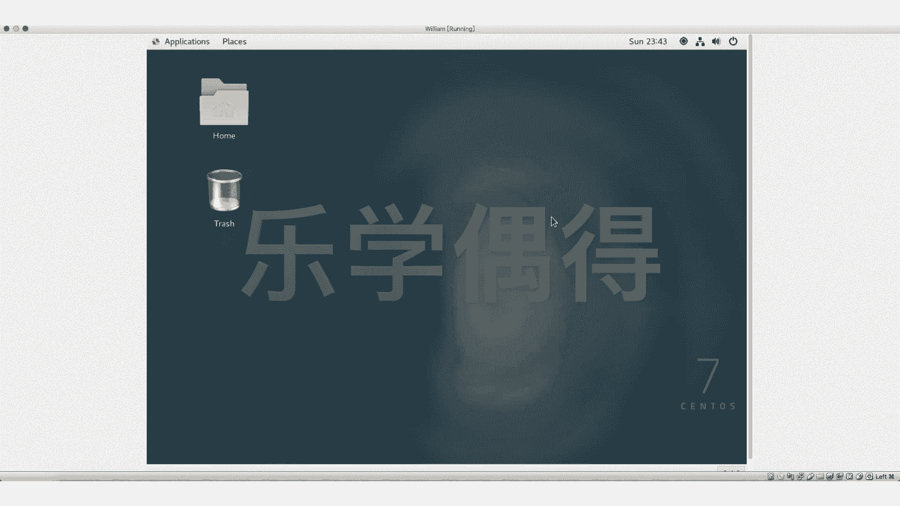

# 乐学偶得｜Linux云计算红帽RHCSA／RHCE／RHCA - P17：16. 如何从虚拟机中切换出来

在本节课程中，我们将学习一个非常基础但至关重要的操作：如何在虚拟机软件（如VirtualBox）中，将鼠标和键盘的控制权从虚拟机切换回宿主机（即你真实的电脑），以及如何再次切换回去。这对于初学者管理虚拟机至关重要。

有些同学在虚拟机安装好系统后，会立即开始操作。在操作过程中，点击虚拟机窗口后，可能会看到一串提示文字。

此时，用户可能会发现鼠标被限制在虚拟机窗口内，无法移动到外部。尝试按键盘，会发现键盘输入也被虚拟机捕获，无法与宿主机交互。这种情况通常会导致用户选择重启来解决。

遇到这种情况无需慌张。虚拟机软件提供了一个专用的“释放”按键来实现切换。

我们可以观察虚拟机窗口的右下角，通常会有一个按键提示。这个按键通常是宿主机特有的功能键，例如在Windows宿主机上可能是**右Ctrl键**，在macOS宿主机上可能是**左Command键**（即 `⌘` 键）。按下这个提示的按键，你会发现屏幕上出现了两个鼠标指针。

此时，那个可以自由移动的指针就是宿主机真实的鼠标，你可以将其移出虚拟机窗口，并对宿主机进行操作，例如调整虚拟机窗口大小。再次点击虚拟机窗口内部，或者按下相同的按键（有时显示为“Capture”），控制权又会被虚拟机捕获。

这相当于在**宿主机**和**虚拟机**两个环境之间进行切换。不同宿主机操作系统（如Windows、macOS、Linux）的切换按键可能不同。

以下是关键的操作步骤总结：

1.  **观察提示**：进入全屏或鼠标被捕获后，首先查看虚拟机窗口右下角的按键提示。
2.  **按下释放键**：根据提示，按下对应的按键（如右Ctrl、左Command等），即可将鼠标和键盘控制权释放回宿主机。
3.  **重新捕获**：需要操作虚拟机时，点击虚拟机窗口或再次按下提示的按键，即可将控制权交还给虚拟机。

需要特别注意，当控制权被虚拟机“捕获”（Capture）后，你的所有键盘输入都将被虚拟机系统接收，而不会对宿主机环境产生任何影响。

本节课中，我们一起学习了虚拟机与宿主机之间控制权切换的方法。核心是记住**观察虚拟机界面提示**并**使用正确的宿主功能键**（如 `右Ctrl` 或 `左Command`）进行切换。掌握这个技巧，你就能轻松地在虚拟机和真实电脑之间自由切换，避免因无法切换而重启的尴尬，为后续的Linux学习打下顺畅的操作基础。