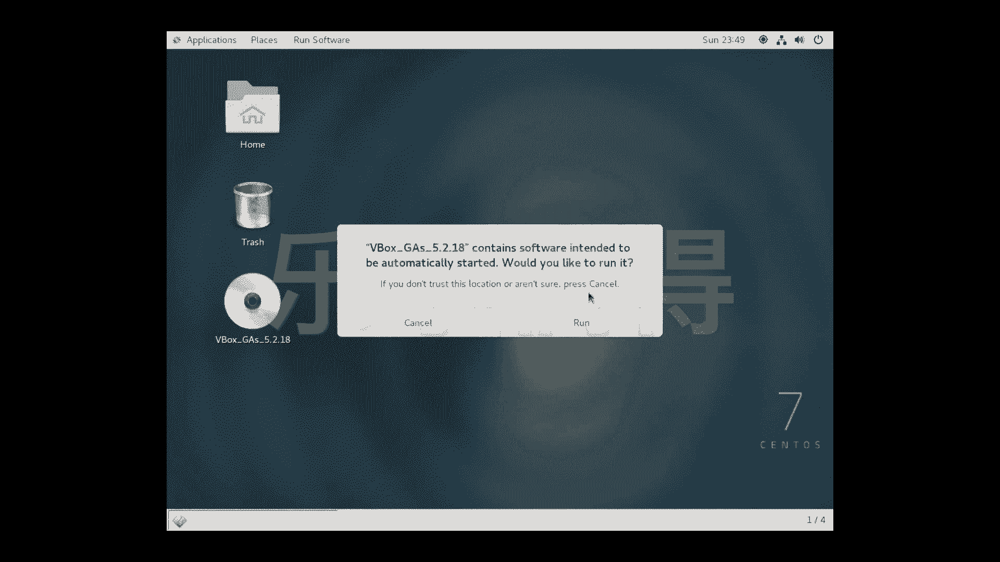
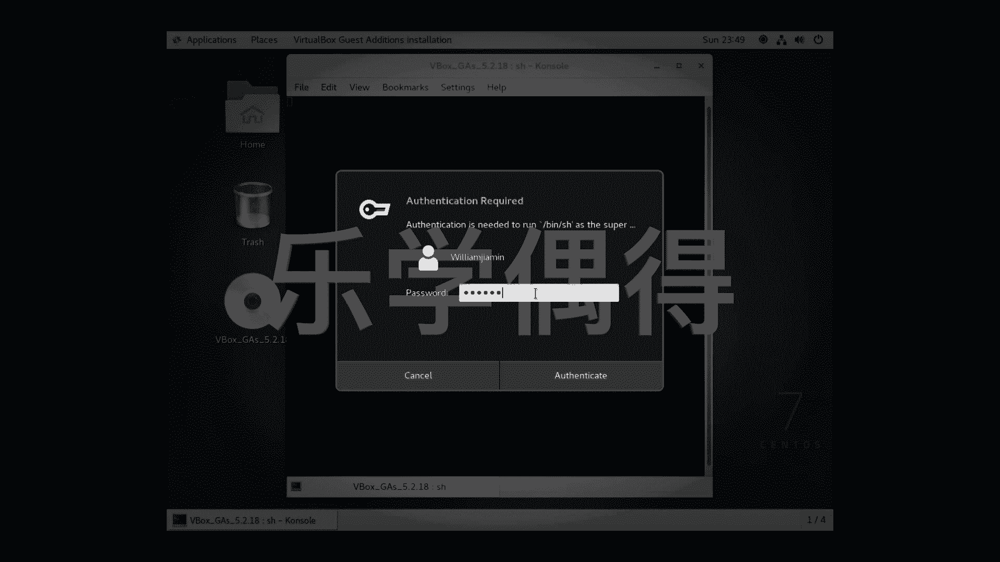
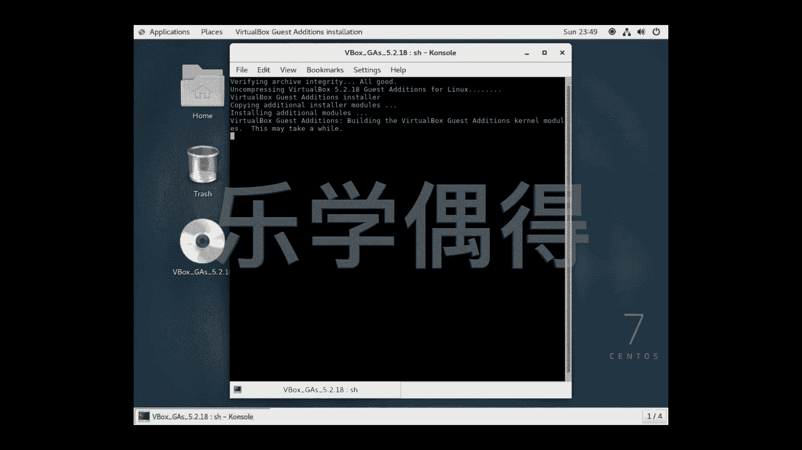
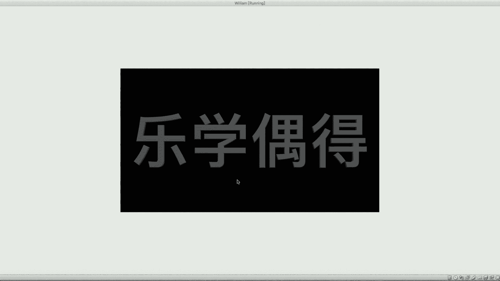

# 乐学偶得｜Linux云计算红帽RHCSA／RHCE／RHCA：P18：17. 外貌协会的福音 🖥️

在本节课中，我们将学习如何提升CentOS虚拟机在VirtualBox中的显示效果，包括安装增强功能以提高分辨率和改善桌面体验。

上一节我们介绍了虚拟机的基本操作，本节中我们来看看如何优化虚拟机的显示界面。

## 安装VirtualBox增强功能

首先，我们需要从VirtualBox主界面为虚拟机安装增强功能。操作步骤如下：

以下是具体步骤：
1.  在虚拟机窗口中，按下键盘上的 **`Esc`** 键，将鼠标焦点切换回宿主机。
2.  在VirtualBox软件顶部的菜单栏中，点击 **`设备(Device)`**。
3.  在下拉菜单中，选择 **`安装增强功能(Insert Guest Additions CD image...)`**。

完成上述步骤后，系统会提示检测到新光盘。

## 在虚拟机中运行安装程序

切换回虚拟机窗口，系统会弹出一个对话框，提示光盘包含可自动运行的软件。

以下是后续操作：
1.  在弹出的对话框中，选择 **`运行(Run)`** 以启动安装程序。
2.  根据提示，输入管理员（root）密码进行授权。
3.  等待安装过程自动完成。此过程可能需要一些时间。

安装完成后，关闭安装提示窗口。

## 重启虚拟机以应用更改

安装增强功能后，需要重启系统才能使更改生效。

操作步骤如下：
1.  点击虚拟机桌面右上角的电源按钮。
2.  选择 **`重启(Restart)`**。
3.  在弹出的对话框中，勾选 **`安装待处理的软件更新(Install pending software update)`** 选项。
4.  确认并等待虚拟机完成重启。

## 调整显示设置

重启后，虚拟机的桌面分辨率通常会自适应为最佳状态。如果显示比例仍不理想，可能是宿主机缩放设置的影响。

以下是检查和调整方法：
1.  再次按下 **`Esc`** 键切换至宿主机。
2.  在VirtualBox的 **`视图(View)`** 菜单中，找到 **`虚拟屏幕缩放(Virtual Screen 1)`** 下的 **`缩放比例(Scale Factor)`**。
3.  确保比例设置为 **`100%`**，以获得最清晰的显示效果。

调整完毕后，即可在优化后的高分辨率桌面环境中进行后续学习与操作。

本节课中我们一起学习了为VirtualBox中的CentOS虚拟机安装增强功能，从而显著提升显示分辨率和桌面体验。掌握这一技能，能让我们在更舒适直观的界面下高效学习Linux系统操作。