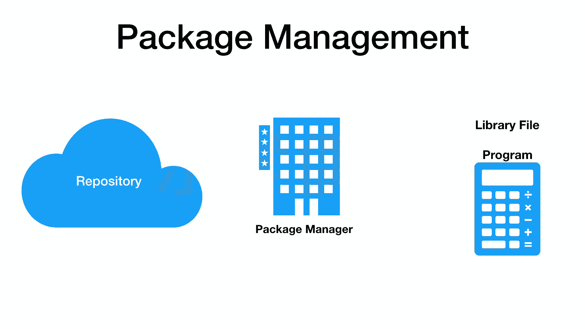
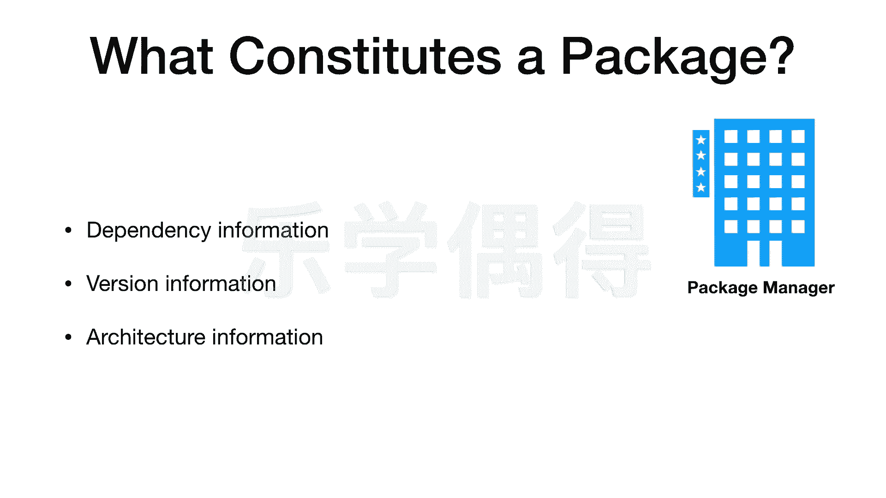
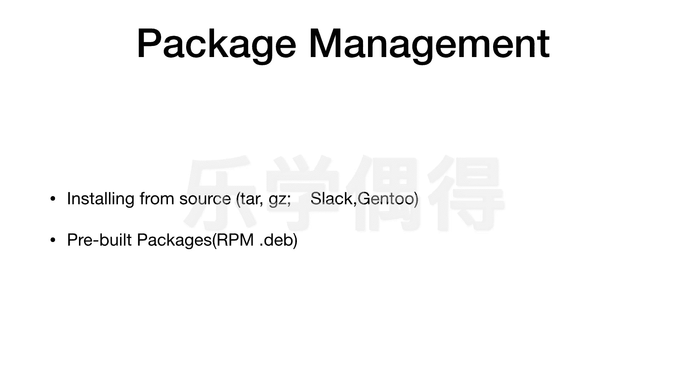
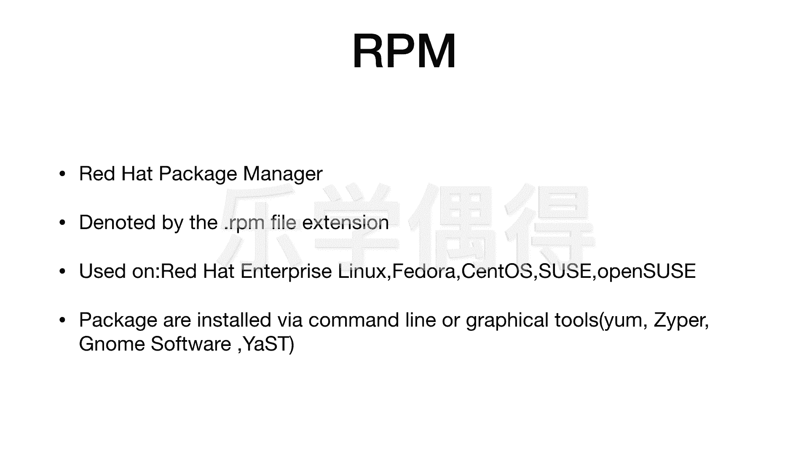
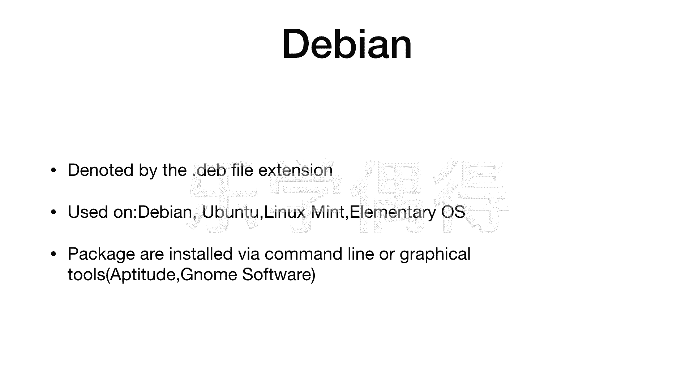

# 乐学偶得｜Linux云计算红帽RHCSA／RHCE／RHCA - P19：18.程序安装方法

在本节课中，我们将要学习Linux系统中的程序安装方法，即包管理。我们将了解Linux与Windows或macOS在软件安装上的区别，并介绍包、仓库和包管理器等核心概念。

Linux系统安装程序的方式与Windows或macOS不同。Linux采用包的概念。每个Linux发行版都有一个位于云端的仓库。仓库存储了该发行版所需的各种程序。当用户需要安装程序时，会向云端仓库发送请求，将程序包下载到本地。

电脑上有一个专门的包管理器程序。包管理器负责追踪电脑上已安装的包。当需要从仓库安装新包时，包管理器会识别并一同下载该包所需的依赖环境或程序。删除或更新程序时，也需要使用包管理器。

Linux系统的学习曲线最初可能较为陡峭，但熟悉后进步会非常快。本节课将从最简单的概念讲起，介绍包管理。

上一节我们介绍了包管理器的概念，本节中我们来看看包管理器管理的“包”具体包含哪些信息。

一个软件包主要包含以下三类信息：
*   **依赖信息**：指该软件包正常运行所需依赖的其他环境或文件。包管理器在安装时会自动识别并列出这些依赖项，并一并安装，这简化了环境配置。
*   **版本信息**：指该软件包的版本号，例如1.0.1版。
*   **架构信息**：指该软件包是为32位还是64位CPU准备的。

了解了包的基本信息后，我们来看看在不同Linux系统上进行包管理的主要方法。

在Linux上安装程序，有一种方法是从源代码直接安装，例如使用`.tar.gz`格式的压缩包。但这种方法使用较少，仅在Slackware和Gentoo等特定发行版中常见，因此不做展开。

目前主流使用的是预编译包。开发者已将程序打包好，用户可以直接通过特定格式进行安装。这主要分为两大体系：
*   **红帽体系**：以Red Hat为代表，包括CentOS、Fedora等。
*   **Debian体系**：以Debian为代表，包括Ubuntu、Linux Mint等。

本课程将着重介绍红帽体系，因为其拥有从系统管理员到架构师的完整职业认证路径。但鉴于Ubuntu等Debian系发行版也广泛应用，我们也会简要介绍。

首先介绍红帽体系的包管理方法。RPM的全称是Red Hat Package Manager。红帽体系的安装包通常以`.rpm`作为文件扩展名。

在Red Hat Enterprise Linux、CentOS或Fedora等系统上安装软件，通常使用RPM包。安装方式主要有两种：
*   通过命令行安装。
*   通过图形界面安装。

常用的命令行工具有`yum`（在CentOS/RHEL 7及之前）和`dnf`（在CentOS/RHEL 8及之后和Fedora中）。`zypper`命令则在SUSE和openSUSE中常用。

在图形界面中，常用工具有`GNOME Software`和`YaST`（主要用于SUSE/openSUSE）。本课程将以命令行操作为主进行演示。

接下来我们看看Debian体系的包管理。Debian系发行版，尤其是Ubuntu，在个人电脑和研究领域占有很大市场。

Debian系的安装包通常以`.deb`作为文件扩展名。常见的Debian系发行版有Debian、Ubuntu、Linux Mint等。

在Debian系统上安装软件，主要有两种方法：
*   通过命令行安装，最经典的是使用`apt`命令。
*   通过图形界面安装，通常使用`GNOME Software`等工具。

图形界面工具在不同发行版间有共通性。虽然具体命令稍有不同，但其本质是一致的。

本节课中我们一起学习了Linux程序安装的核心概念与方法。我们了解了Linux通过包、仓库和包管理器来管理软件，这与Windows/macOS直接运行安装程序的方式不同。我们还介绍了Linux两大主流发行版体系（红帽系和Debian系）在包管理上的区别与常用工具。掌握这些基础知识是后续进行具体软件安装和管理操作的前提。