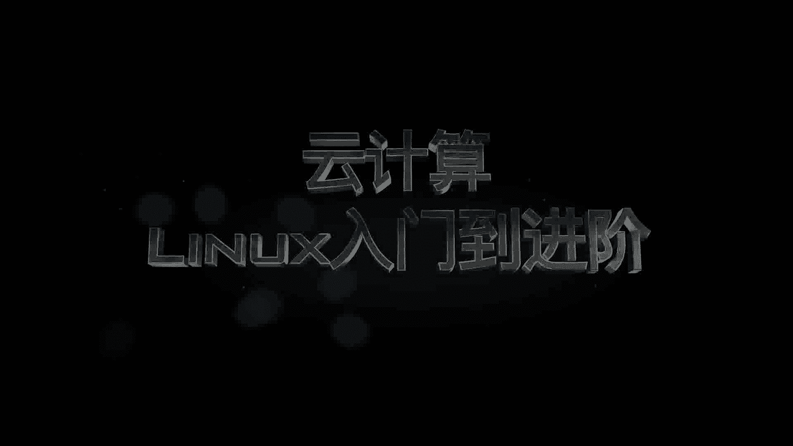
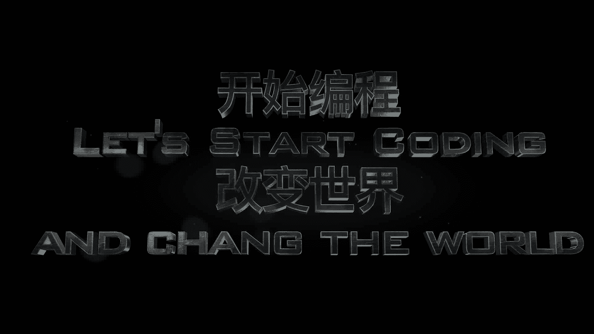

# 乐学偶得｜Linux云计算红帽RHCSA／RHCE／RHCA：P1：Linux介绍

在本节课中，我们将要学习Linux操作系统的基础知识，了解它为何成为当今云计算、大数据和人工智能领域的基石技术。课程将从互联网的发展历程讲起，逐步引导你认识Linux的重要性。

从1969年互联网诞生至今，已过去近半个世纪。这个世界已经得到了飞速的发展。我们见证了万物互联、智能家居、智能穿戴的兴起，并正在大数据时代的下半场探讨人工智能的可能性。

在这个日新月异的世界中，我们作为个人，该如何提升自己的能力呢？

大家好，我是微玉。乐学偶得致力于介绍前沿技术与各行业的结合点。在这一系列视频中，我们会跟大家介绍支持大数据与人工智能的基石技术——云计算中的Linux，内容将从零基础入门一直深入到红帽系统进阶。

---

## 为什么选择Linux？ 🐧

上一节我们概述了技术发展的背景，本节中我们来看看为什么Linux是学习云计算的关键。Linux是一个开源的操作系统内核，因其**稳定性**、**安全性**和**灵活性**，被广泛应用于服务器、嵌入式系统及超级计算机中。

以下是Linux成为技术基石的核心原因：

*   **开源与自由**：Linux遵循GPL协议，用户可以自由使用、修改和分发。这意味着巨大的社区支持和持续创新。
*   **稳定性与高效性**：Linux服务器可以长时间稳定运行，无需频繁重启，资源利用率高。
*   **安全性**：相比其他操作系统，Linux的权限管理和开源特性使其更少受到病毒和恶意软件的威胁。
*   **强大的命令行**：通过命令行界面（CLI），用户可以高效、精准地控制系统，这是自动化运维和开发的基础。
*   **云计算的事实标准**：绝大多数云服务平台（如AWS， Azure， Google Cloud）的基础设施都运行在Linux之上。

## 核心概念：Linux内核与发行版 🧩

理解了Linux的重要性后，我们需要厘清两个核心概念：“Linux内核”与“Linux发行版”。简单来说，**Linux内核**是系统的核心，负责管理硬件、内存和进程。而**Linux发行版**则是内核加上一系列软件包（如桌面环境、工具集）构成的完整操作系统。

它们的关系可以用一个简单公式表示：

**Linux发行版 = Linux内核 + GNU工具 + 软件包管理系统 + 可选桌面环境**

常见的Linux发行版主要分为几个系列，以下是主要的分类：

*   **Red Hat系列**：以企业级稳定著称，包括**RHEL**、**CentOS**和**Fedora**。本课程将重点围绕红帽认证体系展开。
*   **Debian系列**：以软件包丰富和稳定性闻名，包括**Debian**、**Ubuntu**。
*   **Arch Linux系列**：追求极简与前沿，采用滚动更新。
*   **其他发行版**：如**openSUSE**、**Linux Mint**等，各有特色。

## 学习路径：红帽认证体系 📚

对于希望在企业IT基础设施领域发展的学习者，红帽认证是极具价值的资质。接下来，我们了解一下红帽的认证路径。

红帽认证主要分为三个等级，以下是各级认证的简要介绍：

1.  **RHCSA**：红帽认证系统管理员。这是入门级认证，证明你具备执行Linux系统核心管理任务的能力。
2.  **RHCE**：红帽认证工程师。这是中级认证，在RHCSA基础上，证明你具备配置网络服务、安全等高级技能，并满足企业关键需求。
3.  **RHCA**：红帽认证架构师。这是专家级认证，需要在多个领域（如云计算、存储、自动化）通过深度考试，证明你具备设计和管理复杂企业环境的能力。

## 总结与展望 🚀

本节课中，我们一起学习了Linux操作系统的引言。我们从技术发展的浪潮谈起，理解了Linux作为云计算、大数据和人工智能基石的**关键地位**。我们明确了**Linux内核**与**发行版**的区别，并介绍了以**红帽系列**为代表的主流发行版。最后，我们展望了**RHCSA、RHCE、RHCA**这一专业的学习与认证路径，为后续的深入学习奠定了基础。

在接下来的课程中，我们将从最基础的安装与环境配置开始，一步步带你进入Linux的世界。