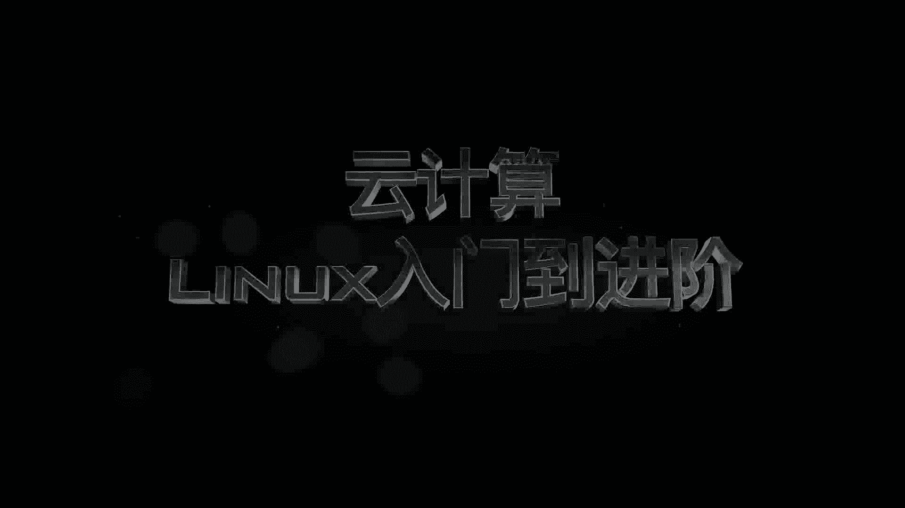
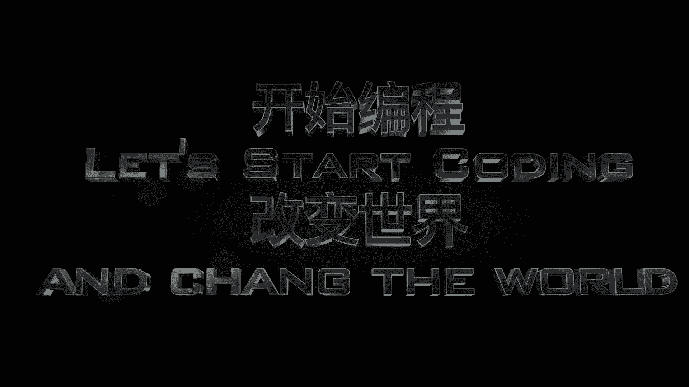

# 乐学偶得｜Linux云计算红帽RHCSA／RHCE／RHCA：P1：Linux介绍

在本节课中，我们将要学习Linux操作系统的基础知识，了解其重要性以及如何开始学习。我们将从时代背景出发，探讨个人技能提升的方向，并最终聚焦于Linux作为核心技术的关键作用。

## 时代背景与技术发展

从1969年互联网诞生至今，近半个世纪，这个世界已经得到了飞速的发展。

上一节我们回顾了技术发展的历程，本节中我们来看看当前技术发展的具体表现。

万物互联、智能家居、智能穿戴等技术已经普及。在大数据时代的下半场，我们开始探讨人工智能的可能性。

## 个人能力提升的方向

在这个日新月异的世界，我们作为个人，该如何提升自己的能力呢？

以下是提升个人技术能力的关键方向：
*   掌握支持现代技术栈的基石技术。
*   理解云计算等前沿领域的核心原理。
*   从零基础开始，系统性地学习一门关键技能。

## 课程内容与目标

大家好，我是微玉。乐学偶得介绍前沿技术与各行业的结合点。

在这一系列视频中，我们会跟大家介绍支持大数据人工智能的基石技术：云计算中的Linux，内容涵盖从零基础入门到红帽系统进阶。

本节课中我们一起学习了Linux课程的开篇介绍，了解了学习Linux对于把握云计算、大数据与人工智能时代机遇的重要性。我们明确了从基础到进阶的学习路径，为后续深入技术细节打下了基础。