# 乐学偶得｜Linux云计算红帽RHCSA／RHCE／RHCA：P20：19.实战操作如何安装httpd 🚀


在本节课中，我们将要学习如何在Linux系统中，通过命令行实战安装一个名为`httpd`的软件包。`httpd`是Apache HTTP服务器的核心程序，常用于搭建Web服务。我们将复习上一节学到的包管理知识，并完成从查找、确认到安装的完整流程。

上一节我们介绍了Linux中的包管理概念，本节中我们来看看如何具体应用这些命令来安装一个真实的软件。

## 安装准备与背景知识

我们不会使用图形界面进行安装，而是直接通过命令行操作，这更符合专业运维的习惯。我们使用的系统是CentOS 7，其包管理命令与红帽（RHEL）体系几乎完全一致。

在红帽体系的Linux中，最常用的安装命令是`yum`。它的名称源于一个历史项目“Yellow dog Updater, Modified”的缩写。了解这个背景有助于理解命令的由来，但并非学习的重点。

## 查找软件包

假设我们拿到一台全新的服务器，现在需要在这台服务器上安装Apache（`httpd`）来搭建Web服务。

首先，我们需要在软件仓库中查找是否存在我们需要的软件包。以下是查找`httpd`相关软件包的命令：

```bash
yum search httpd
```

执行该命令后，系统会从配置的镜像源（例如阿里云镜像）加载数据，并列出所有名称或描述中包含“httpd”的软件包。从结果中，我们可以找到目标软件包：`httpd.x86_64`。

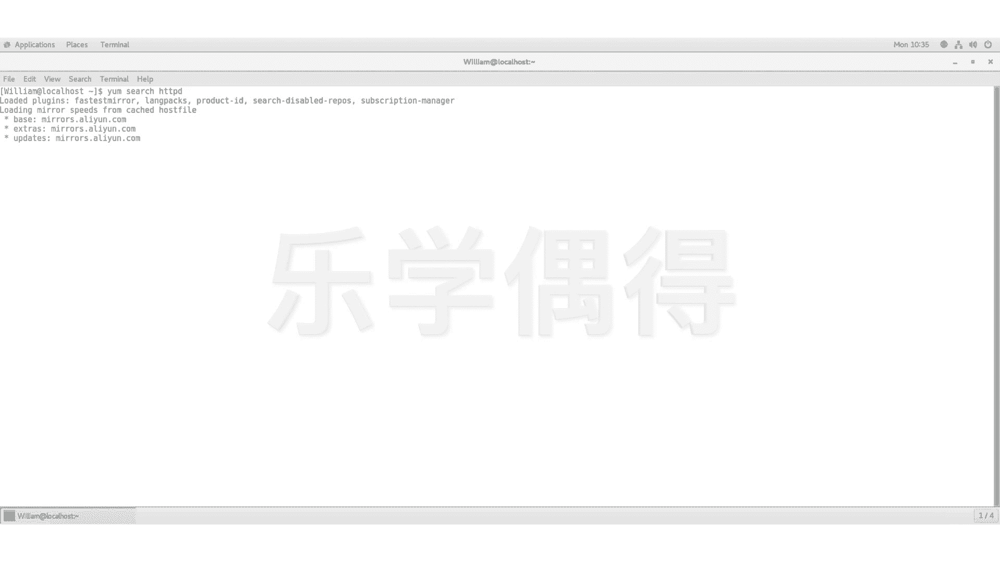

## 查看软件包详情

找到目标后，为了确认版本等信息是否正确，我们可以查看该软件包的详细信息。

以下是查看`httpd`软件包详细信息的命令：

```bash
yum info httpd
```

执行命令后，会显示包括软件包名称（Name）、架构（Architecture）、版本（Version）、来自哪个仓库（Repository）、大小（Size）以及功能描述（Summary）等详细信息。确认这就是我们需要安装的“powerful, efficient, and extensible HTTP server”后，即可进行安装。

## 安装软件包

确认无误后，我们就可以开始安装`httpd`软件包了。直接使用安装命令：

```bash
yum install httpd
```

然而，执行此命令时，系统可能会提示“You need to be root to perform this command”，这表示当前用户权限不足。在Linux中，安装软件通常需要管理员（root）权限。

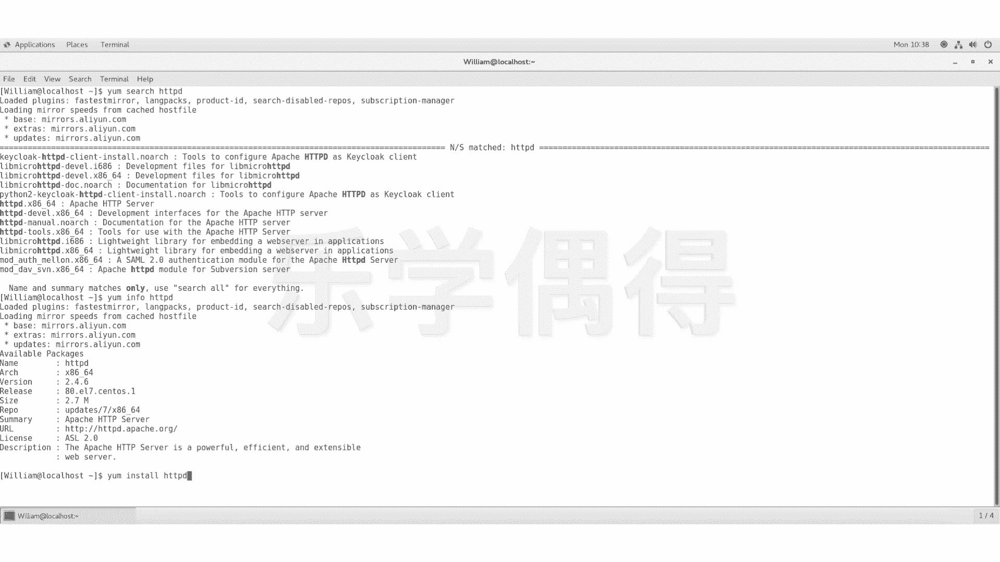

为了解决权限问题，我们需要在命令前加上`sudo`，它代表“superuser do”，即以超级用户身份执行后续命令。我们将在后续课程中详细讲解权限管理。

以下是使用`sudo`提权后进行安装的命令：

```bash
sudo yum install httpd
```

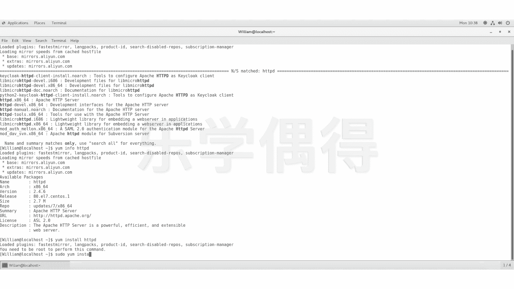

输入该命令后，系统会提示你输入当前用户（示例中为`willm`）的密码。输入正确的密码后，安装过程正式开始。

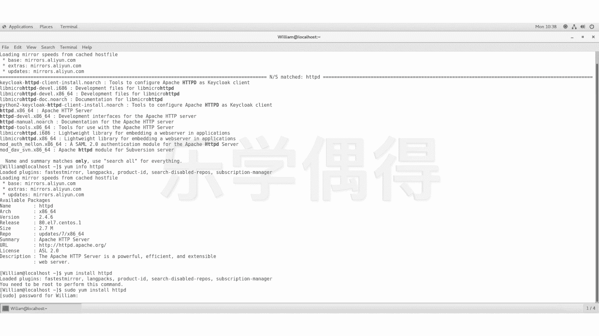

系统会显示将要安装的软件包详情，并询问是否确认安装（Is this ok [y/d/N]?）。此时，输入`y`并按回车键确认。

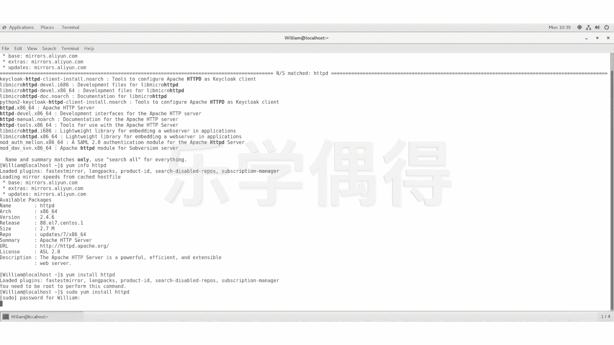

随后，系统会从仓库下载软件包，进行依赖检查和安装。请耐心等待安装完成。

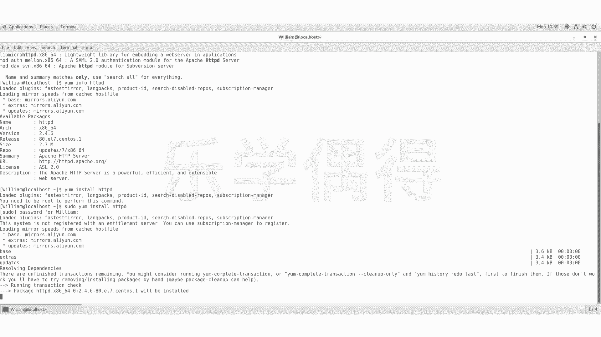

## 验证安装结果

安装完成后，我们需要验证`httpd`是否已成功安装到系统中。

以下是列出所有已安装的软件包，并筛选出`httpd`来确认安装结果的命令：

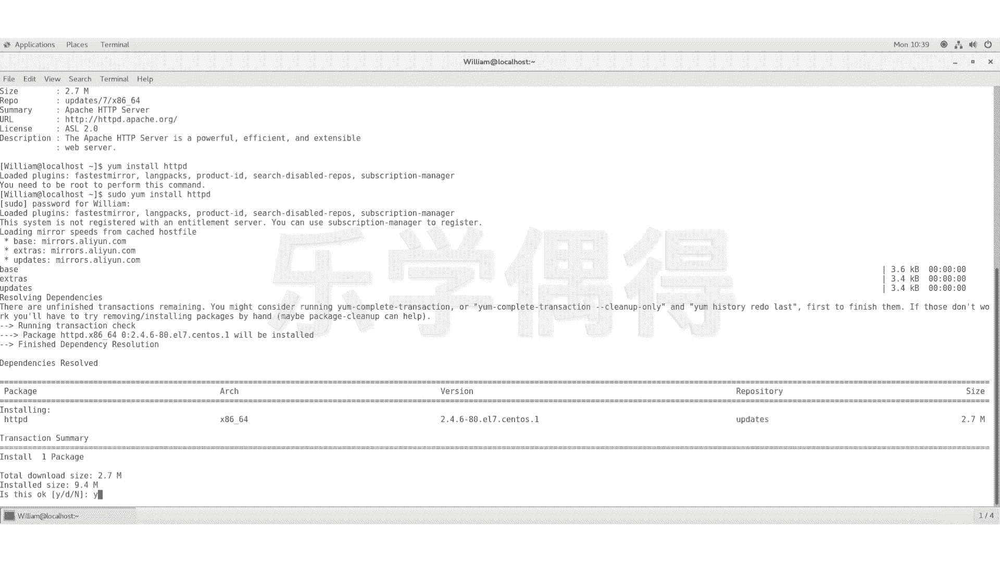

```bash
yum list installed | grep httpd
```

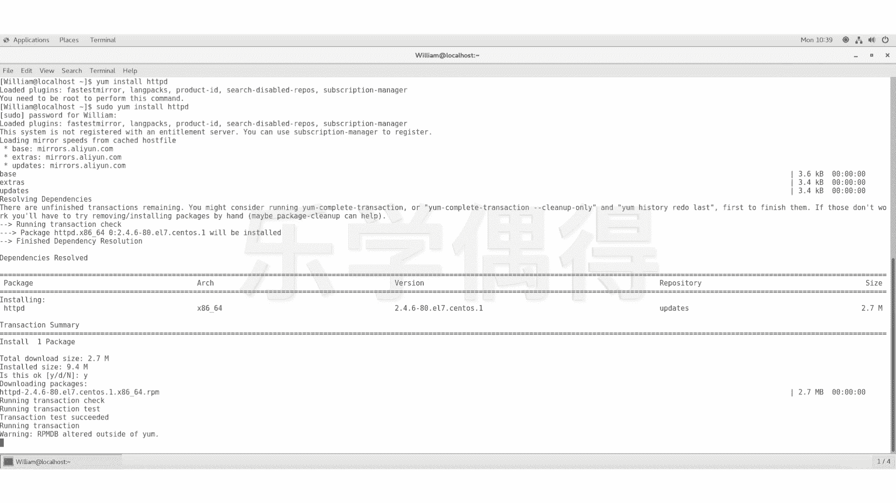

或者，直接列出指定的已安装包：

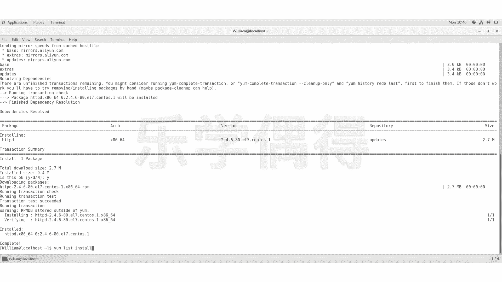

```bash
yum list installed httpd
```

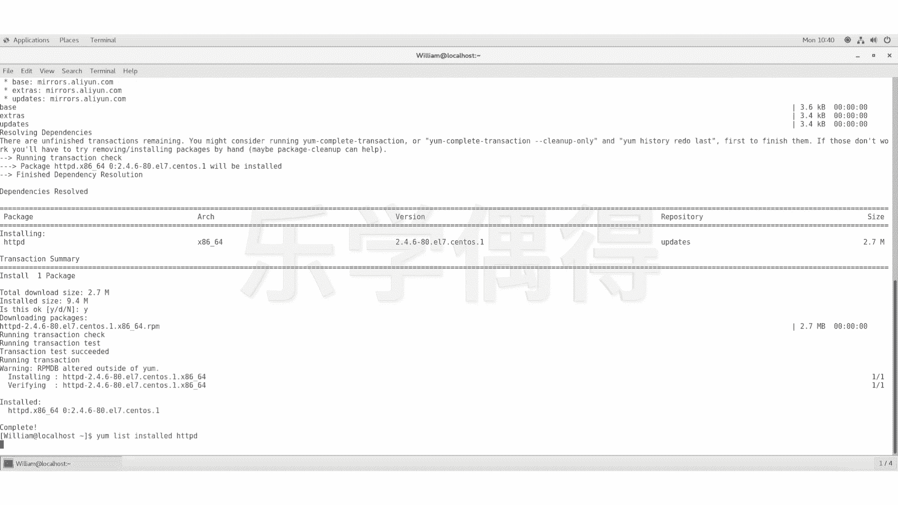

如果命令执行后能显示出`httpd`及其版本信息，则证明软件已经成功安装到系统中。

---

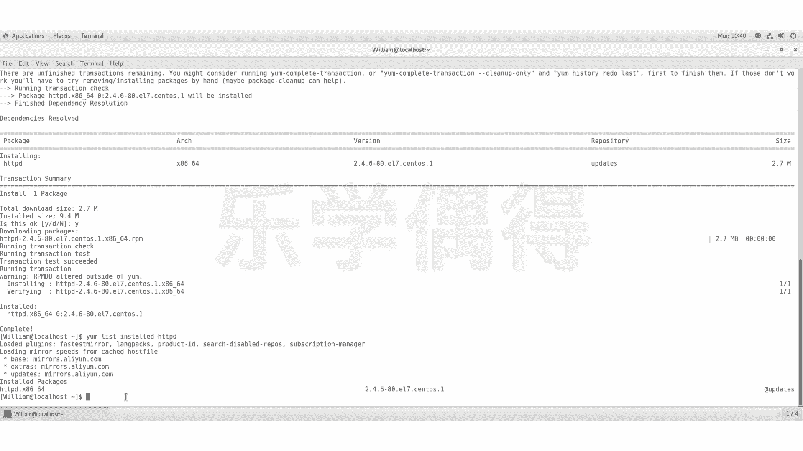

本节课中我们一起学习了在CentOS/RHEL系统上安装软件包的完整流程。我们首先使用`yum search`查找软件，然后用`yum info`确认详情，接着使用`sudo yum install`命令完成安装，最后通过`yum list installed`验证安装结果。这个过程巩固了上一节的包管理知识，并展示了命令行操作的高效与专业性。