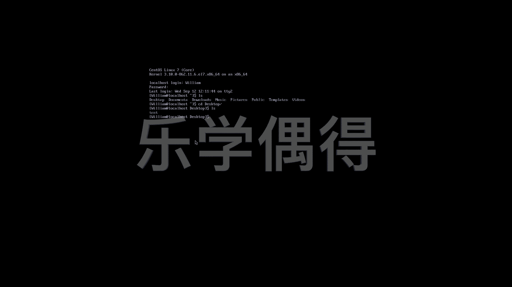

# Linux云计算红帽RHCSA/RHCE/RHCA - P22：21. 各种Terminal之间切换

## 概述
在本节课中，我们将学习如何在Linux系统的不同终端（Terminal）界面之间进行切换。这对于服务器运维和命令行操作至关重要，特别是当系统没有图形化桌面环境时。

---

## 图形界面与命令行
上一节我们介绍了Linux的基本概念，本节中我们来看看如何在不同界面间操作。Linux的桌面版本提供了图形化界面，所见即所得，用户可以像使用Windows或Mac系统一样进行直观操作。然而，对于服务器或某些特定需求，我们更多地需要在命令行界面（CLI）下工作。

## 模拟命令行操作
在图形化桌面环境中，我们可以打开一个模拟的命令行终端程序（如GNOME Terminal）进行操作。以下是一些基本命令的演示：

*   `pwd`：打印当前工作目录。
*   `ls`：列出当前目录下的文件和文件夹。
*   `cd [目录名]`：切换到指定目录，例如 `cd Desktop`。
*   `ll`：以详细列表形式列出目录内容。
*   `mkdir [文件夹名]`：创建新文件夹，例如 `mkdir test`。

## 切换到纯文本终端
我们的电脑不仅仅只有一个模拟终端。我们可以切换到完全独立的纯文本终端界面。这对于服务器环境是常态，因为图形界面可能不稳定且占用更多资源。

**切换方法**：按下组合键 **Ctrl + Alt + F2**。

此时，屏幕会切换到一个黑屏的登录界面。你需要输入用户名和密码进行登录。登录成功后，你将进入一个纯命令行的操作环境，可以执行所有与模拟终端相同的命令。

## 在不同终端间切换与同步
在纯文本终端中创建的文件或目录，在图形界面中同样可见，反之亦然。这说明所有操作都是在同一台电脑的同一文件系统上进行的，只是使用的终端界面不同。

以下是切换不同终端界面的方法：

*   **从图形界面切换到第N个文本终端**：按下 **Ctrl + Alt + F(N)**，其中N通常是2到6。
*   **从文本终端切换回图形界面**：按下 **Ctrl + Alt + F1** 或 **Alt + F1**（取决于系统配置）。
*   **在多个文本终端间切换**：例如，从`tty2`（按Ctrl+Alt+F2进入）切换到`tty3`，只需按下 **Alt + F3**。

你可以同时打开多个文本终端（如`tty2`， `tty3`， `tty4`），并在它们之间自由切换，每个终端都是一个独立的会话。

## 总结
本节课中我们一起学习了Linux系统下多种终端的使用与切换。我们了解了图形界面下的模拟终端，掌握了通过 **Ctrl + Alt + F1~F6** 组合键切换到不同纯文本终端（tty）的方法，并明白了所有终端操作都作用于同一系统环境。这是进行Linux系统管理和深入学习的必备基础技能。