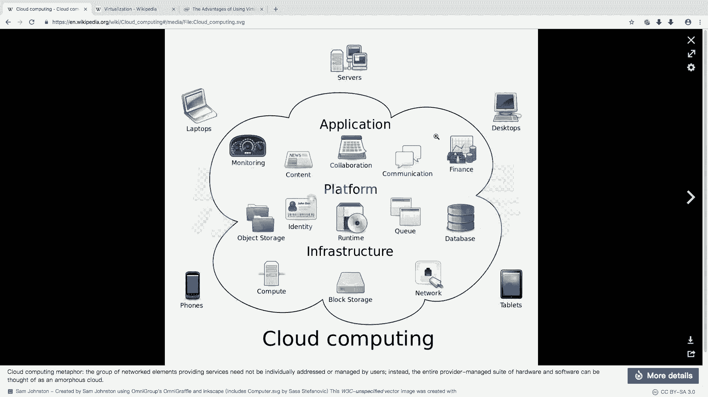
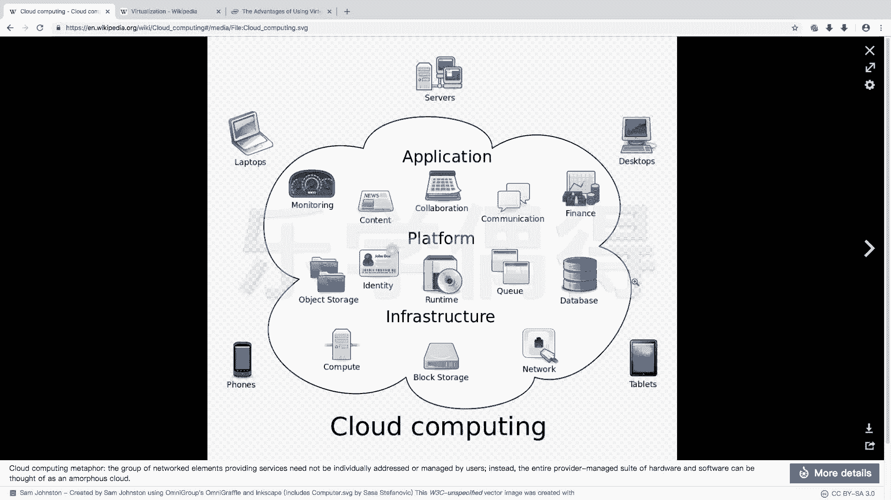
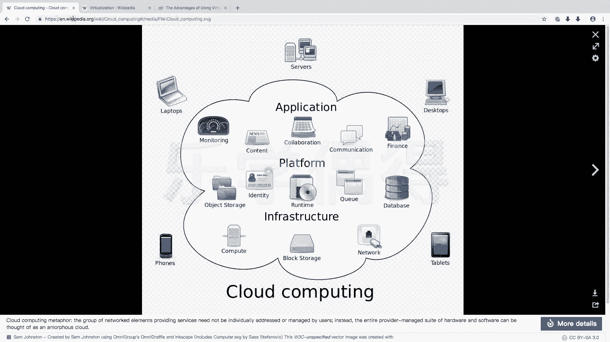
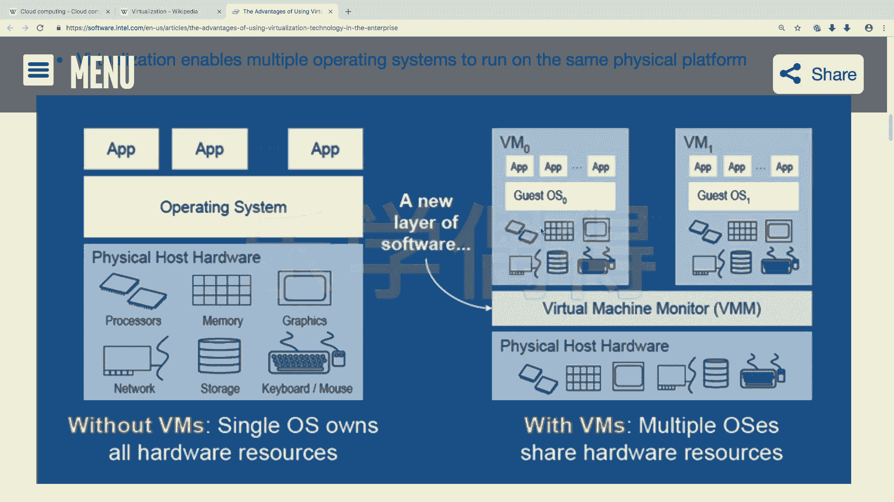

# 乐学偶得｜Linux云计算红帽RHCSA／RHCE／RHCA - P23：22.云计算与虚拟化知识补充


在本节课中，我们将要学习Linux应用非常广泛的两个重要领域：云计算与虚拟化。我们将分别介绍它们的基本概念、工作原理以及它们与Linux系统的紧密联系。

## 云计算 ☁️

上一节我们介绍了课程的整体内容，本节中我们来看看第一个核心概念：云计算。

云计算，即Cloud Computing，是一个被广泛提及的概念。在互联网早期，并没有“云”这个概念。但自从有了互联网，实际上就具备了云计算的基础。

云计算的核心思想是“There is no cloud”，即根本不存在所谓的“云”，它本质上是远程的、他人的计算机。传统模式下，用户在自己的主机上进行计算。而云计算将这些计算、存储等任务全部转移到云端进行处理。

例如，各种数据内容、存储服务和计算任务都被放置在云端。用户手中的设备，如个人电脑或手机，则成为一个终端。当用户需要查询信息或处理数据时，只需从终端向云端发送指令。云端的大型处理器集群会完成计算，并将结果直接返回给终端。

因此，用户手中的设备主要扮演了“显示屏”的角色。支撑这些云端处理器、服务器和基础架构的技术，在Linux系统中得到了非常广泛的应用。





## 虚拟化 💻

了解了云计算后，我们再来看看另一个重要概念：虚拟化。

虚拟化，即Virtualization。我们可以通过一个清晰的图示来理解它。最传统的计算机架构是：**物理硬件（Physical Hardware）** -> **操作系统（Operating System）** -> **应用程序（APP）**。应用程序建立在操作系统之上，而操作系统则直接运行在物理硬件之上。

虚拟化改变了这一架构。在虚拟化环境中，底层仍然是物理硬件。但在这之上，会运行一个**虚拟机监控器（Virtual Machine Monitor）**，类似于我们在个人电脑上安装的VirtualBox或VMware。在这个虚拟机监控器之上，可以创建出多个**虚拟硬件（Virtual Hardware）**环境。



这意味着，你可以在一台物理服务器上模拟出十几个、几十个甚至成百上千个虚拟的计算机硬件环境。然后，在每个虚拟硬件上安装独立的**客户操作系统（Guest OS）**，应用程序则运行在这些客户操作系统之上。

以下是虚拟化架构的简单表示：

```
传统架构：
物理硬件 -> 主机操作系统 -> 应用程序

虚拟化架构：
物理硬件 -> 虚拟机监控器 -> [虚拟硬件1 -> 客户操作系统1 -> 应用程序1]
                               [虚拟硬件2 -> 客户操作系统2 -> 应用程序2]
                               ...
```

这种架构带来了多重优势。首先，它相当于为系统增加了多层隔离和保护，安全性更高。其次，它能将一台物理服务器的资源高效地划分给多个虚拟操作系统使用，极大地提高了资源利用率。最后，虚拟机的创建、调整、迁移和删除都非常快速灵活，可操作性极强。

虚拟化技术也是Linux系统应用非常广泛的领域，并且被认为是未来重要的发展趋势。



## 总结 📝

本节课中我们一起学习了云计算与虚拟化的核心知识。

我们了解到，**云计算**的本质是将计算任务从本地终端转移到远程的大型处理中心，终端主要承担交互和显示的功能，其背后的基础设施大量依赖于Linux系统。

而**虚拟化**技术则允许在一套物理硬件上创建多个独立的虚拟计算机环境，每个环境拥有自己的虚拟硬件、操作系统和应用程序。这种技术提高了安全性、资源利用率和运维灵活性，同样是Linux生态中的重要组成部分。


理解这两个概念，是进一步学习Linux在现代化数据中心和云环境中应用的基础。