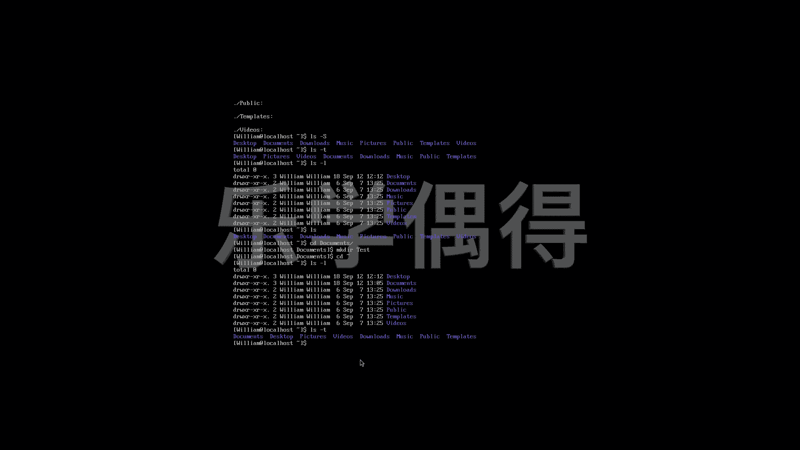

# Linux云计算红帽RHCSA/RHCE/RHCA：P24：23.ls命令的运用 📂

在本节课中，我们将要学习Linux系统中一个非常基础且重要的命令——`ls`。`ls`命令用于列出目录中的文件和子目录。我们将详细介绍它的各种选项，帮助你查看文件的详细信息、隐藏文件、递归目录结构以及按不同规则排序文件列表。

## 概述

上一节我们介绍了一些基本的命令。本节中，我们来看看`ls`命令的具体运用。`ls`是“list”的缩写，它可以列出当前工作目录下的所有内容。

## 详细列表模式

默认的`ls`命令显示的信息较少。我们可以使用`-l`选项来显示更详细的信息。

`ls -l`

执行此命令后，会列出文件的权限、所有者、所属组、大小、修改时间和文件名等信息。例如，用户`william`的主目录下会显示`Desktop`、`Documents`、`Downloads`等文件夹及其详细信息。

## 显示隐藏文件

在Linux中，以点`.`开头的文件是隐藏文件，默认的`ls`命令不会显示它们。使用`-a`选项可以显示所有文件，包括隐藏文件。

`ls -a`

将此命令与之前的`ls`命令对比，你会发现多出了一些以`.`开头的文件，这些文件在常规视图中是看不到的。

## 递归列出目录内容

如果你想查看一个目录及其所有子目录中的内容，可以使用`-R`选项。这个命令会递归地列出指定目录下的所有文件和子目录。

`ls -R`

例如，执行该命令后，它会显示`Desktop`、`Documents`等文件夹内的所有文件，并一直回溯，直到列出当前目录下的所有内容。

## 按文件大小排序

有时我们需要按文件大小来查看列表。使用`-S`选项可以按文件大小从大到小进行排序。

`ls -S`

这样，最大的文件会排在最前面，最小的文件排在最后。

## 按修改时间排序

如果你想查看最近修改过的文件，可以使用`-t`选项，它会按文件的修改时间进行排序，最新的排在最前面。

`ls -t`

为了更清楚地观察，我们可以结合`-l`选项查看具体时间。例如，如果你在`Documents`目录中新建了一个文件夹，那么该目录的修改时间就会更新。再次使用`ls -lt`命令，就能看到`Documents`排在了列表的最前面。

以下是按修改时间排序的示例步骤：
1.  进入`Documents`目录：`cd Documents`
2.  创建一个新目录：`mkdir test`
3.  返回上级目录：`cd ..`
4.  执行按时间排序的命令：`ls -lt`

此时，你会发现`Documents`目录因为刚刚被修改，而显示在列表顶部。

## 总结

本节课中我们一起学习了`ls`命令的多种用法。我们了解了如何列出详细文件信息、显示隐藏文件、递归查看目录结构，以及按文件大小或修改时间进行排序。掌握这些选项能帮助你更高效地浏览和管理Linux系统中的文件。