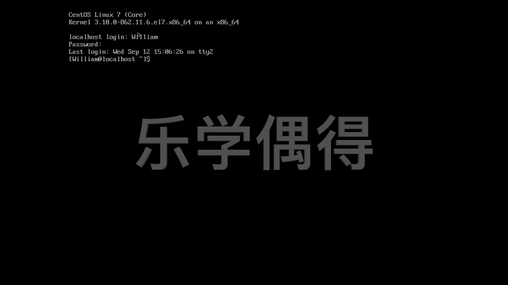

# 乐学偶得｜Linux云计算红帽RHCSA／RHCE／RHCA：P26：25.我是谁和如何切换用户 👤


## 概述
在本节课中，我们将要学习两个在Linux系统中非常基础且重要的操作：如何查看当前登录用户的身份，以及如何在不同的用户账户之间进行切换。这对于系统管理和日常使用都至关重要。

## 调整显示字体大小 🔍
有些同学可能觉得终端或桌面的字体太小，看不清楚。有一个快速调整的方法是直接放大显示比例。例如，可以将缩放比例（scale factor）调整为175%，这样页面就会变得非常大，便于观看。后续我们会介绍如何在命令行中进行更复杂的调整，但当前我们先通过放大来确保学习过程不受影响。

## 登录系统
现在，我们以用户“william”的身份登录到系统中。输入密码后，即可进入系统界面。

## 查看当前用户身份：`whoami` 🤔
在日常工作或学习后，有时会感到困惑，甚至开始思考“我是谁”这样的哲学问题。在Linux命令行中，你可以通过一个简单的命令来回答这个问题：`whoami`。

这个命令用于显示当前登录用户的用户名。当你输入`whoami`并回车后，系统会告诉你当前是以哪个用户的身份在操作。这对于系统管理员尤其有用，例如当你受邀到他人的系统上进行故障排查时，首先需要确认自己是以何种身份和权限登录的。

**命令示例**：
```bash
whoami
```
执行后，终端会显示当前用户名，例如 `william`。

## 切换用户身份：`su` 🔄
如果你发现当前是以“william”身份登录，但需要切换到另一个用户账户进行操作，可以使用 `su` 命令。`su` 是“substitute user”（替代用户）的缩写。

**命令格式**：
```bash
su [用户名]
```
例如，如果你想切换到名为“john”的用户，可以输入 `su john`。如果该用户存在且需要密码，系统会提示你输入对应用户的密码。输入正确密码后，你就会切换到该用户的会话环境。

如果指定的用户名不存在，系统会提示“用户不存在”（user does not exist）。

## 退出当前用户会话：`exit` 🚪
当你完成操作，想要退出（注销）当前用户会话时，可以使用 `exit` 命令。

**重要提示**：Linux命令是大小写敏感的（case-sensitive）。因此，必须输入小写的 `exit`，输入大写的 `EXIT` 是无效的。

输入 `exit` 并回车后，当前用户会话会立即结束。你会看到屏幕上快速闪过“logout”的提示，然后系统通常会返回到登录界面（如“localhost login”）。此时，你需要重新输入用户名和密码才能再次登录。

## 重新登录系统
从登录界面重新登录时，你需要输入用户名和密码。请注意，在输入用户名时，Linux系统通常不会显示任何提示（例如星号或圆点），这是Linux系统安全性的一个体现。如果攻击者连用户名都不知道，就更难尝试登录系统。

## 总结
本节课我们一起学习了Linux用户管理中的三个核心操作：
1.  使用 **`whoami`** 命令查看当前登录用户的身份。
2.  使用 **`su [用户名]`** 命令切换到其他用户账户。
3.  使用 **`exit`** 命令退出（注销）当前用户会话。



掌握这些命令能帮助你更好地理解和管理自己在Linux系统中的权限与会话状态，是进行系统管理和安全操作的基础。