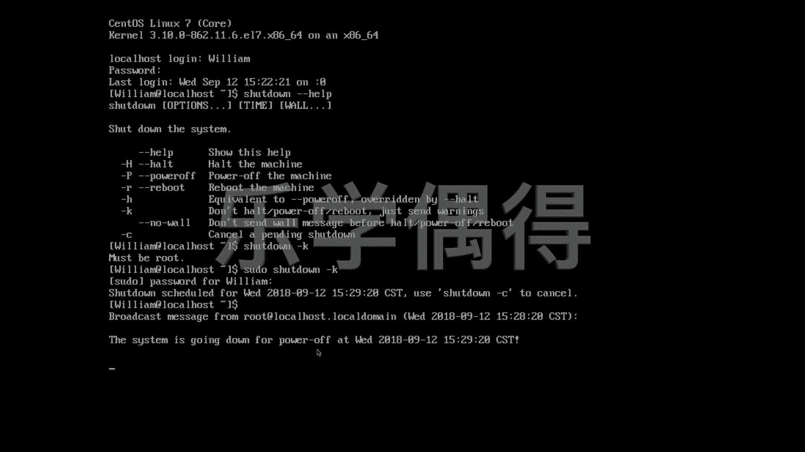

# 乐学偶得｜Linux云计算红帽RHCSA／RHCE／RHCA - P27：26.如何实用关机命令

在本节课中，我们将学习在Linux命令行界面下如何执行关机操作。我们将介绍几个常用的关机命令及其选项，并解释它们之间的区别。

## 关机命令简介

上一节我们介绍了系统的基本操作，本节中我们来看看如何安全地关闭系统。在命令行界面中，有多个命令可以实现关机功能。

## 常用关机命令

以下是三个最基础的关机命令：

*   **`halt`**：此命令会停止系统运行。其效果类似于让系统进入休眠状态。
*   **`poweroff`**：此命令会切断电源，是关机的一种直接方法。
*   **`shutdown`**：这是一个功能更丰富的关机命令，提供了多种选项来控制关机行为。

需要注意的是，执行这些命令通常需要`root`（超级用户）权限。如果权限不足，系统会提示你需要获得相应权限。

## shutdown命令详解

`shutdown`命令拥有许多选项，可以满足不同的关机需求。我们可以通过查看帮助文档来了解所有可用选项。

输入命令 `shutdown --help` 可以查看该命令的详细说明。

以下是`shutdown`命令的一些常用选项：

*   **`shutdown -H`**：此选项等同于执行 `halt` 命令，使系统停止运行。
*   **`shutdown -P`**：此选项等同于执行 `poweroff` 命令，进行关机断电。
*   **`shutdown -h`**：此选项的效果与 `-P`（即`poweroff`）相同，但权限要求可能更高。
*   **`shutdown -k`**：此选项不会真正关机，而是向所有用户发送一条警告信息（warning message）。
*   **`shutdown -c`**：此选项用于取消一个正在倒计时的关机计划。例如，如果你执行了一个定时关机的命令，可以使用此选项来取消它。

## 命令示例

现在，让我们通过一个例子来演示`shutdown -k`选项的用法。该命令会发送关机警告但不执行实际关机。

输入命令 `shutdown -k`。

系统提示“必须为root用户”（must be root），因此我们需要使用`sudo`命令来获取超级用户权限。输入命令 `sudo shutdown -k` 并输入密码。

执行后，系统会广播一条消息，例如：“系统将在预定时间关闭，使用 `shutdown -c` 命令可以取消此操作。”

本节课中我们一起学习了Linux下的关机命令。我们了解了`halt`、`poweroff`和功能强大的`shutdown`命令的基本用法，并通过`shutdown -k`选项演示了如何发送关机警告。记住，在执行实际关机操作前，请确保已保存所有工作。