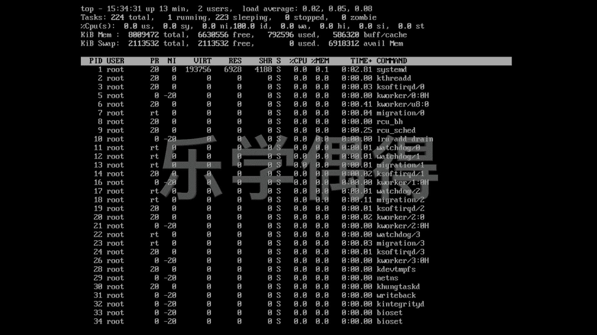
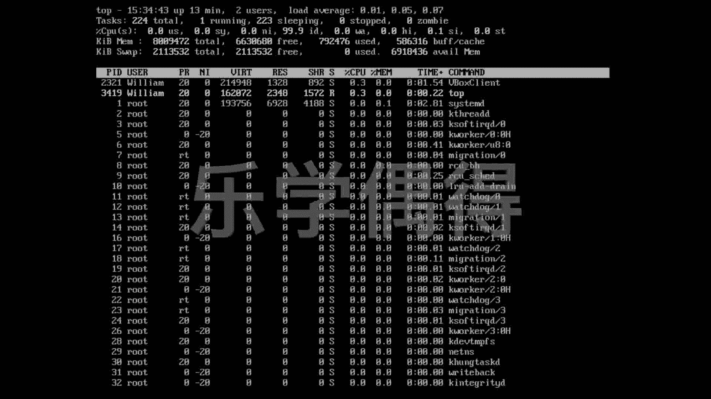
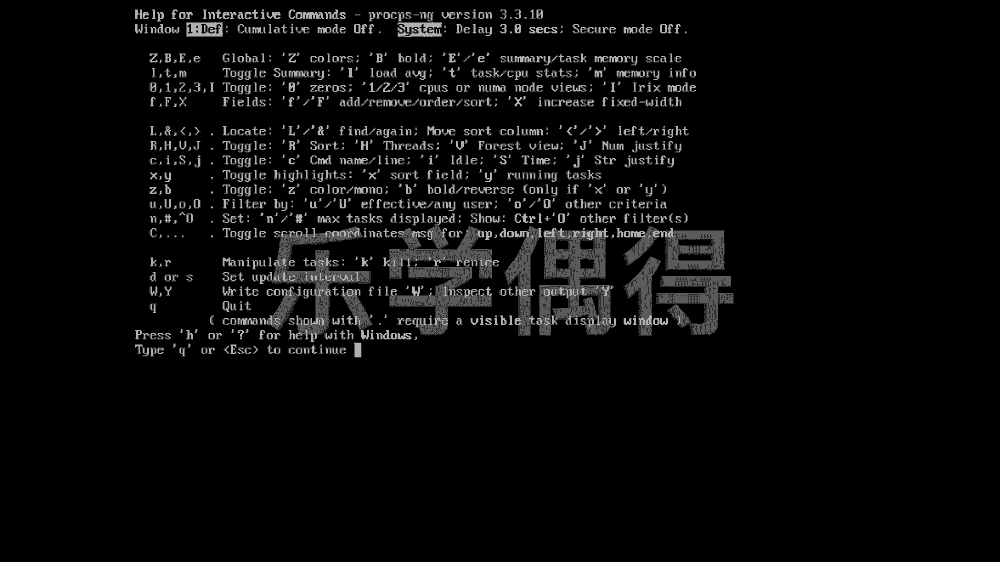
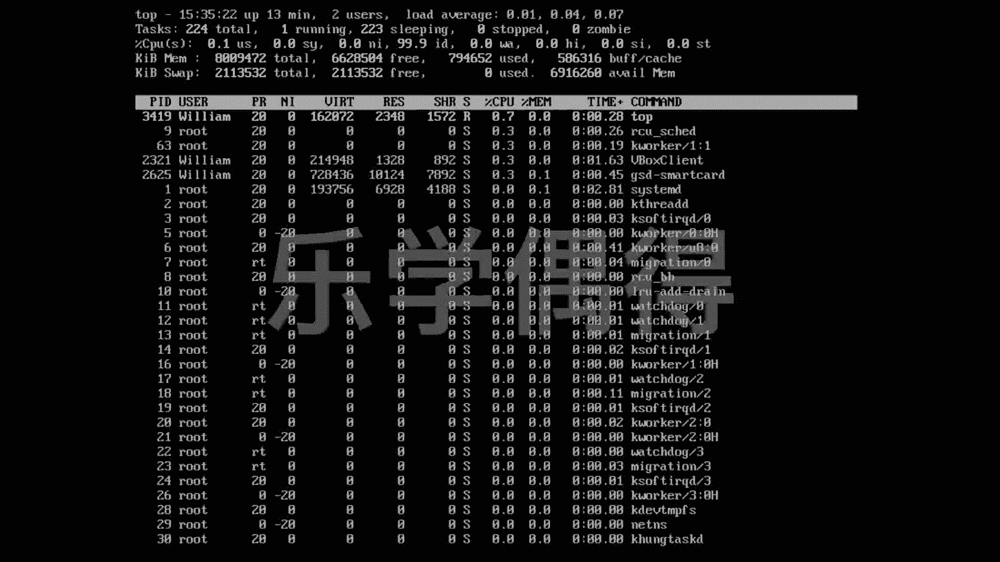
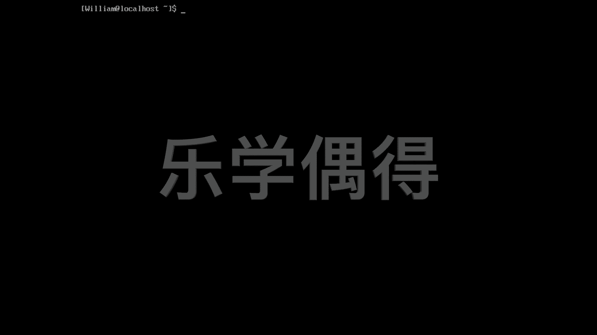

# 乐学偶得｜Linux云计算红帽RHCSA／RHCE／RHCA - P28：27. 使用top命令查看系统正在运行的程序 🖥️


在本节课中，我们将要学习一个非常实用的系统监控命令：`top`。这个命令能够动态地显示系统中正在运行的进程及其资源占用情况，是系统管理员进行性能监控和故障排查的重要工具。

## 概述

`top`命令可以实时显示系统中各个进程的运行状态，类似于Windows或macOS系统中的“任务管理器”或“活动监视器”。通过它，我们可以快速了解哪些程序占用了最多的CPU或内存资源。

## 使用top命令

在终端中输入 `top` 命令，即可进入其交互式界面。

```bash
top
```

执行后，屏幕会显示一个不断刷新的列表，其中包含进程ID（PID）、所属用户（USER）、CPU占用率、内存占用率等信息。这个界面实时反映了系统当前的负载情况。

## 解读top界面信息

上一节我们启动了`top`命令，本节中我们来看看界面中各项信息的含义。

初始的`top`界面可能信息繁多，但不必担心，后续课程会逐一详细介绍。目前，我们可以将其理解为一个动态的“资源管理器”，它能让我们看到后台所有正在运行的程序。

以下是界面中一些关键列的简要说明：
*   **PID**: 进程的唯一标识符。
*   **USER**: 启动该进程的用户。
*   **%CPU**: 该进程占用的CPU百分比。
*   **%MEM**: 该进程占用的内存百分比。
*   **COMMAND**: 启动该进程的命令名称。

## top命令的实用场景

`top`命令对于系统管理和安全监控极为有用。

例如，当你发现系统运行缓慢时，可以通过`top`快速定位到占用资源过高的进程。此外，在服务器安全方面，如果你发现一个不认识的用户（USER）在运行进程，或者某个未知进程持续占用大量资源，这可能意味着系统已被入侵。此时，你可以通过记录下的进程ID（PID）进行深入调查。



## 使用帮助与交互控制



在`top`的交互界面中，可以执行多种操作。如果你不清楚如何操作，可以随时调出帮助菜单。

只需在`top`运行界面中按下键盘上的 **`h`** 键，即可显示帮助信息。

以下是帮助页面提供的一些常用操作：
*   按 **`k`** 键：终止一个指定的进程。
*   按 **`上下箭头`** 或 **`PgUp`/`PgDn`** 键：滚动浏览进程列表。
*   按 **`M`** 键：按内存使用率排序进程。
*   按 **`P`** 键：按CPU使用率排序进程。

## 退出top命令

查看完毕后，需要退出`top`界面。

退出`top`命令非常简单。在交互界面中，直接按下键盘上的 **`q`** 键即可退出，并返回到终端命令行。

按下`q`后，动态更新会停止，界面将冻结。随后，你便会完全退出`top`程序，回到命令行提示符。

## 清理终端屏幕

退出`top`后，终端屏幕可能保留了之前的输出，显得杂乱。

如果你想获得一个干净的终端窗口，可以使用`clear`命令。



```bash
clear
```



执行`clear`命令后，所有之前的输出都会被清空，光标将回到终端窗口的第一行，方便你开始新的操作。



## 总结

本节课中我们一起学习了`top`命令的基本用法。我们了解到`top`是一个强大的实时系统监控工具，可以用来查看进程、排查高负载问题以及进行基础的安全检查。记住启动命令`top`、帮助键`h`、排序键`M`/`P`以及退出键`q`，你就能有效地使用这个工具来洞察你的Linux系统。