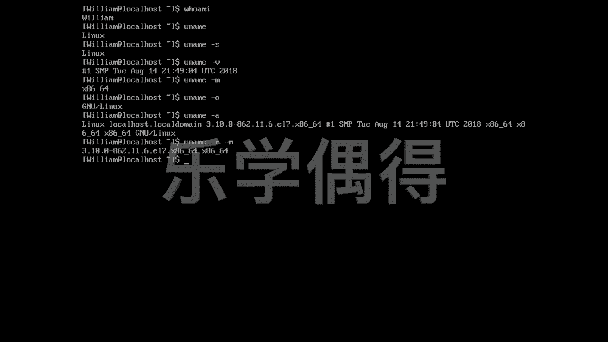

# 乐学偶得｜Linux云计算红帽RHCSA／RHCE／RHCA - P29：28.uname显示系统与机器信息 🖥️

## 概述
在本节课中，我们将要学习如何使用 `uname` 命令来查看系统与机器的相关信息。通过这个命令，你可以了解当前操作系统的内核名称、版本、硬件架构等关键信息。

## 教程内容

我们之前学过 `whoami` 命令，它可以帮助我们知道当前登录的用户是谁。除了知道用户身份，我们有时还想了解用户所在的整个系统环境是什么样的。这时，我们可以通过询问系统名字来获取信息。

因此，我们使用 `uname` 命令。输入 `uname` 后，系统会返回 `linux`，这证明我们整个操作系统的内核是 Linux 内核。

同样的，我们还可以使用 `uname` 命令加上 `-s` 选项，以这种方式也可以得到操作系统内核的名字。输入 `uname -s` 同样会返回 `linux`。

当然，我们还可以通过按向上的方向键，将上一条命令直接复制下来，这是一种快捷操作。

如果我们使用 `uname -v`，这里的 `v` 代表 `version`，这个命令会显示 Linux 内核的版本信息。

我们知道了内核信息，还需要了解机器的硬件信息。虽然我们的机器是虚拟机，但也可以查看。因为当前操作系统并不知道自己运行在虚拟环境中，它仍然会报告它认为的硬件配置。

因此，我们可以查看它认为的硬件类型。输入 `uname -m` 可以查看，结果显示为 `x86_64`，这表示它是一个 64 位的系统。这意味着虚拟机里的 Linux 系统运行在 64 位架构上，尽管它实际上是在 Virtual Box 虚拟机里。

我们还可以使用 `uname -o` 来查看操作系统的具体名称，结果显示为 `GNU/Linux`，这同样是 Linux 操作系统。

与其逐个查看，不如一次性显示所有信息。输入 `uname -a` 可以一次性显示以上所有的系统信息。

而且，我们还可以选择性地显示部分信息组合。例如，如果我们既想显示内核版本号，又想显示机器类型，可以使用 `uname -r -m` 这样的组合命令。

这样，当别人询问你具体在什么版本和架构上运行时，你就可以按照自己想要显示的信息，将这些选项组合在 `uname` 命令后，按下回车，以下的信息就是你想要查询到的信息。

以下是 `uname` 命令常用选项的总结列表：

*   `uname`：显示内核名称。
*   `uname -s`：显示内核名称（与不加选项效果相同）。
*   `uname -v`：显示内核版本。
*   `uname -m`：显示机器硬件架构。
*   `uname -o`：显示操作系统名称。
*   `uname -a`：显示所有系统信息。
*   `uname -r -m`：组合显示内核版本和机器架构。

## 总结
本节课中，我们一起学习了 `uname` 命令的用法。通过这个命令，我们可以方便地查询 Linux 系统的内核信息、版本、硬件架构等关键数据，这对于系统管理和故障排查非常有帮助。