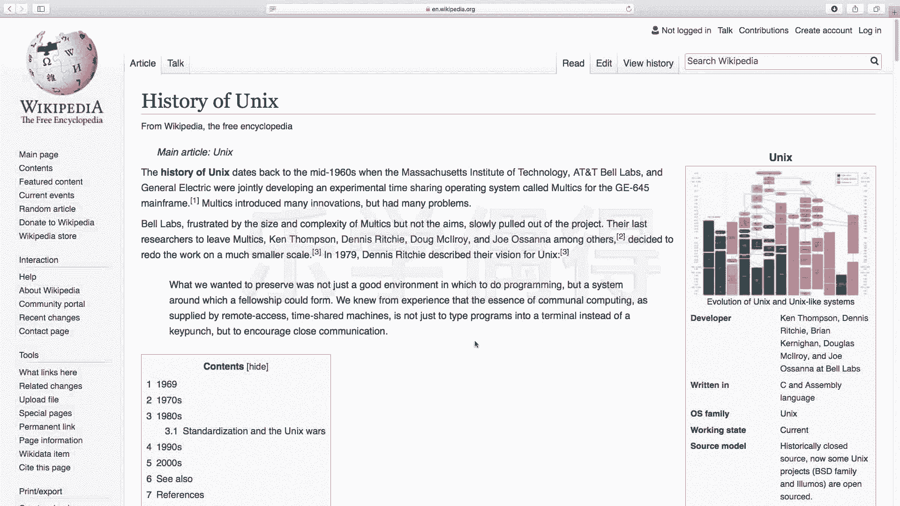
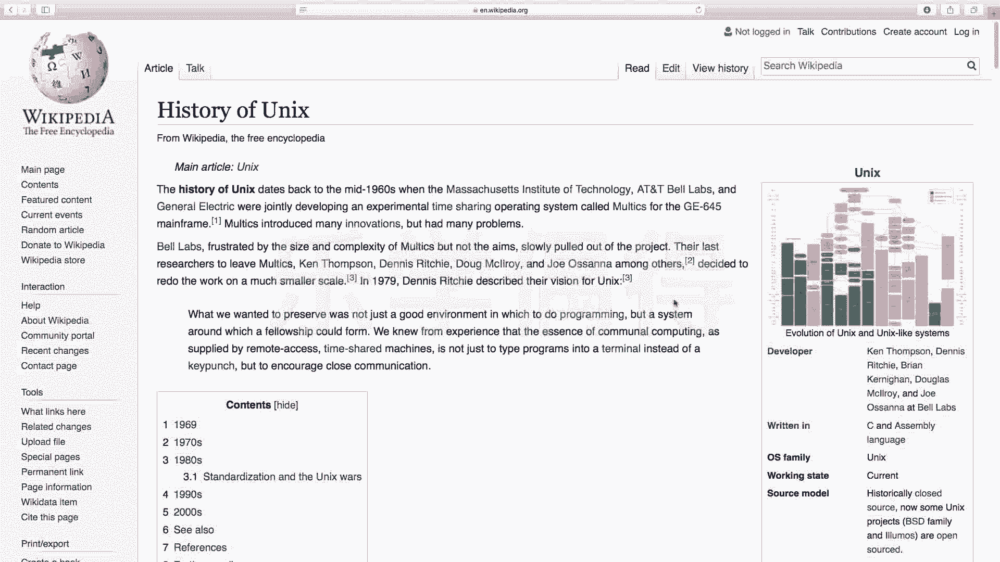
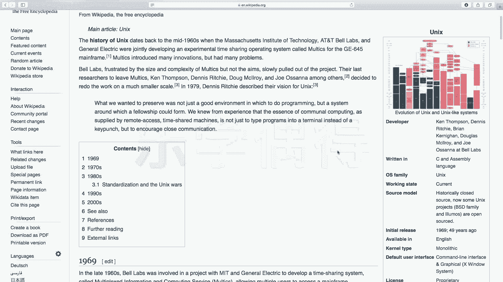
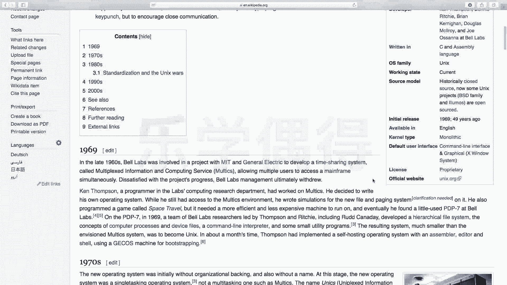

# 乐学偶得｜Linux云计算红帽RHCSA／RHCE／RHCA - P2：1.Unix的历史 🕰️

在本节课中，我们将要学习Unix操作系统的起源与发展历史。了解这段历史有助于我们理解Linux的诞生背景，以及为什么类Unix系统在当今计算世界中如此重要。

## Unix与Linux的关系

上一节我们介绍了课程的整体目标，本节中我们来看看Unix和Linux的关系。Linux和Unix可以被比作一对父子关系。Unix是父亲，而Linux是其后代发展出的一个重要版本。

为了更清晰地理解它们的谱系，可以参考维基百科上“History of Unix”页面的图表。该图表展示了从最初的Unix系统开始，各种基于Unix版本不断改动和开发的操作系统。图中绿色部分代表开源系统，橙色代表混合或共享源代码的系统，红色代表闭源的商业版本。

例如，我们日常使用的苹果Macintosh的macOS系统，就是基于FreeBSD。而BSD系统向上追溯，其根源也是Unix。因此，macOS这类系统被称为“类Unix操作系统”。

该时间线图从1969年Unix诞生开始，一直延续到2017年，清晰地展示了各种系统的分类与演变。如果对这段历史有浓厚兴趣，可以查阅维基百科的详细页面或相关书籍。

作为学习者，了解一个技术的起源、它要解决的问题、发展历程以及我们为什么要学习它，是非常必要的。

## Unix的发展阶段

接下来，我们将Unix的发展历史分为三个阶段进行介绍。

### 第一阶段：Multics项目的启动与困境

Unix发展的第一阶段始于1965年。当时，麻省理工学院（MIT）、通用电气公司（GE）以及AT&T旗下的贝尔实验室（Bell Labs）联合开展了一个名为 **Multics** 的大型项目。

**Multics** 这个名字是“**MULT**iplexed **I**nformation and **C**omputing **S**ervice”的缩写。从其中文译名“具有交互式多道程序处理能力的分时操作系统”可以看出，这是一个非常复杂和宏大的工程。

然而，由于项目过于复杂，开发进度严重落后。在软件开发中，这种因目标过大而导致项目停滞的情况并不少见。最终，贝尔实验室逐渐退出了这个合作项目。

### 第二阶段：Unix的诞生与C语言的出现

贝尔实验室的退出并没有终结故事，这引出了Unix发展的第二阶段。1969年，贝尔实验室的工程师**肯·汤普森**（Ken Thompson）在退出Multics项目后，为了在一台PDP-7计算机上更流畅地运行一个游戏程序，决定自己编写一个更高效的操作系统。这就是最初的Unix操作系统。

随后在1971年，肯·汤普森与他的同事**丹尼斯·里奇**（Dennis Ritchie）共同发明了**C语言**。C语言对后来的编程语言产生了深远影响，至今仍能看到它的影子。

1973年，他们做了一项关键工作：用新发明的C语言重写了Unix系统的大部分源代码。这使得Unix系统的**可移植性**大大增强。用C语言编写的Unix内核，可以相对容易地移植到不同类型的计算机硬件上运行。

以下是推动Unix发展的核心人物与关键贡献：

*   **肯·汤普森**：Unix系统的最初开发者。
*   **丹尼斯·里奇**：与汤普森共同发明C语言。
*   **C语言**：用于重写Unix，使其具备强可移植性。
*   **1973年重写**：使用C语言重构Unix，是Unix得以广泛传播的关键技术决策。

### 第三阶段：Unix的传播与分化

在Unix用C语言重写后，由于其优异的性能和可移植性，AT&T开始向大学和研究机构发放许可证。这导致了Unix系统的快速传播和多样化发展，形成了不同的分支，如BSD（Berkeley Software Distribution）和后来的商业Unix系统（如AIX、HP-UX）。正是这种分化为后来Linux的诞生创造了条件。

## 总结

本节课中我们一起学习了Unix操作系统的历史。我们了解到Unix起源于一个名为Multics的复杂项目，由贝尔实验室的工程师肯·汤普森简化并首创。随后，他与丹尼斯·里奇发明的C语言被用于重写Unix，这极大地提升了其可移植性，为Unix的广泛传播奠定了基础。理解这段“父子”历史，能帮助我们更好地认识Linux出现的背景及其在操作系统家族中的地位。