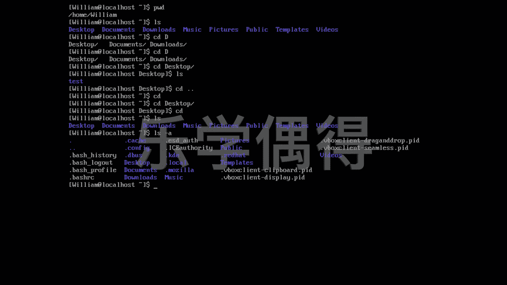

# 乐学偶得｜Linux云计算红帽RHCSA／RHCE／RHCA - P30：29.自由的在系统中穿梭 🧭


在本节课中，我们将学习如何在Linux文件系统中自由地“穿梭”，即进入和退出不同的目录。我们将掌握几个核心命令，它们能帮助我们查看当前所在位置、列出目录内容以及在不同目录间切换。

## 查看当前工作目录

首先，我们需要知道自己在文件系统中的哪个位置。`pwd`命令可以完成这个任务。`pwd`代表“print working directory”，即打印工作目录。执行这个命令，它会告诉我们当前正在工作的目录是什么。

```bash
pwd
```

## 列出目录内容

知道了当前的位置，下一步就是查看这个目录里有什么。`ls`命令可以将目录中的所有文件和子目录以列表形式列举出来。例如，你可能会看到`Desktop`、`Documents`、`Music`、`Public`等目录。

```bash
ls
```

## 进入与退出目录

上一节我们介绍了如何查看目录内容，本节中我们来看看如何在目录之间移动。

### 进入目录

要进入一个目录，我们使用`cd`命令，后面跟上目标目录的名称。例如，要进入`Desktop`目录，可以输入：

```bash
cd Desktop
```

**注意**：Linux系统是大小写敏感的，因此必须确保目录名的大小写完全正确。输入时，可以按`Tab`键来自动补全目录名。如果存在多个以相同字母开头的目录，按一次`Tab`可能无法补全，此时可以按两次`Tab`来查看所有选项，然后输入更多字符来唯一确定。

### 退出目录

退出目录有两种常用方法：
1.  使用`cd ..`命令。这里的两个点`..`代表上一级目录。
2.  直接输入`cd`命令，不加任何参数，这会直接回到当前用户的主目录（即初始界面）。

以下是具体操作示例：
```bash
# 方法一：返回上一级目录
cd ..

# 方法二：直接返回主目录
cd
```

## 查看详细信息

当我们进入一个目录后，可以再次使用`ls`命令查看其内容。如果想看到更详细的信息，包括隐藏文件（以点`.`开头的文件），可以使用`ls -a`命令。

```bash
ls -a
```



通过以上命令的组合使用，我们就可以在Linux系统中自由地导航，轻松地进入和退出各个目录。

本节课中我们一起学习了`pwd`、`ls`、`cd`和`cd ..`等命令。这些是Linux文件系统操作的基础，熟练掌握它们对于后续的学习至关重要。现在，你已经可以自由地在系统中穿梭了。