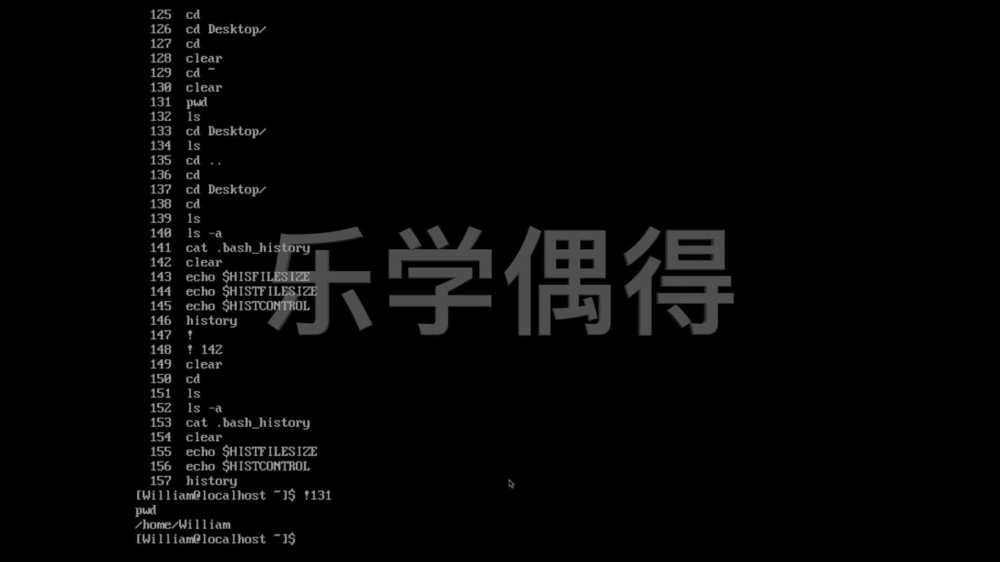

# Linux云计算红帽RHCSA/RHCE/RHCA：P31：30. Linux在记录你的一举一动


## 概述
在本节课中，我们将要学习Linux系统中的历史记录功能。这个功能会记录用户在命令行中执行过的所有命令，对于系统管理和安全审计非常重要。我们将了解如何查看、管理以及利用这些历史记录。

## 历史记录的重要性
上一节我们介绍了Linux的基本操作，本节中我们来看看系统如何记录用户的操作。在电影情节中，无论是黑客入侵还是安全防护，操作者都会输入一系列指令。如果能获取到这些指令记录，就能了解对方的意图。因此，系统的日志或历史记录就变得至关重要。

不要一听到历史记录就感到紧张，认为它涉及隐私而想要删除。对于企业服务器或个人Linux系统而言，保留历史记录非常重要。在需要高安全性或进行参数调整时，用户可以像使用无痕浏览一样，选择性地删除所有历史记录。

## 历史记录的存储位置
我们知道，输入如`cd`、`ls`等命令时，系统都会保存记录。例如，我们使用`ls -a`命令可以显示当前目录下的所有文件，包括隐藏文件。

以下是查看历史记录文件的方法：
```bash
cat .bash_history
```
这个文件专门用于存储用户在Bash shell中执行过的命令历史。`.bash_history`文件位于用户的家目录下。

## 查看与管理历史记录
我们可以直接查看历史记录文件的内容。如果不想看了，可以使用`clear`命令清屏。

我们还可以查看历史记录的相关配置。例如，想知道系统能保存多少条记录，可以使用以下命令：
```bash
echo $HISTSIZE
```
这个变量定义了历史记录列表保存的命令条数。默认值通常是1000条，但可以根据需要进行修改。例如，可以将其设置为0以完全不保存，或设置为10000以保存更多记录。

同样，我们可以查看历史记录的其他控制参数：
```bash
echo $HISTCONTROL
```
常见的值如`ignorespace`（忽略以空格开头的命令）或`ignoredups`（忽略重复的连续命令）。这允许用户对历史记录的行为进行定制。

查看当前会话的历史记录列表，最简单的方法是直接输入：
```bash
history
```
执行此命令会列出所有带编号的历史命令。

## 使用历史记录
历史记录不仅用于查看，还能方便地重新执行命令。每个历史命令前面都有一个编号。

以下是重新执行特定编号命令的方法：
```bash
!131
```
输入`!`加上命令编号（例如131），系统就会重新执行那条命令。这是一种非常高效的操作方式。



## 总结
本节课中我们一起学习了Linux系统的历史记录功能。我们了解了历史记录的重要性、存储位置（`.bash_history`文件），以及如何查看（`history`命令）、配置（`$HISTSIZE`， `$HISTCONTROL`变量）和利用（`!`编号）历史记录。掌握这些知识，对于日常系统管理和故障排查都很有帮助。