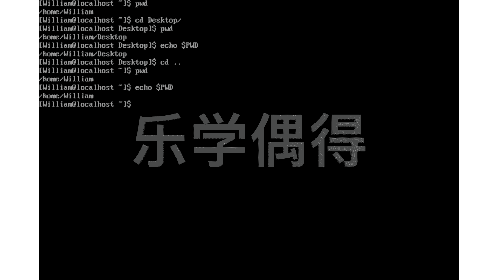
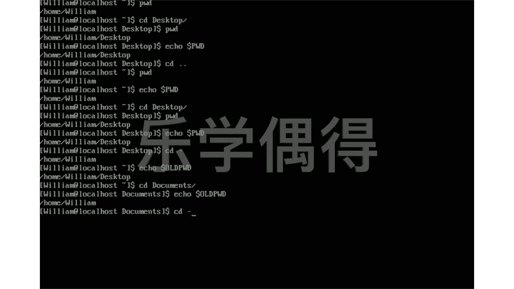

# 乐学偶得｜Linux云计算红帽RHCSA／RHCE／RHCA - P32：31.命令与变量


在本节课中，我们将要学习Linux中的命令与环境变量，理解命令如何像变量一样工作，以及如何查看和利用这些变量来追踪系统状态。

## 命令与变量

上一节我们介绍了基本的目录操作。本节中我们来看看命令与变量之间的关系。

输入小写的 `pwd` 命令，可以打印当前工作目录。例如，执行后可能返回 `/home/william`。这个命令本身就像一个标签固定的按钮，但每次按下时返回的结果可能不同，这是因为其背后的“值”发生了变化。

这个背后的“值”就是环境变量。我们可以使用 `echo` 命令查看环境变量的具体内容。查看当前工作目录对应的环境变量，需要使用美元符号 `$` 加上变量名 `PWD`。

以下是查看 `PWD` 变量值的命令：
```bash
echo $PWD
```
执行此命令，会显示与 `pwd` 命令相同的结果，例如 `/home/william`。

当我们使用 `cd` 命令改变目录后，例如 `cd Desktop`，再次执行 `pwd` 命令，输出会变为 `/home/william/Desktop`。此时，再次使用 `echo $PWD` 查看，会发现变量 `PWD` 的值也同步更新为新的路径。这证明了 `pwd` 命令的输出依赖于 `PWD` 这个环境变量的值。





## 使用 `OLDPWD` 变量

理解了 `PWD` 变量后，我们来看看另一个有用的变量 `OLDPWD`。

在Linux中，`cd -` 命令可以快速返回上一个工作目录。这个功能就是通过 `OLDPWD` 环境变量实现的。`OLDPWD` 变量保存了上一次工作目录的路径。

我们可以通过 `echo` 命令查看 `OLDPWD` 的值。

以下是查看上一个目录路径的命令：
```bash
echo $OLDPWD
```
例如，从 `/home/william` 切换到 `/home/william/Documents` 后，`echo $OLDPWD` 会显示 `/home/william`。此时，执行 `cd -` 命令，就会立刻跳回 `/home/william` 目录。





本节课中我们一起学习了Linux中命令与环境变量的关系。我们了解到 `pwd` 命令的输出实质上是读取了 `PWD` 环境变量的值，而 `cd -` 命令则是利用了 `OLDPWD` 变量来记录和返回上一个工作目录。掌握这些概念有助于更深入地理解Linux命令的工作原理。