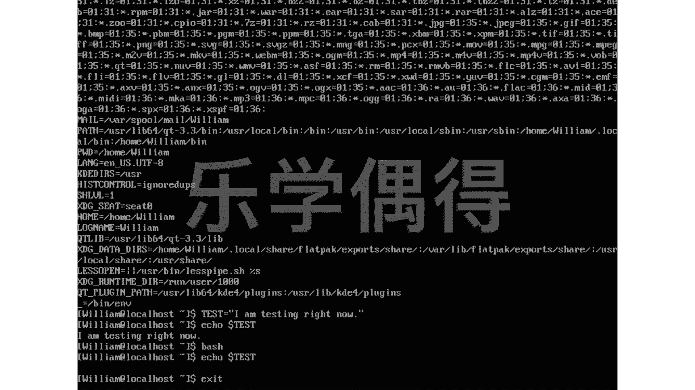
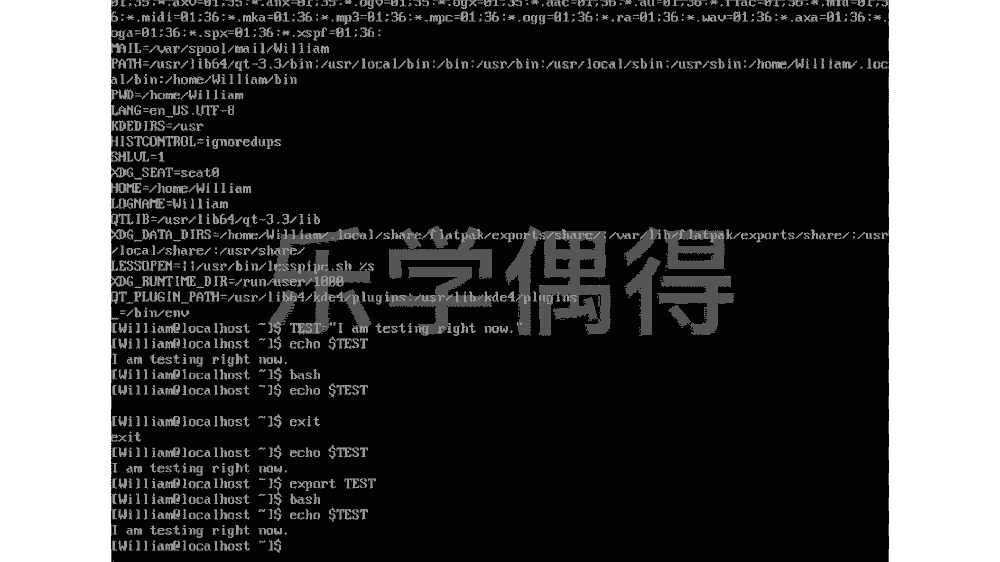

# 乐学偶得｜Linux云计算红帽RHCSA／RHCE／RHCA - P33：32.变量导出 📤


在本节课中，我们将要学习Linux中的环境变量概念，以及如何创建和导出变量，使其在不同的Shell会话中生效。

上一节我们介绍了环境变量的基本概念，本节中我们来看看如何自定义变量并将其导出。

## 什么是环境变量？

环境变量是操作系统或Shell中用于存储配置信息和系统属性的键值对。它们定义了系统的工作环境。我们可以使用 `env` 命令查看当前Shell中的所有环境变量。

```bash
env
```

执行此命令后，会看到许多类似 `HISTCONTROL=ignoredups` 或 `PWD=/home/william` 的输出。其中，等号左侧是变量名，右侧是变量的值。例如，`PWD` 变量存储了当前工作目录的路径，每次执行 `pwd` 命令时，系统都会读取这个变量的值。

## 如何自定义变量？

Linux系统非常灵活，允许用户自定义变量。定义变量的语法很简单。

以下是定义变量的基本格式：

```bash
变量名=值
```

例如，我们可以创建一个名为 `test` 的变量，并为其赋值：

```bash
test="I'm testing right now"
```

这行命令的含义是：将字符串 `I'm testing right now` 赋值给变量 `test`。定义完成后，我们可以使用 `echo` 命令和美元符号 `$` 来引用这个变量的值：

```bash
echo $test
```

执行后，终端会输出 `I'm testing right now`。这说明我们成功创建了一个变量。

## 变量的作用域问题

然而，我们刚刚定义的变量默认只在当前的Shell会话中有效。如果我们开启一个新的Shell会话（例如，通过执行 `bash` 命令），这个变量就无法被访问了。

以下是验证步骤：

1.  在当前Shell中定义变量 `test`。
2.  执行 `bash` 命令，进入一个新的子Shell。
3.  尝试在新Shell中输出 `$test` 的值，会发现没有任何输出。

这是因为变量默认是“局部”的，其作用域仅限于定义它的那个Shell进程。

## 使用export导出变量

为了让自定义的变量在子Shell或其他Shell会话中也能使用，我们需要使用 `export` 命令将其“导出”为环境变量。



以下是导出变量的命令：

```bash
export 变量名
```

或者，也可以在定义变量的同时直接导出：

```bash
export 变量名=值
```

现在，让我们实践一下。首先，退出当前的子Shell（使用 `exit` 命令），回到原来的Shell。然后，将之前定义的 `test` 变量导出：

```bash
export test
```

导出后，再次打开一个新的子Shell：

```bash
bash
```

在新的Shell中，再次尝试输出变量：

```bash
echo $test
```

此时，终端会成功显示 `I'm testing right now`。这说明通过 `export` 命令，我们成功地将局部变量提升为了全局环境变量，使其在不同的Shell会话中都能被识别和使用。



本节课中我们一起学习了Linux环境变量的概念、如何自定义变量以及如何使用 `export` 命令导出变量，从而扩展变量的作用范围。掌握变量的导出是进行Shell脚本编写和系统环境配置的重要基础。