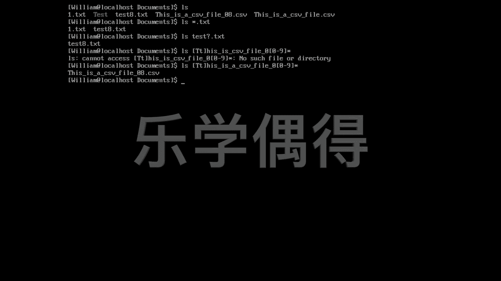

# 乐学偶得｜Linux云计算红帽RHCSA／RHCE／RHCA - P35：34.忘记文件名怎么模糊查找 🔍


在本节课中，我们将要学习在Linux系统中，当你不记得文件的确切名称时，如何使用通配符进行模糊查找。掌握这项技能能帮助你在包含大量文件的目录中快速定位目标。

## 概述

在日常工作中，我们经常需要在一个包含成百上千个文件的目录里寻找特定文件。有时你可能不熟悉该目录的内容，或者记不清文件的全名。这时，使用通配符进行模式匹配查找就变得非常有用。

上一节我们介绍了基本的文件操作，本节中我们来看看如何使用通配符解决“忘记文件名”的问题。

## 使用星号 (*) 通配符

星号 `*` 可以匹配任意长度的任意字符（包括零个字符）。当你记得文件的部分特征，例如扩展名时，这个方法尤其有效。

例如，如果你想查找所有以 `.txt` 结尾的文件，可以使用以下命令：
```bash
ls *.txt
```
这个命令会列出当前目录下所有扩展名为 `.txt` 的文件，例如 `1.txt` 和 `test8.txt`。

## 使用问号 (?) 通配符

问号 `?` 用于精确匹配一个任意字符。当你不确定文件名中某个特定位置的字符时，可以使用它。

假设你知道一个文件以 `text` 开头，以 `.txt` 结尾，但中间有一个字符记不清了（比如可能是 `text1.txt`, `text2.txt` 等），可以使用：
```bash
ls text?.txt
```
这个命令会匹配像 `text8.txt` 这样的文件。

## 使用中括号 ([]) 指定字符范围

中括号 `[]` 用于匹配括号内列出的任意一个字符。这在你知道某个位置可能是几个特定字符之一时非常有用。

例如，你想找一个文件，但不确定它的首字母是大写 `T` 还是小写 `t`，同时文件名中间的数字记不清了，扩展名也忘了。可以这样查找：
```bash
ls [Tt]his is a csv file [0-9].*
```
以下是这个命令各部分的解释：
*   `[Tt]`：匹配大写 `T` 或小写 `t`。
*   `[0-9]`：匹配从 `0` 到 `9` 的任意一个数字。
*   `.*`：`*` 匹配任意字符，因此 `.*` 可以匹配以任意字符串作为扩展名。

通过组合这些通配符，即使记忆模糊，也能有效地定位文件。

## 总结

本节课中我们一起学习了Linux中用于模糊查找文件的三种核心通配符：
*   **星号 `*`**：匹配任意数量的任意字符。
*   **问号 `?`**：匹配一个任意字符。
*   **中括号 `[]`**：匹配括号内指定的一个字符或字符范围。



灵活运用这些通配符，可以极大地提高在命令行中查找和管理文件的效率。