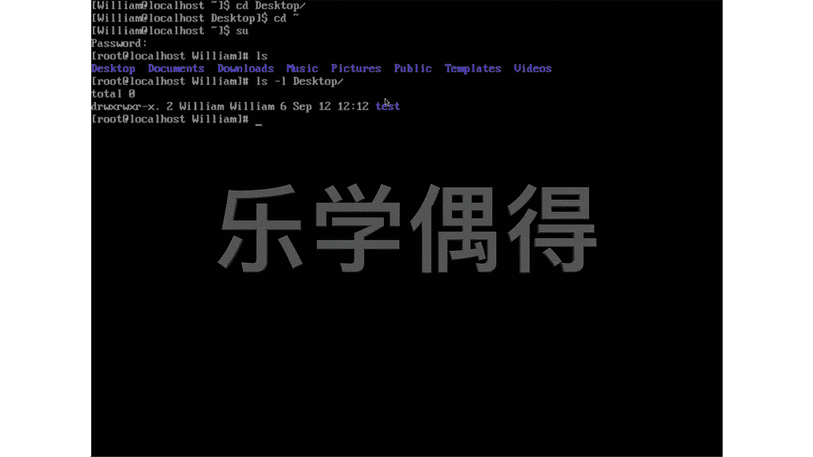

# 乐学偶得｜Linux云计算红帽RHCSA／RHCE／RHCA - P37：36命令行语法规则 🖥️


在本节课中，我们将要学习Linux命令行界面的基本语法规则。理解命令的构成部分是高效使用Linux的基础。我们将从登录提示符开始，逐步解析一条完整命令的各个组成部分及其含义。

## 登录提示符与用户权限

登录Linux系统后，你会看到类似 `william@localhost ~$` 的提示符。这个提示符包含了几个关键信息。

*   `william` 是当前登录用户的用户名。
*   `@localhost` 表示你正在本地主机上操作。
*   `~` 符号代表当前用户的家目录。
*   提示符末尾的符号表示你的用户权限：`$` 代表普通用户，`#` 代表超级用户。

普通用户权限有限，许多系统级操作需要切换到超级用户。你可以使用 `su` 命令并输入密码进行切换。切换成功后，提示符会从 `$` 变为 `#`。

上一节我们介绍了命令行提示符的含义，本节中我们来看看一条具体命令的语法结构。

## 命令的语法结构

在Linux中，一条标准命令通常由三部分组成：**命令**、**选项**和**参数**。其基本格式可以表示为：
```
command [options] [arguments]
```

为了更好地理解，让我们分析一个具体例子：`ls -l Desktop`。

以下是这条命令的分解说明：
*   **命令**：`ls`。这是核心动作，告诉系统“要做什么”。在这里是“列出内容”。
*   **选项**：`-l`。这是命令的修饰符，告诉系统“以何种方式做”。`-l` 表示以长格式（详细信息）列出。
*   **参数**：`Desktop`。这是命令的作用对象，告诉系统“对谁做”。在这里是指定要列出 `Desktop` 目录的内容。

因此，`ls -l Desktop` 这条命令的含义是：**以详细列表的形式，列出 `Desktop` 目录下的所有内容**。



本节课中我们一起学习了Linux命令行的基本语法规则。我们首先了解了登录提示符所包含的用户、主机和权限信息。然后，我们深入解析了一条命令的标准结构，明确了**命令**、**选项**和**参数**各自的作用。掌握这些基础概念，是后续学习更复杂命令和脚本的基石。