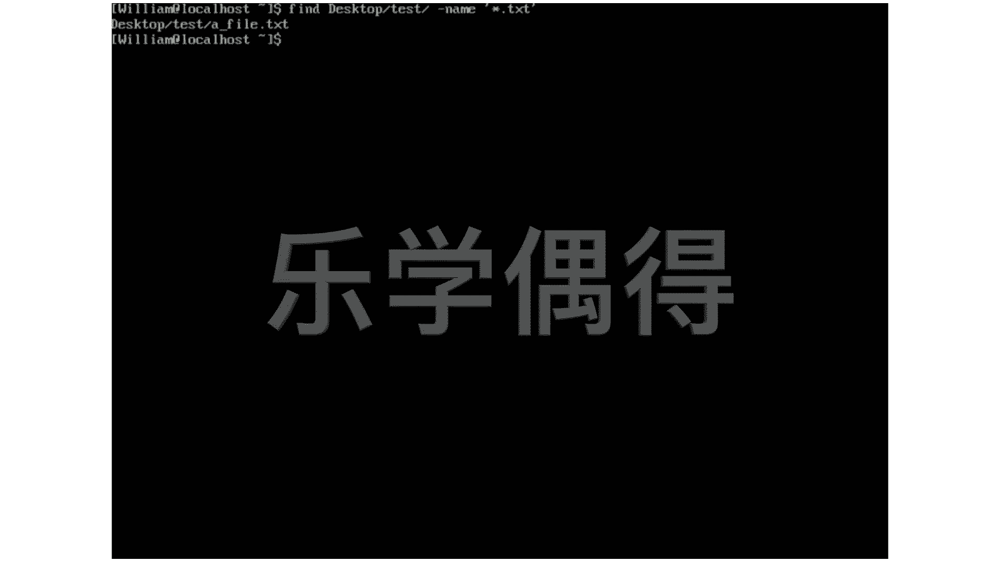
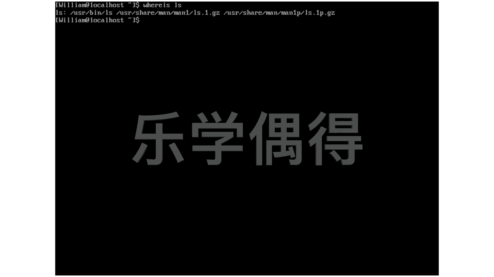

# 乐学偶得｜Linux云计算红帽RHCSA／RHCE／RHCA - P38：37.系统中查找文件


在本节课中，我们将要学习在Linux系统中查找文件的几种常用方法。掌握这些工具能帮助你快速定位所需文件，提高工作效率。

## 🔍 使用locate命令快速查找

上一节我们介绍了文件系统的基本概念，本节中我们来看看如何利用`locate`命令进行快速查找。

`locate`是Linux中最快的文件查找工具之一。它之所以快，是因为它并非直接在庞大的文件系统中搜索，而是查询一个预先建立好的文件数据库。这个数据库通常每天更新一次，因此查找速度极快。

例如，如果你想查找系统中所有包含“L”的文件或目录，可以使用以下命令：
```bash
locate L
```
执行后，系统会瞬间列出大量结果。这是因为`locate`从数据库中检索，速度非常快。但需要注意的是，由于数据库并非实时更新，它可能找不到刚刚创建的文件。

## 🔎 使用find命令精确查找

虽然`locate`很快，但它依赖于数据库的更新。如果你想在文件系统中进行实时、精确的查找，就需要使用`find`命令。

`find`命令直接在文件系统中搜索，因此比`locate`稍慢，但功能更强大、更精确。使用`find`时，你需要指定搜索的起点目录和搜索条件。

以下是`find`命令的一个基本用法示例。假设我们要在`~/Desktop/test`目录下，查找所有以`.txt`结尾的文件：
```bash
find ~/Desktop/test -name "*.txt"
```
在这个命令中：
*   `~`代表当前用户的家目录。
*   `-name`选项指定按文件名搜索。
*   `"*.txt"`是搜索模式，`*`是通配符，代表任意字符，所以这个模式匹配所有以`.txt`结尾的文件。

执行后，命令会列出`~/Desktop/test`目录及其所有子目录中，所有符合该模式的文件。





## 📍 使用whereis命令定位程序文件

除了查找普通文件，有时我们还需要知道一个系统命令或程序文件的具体存放位置。这时可以使用`whereis`命令。

`whereis`命令专门用于查找二进制程序文件、源代码文件和手册页（man page）的路径。例如，我们想查找`ls`这个常用命令的相关文件存放在哪里：
```bash
whereis ls
```
执行后，你可能会看到类似以下的输出：
```
ls: /usr/bin/ls /usr/share/man/man1/ls.1.gz
```
输出结果通常包含两部分：
1.  二进制文件路径：例如`/usr/bin/ls`，这是`ls`命令可执行文件的位置。
2.  手册页路径：例如`/usr/share/man/man1/ls.1.gz`，这是`ls`命令的说明书（man page）文件。手册页是Linux系统自带的命令说明书，当你对某个命令的选项或用法不清楚时，可以使用`man`命令查看，例如`man ls`。




本节课中我们一起学习了在Linux系统中查找文件的三种主要方法：
1.  **`locate`命令**：基于数据库进行**快速**查找，适合查找已知存在的旧文件。
2.  **`find`命令**：在文件系统中进行**实时、精确**查找，功能强大，支持多种条件。
3.  **`whereis`命令**：专门用于查找**可执行程序、源代码和手册页**的路径。


根据不同的需求选择合适的查找工具，能让你在Linux系统中更加得心应手。