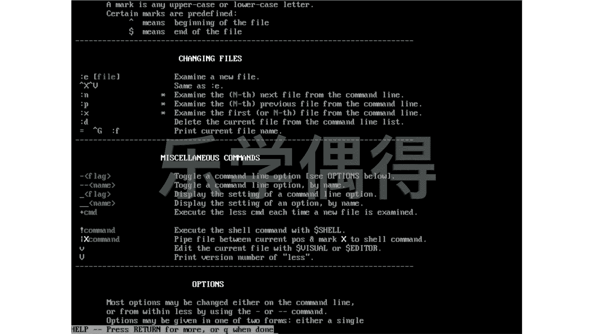
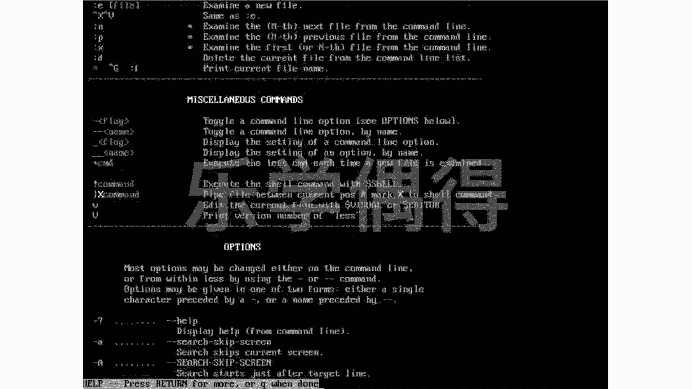
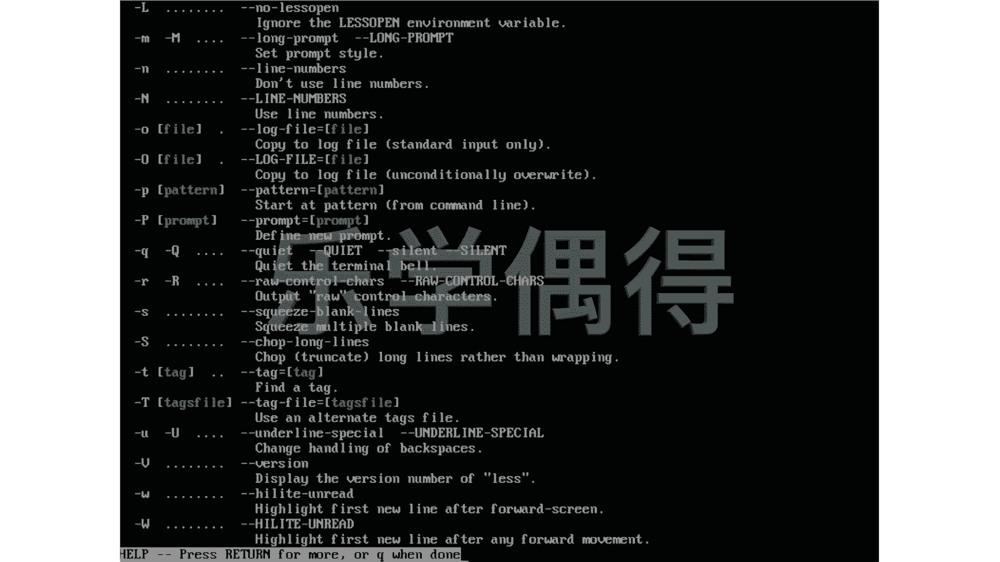
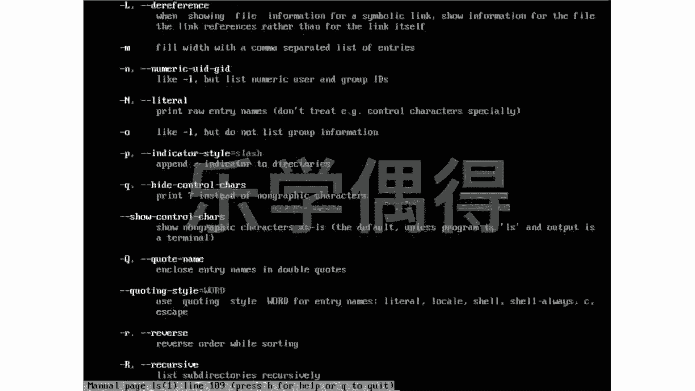
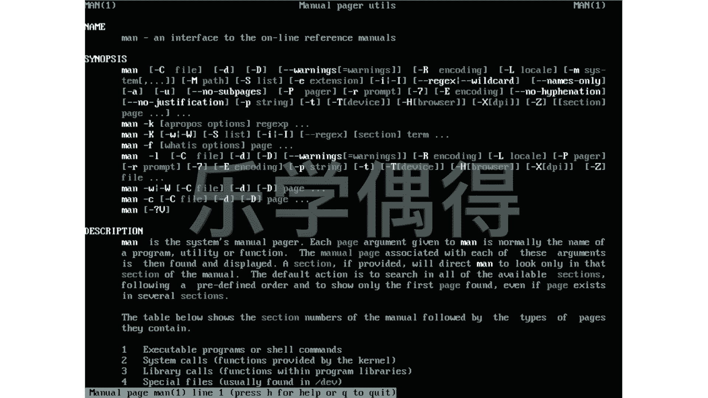
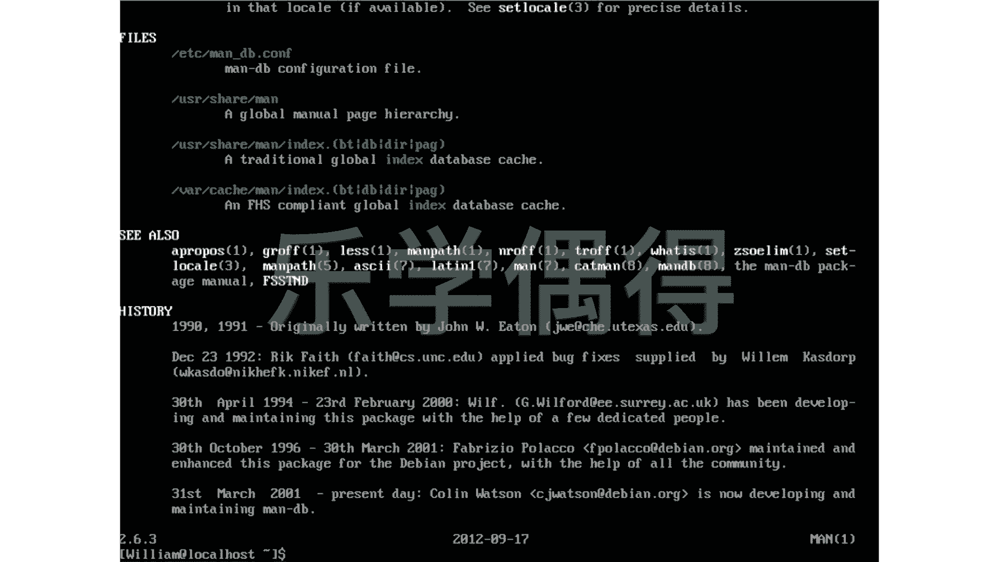

# Linux系统管理：P39：38. Linux自带的说明书 📚


在本节课中，我们将要学习Linux系统中一个极其重要的工具——`man`命令。它就像Linux自带的说明书，能帮助我们查询命令的详细用法、选项和示例。没有人能记住所有命令及其选项，因此掌握查阅“说明书”的方法是高效使用Linux的关键。

## 使用 `man` 命令查阅手册

上一节我们介绍了Linux命令的复杂性，本节中我们来看看如何使用系统自带的帮助手册。`man`是`manual`（手册）的缩写，用于显示指定命令的详细说明文档。

**基本语法**：
```bash
man [命令名称]
```

例如，要查看`ls`命令的用法，可以输入：
```bash
man ls
```
执行后，会进入一个全屏的文档浏览界面。这里会列出命令的名称、语法、描述以及所有可用的选项（如`-a`, `-l`等）及其解释。

以下是浏览`man`手册时的常用操作：
*   **翻页**：按`空格键`或`f`向下翻一页，按`b`向上翻一页。
*   **搜索**：按`/`键，然后输入关键词（如`option`），按回车进行搜索。按`n`查找下一个匹配项，按`N`查找上一个。
*   **退出**：按`q`键即可退出`man`手册界面。

## 指定手册章节

`man`手册内容庞大，被分成了不同的章节（section）。例如，命令通常在第1章，系统配置文件在第5章。有时一个关键词（如`passwd`）在多个章节都有内容。









**指定章节的语法**：
```bash
man [章节编号] [命令或文件名]
```

例如，`passwd`既是一个修改密码的命令（第1章），也是一个系统配置文件（第5章）。如果想直接查看其配置文件的格式说明，可以输入：
```bash
man 5 passwd
```

如果你不确定某个主题属于哪个章节，可以使用`whatis`命令或`man -f`来查看。
```bash
whatis passwd
# 或
man -f passwd
```
这个命令会列出`passwd`在所有相关章节中的简要说明，帮助你确定需要查阅哪一部分。

## 使用 `apropos` 进行模糊查找

有时我们只记得某个命令的大致功能，却忘记了具体名称。这时，`apropos`命令就非常有用了。它会在所有`man`手册的描述中搜索你提供的关键词。

**基本语法**：
```bash
apropos [搜索关键词]
```

例如，如果你想查找与“search”（搜索）功能相关的命令，可以输入：
```bash
apropos search
```
系统会列出所有手册描述中包含“search”的命令和函数，你可以从中找到你需要的那个命令，然后再用`man`命令查看其详细用法。

## 探索 `man` 手册本身

`man`本身也是一个命令，我们也可以查看它的手册来学习更多高级用法。
```bash
man man
```
在手册末尾，你通常还能看到“HISTORY”（历史）部分，了解该命令的原始作者和开发历程，这像是藏在系统里的小彩蛋。



---



本节课中我们一起学习了Linux系统中内置的“说明书”系统。我们掌握了使用`man`命令查看命令的详细手册，学会了通过指定章节编号来精确查找，以及利用`whatis`和`apropos`命令在忘记命令名称时进行查找。熟练运用这些工具，是摆脱死记硬背、高效学习和使用Linux命令的基石。记住，遇到不熟悉的命令时，第一反应就应该是`man [命令名]`。