# 乐学偶得｜Linux云计算红帽RHCSA／RHCE／RHCA：P3：Linux的历史和各种发行版本介绍 🐧

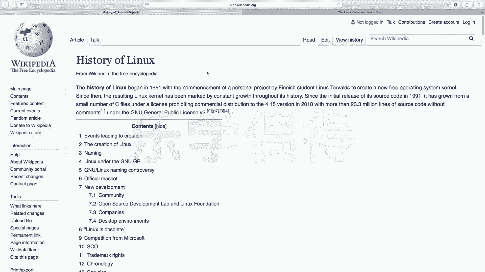

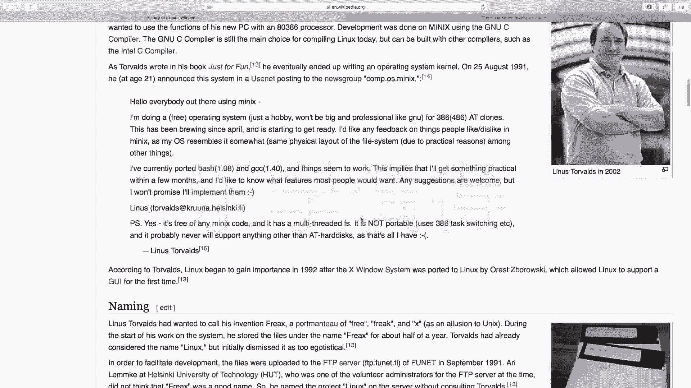

在本节课中，我们将要学习Linux操作系统的起源、发展历史以及当前主流的各种发行版本。了解这些背景知识，有助于我们理解Linux的开源精神，并为后续选择合适的学习和工作环境打下基础。

## Linux的起源与发展

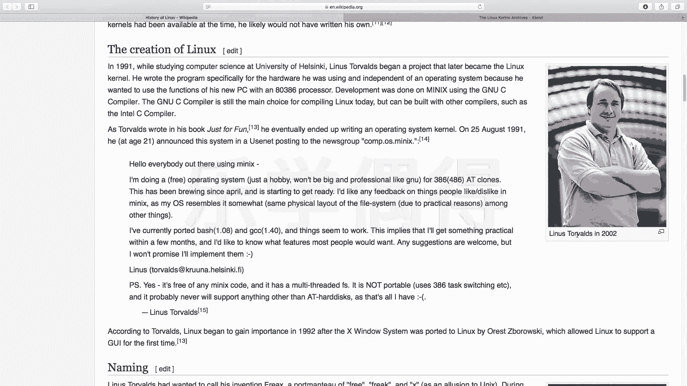

上一节我们介绍了Linux的基本概念，本节中我们来看看它的诞生故事。Linux的发展历史是一个传奇的故事。

Linux与Unix存在父子关系。Unix系统诞生在前，是基础，而Linux是在Unix的思想和设计基础上进行开发的。

整个Linux系统由一位名叫**Linus Torvalds**（中文常译为李纳斯·托瓦兹）的开发者创建，他至今依然活跃在技术社区。他在1991年于芬兰读大学期间开始了这个项目。

当时，他的一位教授为了教学，自己编写了一个名为**Minix**的操作系统，用于讲授《操作系统：设计与实现》这门课程。Minix是一个类Unix系统，主要用于学术目的。

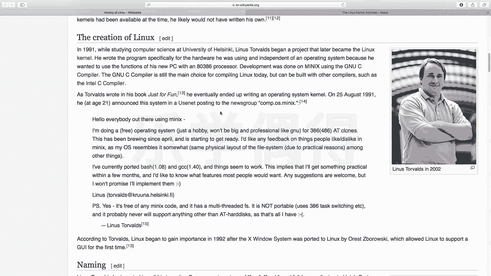

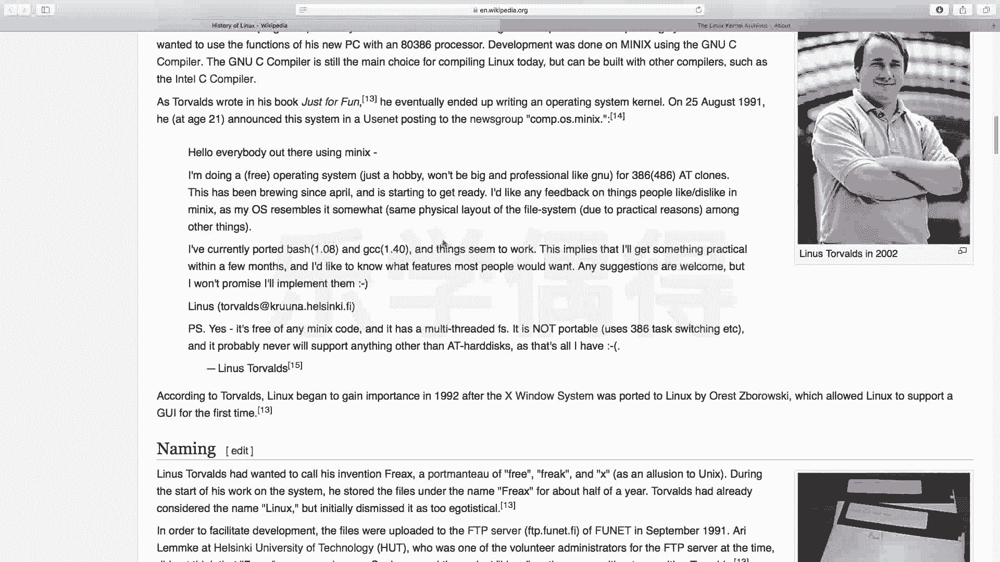

虽然Minix的源代码是公开的，但教授不允许学生修改或分发这些源代码。并且，Minix最初是为16位处理器设计的，在当时的32位机器上运行效果不佳，而能流畅运行它的机器又非常昂贵。

这促使了Linus Torvalds决定自己编写一个操作系统。他秉持着两种精神：一是**开源精神**（源代码应自由开放、允许修改和分发），二是让系统能在更普及、更经济的硬件上运行。

他将自己创建的系统命名为**Linux**，这个名字结合了他的名字“Linus”和“Unix”，寓意着“Linus的Unix”。

他发起这个项目后，吸引了全球众多爱好者共同参与，形成了一个强大的开源社区。大家协作开发，共同完成了这个大型项目。

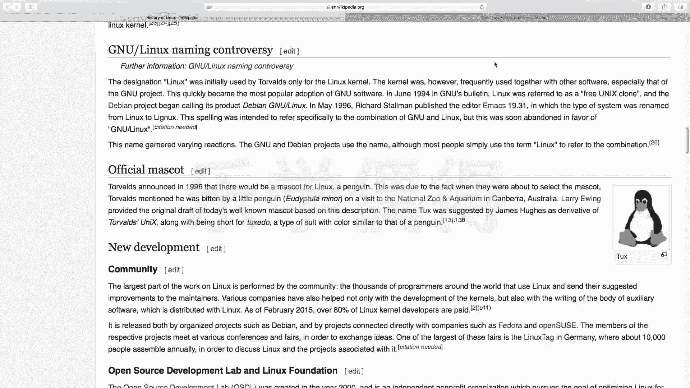

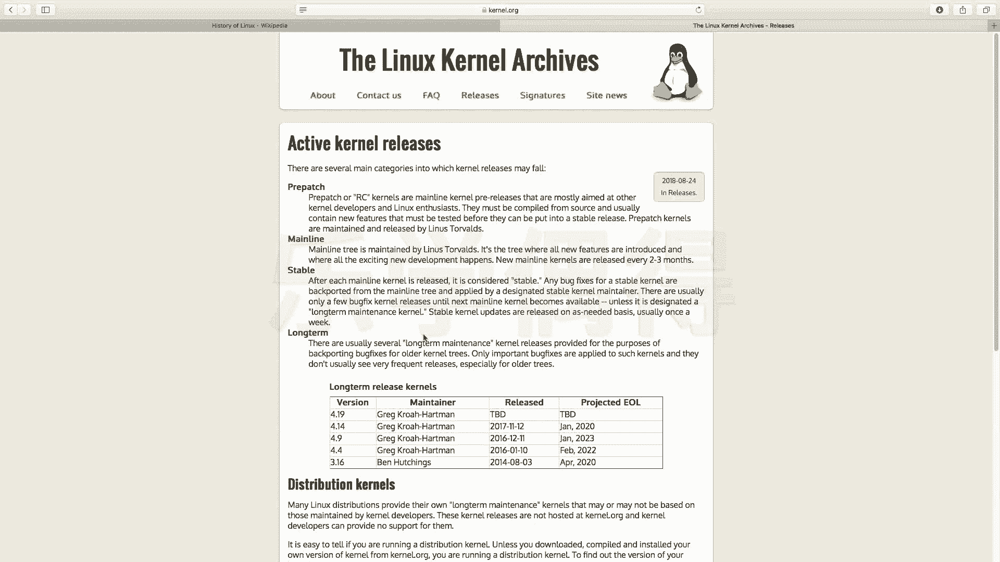

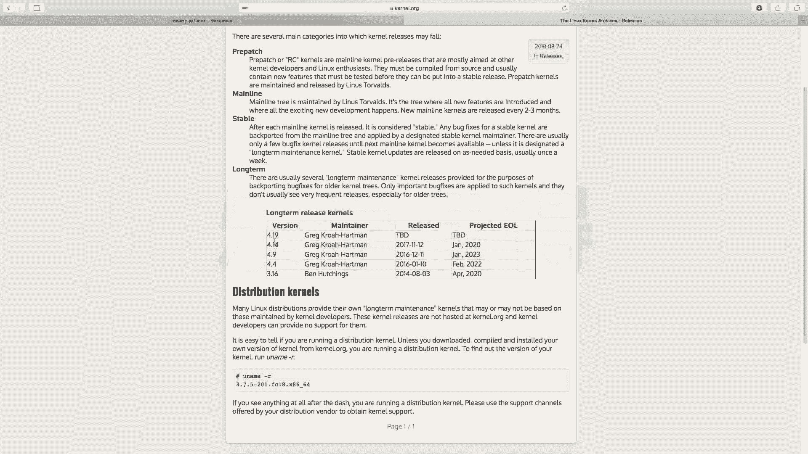

Linux是一个**开源软件**，其所有源代码完全开放，任何人都可以查看、修改和分发。这是它最核心、最精妙的特性之一。

关于Linux的吉祥物——企鹅（Tux），有多种传说。一种说法是Linus在动物园被企鹅咬过，因此将其作为标志。但更广为流传且符合开源精神的说法是：企鹅生活在南极，而南极不属于任何国家，是全世界共有的。这象征着Linux系统是公共的、免费的、开放的，任何人都可以自由使用和贡献。

## Linux内核与发行版

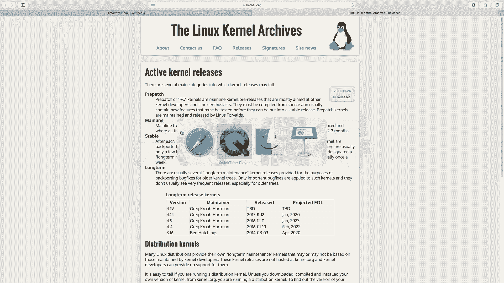

上一节我们了解了Linux的诞生，本节中我们来看看它的核心构成与不同形态。Linux系统本身有一个最核心的部分，叫做**内核（Kernel）**。

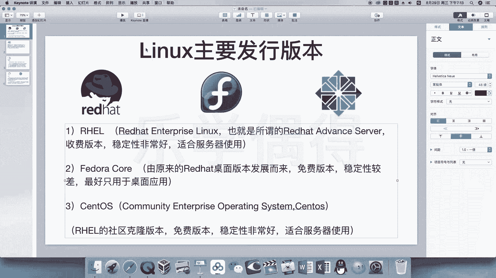

内核是操作系统的核心，负责管理系统的硬件和资源。你可以把它想象成坚果内部坚硬的核心。与内核交互的外壳，就是我们之后会学习的**Shell（命令行界面）**。

Linux内核由**Linux基金会**维护，其最新版本会在官方网站 **kernel.org** 上发布。例如，在录制本课程时，内核版本已更新到4.19系列。

基于这个统一的内核，不同的组织或个人为其添加各种软件、包管理工具和桌面环境，就形成了各种各样的**发行版（Distribution）**。

## 主流Linux发行版介绍

对于初学者，面对众多的Linux发行版常常感到困惑。以下是当前主流的几大Linux发行版系列及其特点，帮助大家做出选择。

### Red Hat（红帽）系列

Red Hat是一家非常受尊敬的开源公司，它证明了完全开源也能成功盈利的商业模型。在运维和云计算领域，Red Hat的认证（如RHCSA, RHCE, RHCA）具有很高的权威性。

Red Hat系列主要有以下几个分支：

*   **Red Hat Enterprise Linux (RHEL)**：这是Red Hat官方推出的企业级服务器版本。它是一个**收费**版本，以**极高的稳定性**著称。企业购买它，一方面是获得其卓越的技术支持（售后），另一方面也是在购买一份服务保障（“背锅”）。目前主要版本是RHEL 7/8。
*   **Fedora**：这是Red Hat社区支持的桌面版本，**免费**。它拥有友好的图形界面（GUI），适合个人日常使用。Fedora会集成许多新技术，但因此可能不如RHEL稳定，**不推荐**用于生产服务器环境。
*   **CentOS**：全称是Community Enterprise Operating System。它可以说是**RHEL的免费克隆版**，去除了Red Hat的商标和商业支持，但二进制兼容。其稳定性与RHEL几乎一致。**本课程将使用CentOS进行讲解**，因为它免费、稳定，且是国内众多互联网公司广泛使用的服务器系统，学习它能无缝对接企业需求和红帽认证体系。

### 其他常见发行版

除了Red Hat系列，还有几个流行的发行版：

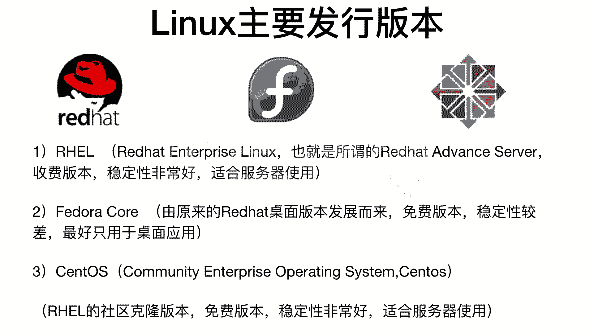

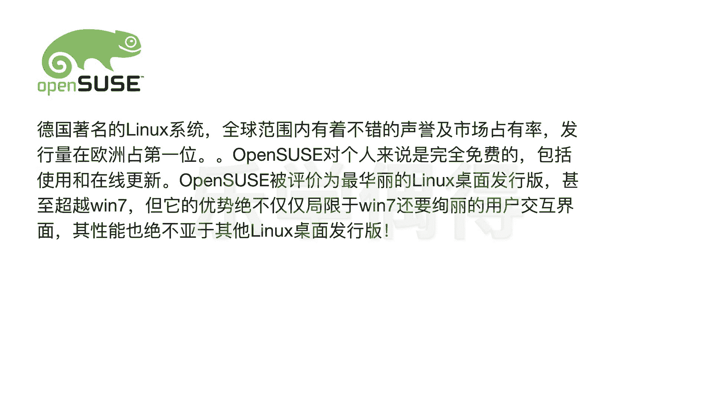

*   **openSUSE**：源自德国，在欧洲非常流行。它以其华丽且高度可定制的桌面环境（KDE）而闻名，适合桌面用户。
*   **Gentoo**：这是一个为高级用户设计的发行版，以极高的**定制性**著称。它需要用户从源代码开始编译整个系统，对用户要求很高，**不推荐**初学者使用。
*   **Debian系列**：这是一个历史悠久的社区发行版，以稳定著称。其最著名的衍生版是：
    *   **Ubuntu**：基于Debian，是**最适合初学者入门**的发行版之一。它拥有极其友好的安装界面和桌面环境，软件仓库丰富，使用 `apt-get` 命令管理软件非常方便。如果你是个人电脑使用，推荐从Ubuntu开始。

## 总结

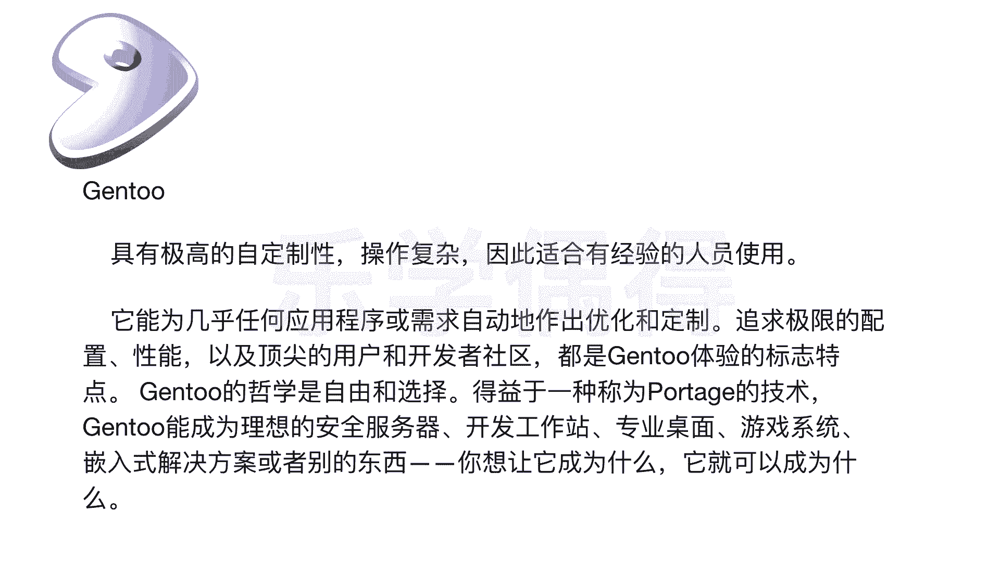

本节课中我们一起学习了Linux的传奇起源、其核心的开源精神与内核概念，并梳理了当前主流的发行版本。

简单来说：
*   **起源**：Linus Torvalds因对Minix的限制不满，于1991年创建了开源的Linux。
*   **核心**：Linux系统由 **内核（Kernel）** 和 **外壳（Shell）** 等构成，内核统一，但发行版多样。
*   **选择建议**：
    *   个人学习/桌面使用：推荐 **Ubuntu**。
    *   从事运维、云计算，追求与企业环境接轨：推荐从 **CentOS**（或RHEL）开始学习。

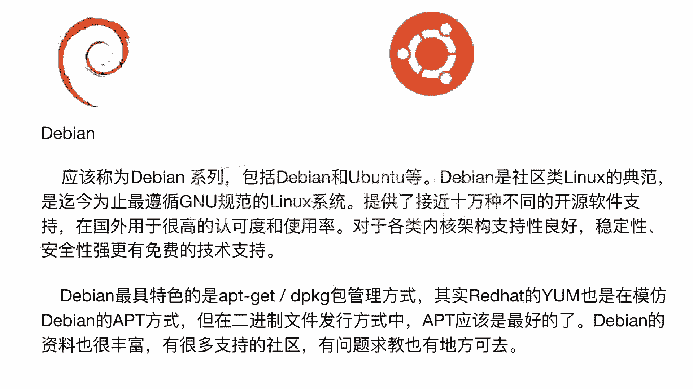

理解这些背景知识，能帮助我们在后续的学习中更好地把握Linux的精髓。下一节，我们将开始动手，学习如何安装Linux系统。