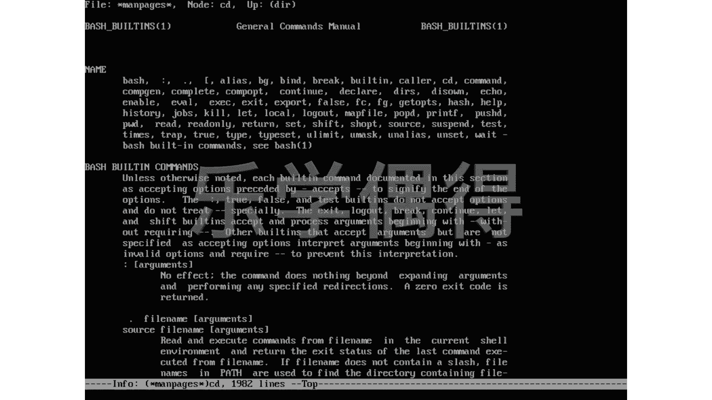

# Linux系统管理：P40：更强大的man与info命令


## 概述

在本节课中，我们将学习Linux系统中两个重要的帮助命令：`man`和`info`。`man`是传统的命令手册，而`info`则提供了更强大、支持超链接跳转的文档查看功能。我们将重点了解`info`命令的交互式使用方法，以及它如何解决在阅读手册时遇到的“解释中嵌套解释”的难题。

## 传统man命令的局限性

上一节我们介绍了`man`命令的基本用法。然而，在使用`man`页面时，你可能会遇到一个不便之处：当你阅读一个命令的解释时，如果解释中又提到了另一个你不熟悉的概念或命令，你无法直接在当前页面内跳转查看。你必须退出当前的`man`页面，然后重新输入`man`命令去查询那个新概念。这个过程就像查字典时，字典对一个词的解释里又用了你不认识的词，你需要合上这本字典，再去找另一本字典，效率较低。

## 更强大的info命令

为了解决上述问题，Linux系统提供了一个更强大的文档查看工具：`info`。`info`可以看作是`man`页面的“高阶版”，其最显著的特点是它内部支持超链接跳转功能。

### info命令的基本使用

你可以像使用`man`一样，使用`info`命令后跟命令名称来查看文档。例如，查看`ls`命令的info文档：

```bash
info ls
```

### info的交互式跳转功能

进入`info`页面后，你会发现一个关键特性：凡是带有星号 `*` 标记的文本，都是一个可跳转的链接（类似于网页中的超链接）。

以下是info页面中常用的导航操作：

*   **选择链接**：使用键盘的**方向键**将光标移动到带有星号的链接上。
*   **跳转**：将光标移动到目标链接后，按下**回车键**，即可跳转到该链接指向的详细说明页面。
*   **返回/退出**：按下 **`q`** 键可以退出当前的`info`页面。

例如，在`info`页面中看到 `* Introduction::`，将光标移上去并按回车，就会跳转到“介绍”章节。

### info的节点概念

`info`文档的结构由一个个“节点”组成。每个节点就像互联网中的一个独立计算机，是一个信息单元。这些节点通过超链接相互连接，形成了一个网状的知识结构。在`info`界面中，每个可跳转的星号链接都指向一个具体的节点，让你可以自由地在相关的知识点之间穿梭，无需反复退出和重进。

## 总结



本节课我们一起学习了`man`和`info`这两个帮助命令。`man`是基础且必需的命令手册，而`info`则提供了更现代、更便捷的交互式阅读体验，尤其擅长处理复杂、相互关联的文档。通过`info`的超链接跳转功能，你可以像浏览网页一样高效地查阅系统文档，极大地提升了学习与排查问题的效率。请务必掌握`info`的基本导航方法，它将成为你深入Linux世界的有力工具。