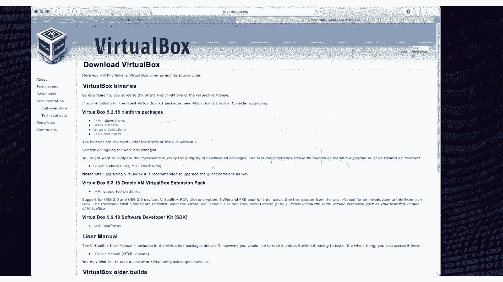

# 乐学偶得｜Linux云计算红帽RHCSA／RHCE／RHCA - P4：3.下载Linux系统及虚拟机

在本节课中，我们将学习如何下载Linux操作系统和虚拟机软件，为后续的安装与配置搭建好实验环境。

无论您当前使用的是Windows、macOS还是Linux系统，在开始学习Linux时，通常都需要配置一个实验环境。对于Windows或macOS用户，我们推荐使用虚拟机。虚拟机是一个可以在一台计算机上模拟出另一台完整计算机环境的软件，它允许您在不影响主系统的情况下安装和运行Linux。这样做的好处是安全、灵活，并且可以轻松创建系统快照和恢复点，非常适合学习和测试。

## 下载虚拟机软件 🖥️

上一节我们介绍了使用虚拟机的好处，本节中我们来看看如何获取虚拟机软件。

我们推荐使用 **VirtualBox**，它是一款由甲骨文公司开发的免费、开源的虚拟机软件，支持Windows、macOS和Linux等多个主机系统。

以下是下载步骤：
1.  访问VirtualBox官方网站。
2.  根据您电脑的操作系统（如Windows或macOS），点击对应的下载链接。
3.  下载完成后，运行安装程序并按照提示完成安装。

## 下载Linux系统镜像 🐧

安装好虚拟机软件后，我们需要准备要安装的Linux系统。本课程将使用 **CentOS** 系统，因为它与后续要学习的红帽系统（Red Hat）高度兼容且完全免费，在国内应用也非常广泛。

以下是需要下载的镜像文件：
*   **CentOS 最小安装镜像**：一个基础版本，只包含核心系统。
*   **CentOS 完整版DVD镜像**：包含大量软件包的完整版本。

建议初学者同时下载这两个镜像文件。完整版安装更便捷，最小版则更轻量。一次性下载可以避免后续因缺少软件包而带来的麻烦，但请确保您的磁盘有足够空间。

## 总结

本节课中我们一起学习了搭建Linux学习环境的第一步：下载虚拟机软件VirtualBox和CentOS Linux系统镜像。准备好这些工具后，我们就可以在下一节课开始配置虚拟机并安装Linux系统了。