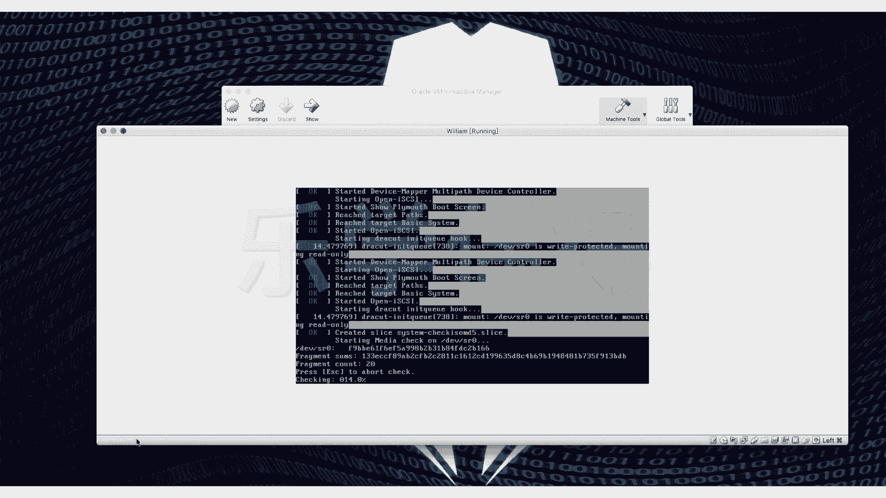
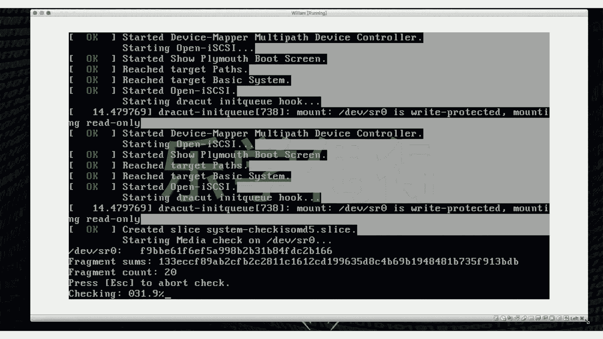

# 乐学偶得｜Linux云计算红帽RHCSA／RHCE／RHCA - P8：7.画面太小，scale一下

在本节课中，我们将要学习如何调整虚拟机窗口的显示比例，以解决安装界面或系统界面过小、不便操作和观看的问题。

## 问题描述与解决思路

上一节我们介绍了虚拟机的安装与启动。本节中我们来看看一个常见问题：虚拟机启动后，其显示窗口可能只占据屏幕的一小部分区域，导致内容过小，影响操作和观看体验。

例如，在安装或使用过程中，虚拟机窗口的实际显示区域可能远小于我们屏幕的可用空间。因此，我们需要将其放大，以获得更佳的视觉效果。

## 调整显示比例（Scale Factor）的步骤

以下是调整虚拟机显示比例的具体操作流程。

1.  首先，确保你的虚拟机处于运行状态。
2.  在虚拟机软件（如VMware Workstation）的菜单栏中，点击 **`View`**（查看）选项。
3.  在下拉菜单中，找到并选择 **`Scale Display`**（缩放显示）子菜单。
4.  在该子菜单中，你可以看到 **`Scale Factor`**（缩放因子）的选项。选择你需要的放大比例，例如 **`200%`**。

**请注意**：某些显示设置（如分辨率）在虚拟机启动后可能无法更改。但 **`Scale Factor`**（缩放因子）通常可以在运行时动态调整。

将缩放因子调整到200%后，虚拟机界面通常会放大到一个比较舒适的大小。你可以根据个人喜好和屏幕空间，尝试不同的比例，但最大通常支持到200%。

## 虚拟机的优势与应用场景

调整到合适大小后，你可以将虚拟机窗口放置在屏幕一侧。这样做有一个显著的好处：你可以同时观看教学视频并在虚拟机中进行实操练习。

例如，你可以在真实电脑上播放教程，在虚拟机里同步输入命令进行练习。这种“边看边练”的方式是使用虚拟机学习的一大优势。

更进一步，虚拟机的强大之处在于可以模拟多台计算机。只要你的物理电脑性能足够，你可以同时运行多个虚拟机窗口，并让它们彼此交互，甚至可以搭建一个小型的计算机集群进行网络或分布式计算的实验。这为学习和测试提供了极大的灵活性。

## 关于系统版本选择的补充说明

在等待系统安装的间隙，简单提一下Linux版本的选择。本次演示安装的是功能最全的 **`Everything`** 版本。

对于初学者，通常建议选择官方标准镜像或 **`Everything`** 版本。而 **`Minimal`**（最小化）版本安装后需要手动配置大量组件，对新手可能不够友好。因此，从学习效率出发，推荐使用包含更多预设软件包的版本。

本节课中我们一起学习了如何通过调整 **`Scale Factor`**（缩放因子）来放大虚拟机显示界面，以提升操作和观看体验。同时，我们也探讨了虚拟机“边看边练”的学习模式及其在创建多机实验环境方面的潜力。接下来，我们将等待系统安装完成，进入下一个配置环节。