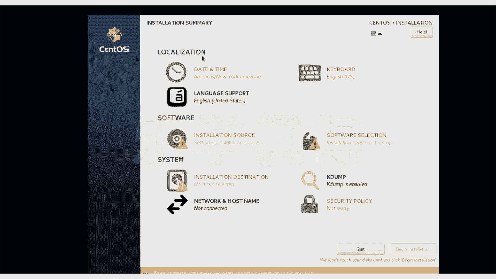
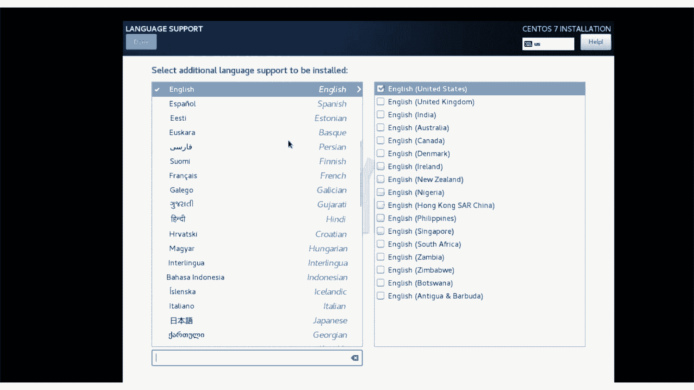
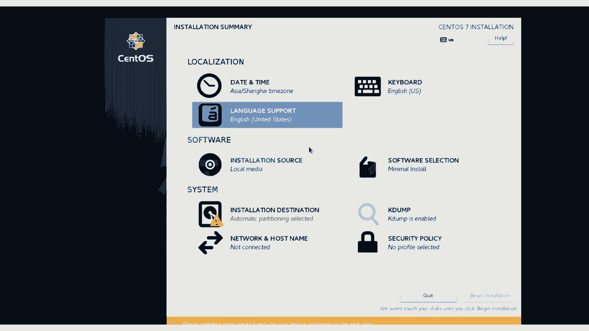
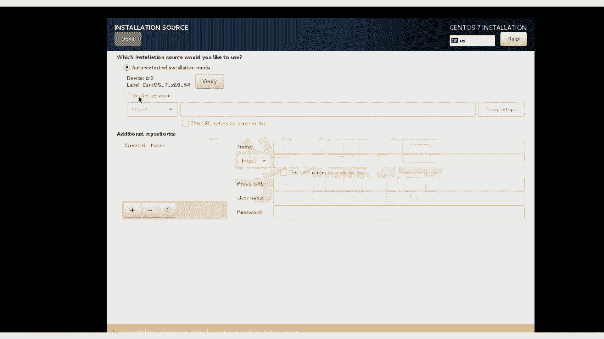
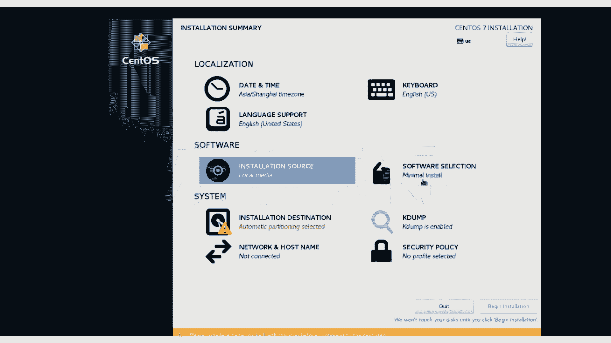
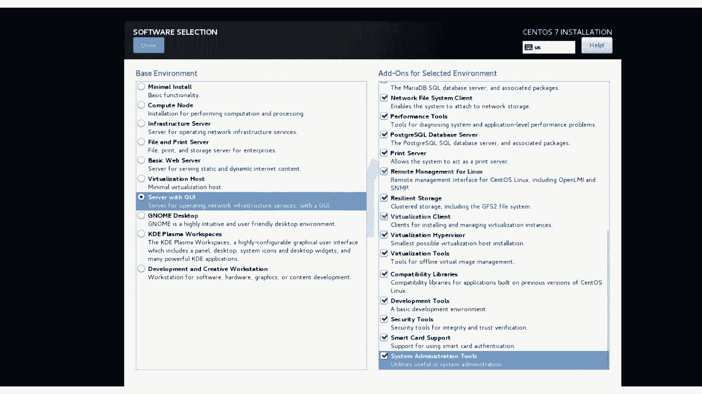
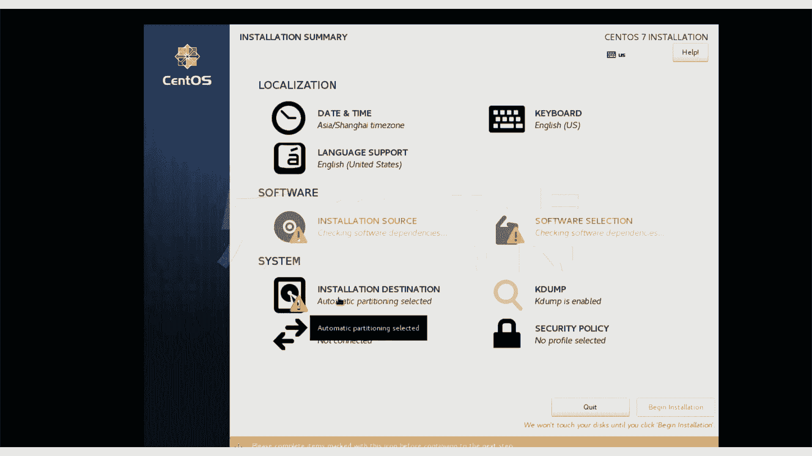
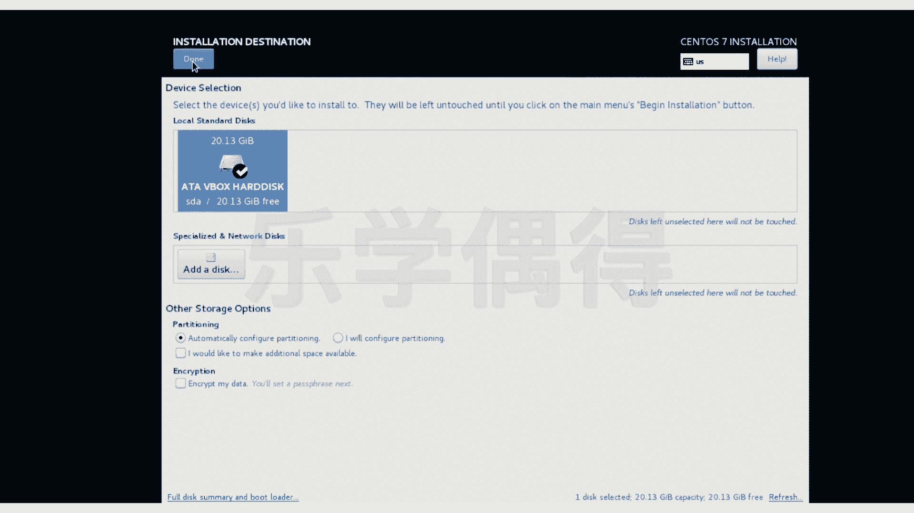

# 乐学偶得｜Linux云计算红帽RHCSA／RHCE／RHCA：P9：8.Linux安装系统参数设置

在本节课中，我们将学习如何在Linux系统安装过程中，对各项关键参数进行设置。这是系统安装的核心步骤，直接关系到后续系统的功能与使用体验。

上一节我们完成了安装介质的加载，本节中我们来看看如何配置安装界面中的各项参数。

当黑屏等待过程结束后，我们会进入图形化的安装界面。此时，我们可以开始进行系统配置。

首先需要注意的是鼠标操作模式。在虚拟机环境中，外部操作系统的鼠标与虚拟机内的鼠标是两个独立的指针。点击虚拟机窗口内部，会提示是否“捕获”鼠标。

*   **Capture**：选择此项，鼠标将被锁定在虚拟机内，无法移出窗口。
*   **Click**：选择此项，鼠标可以在外部和虚拟机内部自由移动。

为了后续操作方便，我们选择“Capture”模式，将鼠标完全锁定在虚拟机内进行操作。这与在真实物理机上安装系统的体验是完全一致的。

以下是安装过程中的主要参数设置步骤：

**1. 语言与键盘设置**
我们首先看到语言选择界面。建议保持默认的 **English (United States)**。在计算机领域，尤其是编程和命令行操作中，英语是主要语言，这有助于后续的学习和使用。键盘布局也保持默认即可。设置完成后，点击“Continue”。

**2. 时间与日期设置**
接下来是“DATE & TIME”设置。这里可以将其调整为中国的时区（例如 Asia/Shanghai）。不过，即使不在此处调整，系统在安装完成后首次启动时，通常也会通过网络自动同步正确的时间。因此，这一步按需设置即可，点击“Done”确认。

**3. 软件选择**
这是非常重要的一步。“SOFTWARE SELECTION”决定了系统将安装哪些基础软件包。
*   **Minimal Install**：最小化安装，仅包含最基本系统，不推荐初学者。
*   **Server with GUI**：我们选择此项。它提供了一个带图形界面的服务器环境，既包含了服务器管理所需的核心工具，又有图形界面方便初学者上手操作。在右侧的附加选项中，建议将可能用到的环境（如开发工具、Java平台等）都勾选上，以避免后续学习时因缺少组件而带来麻烦。选择完成后，点击“Done”。

**4. 安装目标**
“INSTALLATION DESTINATION”用于选择将系统安装到哪个磁盘。由于我们在创建虚拟机时已经配置好了虚拟硬盘，此处直接选中该磁盘即可，无需额外分区操作（系统会自动配置），点击“Done”。

**5. 其他设置**
“KDUMP”是内核崩溃转储机制，用于调试，学习环境可以保持启用或禁用，影响不大。“SECURITY POLICY”和“NETWORK & HOST NAME”可以暂时使用默认设置，后续课程会详细讲解网络配置。

所有参数设置完毕后，安装界面会显示“Begin Installation”按钮。点击它，系统将开始根据我们的设置进行安装。在安装过程中，我们还需要设置root管理员密码和创建一个普通用户，这部分内容我们将在下一节详细讲解。

本节课中我们一起学习了Linux安装过程中的关键参数设置，包括语言、时区、软件包选择以及安装目标磁盘。正确配置这些参数是确保系统符合我们学习需求的基础。下一节，我们将完成安装的最后步骤：设置用户密码。