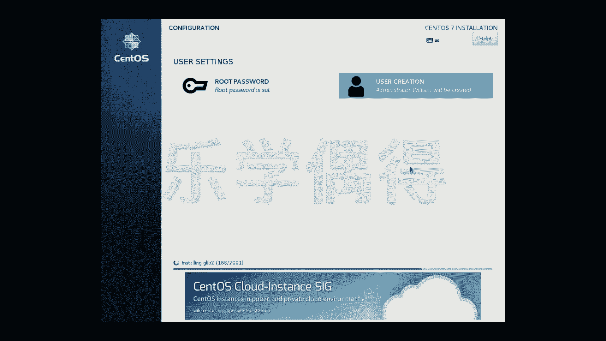

# 乐学偶得｜Linux云计算红帽RHCSA／RHCE／RHCA - P10：9.Linux安装系统参数设置2 - 爱学习的YY酱 - BV1ai4y187XZ

好了啊，我们这些其他东西全部都调好之后的话，我们还要把这个嗯叫做network and host name啊，这个地方要调一下啊，我们把它点一下，点开之后的话，这个network我们要把它打开。啊。

onon了之后的话啊，相当于我们呃建了一个嗯怎么说，在我们的真实的机器和虚拟机器里面建了一个桥梁，相当于虚拟机器可以通过啊我们这个真实的机器进行上网。所以说我们可以直接在这个虚拟机器里面进行上网啊。

我们点一下当。到了之后这个security啊，这些我们先不管，先直接begin installation。好，这个时候下面就可以正在进行安装了。你可以看他正在进行积极的安装，是不是啊，这个时候呢。

我们也不能闲着，是不是？我们上面看看有两个东西，我们没有填啊，一个叫做root passport啊，这个相当于是最最最牛的一个啊账户密码啊，我们先root啊，不过我们后面应该会学这个怎么样。哎。

怎么也不叫破解吧，反正就怎么样获得这个root权限啊，这个我们今后再讲吧啊，我们先嗯先目前认为这是最牛的一个密码嘛，就root啊。root的话，我们自己可以先自己设一个密码。啊。等一下啊。蔬菜。好。

密码两次重复。啊看来我平常这种常用密码还不是安全等级不是很高啊啊，当就可以退出了啊。你看下面还在进行安装，我们呢还可以把这个user就cre，我们还可以这个创建一个user啊。

那这个ful namewilliam贾明user nameusername就叫william吧，user name。嗯，然后呢我们要make this user administrator。

相当于让这个user或者这个管理员这个权限password，我们加一个password吧，跟root passwordword一样好了。好啊，adance啊也可以打开啊。

这个呢其实没有必要嗯做其他的改动。不过大家也可以打开看一下啊，home directory大家可以知道哦，home william相当于是我这个user name作为home directory啊。

我们就直接cancel吧。这个其实没有必要做大的修改当就可以了啊，现在呢我们就只需要耐心等待等待下面这个安装完成再进行重启就可以啊再次进入系统了啊。因为这个安装时间比较长，所以说我就不跟大家进行演示了。

直接切过去啊，到这个正式进入程序的页面了。

