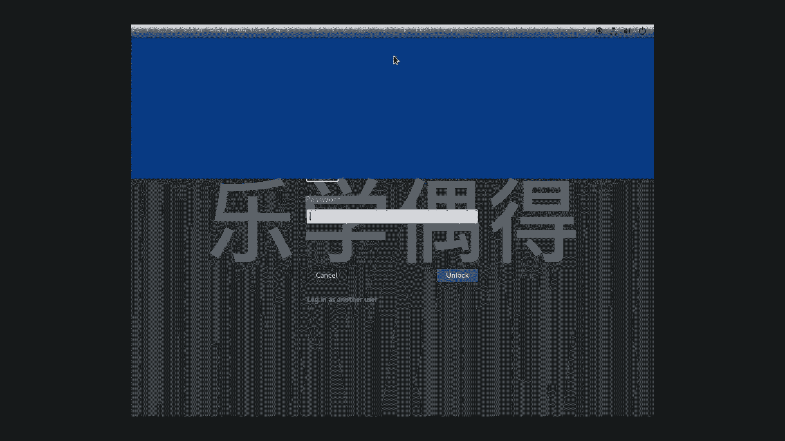
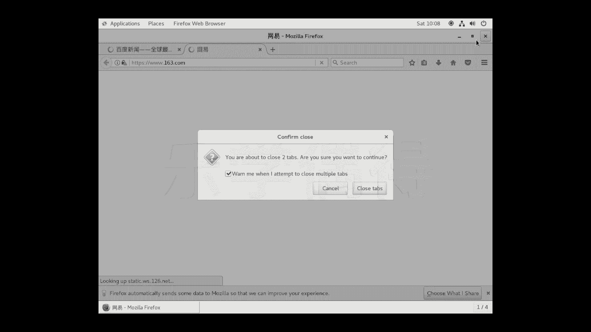
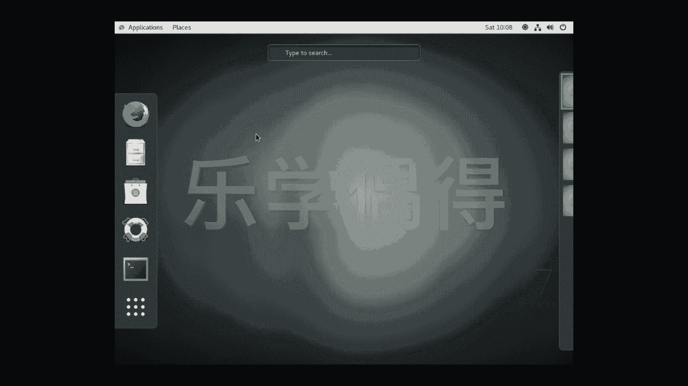
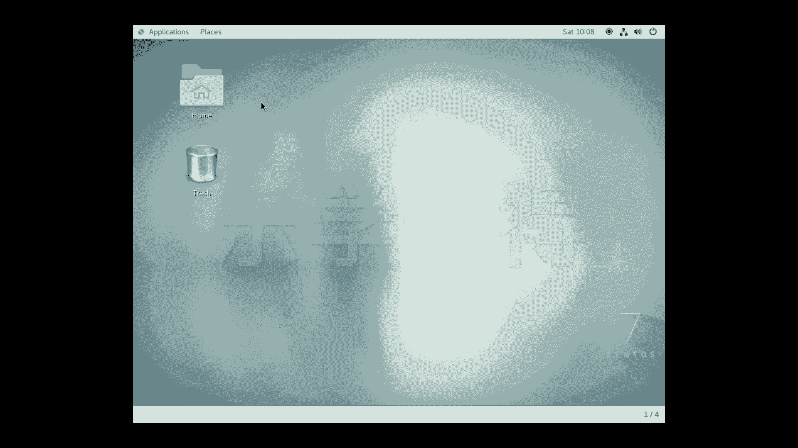
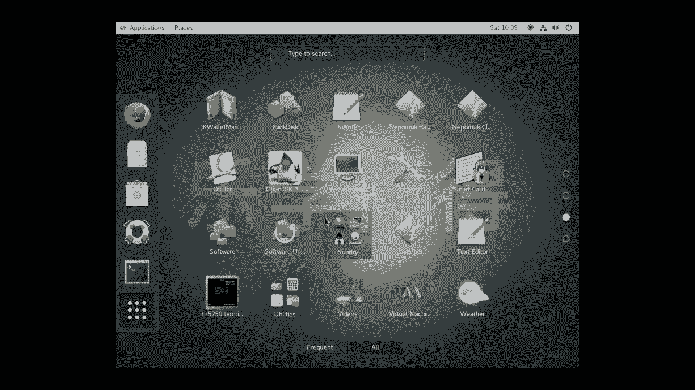
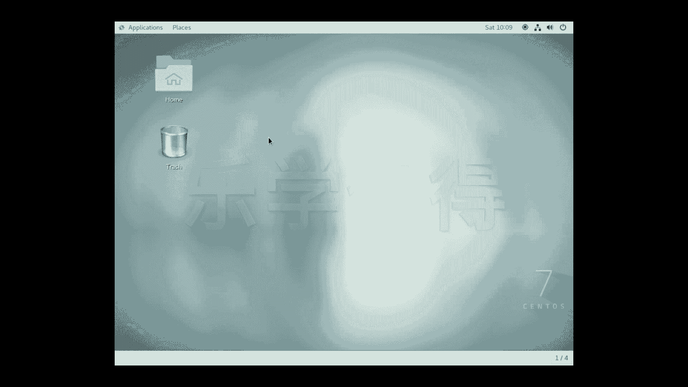
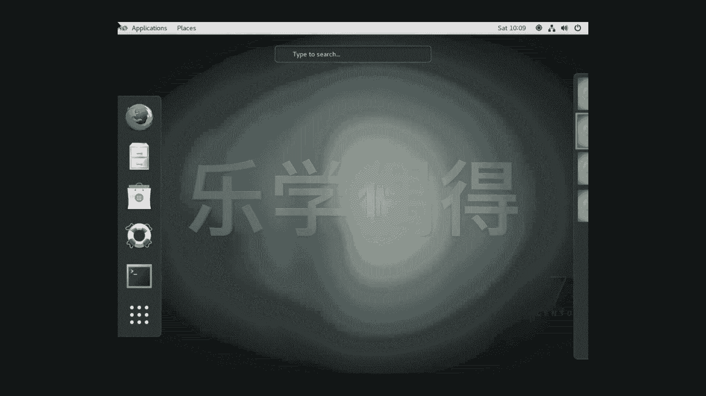
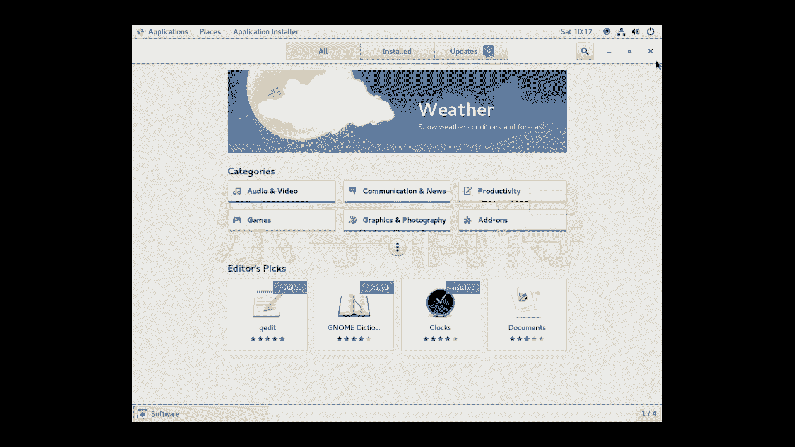

# 乐学偶得｜Linux云计算红帽RHCSA／RHCE／RHCA - P11：10.CentOS及Linux桌面GUI版本熟悉 - 爱学习的YY酱 - BV1ai4y187XZ

好了，我们已经把这个s OS已经安装好了啊，现在我们重新启动之后进入了一个这个界面。呃，我们再点点一下啊，然后往上这样一拖，它其实就可以开了啊。

然后到了一个，你看我刚刚注册这个用户是叫willing加密，然后要你输入刚刚你自己设置这个密码啊，我就把密码输进去。好unlock或者按一下回车啊，就进入到了这个界面啊。

这个界面呢大家一看就是sent OS seven OS7的一个界面。这个界面跟这个linux的界面的话几乎也是一样的，这种样子的这个图形界面呢叫做相当于是一个体系吧很多红帽下面这种体系的话。

其实都是建立在这个on的这种样子的版本。所以说啊如果你是用红帽的这个re它的这个企业版本或者是sentOS啊等等啊，他们用的这个系统的话的操作页面，就是desktop version啊。

就是桌面版的这种版本的话，都是这种样子的啊，我们现在可以看一看，这个其实感觉跟我们这个windows没有什太大的区别，是不是？

而且感觉跟m也有点像你看比如说我把这个ho这样打开打开之后你看这种样子的有点像这个mac里面这个fin是不是？home documentdownloadmusic ，picture。

 videosde and trash啊等等等等啊，这些的话啊感觉是很熟悉的，是不是？只不过我们要关的话，点这边的一个啊就可以关掉了啊，trash啊。都都是在这边的啊。

然后这边有个叫application和places，这个places有点像finder，它可以到很多很多地方。

比如说home就是主页doment文件download下载music pictures音乐这照片还有vide有相当于是影片plication话这样的话就是你安装了一些app，安装了一些应用。

你看favorites里面的话最著的 browser，火狐的一个浏览器我们可以把浏览器打开我们先测试一下网到底是不是好是是你看它先出了一个个页面welcome enterprise system啊。

相当于是一个欢音界面啊，我们一般测试网好不好都是用什么都是用的一个那个用的你看我要全全选的话，其实跟windows有像全选 control加A就全选了啊，一般都是把百度作为测网的一个具。哎。

你看哦我们能打开了，那证明的话网是好的。😊，啊，你看啊比如说看一下新闻啊，这个地图啊等等的话，其实都是可以打开的啊，证明我这个网的话其实是呃其实是好的。就相当于什么？就是我的这个虚拟机里面的网的话。

通过我外面真实机的网的话啊，连接到了真正的互联网。然后的话也可以进行这个we browsing啊，进行这个网页浏览的等等操作啊，好像是现在这个呃网网速并不是太快啊。因为现在网好像比较卡。

行，我就把它关掉了啊，相当于我们可以进行网页浏览啊，我们还可以，你看哎我们怎么突然出现一个这样的页面，是不是？每当你把这个鼠标往这个左上角这样移的时候的话，它有点像你如果用过mac的话。

它有点像在这个触控板的话，进行一个这个一抓的一个操作，有点把这个把这个这个。

相当于这个launch pad这种样子，把它把它把它打开了一样啊，你左左上啊这个一晃就会出现一个这个界面。然后这边的话就左边就是一个docking area，就是有点像这个呃。

你把可以把各种各样的APP哎，各种各样程序，然后放在你常用的啊左边。然后你比如说你想把它打开，或者是想这个显示更多，你就点一下这个。就可以把更多你所有安装的程序的话都可以显示出来啊。这种方法的话。

其实也可以通过这个application这样去找也都是可以的。

而且呢大家发现没有？我们左上角这样一晃晃了之后的话，发现这边有好几个页面，是不是啊？

啊，有点像这个m克的呃，你可以打开很多很多这个页面啊，在这个linux里面这个其实也是可以的。而且我这个页面的话，还可以直接这个按住这个page up和 page置 down进行选择。

你看比如说我现在到这边了。

到这个配这个第二个配置。那第二个配置之后的话，你看我可以在这个下面的话，你看2，然后斜杠4，相当于一共有4个，它这个叫做workspace啊，工作空间啊，你到二，你可以切换到一。

相当于每一个workspace的话，可以显示不同的东西，相当于这些程序可以同时进行运行啊。好啊，这相当于就是最基本的一些这个关于这gooi界面的。

就是图图像那种界面的这个dextop version的版本的啊跟大家进行大概的介绍一下啊。如果大家要进行什么文件处理啊graphic啊等等。还有这个呃上网想换一个浏览器的话啊，如果你这个里面没有啊。

大家不要不要慌啊，就在这个favite里面啊。favite里面有一个叫做application installer，有点像嗯有点像app store一样的这种感觉。

是这个linux的app store啊。你可以在这个里面的话进行。比如说你想啊这个。Graphic and。photography啊，你点开这个你可以把一些图像处理的一些东西的话，就可以安装在上面。

包括还有一些扫描的一些东西啊啊，还有这个这个ve graphic，相当于矢量图的呃绘画了一些软件。好，当然呢我们还可以通过这个productivity。我想大家如果要用linux的话嗯。

满足平常办公需要的话，很可能就是word processor就是进行办公的一些文件处理啊。这个时候我推荐的话叫lib office writer啊。

这个呢跟这个micsoft的 office几乎是一样的啊大家看的话，估计也挺熟悉的啊大家把这个下载下来之后，你点一下啊。

点一下这inst就可以直接安装安装下安装在你本机上其实就可以满足这个学习工作环境以个平常要用的一些文件处理其实lib office几乎都可以满足啊。

我刚刚说的这个g这个desktop其实就是这样拼的啊这样的话相当于是一个一个desextop的版本的这个体系吧啊我们这个lib office writer是专门做文件处理的。

如果是我们想做这个表格方面处理的话，在fin这边有个叫lib office啊就是lib office感觉是ulation相关的有点就是像这个。

windows里面的这个office的excel  exccel表格一样的啊，大家可以也可以用一下。如果平常还要做一些数据方面的话，也可以直接这样的把这个东西下起来。

应该可以满足我们平常的这个呃办公的需求啊啊，其实还有更多的，包括还有甚至还有游戏。但是这个游戏啊质量堪忧，还有这个麻将啊等等啊，这些大家可以自己先下来玩一玩。然后呢。

因为我跟大家演示的是安装这个desktop的的版本，相当于是可以进行可视化的啊，大家先熟悉一下这个操作系统啊。然后呢我们再来通过这个命令行啊来了解这个嗯cent它有些什么特性。

也应该一些基本行基本的命令行的一些命令，我们再来学习一下。

