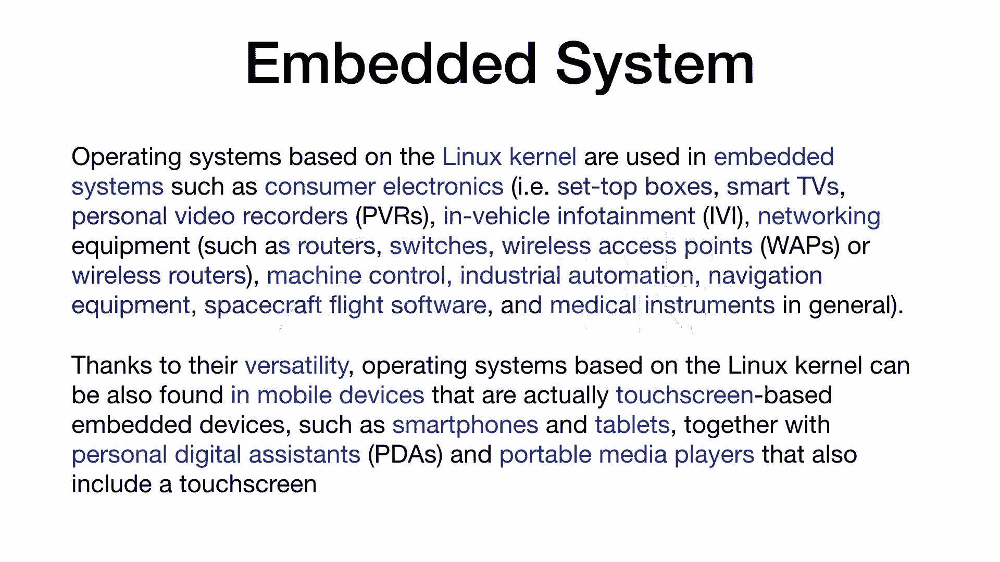
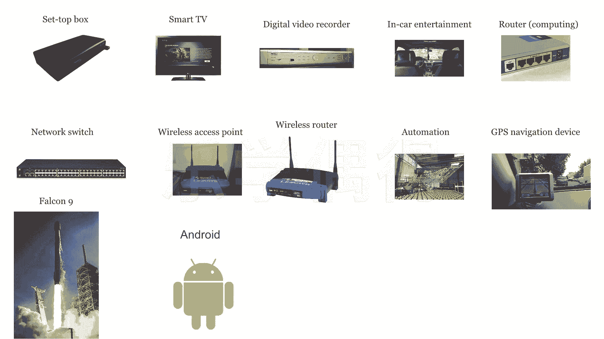

# 乐学偶得｜Linux云计算红帽RHCSA／RHCE／RHCA - P13：12.Linux嵌入式系统运用 - 爱学习的YY酱 - BV1ai4y187XZ

那么首先什么是inbed system？什么是嵌入性的系统呢？啊这种的话其实就是我们平常这个身边的一些很多很多你说不能进行编程的一些东西啊，差不多都是嵌入式系统啊，就比如说你的这个电视啊。

你的这个这个路由器等等。其实这些呢都是属于嵌入式系统它把这个程序啊已经全部写好了，写好之后的话，直接啊装进去装进之后的话，你是它是嵌入到它这个系统里面的，你是不能够对它后期进行更改的啊。

这个呢一般就叫嵌入式系统啊，嵌入系统的话用的非常非常多都是linux的这个啊 kernel就是linux的内核啊，我们可以看一下啊。

这一段呢是这个关于这个inbed system里面linux啊经常运用的一些领域啊，是kipedia上的一段话啊。因为我知道大家看到这个英文而且看到字的话，其实就不想看我给大家特意整理成了图啊。

大家一看这个图的话，其实啊就大概知道其实这个。

在我们生活中的话，运用是非常非常广泛的，可以说渗透到我们生活中的方方面面。但是呢我们其实都没有察觉到啊。

一个呢这个第一个啊看左上角第一个set box啊这个就是我们的机顶盒我们看电视的时的话电视说实话就是个显示器而已啊。但是呢你这个显示器里面需要把一些信号传到这个电视里面去。

能跟你把这个这个信号转换转之后把它播出来是不是啊这个呢机顶盒就是set box里面它是嵌入式的实个语言就是也不叫语言吧，就是它的系统啊是linux啊然后像smart t这个智能的电视智能电视应该有不少。

它其实就是安卓的一个运用安卓的话其实就是lin啊这个也是lin在我们日常生活中的一个运用方面吧。还有你看这个d video record现在可能不太常用啊个人的进行这个数字。数字影像去录制啊。

录制后进行转换的一个仪器啊，这可能属于比较老的一些产品吧。还有我们的这个in entertainment啊，这个行业我觉得个人呢是非常看好的，就在车内的一些娱乐设施啊。

我们最开始的时候呃车里面的娱娱是没有娱乐了，车能开就不错了，是不是啊，现在呢嗯慢慢的就要提高了最开始是先听这个广播电台。啊FMAM等等，就这个嵌入到这个啊车的这个操作环境里面啊。

但现在呢还有这个MP4在上们播放啊，现在那个这个GPS也能在上面啊，还有这个行车记录仪也可以在车上面啊，还车上还能有各种各种音响啊，各种能上网啊，能打电话等等，相当于现在变成了一个电脑一样的。

而且呢为什么我觉得这个这个行业呃今后会来一个爆炸式的一个发展，就是因为这个自动驾驶啊，人工智能的这种去学习啊啊，这个车我觉得这这个车它自这个自动驾驶应该安全的自动驾驶实现的话，应该在不不远的未来。

一定会实现。这个时候的话人其实就可以放松自己的眼睛啊，手啊，在车上的话就可以进行休息啊，所以说在车上你说休息不可能一直睡觉嘛，那车上肯定会进行其他的一些活动啊，甚至是工作啊，那样就很悲催了。

不过车上的这个娱乐设施一旦一定会越来越完善啊，这个目前的车上娱乐设施不少都是作为用那个这个linux的还有这个呃root嗯network switch wireless x point。

还有 route啊，这下面一系列的4个，其实都是跟网络有关的啊网络有关的，其实比如说像这个嗯转换器啊，还有这个呃我们所所说wifi嘛啊，还有一些这个路由器等等。其实它里面也是写好了程序的啊。

进行了呃一些转换吧这些写好了这个程序就是在这个linux上面去写的。还有就是这个automation啊在我们的一些机械臂啊，嗯还有一些小的一些机器人啊，你要去对这些机器人进行编程的话啊。

通常也是一个呃袖真版的一个计算机在上面啊，这个东西其实也是嵌入式的这个lin的运用有GPS这个也接属于上面这个啊一般现在GPS都在车上变成一个这个标配的一个设置了啊。

之前我记得这个GPS刚刚出来的时候还需要花几千块钱要专门去买一个东西啊，现在说实话这个车上GPS已经成为一个标配而且呢我们每个手机上每个s智能这个电话上面的话已经有了这个GPS相当于很多功能都合在一起了啊。

这也是非常这个科技进步的一个一个一个一个标志吧啊，我们再看下面呢还有个火箭，是不是啊这个是美国的一个这个火箭叫做fcom nine啊这个fcom nine它的系统啊，其实就是基于这个lin，还有这个。

plus plus啊，这个linux c加加用这些语言去写的啊，所以说嗯这个不仅在地球能用啊，你要是这个突破到了太空啊，进行这个宇宙航天的这个这个探索的时候的话，也会用到linux啊。

证明它的运用也非常广泛啊。当然我们最多的用这个安卓这个手机啊，其实它这个内核其实也是基于这个linux的这个con的啊，所以说我们的smart phone啊啊应该有个一半以上的都是安卓安卓手机吧啊。

这个也是嗯运用非常非常广泛的一个方面吧。啊，所以说啊通过以上的这些图啊，大家就慢慢能明白为什么我们要学习这个linux，不仅仅是服务器啊，在这个嵌入式的系统里面的话，也是运用非常非常广泛的。

它在我们生活中的话方方面面，而且呢我对它的未来前景非常看好因为说实话包括安卓啊，安卓现在的各种各能智能电视啊，智能家居啊等等的话，其实也是就是一个安卓机吧，是不是？其实就是一个安卓机。

然后在连的这个这个这个实级的冰箱也好啊，这个电视也好啊，这个电饭煲里面也好啊啊，所谓万物互联嘛，电视器里面，其实说实话就是一个安卓的一个一个内核安卓又是基于linux在上面的这个建立的。

所以说嗯这个运用还是非常广泛啊。如果我们把这个底层的这个linux这个了解熟了之后的话，在往上面去学习各种的像java啊，这个C加加呀，还有这个python啊。等等的话，其实就更加如鱼得水。

因为你知道这个最底层它是啊如何进行操作的啊，所以说对我们也有帮助吧，而且这个运用的话一定会越来越广泛的啊，这个呢就是跟大家先介绍一下嵌入式系统。

