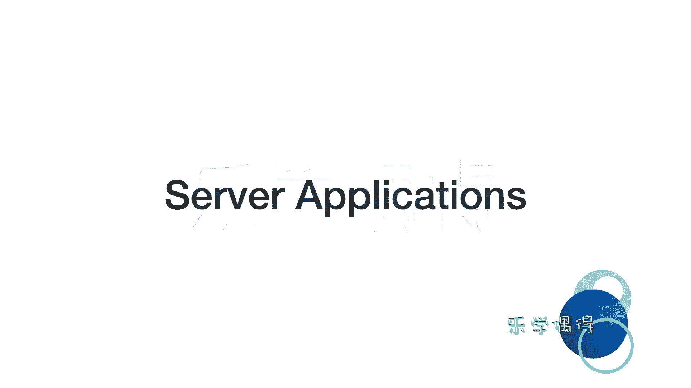

# 乐学偶得｜Linux云计算红帽RHCSA／RHCE／RHCA - P14：13.Linux服务器云计算方面的运用 - 爱学习的YY酱 - BV1ai4y187XZ

好了啊，上一节课呢我们跟大家介绍了这个inba system嵌入系统里面啊都有linux。也就是说我们平常这个都没听说过linux是不是现在再去看我们平常这些智能家居啊啊。

我们甚至是这个安卓手机里面的话，其实linux无处不在啊，现在呢我们来介绍一下我们这整个系列视频里面需要重点研究的一个方面，就是serv applications就是linux作为服务器这一端啊。

它的运用啊，我们知道这个世界五百强啊，他们所用的服务器90%以上啊几乎都是用用这个linux的服务器，为什么用linux做服务器呢，因为它特别特别稳定啊。

你们平常用这个计算机啊经常最长也不会这个几个星期不关机，是不是但是呢这个服务器它必须24小时要开机。如果一个服务器当掉了的话，你这个网站你要去访问的时候，那很可能就访问不进去了，但是你看。

我们平常访问一些网站的时候，能不能说突然一下这网站访问不进去了？那一下子这个网站的话就就做当掉了，是不是啊？所以说这个服务器一定要非常非常稳定啊？

包括你看我们上节课不是介绍了这个这个航天的这种火箭啊等等上面也是用这个lin为内核的。就是因为linux它这个系统非常非常稳定。而且它是一个开源版本的之前我也跟大家说过，因为它开源。

所以大家都可以对这个系统进行修改，进行完善。这么多眼睛钉在这是不是那这个东西一定会越来越完善，越来越个固若金汤啊，所以说我们lin在服务器方面的运用也非常非常广泛啊，我个人也认为这个这个云计算啊。

包括这种所有东西全部都放到云端的，是一个未来发展的一个趋势啊，所以说我们无论是做任何行业啊我们要运用这个人工智能一些方法，就机器学习的方法。

而且呢通过大数据的data money啊这种对数据进行一些处理啊，运算啊，以及这个。机器对数据进行学习啊，这些非常非常耗电脑的事情啊，我们一定会要把它最终转化到云端的啊。

所以说我们要既然把这东西要转化到云端，我们应当这个明白一些基本的一些这个服务器的一些常识吧啊，所以说我觉得啊把这个linux啊，目前大家把它学好的话，今后的用处是非常非常广泛的。好。

我们先给大家讲一下这个server application到底是怎么一回事。所以服务器服务器它到底是个怎么回事的。

大家可以看一下这两张图啊，左上角啊是facebook它的一个服务器哈，大家可以看一下啊，这个服务器非常非常庞大。而且呢它其实有很多很多的这个分支的服务器。嗯，你看这个人他用的一一台电脑，对不对？

然后估计在对这个服务器进行测试啊。而后左上角的话它就是一个服务器，就是一个server啊serv server它是啊为我们服务的，是不是？那到底为什么服务呢？啊？

大家看一下右下角右下角是我们之前安装这个sOS sevensOS7的一个操作系统啊，我们可以在这操作系统里面进行点击。比如说我要上网，我可以打开这个fifox啊，它自带的一个东西。

我上网上网打开假设我要打开某一个网站，这个网站呢，其实它最终啊储存在这个这个服务器的这个地方，就是它储存在左上角，我通过右边啊啊这个dessktop打开一个网页，这个网页呢会跟这个服务器发送一个请求。

这个服务器呢嗯就相当于它一直在监听，有没有跟人跟他打电话，是不是你可以把它想象成这个呃两个电话正在打。一旦有人跟他打电话，他就把这个电话就接起来了。接下来之后的话，他说哎你需要什么东西啊啊。

他说我需要这一份网站的这个哪个哪个啊哪个哪个信息。然后呢，这个服务器他就说好，我就把这个信息，我就把这个data我传送给你啊，这其实啊就是我们如何打开网页的一个过程。

也就是说我们这个本地的这个destop通过打开网页给我们服务器发送一个请求服务器呢啊把这个请求接合到之后的话，把自己的一些储存到这个服务器里面一些信息啊，通过互联网发送到你这个电脑上啊。

然后呢我们发送电脑上的话，我们怎么能看到我们这些这个绚丽多彩的网页呢，就是我们不是有一些浏览器嘛，浏览器相当于对我们这些信息进行一些解析进行些渲染啊。

我们就把啊这些这个各种各样的这个这个响应式这个网页啊，还有这种各种图片啊等等啊，都会展现在我们面前。这样的话就非常漂亮啊，大家可以看一下我们这个IP你可以把。IP地址啊想象成就是电话号码。

而你看你个服务器下面就是左下角啊有个portport就是一个端口啊，端口你就可以想象成它是一个嗯电话的一个转接的一个号码吧。就比如说你先打这个IP，相当于你先打这个电话，打了电话之后的话。

然后电话他相当于说哎你打这个电话的话，你要转多少多少号啊。然后你说哦你要转这么这么多号。然后呢，它就会相应转到那个号，进行相应的操作啊，下面我们来了解一下port。

